# QALY UML / Diagram Specification v2.3

**Phiên bản:** v2.3 — Production-ready diagrams package  
**Dựa trên:** QALY Docs v2.1 SQL Server Gap Audit Package  
**Database target:** SQL Server 2022 Developer Edition; Qdrant cho vector DB  
**Ngày tạo:** 19/05/2026  

---

## 1. Kết luận audit

Bộ v2.1 chưa có đủ sơ đồ cuối cùng để nộp/defense. Gói này bổ sung đầy đủ các loại sơ đồ production cần có: use case, sequence, class, activity, state machine, ERD, component, deployment, data-flow, security flow, AI/RAG flow, observability và traceability.

## 2. Quy ước production dùng trong sơ đồ

- Tất cả request thay đổi dữ liệu phải qua: authentication, tenant resolution, RBAC 3 tầng, validation, transaction, audit log.
- Dữ liệu multi-tenant luôn có `tenant_id` hoặc scope tương đương; query phải chống cross-tenant access.
- Customer view chỉ trả `customer_safe/public data`; private/internal data phải bị mask.
- AI/RAG không được lấy context trước khi qua `AiPermissionFilter` và metadata filter theo tenant/project/entity visibility.
- File/evidence/import dùng object storage; DB chỉ lưu metadata và storage key.
- Sequence diagram ưu tiên thể hiện cả happy path, alternate path, audit point, notification/realtime point.

## 3. Chỉ mục sơ đồ

| Nhóm | Sơ đồ |
|---|---|
| Use case | Overall 68 use cases + 5 sơ đồ module |
| Architecture | Context, Container, Backend Component, Frontend Component, Deployment |
| Security | Authorization/Tenant/RBAC flow |
| Domain/Data | Class diagram, Core ERD SQL Server, Task/Project state machine |
| Sequence | Login, create project, create task, status approval, Kanban move, chat-to-task, AI RAG, import, report, wiki rollback |
| Activity/DFD/Ops | Task lifecycle, import mining, customer-safe view, AI knowledge sync, observability, workers, traceability chain |

---

## ACT_01_Task_Lifecycle_End_To_End

**File:** `docs/diagrams/mermaid/ACT_01_Task_Lifecycle_End_To_End.mmd`

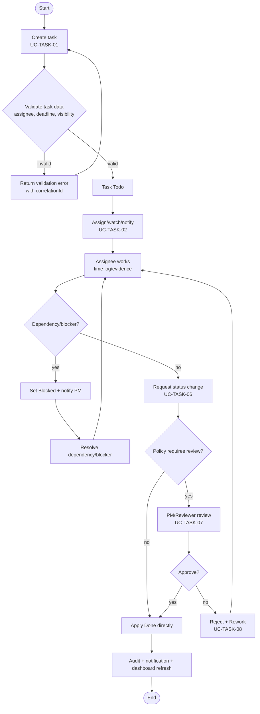
## ACT_02_Document_Mining_Import

**File:** `docs/diagrams/mermaid/ACT_02_Document_Mining_Import.mmd`

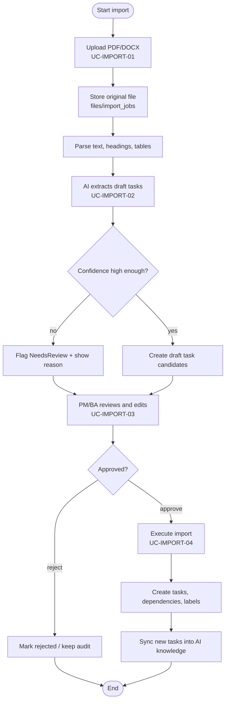
## ACT_03_Customer_Safe_View

**File:** `docs/diagrams/mermaid/ACT_03_Customer_Safe_View.mmd`

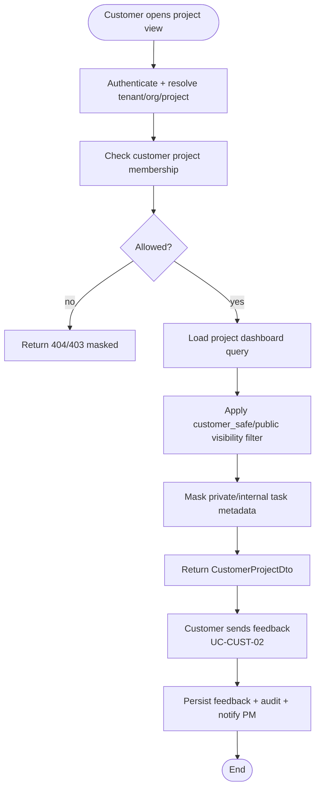
## ARCH_01_System_Context

**File:** `docs/diagrams/mermaid/ARCH_01_System_Context.mmd`

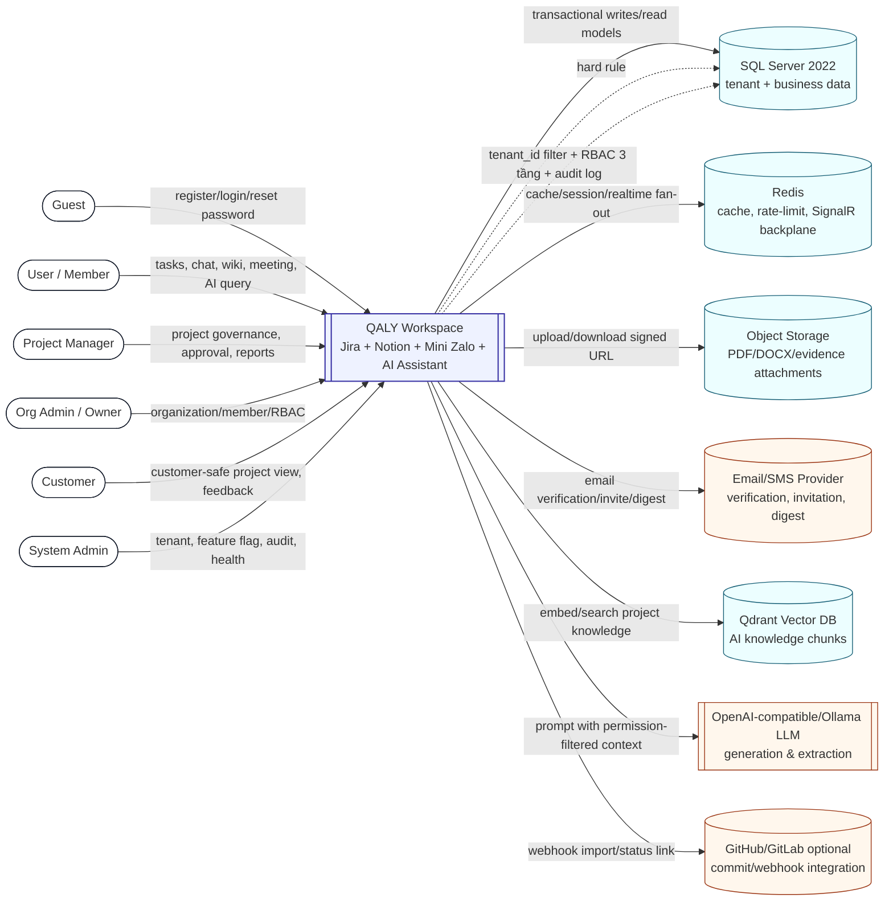
## ARCH_02_Container_Architecture

**File:** `docs/diagrams/mermaid/ARCH_02_Container_Architecture.mmd`

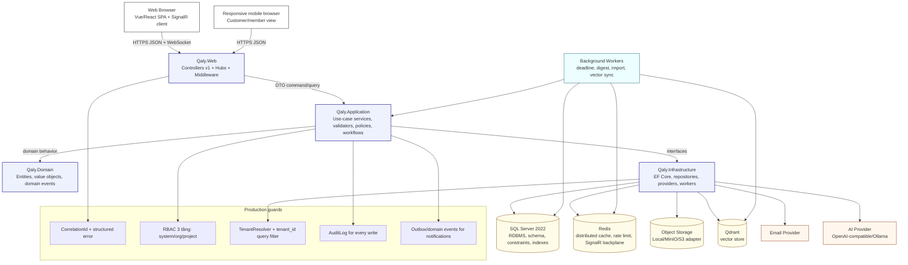
## ARCH_03_Backend_Component_Clean_Architecture

**File:** `docs/diagrams/mermaid/ARCH_03_Backend_Component_Clean_Architecture.mmd`

```mermaid
flowchart TB
  %% Backend component diagram
  classDef layer fill:#eef2ff,stroke:#3730a3,stroke-width:1.3px;
  classDef comp fill:#fff,stroke:#111827;
  classDef policy fill:#ecfeff,stroke:#155e75;
  classDef data fill:#fefce8,stroke:#854d0e;

  subgraph Web[Qaly.Web]
    Controllers[REST Controllers v1]:::comp
    Hubs[SignalR Hubs<br/>ChatHub NotificationHub ProjectHub AiHub]:::comp
    Middleware[Middleware<br/>Exception, CorrelationId, TenantResolver]:::comp
  end
  subgraph Application[Qaly.Application]
    AuthSvc[AuthService]:::comp
    OrgSvc[OrganizationService]:::comp
    ProjectSvc[ProjectService]:::comp
    TaskSvc[TaskService]:::comp
    Workflow[TaskWorkflowService<br/>approval + transition rules]:::policy
    BoardSvc[Board/Sprint/Timeline Services]:::comp
    ChatSvc[ChatService]:::comp
    WikiFile[Wiki/File/Import Services]:::comp
    AiSvc[AiService + RAGService]:::comp
    Policies[Policies<br/>RbacPolicy, ProjectAccessPolicy, VisibilityPolicy, AiPermissionFilter]:::policy
    Validators[Fluent Validators / Guard Clauses]:::policy
    Events[Domain/Application Events<br/>outbox-ready]:::policy
  end
  subgraph Domain[Qaly.Domain]
    Entities[Entities<br/>Tenant User Org Project Task Sprint Chat Wiki Meeting File Audit]:::comp
    ValueObjects[Value Objects<br/>Status Priority Role Visibility Deadline]:::comp
    DomainEvents[Domain Events<br/>TaskCreated TaskStatusRequested EvidenceUploaded]:::comp
  end
  subgraph Infrastructure[Qaly.Infrastructure]
    Db[QalyDbContext + EF Configurations]:::data
    Repos[Repositories + UnitOfWork]:::data
    Providers[Providers<br/>Email Storage Realtime AI Vector Import Parser]:::data
    Workers[Workers<br/>deadline digest vector sync import jobs]:::data
  end

  Controllers --> Middleware
  Controllers --> AuthSvc
  Controllers --> OrgSvc
  Controllers --> ProjectSvc
  Controllers --> TaskSvc
  Controllers --> BoardSvc
  Controllers --> ChatSvc
  Controllers --> WikiFile
  Controllers --> AiSvc
  Hubs --> ChatSvc
  Hubs --> AiSvc
  AuthSvc --> Policies
  OrgSvc --> Policies
  ProjectSvc --> Policies
  TaskSvc --> Validators
  TaskSvc --> Policies
  TaskSvc --> Workflow
  BoardSvc --> Workflow
  WikiFile --> Policies
  AiSvc --> Policies
  AiSvc --> AiPermissionFilter[AiPermissionFilter]:::policy
  Workflow --> Entities
  TaskSvc --> DomainEvents
  Events --> Providers
  Application --> Domain
  Application --> Infrastructure
  Infrastructure --> Db
  Infrastructure --> Repos
  Infrastructure --> Providers
  Workers --> Application
```
## ARCH_04_Frontend_Component_Modules

**File:** `docs/diagrams/mermaid/ARCH_04_Frontend_Component_Modules.mmd`

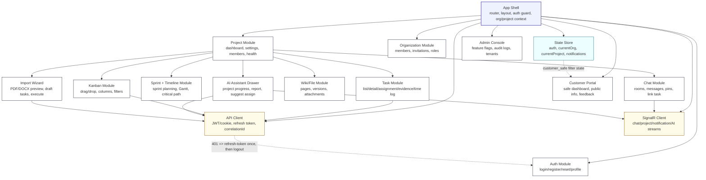
## ARCH_05_Deployment_Production

**File:** `docs/diagrams/mermaid/ARCH_05_Deployment_Production.mmd`

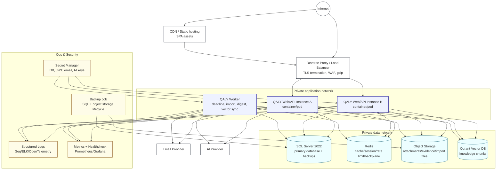
## DATA_01_Core_ERD_SQLServer

**File:** `docs/diagrams/mermaid/DATA_01_Core_ERD_SQLServer.mmd`

```mermaid
erDiagram
  %% Core ERD. Physical schema target: SQL Server 2022. All business tables carry tenant_id, audit columns, and soft delete where applicable.
  TENANTS ||--o{ ORGANIZATIONS : owns
  TENANTS ||--o{ USERS : contains
  TENANTS ||--o{ FEATURE_FLAGS : configures
  USERS ||--o{ USER_SESSIONS : opens
  USERS ||--o{ USER_REFRESH_TOKENS : owns
  USERS ||--o{ ORGANIZATION_MEMBERS : joins
  ORGANIZATIONS ||--o{ ORGANIZATION_MEMBERS : has
  ORGANIZATIONS ||--o{ ORGANIZATION_INVITATIONS : invites
  ORGANIZATIONS ||--o{ PROJECTS : contains
  PROJECTS ||--o{ PROJECT_SETTINGS : configures
  PROJECTS ||--o{ PROJECT_MEMBERS : has
  USERS ||--o{ PROJECT_MEMBERS : participates
  PROJECTS ||--o{ PROJECT_LABELS : defines
  PROJECTS ||--o{ TASKS : owns
  TASKS ||--o{ TASK_ASSIGNMENTS : assigned_to
  USERS ||--o{ TASK_ASSIGNMENTS : receives
  TASKS ||--o{ TASK_DEPENDENCIES : depends
  TASKS ||--o{ TASK_DEPENDENCIES : blocks
  TASKS ||--o{ TASK_STATUS_CHANGE_REQUESTS : requests
  TASK_STATUS_CHANGE_REQUESTS ||--o{ TASK_STATUS_CHANGE_APPROVALS : reviewed_by
  TASKS ||--o{ TASK_EVIDENCES : proves
  FILES ||--o{ TASK_EVIDENCES : stores
  TASKS ||--o{ TASK_TIME_LOGS : logs
  PROJECTS ||--o{ KANBAN_BOARDS : visualizes
  KANBAN_BOARDS ||--o{ KANBAN_COLUMNS : contains
  KANBAN_COLUMNS ||--o{ KANBAN_CARDS : orders
  TASKS ||--o{ KANBAN_CARDS : displayed_as
  PROJECTS ||--o{ SPRINTS : plans
  SPRINTS ||--o{ SPRINT_TASKS : includes
  TASKS ||--o{ SPRINT_TASKS : planned_in
  PROJECTS ||--o{ TIMELINE_BASELINES : baselines
  PROJECTS ||--o{ CHAT_ROOMS : has
  CHAT_ROOMS ||--o{ CHAT_MESSAGES : contains
  CHAT_MESSAGES ||--o{ CHAT_MESSAGE_TASK_LINKS : links
  TASKS ||--o{ CHAT_MESSAGE_TASK_LINKS : referenced_by
  PROJECTS ||--o{ MEETINGS : schedules
  MEETINGS ||--o{ MEETING_NOTES : records
  MEETINGS ||--o{ MEETING_ACTION_ITEMS : creates
  TASKS ||--o{ MEETING_ACTION_ITEMS : converted_to
  PROJECTS ||--o{ WIKI_SPACES : documents
  WIKI_SPACES ||--o{ WIKI_PAGES : contains
  WIKI_PAGES ||--o{ WIKI_PAGE_VERSIONS : versions
  PROJECTS ||--o{ AI_KNOWLEDGE_DOCUMENTS : indexes
  AI_KNOWLEDGE_DOCUMENTS ||--o{ AI_KNOWLEDGE_CHUNKS : chunks
  PROJECTS ||--o{ IMPORT_JOBS : imports
  IMPORT_JOBS ||--o{ IMPORT_DRAFT_TASKS : proposes
  PROJECTS ||--o{ NOTIFICATIONS : notifies
  TENANTS ||--o{ AUDIT_LOGS : records

  TENANTS {
    uniqueidentifier id PK
    nvarchar code UK
    nvarchar name
    nvarchar status
  }
  USERS {
    uniqueidentifier id PK
    uniqueidentifier tenant_id FK
    nvarchar email UK
    nvarchar password_hash
    nvarchar status
    bit email_verified
  }
  ORGANIZATIONS {
    uniqueidentifier id PK
    uniqueidentifier tenant_id FK
    nvarchar name
    nvarchar status
  }
  PROJECTS {
    uniqueidentifier id PK
    uniqueidentifier tenant_id FK
    uniqueidentifier organization_id FK
    nvarchar code
    nvarchar name
    nvarchar status
    date start_date
    date due_date
  }
  TASKS {
    uniqueidentifier id PK
    uniqueidentifier tenant_id FK
    uniqueidentifier project_id FK
    uniqueidentifier parent_task_id FK
    uniqueidentifier sprint_id FK
    nvarchar title
    nvarchar status
    nvarchar priority
    nvarchar visibility
    datetime2 due_at
  }
  AUDIT_LOGS {
    uniqueidentifier id PK
    uniqueidentifier tenant_id FK
    uniqueidentifier actor_user_id FK
    nvarchar action
    nvarchar entity_type
    uniqueidentifier entity_id
    nvarchar correlation_id
  }
```
## DATA_02_AI_Knowledge_Sync_DFD

**File:** `docs/diagrams/mermaid/DATA_02_AI_Knowledge_Sync_DFD.mmd`

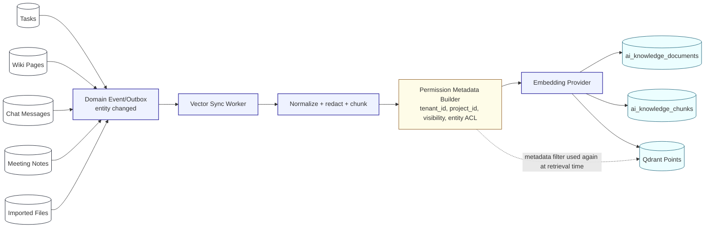
## OPS_01_Observability_Error_Flow

**File:** `docs/diagrams/mermaid/OPS_01_Observability_Error_Flow.mmd`

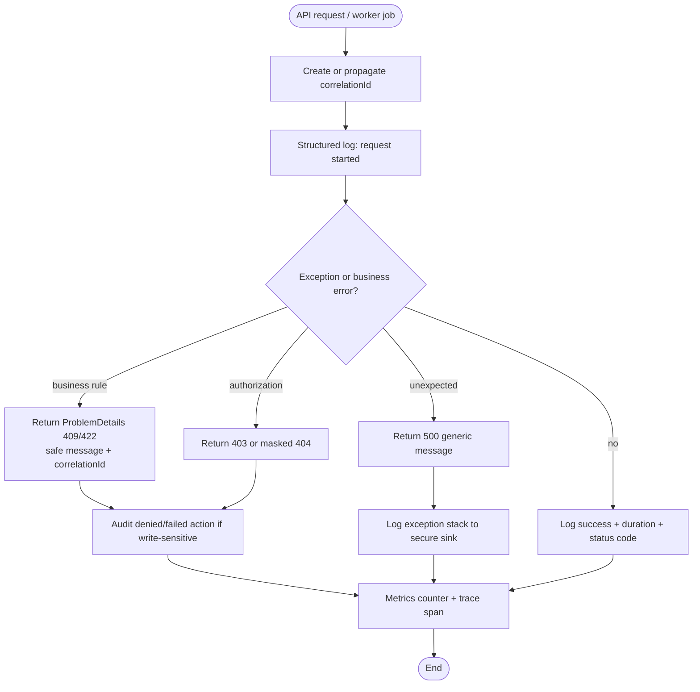
## OPS_02_Background_Workers

**File:** `docs/diagrams/mermaid/OPS_02_Background_Workers.mmd`

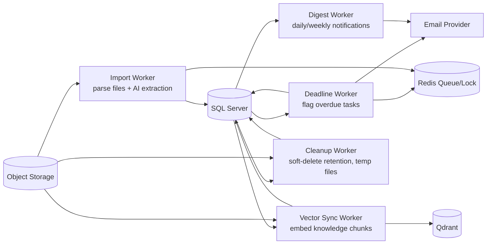
## SEC_01_Authorization_Tenant_Flow

**File:** `docs/diagrams/mermaid/SEC_01_Authorization_Tenant_Flow.mmd`

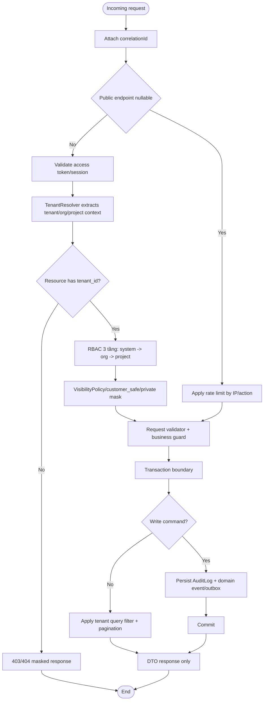
## SEQ_01_Login_Tenant_RBAC

**File:** `docs/diagrams/mermaid/SEQ_01_Login_Tenant_RBAC.mmd`

```mermaid
sequenceDiagram
  autonumber
  actor U as Guest/User
  participant UI as Web UI
  participant API as AuthController
  participant Auth as AuthService
  participant DB as SQL Server
  participant Redis as Redis Cache
  participant Audit as AuditLog

  U->>UI: Nhập email/password
  UI->>API: POST /api/v1/auth/login
  API->>Auth: Login(command, correlationId)
  Auth->>DB: Find user by normalized email
  DB-->>Auth: user + password hash + tenant/org memberships
  Auth->>Auth: Verify password + status + email policy
  alt Invalid credential/status
    Auth-->>API: AuthError masked
    API-->>UI: 401 ProblemDetails + correlationId
  else Valid
    Auth->>DB: Create user_session + refresh_token
    Auth->>Redis: Store session/rate-limit metadata
    Auth->>Audit: Write AUTH_LOGIN_SUCCESS
    Auth-->>API: Access token/cookie + profile DTO
    API-->>UI: 200 OK /api/v1/auth/me-compatible payload
  end
  Note over Auth,DB: Không trả entity trực tiếp; mọi response là DTO.
```
## SEQ_02_Create_Project_And_Members

**File:** `docs/diagrams/mermaid/SEQ_02_Create_Project_And_Members.mmd`

```mermaid
sequenceDiagram
  autonumber
  actor PM as Org Admin / PM
  participant UI as Project UI
  participant API as ProjectsController
  participant ProjectSvc as ProjectService
  participant Policy as RbacPolicyService
  participant DB as SQL Server
  participant Email as Email Provider
  participant Audit as AuditLog

  PM->>UI: Tạo project + danh sách thành viên
  UI->>API: POST /api/v1/orgs/{orgId}/projects
  API->>ProjectSvc: CreateProject(command)
  ProjectSvc->>Policy: CanCreateProject(user, orgId)
  Policy->>DB: Check tenant + org role
  DB-->>Policy: org_admin/project_manager allowed
  Policy-->>ProjectSvc: Allowed
  ProjectSvc->>ProjectSvc: Validate code/name/date/policy
  ProjectSvc->>DB: Insert projects, project_settings, project_members
  ProjectSvc->>Audit: PROJECT_CREATED + MEMBERS_ADDED
  ProjectSvc->>Email: Send project invitation/notification
  DB-->>ProjectSvc: Commit transaction
  ProjectSvc-->>API: ProjectDetailDto
  API-->>UI: 201 Created
  Note over ProjectSvc,DB: Project code unique within organization/tenant; writes are transactional.
```
## SEQ_03_Create_Task

**File:** `docs/diagrams/mermaid/SEQ_03_Create_Task.mmd`

```mermaid
sequenceDiagram
  autonumber
  actor M as PM/Member
  participant UI as Task UI
  participant API as TasksController
  participant TaskSvc as TaskService
  participant Policy as ProjectAccessPolicy
  participant Workflow as TaskWorkflowService
  participant DB as SQL Server
  participant Event as Outbox/Notification
  participant Audit as AuditLog

  M->>UI: Nhập title, assignee, priority, due date, visibility
  UI->>API: POST /api/v1/projects/{projectId}/tasks
  API->>TaskSvc: CreateTask(command)
  TaskSvc->>Policy: CanCreateTask(user, projectId, visibility)
  Policy->>DB: Check tenant + project_members + delegated scope
  DB-->>Policy: permission result
  Policy-->>TaskSvc: allowed
  TaskSvc->>TaskSvc: Validate deadline, parent task, assignee is project member
  TaskSvc->>Workflow: Initial status = Todo/Draft by policy
  Workflow-->>TaskSvc: validated task aggregate
  TaskSvc->>DB: Insert tasks + assignments + labels + watchers
  TaskSvc->>Audit: TASK_CREATED
  TaskSvc->>Event: TaskCreated notification
  DB-->>TaskSvc: Commit
  TaskSvc-->>API: TaskDetailDto
  API-->>UI: 201 Created + task detail
  Note over TaskSvc,Policy: BR-TASK-01 assignee phải là project member; customer/private visibility được mask.
```
## SEQ_04_Task_Status_Approval

**File:** `docs/diagrams/mermaid/SEQ_04_Task_Status_Approval.mmd`

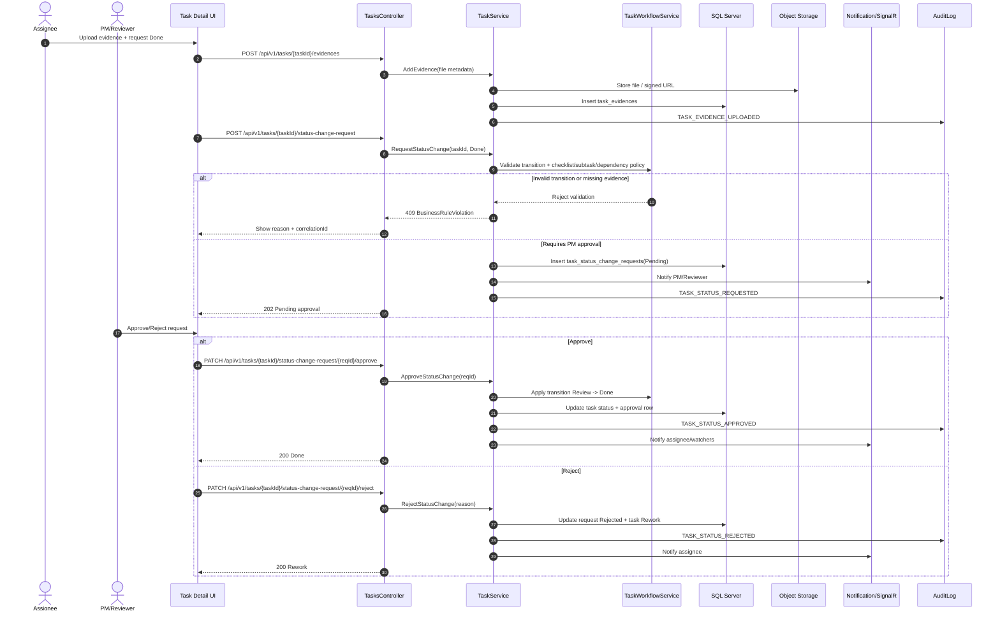
## SEQ_05_Kanban_Drag_Drop_Status

**File:** `docs/diagrams/mermaid/SEQ_05_Kanban_Drag_Drop_Status.mmd`

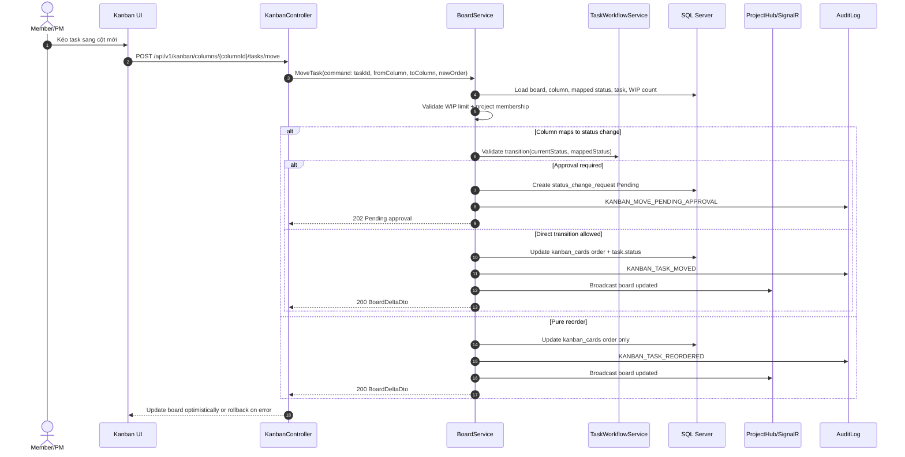
## SEQ_06_Chat_Assign_Task

**File:** `docs/diagrams/mermaid/SEQ_06_Chat_Assign_Task.mmd`

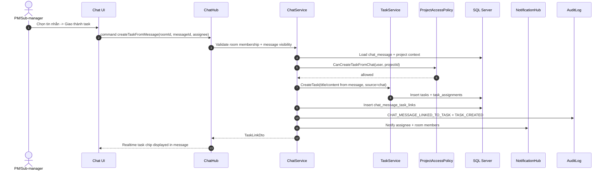
## SEQ_07_AI_RAG_Project_Progress

**File:** `docs/diagrams/mermaid/SEQ_07_AI_RAG_Project_Progress.mmd`

```mermaid
sequenceDiagram
  autonumber
  actor U as Project member/PM
  participant UI as AI Assistant Drawer
  participant API as AiController/AiHub
  participant AiSvc as AiService
  participant Filter as AiPermissionFilter
  participant DB as SQL Server
  participant Vector as Qdrant
  participant LLM as LLM Provider
  participant Audit as AuditLog

  U->>UI: Hỏi "Dự án đang chậm ở đâu?"
  UI->>API: POST /api/v1/ai/conversations/{id}/messages
  API->>AiSvc: AskProjectQuestion(projectId, question)
  AiSvc->>Filter: Build allowed scope(user, projectId)
  Filter->>DB: Check project member role + visibility/customer_safe
  DB-->>Filter: allowed entity scopes
  AiSvc->>Vector: Search topK chunks with metadata filter tenant_id/project_id/entity visibility
  Vector-->>AiSvc: candidate chunks
  AiSvc->>Filter: Post-filter chunks by entity permission
  AiSvc->>DB: Load fresh task/project stats for deterministic context
  AiSvc->>LLM: Prompt(question + filtered context + citation ids)
  LLM-->>AiSvc: answer draft
  AiSvc->>DB: Save conversation/message + cited sources
  AiSvc->>Audit: AI_PROJECT_QUESTION_ASKED
  AiSvc-->>API: Stream answer + source cards
  API-->>UI: Render answer; hide sources user cannot open
  Note over Filter,Vector: Không bao giờ đưa private/customer-unsafe content vào prompt nếu user không có quyền.
```
## SEQ_08_Document_Import_To_Tasks

**File:** `docs/diagrams/mermaid/SEQ_08_Document_Import_To_Tasks.mmd`

```mermaid
sequenceDiagram
  autonumber
  actor BA as PM/BA
  participant UI as Import Wizard
  participant API as ImportController
  participant ImportSvc as ImportService
  participant Storage as Object Storage
  participant Parser as Document Parser
  participant AI as AI Extraction Provider
  participant DB as SQL Server
  participant TaskSvc as TaskService
  participant Audit as AuditLog

  BA->>UI: Upload PDF/DOCX đặc tả/biên bản
  UI->>API: POST /api/v1/import/documents
  API->>ImportSvc: CreateImportJob(projectId, file)
  ImportSvc->>Storage: Store original file
  ImportSvc->>DB: Insert import_jobs(status=Queued)
  ImportSvc->>Audit: IMPORT_JOB_CREATED
  API-->>UI: 202 jobId

  ImportSvc->>Parser: Extract text/tables
  Parser-->>ImportSvc: normalized document text
  ImportSvc->>AI: Extract draft tasks, milestones, risks
  AI-->>ImportSvc: draft_task candidates + confidence
  ImportSvc->>DB: Insert import_draft_tasks(status=NeedsReview)
  ImportSvc->>Audit: IMPORT_DRAFT_TASKS_EXTRACTED

  BA->>UI: Review/approve draft tasks
  UI->>API: PATCH /api/v1/import/jobs/{jobId}/draft-tasks/{draftId}/approve
  API->>ImportSvc: ApproveDraftTask(draftId)
  ImportSvc->>DB: Mark approved

  BA->>UI: Execute import
  UI->>API: POST /api/v1/import/jobs/{jobId}/execute
  API->>ImportSvc: Execute(jobId)
  ImportSvc->>TaskSvc: CreateTask for each approved draft
  TaskSvc->>DB: Insert tasks/assignments/dependencies
  ImportSvc->>DB: Mark job Completed
  ImportSvc->>Audit: IMPORT_JOB_EXECUTED
  API-->>UI: ImportResultDto with created task links
```
## SEQ_09_Weekly_Report_Generation

**File:** `docs/diagrams/mermaid/SEQ_09_Weekly_Report_Generation.mmd`

```mermaid
sequenceDiagram
  autonumber
  actor PM as PM
  participant UI as Report UI
  participant API as AiController
  participant AiSvc as AiService
  participant DB as SQL Server
  participant Vector as Qdrant
  participant LLM as LLM Provider
  participant Audit as AuditLog

  PM->>UI: Generate weekly report
  UI->>API: POST /api/v1/ai/projects/{projectId}/generate-report
  API->>AiSvc: GenerateWeeklyReport(projectId, weekRange)
  AiSvc->>DB: Load deterministic stats: done/in-progress/overdue/blockers/velocity
  AiSvc->>Vector: Retrieve meeting/wiki/chat/task context within week
  AiSvc->>AiSvc: Permission filter + summarize context
  AiSvc->>LLM: Generate report with sections: progress, risks, blockers, next actions
  LLM-->>AiSvc: report draft
  AiSvc->>DB: Save project_status_reports + ai_conversation source refs
  AiSvc->>Audit: AI_WEEKLY_REPORT_GENERATED
  AiSvc-->>API: ReportDto
  API-->>UI: Render editable report
```
## SEQ_10_Wiki_Version_Rollback

**File:** `docs/diagrams/mermaid/SEQ_10_Wiki_Version_Rollback.mmd`

```mermaid
sequenceDiagram
  autonumber
  actor PM as PM/Member
  participant UI as Wiki UI
  participant API as WikiController
  participant WikiSvc as WikiService
  participant Policy as ProjectAccessPolicy
  participant DB as SQL Server
  participant Vector as Qdrant/Vector Sync
  participant Audit as AuditLog

  PM->>UI: Chỉnh sửa wiki page
  UI->>API: PATCH /api/v1/wiki/pages/{pageId}
  API->>WikiSvc: UpdatePage(markdown)
  WikiSvc->>Policy: CanEditWiki(user, page.projectId)
  Policy-->>WikiSvc: allowed
  WikiSvc->>DB: Insert wiki_page_versions(versionNo+1) + update current pointer
  WikiSvc->>Audit: WIKI_PAGE_UPDATED
  WikiSvc->>Vector: Enqueue knowledge sync
  API-->>UI: PageDto with new version

  PM->>UI: Rollback về version cũ
  UI->>API: POST /api/v1/wiki/pages/{pageId}/restore/{versionId}
  API->>WikiSvc: RestoreVersion(versionId)
  WikiSvc->>DB: Insert new version copied from old version
  WikiSvc->>Audit: WIKI_PAGE_RESTORED
  WikiSvc->>Vector: Enqueue knowledge sync
  API-->>UI: PageDto restored
```
## STATE_01_Task_Lifecycle

**File:** `docs/diagrams/mermaid/STATE_01_Task_Lifecycle.mmd`

```mermaid
stateDiagram-v2
  %% Task lifecycle controlled by BR-TASK-01..06 and BR-DEP-01..04
  [*] --> Draft: create draft / import draft
  Draft --> Todo: submit valid task
  Todo --> InProgress: assignee starts work
  InProgress --> Review: assignee requests review
  Review --> Done: PM/Reviewer approves
  Review --> Rework: PM/Reviewer rejects
  Rework --> InProgress: assignee updates fix
  Todo --> Blocked: dependency/blocker found
  InProgress --> Blocked: dependency/blocker found
  Blocked --> Todo: blocker resolved before work starts
  Blocked --> InProgress: blocker resolved while active
  Todo --> Cancelled: PM archives/cancels
  InProgress --> Cancelled: PM archives/cancels
  Review --> Cancelled: PM archives/cancels
  Done --> Archived: project/task archived
  Cancelled --> Archived: retention/archive
  Archived --> [*]

  state Review {
    [*] --> PendingApproval
    PendingApproval --> Approved: validate evidence/checklist/subtasks
    PendingApproval --> Rejected: reject with reason
    Approved --> [*]
    Rejected --> [*]
  }

  note right of Blocked
    Strict mode: task cannot enter InProgress
    if dependency is blocking.
  end note
  note right of Done
    Done requires subtasks/checklists Done
    if project policy enables it.
  end note
```
## STATE_02_Project_Lifecycle

**File:** `docs/diagrams/mermaid/STATE_02_Project_Lifecycle.mmd`

```mermaid
stateDiagram-v2
  %% Project lifecycle for outsource workflow governance
  [*] --> Draft: create project
  Draft --> Active: PM confirms scope/team
  Active --> OnHold: pause by PM/org admin
  OnHold --> Active: resume
  Active --> Completed: all required milestones/tasks accepted
  Active --> Cancelled: cancelled with reason
  Completed --> Archived: archive after acceptance/retention
  Cancelled --> Archived: archive after closure
  Archived --> Active: restore if policy allows
  Archived --> [*]

  note right of Active
    Dashboard, Kanban, Timeline, Chat, Wiki,
    Meeting, AI and Customer view are scoped here.
  end note
```
## TRACE_01_Requirement_To_Implementation_Map

**File:** `docs/diagrams/mermaid/TRACE_01_Requirement_To_Implementation_Map.mmd`

```mermaid
flowchart LR
  %% Traceability chain used in defense/demo
  Req[Requirement / SRS] --> UC[Use Case Catalog + Specification]
  UC --> BR[Business Rules]
  UC --> API[API Specification]
  UC --> UI[UI Screen / Route]
  BR --> Domain[Domain Service / Workflow]
  API --> Controller[Controller / Hub]
  Domain --> DB[SQL Server Tables + Constraints]
  Domain --> Event[Domain Events + Audit Logs]
  DB --> Test[Test Cases]
  API --> Test
  UI --> E2E[E2E Tests]
  Test --> Acceptance[Acceptance Checklist]
  Event --> Acceptance
  Acceptance --> Demo[Demo Script / Graduation Defense]
```
## UC_00_Overall_68_Use_Cases

**File:** `docs/diagrams/mermaid/UC_00_Overall_68_Use_Cases.mmd`

```mermaid
flowchart LR
  %% QALY Overall Use Case Diagram - 68 Use Cases
  classDef actor fill:#fff,stroke:#111827,stroke-width:1px;
  classDef must fill:#eef2ff,stroke:#3730a3,stroke-width:1px;
  classDef should fill:#ecfeff,stroke:#155e75,stroke-width:1px;
  classDef nice fill:#f7fee7,stroke:#3f6212,stroke-width:1px;
  subgraph Actors[Actors / Vai trò]
    A_AIService(["AI service"])
    A_Assignee(["Assignee"])
    A_BA(["BA/Documenter"])
    A_Customer(["Customer"])
    A_Guest(["Guest / khách chưa đăng nhập"])
    A_InvitedUser(["Invited user"])
    A_OrgAdmin(["Org admin"])
    A_OrgOwner(["Org owner"])
    A_ProjectManager(["Project manager / PM"])
    A_ProjectMember(["Project member"])
    A_Reviewer(["Reviewer/Approver"])
    A_RoomAdmin(["Room admin"])
    A_RoomMember(["Room member"])
    A_SubManager(["Sub-manager"])
    A_System(["System worker"])
    A_SystemAdmin(["System admin"])
    A_SystemCustomerAdmin(["System customer/admin"])
    A_User(["User / người dùng đã đăng nhập"])
  end
  subgraph SYS[QALY Workspace System]
    subgraph AUTH["AUTH - Auth & Identity"]
      UC_UC_AUTH_01(["UC-AUTH-01<br/>Đăng ký tài khoản<br/>Must Have"]):::must
      UC_UC_AUTH_02(["UC-AUTH-02<br/>Xác thực email<br/>Should Have"]):::should
      UC_UC_AUTH_03(["UC-AUTH-03<br/>Đăng nhập<br/>Must Have"]):::must
      UC_UC_AUTH_04(["UC-AUTH-04<br/>Đăng xuất<br/>Must Have"]):::must
      UC_UC_AUTH_05(["UC-AUTH-05<br/>Làm mới phiên/token<br/>Should Have"]):::should
      UC_UC_AUTH_06(["UC-AUTH-06<br/>Quên mật khẩu<br/>Should Have"]):::should
      UC_UC_AUTH_07(["UC-AUTH-07<br/>Đặt lại mật khẩu<br/>Should Have"]):::should
      UC_UC_AUTH_08(["UC-AUTH-08<br/>Đổi mật khẩu<br/>Must Have"]):::must
    end
    subgraph ORG["ORG - Organization"]
      UC_UC_ORG_01(["UC-ORG-01<br/>Tạo organization<br/>Must Have"]):::must
      UC_UC_ORG_02(["UC-ORG-02<br/>Mời thành viên vào organization<br/>Must Have"]):::must
      UC_UC_ORG_03(["UC-ORG-03<br/>Chấp nhận lời mời<br/>Should Have"]):::should
      UC_UC_ORG_04(["UC-ORG-04<br/>Phân quyền thành viên organization<br/>Must Have"]):::must
      UC_UC_ORG_05(["UC-ORG-05<br/>Xóa thành viên khỏi organization<br/>Must Have"]):::must
    end
    subgraph PROJ["PROJ - Project"]
      UC_UC_PROJ_01(["UC-PROJ-01<br/>Tạo project<br/>Must Have"]):::must
      UC_UC_PROJ_02(["UC-PROJ-02<br/>Cập nhật thông tin project<br/>Must Have"]):::must
      UC_UC_PROJ_03(["UC-PROJ-03<br/>Thêm thành viên vào project<br/>Must Have"]):::must
      UC_UC_PROJ_04(["UC-PROJ-04<br/>Phân quyền thành viên project<br/>Must Have"]):::must
      UC_UC_PROJ_05(["UC-PROJ-05<br/>Lưu trữ project<br/>Should Have"]):::should
      UC_UC_PROJ_06(["UC-PROJ-06<br/>Xem dashboard tiến độ project<br/>Must Have"]):::must
    end
    subgraph TASK["TASK - Task Workflow"]
      UC_UC_TASK_01(["UC-TASK-01<br/>Tạo task<br/>Must Have"]):::must
      UC_UC_TASK_02(["UC-TASK-02<br/>Giao task cho thành viên<br/>Must Have"]):::must
      UC_UC_TASK_03(["UC-TASK-03<br/>Tạo subtask phụ thuộc task cha<br/>Should Have"]):::should
      UC_UC_TASK_04(["UC-TASK-04<br/>Tạo task dependency<br/>Must Have"]):::must
      UC_UC_TASK_05(["UC-TASK-05<br/>Cập nhật trạng thái task<br/>Must Have"]):::must
      UC_UC_TASK_06(["UC-TASK-06<br/>Gửi yêu cầu chuyển trạng thái<br/>Must Have"]):::must
      UC_UC_TASK_07(["UC-TASK-07<br/>PM duyệt yêu cầu chuyển trạng thái<br/>Must Have"]):::must
      UC_UC_TASK_08(["UC-TASK-08<br/>PM từ chối và yêu cầu làm lại<br/>Must Have"]):::must
      UC_UC_TASK_09(["UC-TASK-09<br/>Upload bằng chứng hoàn thành<br/>Must Have"]):::must
      UC_UC_TASK_10(["UC-TASK-10<br/>Log thời gian làm việc<br/>Should Have"]):::should
    end
    subgraph KANBAN["KANBAN - Kanban Board"]
      UC_UC_KANBAN_01(["UC-KANBAN-01<br/>Kéo thả task giữa các cột<br/>Must Have"]):::must
      UC_UC_KANBAN_02(["UC-KANBAN-02<br/>Thêm cột tùy chỉnh<br/>Should Have"]):::should
      UC_UC_KANBAN_03(["UC-KANBAN-03<br/>Xóa cột với điều kiện<br/>Should Have"]):::should
      UC_UC_KANBAN_04(["UC-KANBAN-04<br/>Đặt WIP limit cho cột<br/>Should Have"]):::should
      UC_UC_KANBAN_05(["UC-KANBAN-05<br/>Lọc task trên kanban<br/>Must Have"]):::must
    end
    subgraph SPRINT["SPRINT - Sprint"]
      UC_UC_SPRINT_01(["UC-SPRINT-01<br/>Tạo sprint<br/>Should Have"]):::should
      UC_UC_SPRINT_02(["UC-SPRINT-02<br/>Lên kế hoạch sprint<br/>Should Have"]):::should
      UC_UC_SPRINT_03(["UC-SPRINT-03<br/>Bắt đầu sprint<br/>Should Have"]):::should
      UC_UC_SPRINT_04(["UC-SPRINT-04<br/>Hoàn thành sprint<br/>Should Have"]):::should
      UC_UC_SPRINT_05(["UC-SPRINT-05<br/>Xem burndown chart<br/>Nice to Have"]):::nice
    end
    subgraph TIMELINE["TIMELINE - Timeline/Gantt"]
      UC_UC_TIMELINE_01(["UC-TIMELINE-01<br/>Xem timeline Gantt<br/>Must Have"]):::must
      UC_UC_TIMELINE_02(["UC-TIMELINE-02<br/>Kéo thả điều chỉnh timeline<br/>Should Have"]):::should
      UC_UC_TIMELINE_03(["UC-TIMELINE-03<br/>Xem critical path<br/>Nice to Have"]):::nice
    end
    subgraph CHAT["CHAT - Chat/Realtime"]
      UC_UC_CHAT_01(["UC-CHAT-01<br/>Tạo nhóm chat project<br/>Must Have"]):::must
      UC_UC_CHAT_02(["UC-CHAT-02<br/>Gửi tin nhắn văn bản<br/>Must Have"]):::must
      UC_UC_CHAT_03(["UC-CHAT-03<br/>Giao task trực tiếp từ chat<br/>Must Have"]):::must
      UC_UC_CHAT_04(["UC-CHAT-04<br/>Link task vào tin nhắn<br/>Should Have"]):::should
      UC_UC_CHAT_05(["UC-CHAT-05<br/>Pin tin nhắn quan trọng<br/>Should Have"]):::should
      UC_UC_CHAT_06(["UC-CHAT-06<br/>Xem task được giao trong chat<br/>Should Have"]):::should
    end
    subgraph MEETING["MEETING - Meeting"]
      UC_UC_MEETING_01(["UC-MEETING-01<br/>Tạo meeting và ghi note<br/>Should Have"]):::should
      UC_UC_MEETING_02(["UC-MEETING-02<br/>AI tóm tắt meeting<br/>Should Have"]):::should
      UC_UC_MEETING_03(["UC-MEETING-03<br/>Tạo action item từ meeting<br/>Should Have"]):::should
    end
    subgraph WIKI["WIKI - Wiki/Knowledge"]
      UC_UC_WIKI_01(["UC-WIKI-01<br/>Tạo wiki page<br/>Must Have"]):::must
      UC_UC_WIKI_02(["UC-WIKI-02<br/>Chỉnh sửa wiki page versioning<br/>Must Have"]):::must
      UC_UC_WIKI_03(["UC-WIKI-03<br/>Rollback phiên bản wiki cũ<br/>Should Have"]):::should
    end
    subgraph AI["AI - AI Assistant"]
      UC_UC_AI_01(["UC-AI-01<br/>Hỏi AI về tiến độ project<br/>Should Have"]):::should
      UC_UC_AI_02(["UC-AI-02<br/>AI sinh báo cáo tiến độ tuần<br/>Should Have"]):::should
      UC_UC_AI_03(["UC-AI-03<br/>AI gợi ý assign task<br/>Nice to Have"]):::nice
      UC_UC_AI_04(["UC-AI-04<br/>Sync dữ liệu project vào AI knowledge base<br/>Should Have"]):::should
    end
    subgraph IMPORT["IMPORT - Document Import"]
      UC_UC_IMPORT_01(["UC-IMPORT-01<br/>Upload tài liệu PDF/DOCX<br/>Should Have"]):::should
      UC_UC_IMPORT_02(["UC-IMPORT-02<br/>AI phân tích và trích xuất task<br/>Should Have"]):::should
      UC_UC_IMPORT_03(["UC-IMPORT-03<br/>Review và approve draft task<br/>Should Have"]):::should
      UC_UC_IMPORT_04(["UC-IMPORT-04<br/>Import task vào project<br/>Should Have"]):::should
    end
    subgraph CUST["CUST - Customer Portal"]
      UC_UC_CUST_01(["UC-CUST-01<br/>Xem tiến độ project customer view<br/>Must Have"]):::must
      UC_UC_CUST_02(["UC-CUST-02<br/>Gửi phản hồi về task<br/>Should Have"]):::should
      UC_UC_CUST_03(["UC-CUST-03<br/>Xem thông tin public<br/>Must Have"]):::must
    end
    subgraph ADMIN["ADMIN - Admin/Audit"]
      UC_UC_ADMIN_01(["UC-ADMIN-01<br/>Bật/tắt feature flag<br/>Should Have"]):::should
      UC_UC_ADMIN_02(["UC-ADMIN-02<br/>Xem audit log hệ thống<br/>Must Have"]):::must
      UC_UC_ADMIN_03(["UC-ADMIN-03<br/>Quản lý tenant<br/>Should Have"]):::should
    end
  end
  A_Guest --> UC_UC_AUTH_01
  A_Guest --> UC_UC_AUTH_02
  A_User --> UC_UC_AUTH_02
  A_Guest --> UC_UC_AUTH_03
  A_User --> UC_UC_AUTH_03
  A_User --> UC_UC_AUTH_04
  A_User --> UC_UC_AUTH_05
  A_Guest --> UC_UC_AUTH_06
  A_Guest --> UC_UC_AUTH_07
  A_User --> UC_UC_AUTH_08
  A_SystemCustomerAdmin --> UC_UC_ORG_01
  A_OrgOwner --> UC_UC_ORG_02
  A_OrgAdmin --> UC_UC_ORG_02
  A_InvitedUser --> UC_UC_ORG_03
  A_OrgOwner --> UC_UC_ORG_04
  A_OrgAdmin --> UC_UC_ORG_04
  A_OrgOwner --> UC_UC_ORG_05
  A_OrgAdmin --> UC_UC_ORG_05
  A_OrgAdmin --> UC_UC_PROJ_01
  A_ProjectManager --> UC_UC_PROJ_01
  A_ProjectManager --> UC_UC_PROJ_02
  A_ProjectManager --> UC_UC_PROJ_03
  A_ProjectManager --> UC_UC_PROJ_04
  A_ProjectManager --> UC_UC_PROJ_05
  A_ProjectMember --> UC_UC_PROJ_06
  A_Customer --> UC_UC_PROJ_06
  A_ProjectManager --> UC_UC_TASK_01
  A_ProjectMember --> UC_UC_TASK_01
  A_ProjectManager --> UC_UC_TASK_02
  A_SubManager --> UC_UC_TASK_02
  A_ProjectManager --> UC_UC_TASK_03
  A_ProjectMember --> UC_UC_TASK_03
  A_ProjectManager --> UC_UC_TASK_04
  A_ProjectMember --> UC_UC_TASK_04
  A_Assignee --> UC_UC_TASK_05
  A_ProjectManager --> UC_UC_TASK_05
  A_Assignee --> UC_UC_TASK_06
  A_ProjectManager --> UC_UC_TASK_07
  A_Reviewer --> UC_UC_TASK_07
  A_ProjectManager --> UC_UC_TASK_08
  A_Reviewer --> UC_UC_TASK_08
  A_Assignee --> UC_UC_TASK_09
  A_Assignee --> UC_UC_TASK_10
  A_ProjectMember --> UC_UC_KANBAN_01
  A_ProjectManager --> UC_UC_KANBAN_01
  A_ProjectManager --> UC_UC_KANBAN_02
  A_ProjectManager --> UC_UC_KANBAN_03
  A_ProjectManager --> UC_UC_KANBAN_04
  A_ProjectMember --> UC_UC_KANBAN_05
  A_ProjectManager --> UC_UC_KANBAN_05
  A_Customer --> UC_UC_KANBAN_05
  A_ProjectManager --> UC_UC_SPRINT_01
  A_ProjectManager --> UC_UC_SPRINT_02
  A_SubManager --> UC_UC_SPRINT_02
  A_ProjectManager --> UC_UC_SPRINT_03
  A_ProjectManager --> UC_UC_SPRINT_04
  A_ProjectManager --> UC_UC_SPRINT_05
  A_ProjectMember --> UC_UC_SPRINT_05
  A_ProjectMember --> UC_UC_TIMELINE_01
  A_ProjectManager --> UC_UC_TIMELINE_02
  A_SubManager --> UC_UC_TIMELINE_02
  A_ProjectManager --> UC_UC_TIMELINE_03
  A_ProjectManager --> UC_UC_CHAT_01
  A_System --> UC_UC_CHAT_01
  A_RoomMember --> UC_UC_CHAT_02
  A_ProjectManager --> UC_UC_CHAT_03
  A_SubManager --> UC_UC_CHAT_03
  A_RoomMember --> UC_UC_CHAT_04
  A_ProjectManager --> UC_UC_CHAT_05
  A_RoomAdmin --> UC_UC_CHAT_05
  A_RoomMember --> UC_UC_CHAT_06
  A_ProjectManager --> UC_UC_MEETING_01
  A_ProjectMember --> UC_UC_MEETING_01
  A_ProjectManager --> UC_UC_MEETING_02
  A_AIService --> UC_UC_MEETING_02
  A_ProjectManager --> UC_UC_MEETING_03
  A_ProjectManager --> UC_UC_WIKI_01
  A_ProjectMember --> UC_UC_WIKI_01
  A_ProjectManager --> UC_UC_WIKI_02
  A_ProjectMember --> UC_UC_WIKI_02
  A_ProjectManager --> UC_UC_WIKI_03
  A_ProjectMember --> UC_UC_AI_01
  A_ProjectManager --> UC_UC_AI_02
  A_ProjectManager --> UC_UC_AI_03
  A_System --> UC_UC_AI_04
  A_ProjectManager --> UC_UC_AI_04
  A_ProjectManager --> UC_UC_IMPORT_01
  A_BA --> UC_UC_IMPORT_01
  A_ProjectManager --> UC_UC_IMPORT_02
  A_AIService --> UC_UC_IMPORT_02
  A_ProjectManager --> UC_UC_IMPORT_03
  A_BA --> UC_UC_IMPORT_03
  A_ProjectManager --> UC_UC_IMPORT_04
  A_Customer --> UC_UC_CUST_01
  A_Customer --> UC_UC_CUST_02
  A_Customer --> UC_UC_CUST_03
  A_SystemAdmin --> UC_UC_ADMIN_01
  A_SystemAdmin --> UC_UC_ADMIN_02
  A_OrgAdmin --> UC_UC_ADMIN_02
  A_SystemAdmin --> UC_UC_ADMIN_03
  %% Production note: write flows require RBAC, validation, transaction, audit, and tenant isolation.```
## UC_01_Auth_Org_Project

**File:** `docs/diagrams/mermaid/UC_01_Auth_Org_Project.mmd`

```mermaid
flowchart LR
  %% UC 01 Auth Org Project
  classDef actor fill:#fff,stroke:#111827,stroke-width:1px;
  classDef must fill:#eef2ff,stroke:#3730a3,stroke-width:1px;
  classDef should fill:#ecfeff,stroke:#155e75,stroke-width:1px;
  classDef nice fill:#f7fee7,stroke:#3f6212,stroke-width:1px;
  subgraph Actors[Actors / Vai trò]
    A_Customer(["Customer"])
    A_Guest(["Guest / khách chưa đăng nhập"])
    A_InvitedUser(["Invited user"])
    A_OrgAdmin(["Org admin"])
    A_OrgOwner(["Org owner"])
    A_ProjectManager(["Project manager / PM"])
    A_ProjectMember(["Project member"])
    A_SystemCustomerAdmin(["System customer/admin"])
    A_User(["User / người dùng đã đăng nhập"])
  end
  subgraph SYS[QALY Workspace System]
    subgraph AUTH["AUTH - Auth & Identity"]
      UC_UC_AUTH_01(["UC-AUTH-01<br/>Đăng ký tài khoản<br/>Must Have"]):::must
      UC_UC_AUTH_02(["UC-AUTH-02<br/>Xác thực email<br/>Should Have"]):::should
      UC_UC_AUTH_03(["UC-AUTH-03<br/>Đăng nhập<br/>Must Have"]):::must
      UC_UC_AUTH_04(["UC-AUTH-04<br/>Đăng xuất<br/>Must Have"]):::must
      UC_UC_AUTH_05(["UC-AUTH-05<br/>Làm mới phiên/token<br/>Should Have"]):::should
      UC_UC_AUTH_06(["UC-AUTH-06<br/>Quên mật khẩu<br/>Should Have"]):::should
      UC_UC_AUTH_07(["UC-AUTH-07<br/>Đặt lại mật khẩu<br/>Should Have"]):::should
      UC_UC_AUTH_08(["UC-AUTH-08<br/>Đổi mật khẩu<br/>Must Have"]):::must
    end
    subgraph ORG["ORG - Organization"]
      UC_UC_ORG_01(["UC-ORG-01<br/>Tạo organization<br/>Must Have"]):::must
      UC_UC_ORG_02(["UC-ORG-02<br/>Mời thành viên vào organization<br/>Must Have"]):::must
      UC_UC_ORG_03(["UC-ORG-03<br/>Chấp nhận lời mời<br/>Should Have"]):::should
      UC_UC_ORG_04(["UC-ORG-04<br/>Phân quyền thành viên organization<br/>Must Have"]):::must
      UC_UC_ORG_05(["UC-ORG-05<br/>Xóa thành viên khỏi organization<br/>Must Have"]):::must
    end
    subgraph PROJ["PROJ - Project"]
      UC_UC_PROJ_01(["UC-PROJ-01<br/>Tạo project<br/>Must Have"]):::must
      UC_UC_PROJ_02(["UC-PROJ-02<br/>Cập nhật thông tin project<br/>Must Have"]):::must
      UC_UC_PROJ_03(["UC-PROJ-03<br/>Thêm thành viên vào project<br/>Must Have"]):::must
      UC_UC_PROJ_04(["UC-PROJ-04<br/>Phân quyền thành viên project<br/>Must Have"]):::must
      UC_UC_PROJ_05(["UC-PROJ-05<br/>Lưu trữ project<br/>Should Have"]):::should
      UC_UC_PROJ_06(["UC-PROJ-06<br/>Xem dashboard tiến độ project<br/>Must Have"]):::must
    end
  end
  A_Guest --> UC_UC_AUTH_01
  A_Guest --> UC_UC_AUTH_02
  A_User --> UC_UC_AUTH_02
  A_Guest --> UC_UC_AUTH_03
  A_User --> UC_UC_AUTH_03
  A_User --> UC_UC_AUTH_04
  A_User --> UC_UC_AUTH_05
  A_Guest --> UC_UC_AUTH_06
  A_Guest --> UC_UC_AUTH_07
  A_User --> UC_UC_AUTH_08
  A_SystemCustomerAdmin --> UC_UC_ORG_01
  A_OrgOwner --> UC_UC_ORG_02
  A_OrgAdmin --> UC_UC_ORG_02
  A_InvitedUser --> UC_UC_ORG_03
  A_OrgOwner --> UC_UC_ORG_04
  A_OrgAdmin --> UC_UC_ORG_04
  A_OrgOwner --> UC_UC_ORG_05
  A_OrgAdmin --> UC_UC_ORG_05
  A_OrgAdmin --> UC_UC_PROJ_01
  A_ProjectManager --> UC_UC_PROJ_01
  A_ProjectManager --> UC_UC_PROJ_02
  A_ProjectManager --> UC_UC_PROJ_03
  A_ProjectManager --> UC_UC_PROJ_04
  A_ProjectManager --> UC_UC_PROJ_05
  A_ProjectMember --> UC_UC_PROJ_06
  A_Customer --> UC_UC_PROJ_06
  %% Production note: write flows require RBAC, validation, transaction, audit, and tenant isolation.```
## UC_02_Task_Kanban_Sprint_Timeline

**File:** `docs/diagrams/mermaid/UC_02_Task_Kanban_Sprint_Timeline.mmd`

```mermaid
flowchart LR
  %% UC 02 Task Kanban Sprint Timeline
  classDef actor fill:#fff,stroke:#111827,stroke-width:1px;
  classDef must fill:#eef2ff,stroke:#3730a3,stroke-width:1px;
  classDef should fill:#ecfeff,stroke:#155e75,stroke-width:1px;
  classDef nice fill:#f7fee7,stroke:#3f6212,stroke-width:1px;
  subgraph Actors[Actors / Vai trò]
    A_Assignee(["Assignee"])
    A_Customer(["Customer"])
    A_ProjectManager(["Project manager / PM"])
    A_ProjectMember(["Project member"])
    A_Reviewer(["Reviewer/Approver"])
    A_SubManager(["Sub-manager"])
  end
  subgraph SYS[QALY Workspace System]
    subgraph TASK["TASK - Task Workflow"]
      UC_UC_TASK_01(["UC-TASK-01<br/>Tạo task<br/>Must Have"]):::must
      UC_UC_TASK_02(["UC-TASK-02<br/>Giao task cho thành viên<br/>Must Have"]):::must
      UC_UC_TASK_03(["UC-TASK-03<br/>Tạo subtask phụ thuộc task cha<br/>Should Have"]):::should
      UC_UC_TASK_04(["UC-TASK-04<br/>Tạo task dependency<br/>Must Have"]):::must
      UC_UC_TASK_05(["UC-TASK-05<br/>Cập nhật trạng thái task<br/>Must Have"]):::must
      UC_UC_TASK_06(["UC-TASK-06<br/>Gửi yêu cầu chuyển trạng thái<br/>Must Have"]):::must
      UC_UC_TASK_07(["UC-TASK-07<br/>PM duyệt yêu cầu chuyển trạng thái<br/>Must Have"]):::must
      UC_UC_TASK_08(["UC-TASK-08<br/>PM từ chối và yêu cầu làm lại<br/>Must Have"]):::must
      UC_UC_TASK_09(["UC-TASK-09<br/>Upload bằng chứng hoàn thành<br/>Must Have"]):::must
      UC_UC_TASK_10(["UC-TASK-10<br/>Log thời gian làm việc<br/>Should Have"]):::should
    end
    subgraph KANBAN["KANBAN - Kanban Board"]
      UC_UC_KANBAN_01(["UC-KANBAN-01<br/>Kéo thả task giữa các cột<br/>Must Have"]):::must
      UC_UC_KANBAN_02(["UC-KANBAN-02<br/>Thêm cột tùy chỉnh<br/>Should Have"]):::should
      UC_UC_KANBAN_03(["UC-KANBAN-03<br/>Xóa cột với điều kiện<br/>Should Have"]):::should
      UC_UC_KANBAN_04(["UC-KANBAN-04<br/>Đặt WIP limit cho cột<br/>Should Have"]):::should
      UC_UC_KANBAN_05(["UC-KANBAN-05<br/>Lọc task trên kanban<br/>Must Have"]):::must
    end
    subgraph SPRINT["SPRINT - Sprint"]
      UC_UC_SPRINT_01(["UC-SPRINT-01<br/>Tạo sprint<br/>Should Have"]):::should
      UC_UC_SPRINT_02(["UC-SPRINT-02<br/>Lên kế hoạch sprint<br/>Should Have"]):::should
      UC_UC_SPRINT_03(["UC-SPRINT-03<br/>Bắt đầu sprint<br/>Should Have"]):::should
      UC_UC_SPRINT_04(["UC-SPRINT-04<br/>Hoàn thành sprint<br/>Should Have"]):::should
      UC_UC_SPRINT_05(["UC-SPRINT-05<br/>Xem burndown chart<br/>Nice to Have"]):::nice
    end
    subgraph TIMELINE["TIMELINE - Timeline/Gantt"]
      UC_UC_TIMELINE_01(["UC-TIMELINE-01<br/>Xem timeline Gantt<br/>Must Have"]):::must
      UC_UC_TIMELINE_02(["UC-TIMELINE-02<br/>Kéo thả điều chỉnh timeline<br/>Should Have"]):::should
      UC_UC_TIMELINE_03(["UC-TIMELINE-03<br/>Xem critical path<br/>Nice to Have"]):::nice
    end
  end
  A_ProjectManager --> UC_UC_TASK_01
  A_ProjectMember --> UC_UC_TASK_01
  A_ProjectManager --> UC_UC_TASK_02
  A_SubManager --> UC_UC_TASK_02
  A_ProjectManager --> UC_UC_TASK_03
  A_ProjectMember --> UC_UC_TASK_03
  A_ProjectManager --> UC_UC_TASK_04
  A_ProjectMember --> UC_UC_TASK_04
  A_Assignee --> UC_UC_TASK_05
  A_ProjectManager --> UC_UC_TASK_05
  A_Assignee --> UC_UC_TASK_06
  A_ProjectManager --> UC_UC_TASK_07
  A_Reviewer --> UC_UC_TASK_07
  A_ProjectManager --> UC_UC_TASK_08
  A_Reviewer --> UC_UC_TASK_08
  A_Assignee --> UC_UC_TASK_09
  A_Assignee --> UC_UC_TASK_10
  A_ProjectMember --> UC_UC_KANBAN_01
  A_ProjectManager --> UC_UC_KANBAN_01
  A_ProjectManager --> UC_UC_KANBAN_02
  A_ProjectManager --> UC_UC_KANBAN_03
  A_ProjectManager --> UC_UC_KANBAN_04
  A_ProjectMember --> UC_UC_KANBAN_05
  A_ProjectManager --> UC_UC_KANBAN_05
  A_Customer --> UC_UC_KANBAN_05
  A_ProjectManager --> UC_UC_SPRINT_01
  A_ProjectManager --> UC_UC_SPRINT_02
  A_SubManager --> UC_UC_SPRINT_02
  A_ProjectManager --> UC_UC_SPRINT_03
  A_ProjectManager --> UC_UC_SPRINT_04
  A_ProjectManager --> UC_UC_SPRINT_05
  A_ProjectMember --> UC_UC_SPRINT_05
  A_ProjectMember --> UC_UC_TIMELINE_01
  A_ProjectManager --> UC_UC_TIMELINE_02
  A_SubManager --> UC_UC_TIMELINE_02
  A_ProjectManager --> UC_UC_TIMELINE_03
  %% Production note: write flows require RBAC, validation, transaction, audit, and tenant isolation.```
## UC_03_Collaboration_Knowledge

**File:** `docs/diagrams/mermaid/UC_03_Collaboration_Knowledge.mmd`

```mermaid
flowchart LR
  %% UC 03 Collaboration Knowledge
  classDef actor fill:#fff,stroke:#111827,stroke-width:1px;
  classDef must fill:#eef2ff,stroke:#3730a3,stroke-width:1px;
  classDef should fill:#ecfeff,stroke:#155e75,stroke-width:1px;
  classDef nice fill:#f7fee7,stroke:#3f6212,stroke-width:1px;
  subgraph Actors[Actors / Vai trò]
    A_AIService(["AI service"])
    A_ProjectManager(["Project manager / PM"])
    A_ProjectMember(["Project member"])
    A_RoomAdmin(["Room admin"])
    A_RoomMember(["Room member"])
    A_SubManager(["Sub-manager"])
    A_System(["System worker"])
  end
  subgraph SYS[QALY Workspace System]
    subgraph CHAT["CHAT - Chat/Realtime"]
      UC_UC_CHAT_01(["UC-CHAT-01<br/>Tạo nhóm chat project<br/>Must Have"]):::must
      UC_UC_CHAT_02(["UC-CHAT-02<br/>Gửi tin nhắn văn bản<br/>Must Have"]):::must
      UC_UC_CHAT_03(["UC-CHAT-03<br/>Giao task trực tiếp từ chat<br/>Must Have"]):::must
      UC_UC_CHAT_04(["UC-CHAT-04<br/>Link task vào tin nhắn<br/>Should Have"]):::should
      UC_UC_CHAT_05(["UC-CHAT-05<br/>Pin tin nhắn quan trọng<br/>Should Have"]):::should
      UC_UC_CHAT_06(["UC-CHAT-06<br/>Xem task được giao trong chat<br/>Should Have"]):::should
    end
    subgraph MEETING["MEETING - Meeting"]
      UC_UC_MEETING_01(["UC-MEETING-01<br/>Tạo meeting và ghi note<br/>Should Have"]):::should
      UC_UC_MEETING_02(["UC-MEETING-02<br/>AI tóm tắt meeting<br/>Should Have"]):::should
      UC_UC_MEETING_03(["UC-MEETING-03<br/>Tạo action item từ meeting<br/>Should Have"]):::should
    end
    subgraph WIKI["WIKI - Wiki/Knowledge"]
      UC_UC_WIKI_01(["UC-WIKI-01<br/>Tạo wiki page<br/>Must Have"]):::must
      UC_UC_WIKI_02(["UC-WIKI-02<br/>Chỉnh sửa wiki page versioning<br/>Must Have"]):::must
      UC_UC_WIKI_03(["UC-WIKI-03<br/>Rollback phiên bản wiki cũ<br/>Should Have"]):::should
    end
  end
  A_ProjectManager --> UC_UC_CHAT_01
  A_System --> UC_UC_CHAT_01
  A_RoomMember --> UC_UC_CHAT_02
  A_ProjectManager --> UC_UC_CHAT_03
  A_SubManager --> UC_UC_CHAT_03
  A_RoomMember --> UC_UC_CHAT_04
  A_ProjectManager --> UC_UC_CHAT_05
  A_RoomAdmin --> UC_UC_CHAT_05
  A_RoomMember --> UC_UC_CHAT_06
  A_ProjectManager --> UC_UC_MEETING_01
  A_ProjectMember --> UC_UC_MEETING_01
  A_ProjectManager --> UC_UC_MEETING_02
  A_AIService --> UC_UC_MEETING_02
  A_ProjectManager --> UC_UC_MEETING_03
  A_ProjectManager --> UC_UC_WIKI_01
  A_ProjectMember --> UC_UC_WIKI_01
  A_ProjectManager --> UC_UC_WIKI_02
  A_ProjectMember --> UC_UC_WIKI_02
  A_ProjectManager --> UC_UC_WIKI_03
  %% Production note: write flows require RBAC, validation, transaction, audit, and tenant isolation.```
## UC_04_AI_Import

**File:** `docs/diagrams/mermaid/UC_04_AI_Import.mmd`

```mermaid
flowchart LR
  %% UC 04 AI Import
  classDef actor fill:#fff,stroke:#111827,stroke-width:1px;
  classDef must fill:#eef2ff,stroke:#3730a3,stroke-width:1px;
  classDef should fill:#ecfeff,stroke:#155e75,stroke-width:1px;
  classDef nice fill:#f7fee7,stroke:#3f6212,stroke-width:1px;
  subgraph Actors[Actors / Vai trò]
    A_AIService(["AI service"])
    A_BA(["BA/Documenter"])
    A_ProjectManager(["Project manager / PM"])
    A_ProjectMember(["Project member"])
    A_System(["System worker"])
  end
  subgraph SYS[QALY Workspace System]
    subgraph AI["AI - AI Assistant"]
      UC_UC_AI_01(["UC-AI-01<br/>Hỏi AI về tiến độ project<br/>Should Have"]):::should
      UC_UC_AI_02(["UC-AI-02<br/>AI sinh báo cáo tiến độ tuần<br/>Should Have"]):::should
      UC_UC_AI_03(["UC-AI-03<br/>AI gợi ý assign task<br/>Nice to Have"]):::nice
      UC_UC_AI_04(["UC-AI-04<br/>Sync dữ liệu project vào AI knowledge base<br/>Should Have"]):::should
    end
    subgraph IMPORT["IMPORT - Document Import"]
      UC_UC_IMPORT_01(["UC-IMPORT-01<br/>Upload tài liệu PDF/DOCX<br/>Should Have"]):::should
      UC_UC_IMPORT_02(["UC-IMPORT-02<br/>AI phân tích và trích xuất task<br/>Should Have"]):::should
      UC_UC_IMPORT_03(["UC-IMPORT-03<br/>Review và approve draft task<br/>Should Have"]):::should
      UC_UC_IMPORT_04(["UC-IMPORT-04<br/>Import task vào project<br/>Should Have"]):::should
    end
  end
  A_ProjectMember --> UC_UC_AI_01
  A_ProjectManager --> UC_UC_AI_02
  A_ProjectManager --> UC_UC_AI_03
  A_System --> UC_UC_AI_04
  A_ProjectManager --> UC_UC_AI_04
  A_ProjectManager --> UC_UC_IMPORT_01
  A_BA --> UC_UC_IMPORT_01
  A_ProjectManager --> UC_UC_IMPORT_02
  A_AIService --> UC_UC_IMPORT_02
  A_ProjectManager --> UC_UC_IMPORT_03
  A_BA --> UC_UC_IMPORT_03
  A_ProjectManager --> UC_UC_IMPORT_04
  %% Production note: write flows require RBAC, validation, transaction, audit, and tenant isolation.```
## UC_05_Customer_Admin

**File:** `docs/diagrams/mermaid/UC_05_Customer_Admin.mmd`

```mermaid
flowchart LR
  %% UC 05 Customer Admin
  classDef actor fill:#fff,stroke:#111827,stroke-width:1px;
  classDef must fill:#eef2ff,stroke:#3730a3,stroke-width:1px;
  classDef should fill:#ecfeff,stroke:#155e75,stroke-width:1px;
  classDef nice fill:#f7fee7,stroke:#3f6212,stroke-width:1px;
  subgraph Actors[Actors / Vai trò]
    A_Customer(["Customer"])
    A_OrgAdmin(["Org admin"])
    A_SystemAdmin(["System admin"])
  end
  subgraph SYS[QALY Workspace System]
    subgraph CUST["CUST - Customer Portal"]
      UC_UC_CUST_01(["UC-CUST-01<br/>Xem tiến độ project customer view<br/>Must Have"]):::must
      UC_UC_CUST_02(["UC-CUST-02<br/>Gửi phản hồi về task<br/>Should Have"]):::should
      UC_UC_CUST_03(["UC-CUST-03<br/>Xem thông tin public<br/>Must Have"]):::must
    end
    subgraph ADMIN["ADMIN - Admin/Audit"]
      UC_UC_ADMIN_01(["UC-ADMIN-01<br/>Bật/tắt feature flag<br/>Should Have"]):::should
      UC_UC_ADMIN_02(["UC-ADMIN-02<br/>Xem audit log hệ thống<br/>Must Have"]):::must
      UC_UC_ADMIN_03(["UC-ADMIN-03<br/>Quản lý tenant<br/>Should Have"]):::should
    end
  end
  A_Customer --> UC_UC_CUST_01
  A_Customer --> UC_UC_CUST_02
  A_Customer --> UC_UC_CUST_03
  A_SystemAdmin --> UC_UC_ADMIN_01
  A_SystemAdmin --> UC_UC_ADMIN_02
  A_OrgAdmin --> UC_UC_ADMIN_02
  A_SystemAdmin --> UC_UC_ADMIN_03
  %% Production note: write flows require RBAC, validation, transaction, audit, and tenant isolation.```
## UML_01_Core_Domain_Class_Diagram

**File:** `docs/diagrams/mermaid/UML_01_Core_Domain_Class_Diagram.mmd`

```mermaid
classDiagram
  direction LR

  class BaseEntity {
    +Guid Id
    +DateTime CreatedAt
    +DateTime UpdatedAt
    +DateTime nullable DeletedAt
    +Guid nullable CreatedBy
    +Guid nullable UpdatedBy
  }
  class Tenant {
    +string Code
    +string Name
    +TenantStatus Status
  }
  class User {
    +string Email
    +string PasswordHash
    +UserStatus Status
    +bool EmailVerified
  }
  class Organization {
    +Guid TenantId
    +string Name
    +OrgStatus Status
  }
  class OrganizationMember {
    +Guid OrganizationId
    +Guid UserId
    +OrgRole Role
    +MemberStatus Status
  }
  class Project {
    +Guid TenantId
    +Guid OrganizationId
    +string Code
    +string Name
    +ProjectStatus Status
    +Date StartDate
    +Date DueDate
    +decimal ProgressPercent
  }
  class ProjectMember {
    +Guid ProjectId
    +Guid UserId
    +ProjectRole Role
    +bool CustomerSafeAccess
  }
  class TaskItem {
    +Guid ProjectId
    +Guid nullable ParentTaskId
    +Guid nullable SprintId
    +string Title
    +TaskStatus Status
    +Priority Priority
    +Visibility Visibility
    +DateTime nullable DueAt
    +decimal ProgressWeight
  }
  class TaskAssignment {
    +Guid TaskId
    +Guid UserId
    +AssignmentRole Role
  }
  class TaskDependency {
    +Guid TaskId
    +Guid DependsOnTaskId
    +DependencyType Type
  }
  class StatusChangeRequest {
    +Guid TaskId
    +TaskStatus FromStatus
    +TaskStatus ToStatus
    +ApprovalStatus ApprovalStatus
    +string Reason
  }
  class TaskEvidence {
    +Guid TaskId
    +Guid FileId
    +EvidenceType Type
  }
  class KanbanBoard {
    +Guid ProjectId
    +string Name
  }
  class KanbanColumn {
    +Guid BoardId
    +string Name
    +int SortOrder
    +int nullable WipLimit
    +TaskStatus nullable MappedStatus
  }
  class Sprint {
    +Guid ProjectId
    +string Name
    +SprintStatus Status
    +Date StartDate
    +Date EndDate
  }
  class ChatRoom {
    +Guid ProjectId
    +RoomType Type
  }
  class ChatMessage {
    +Guid RoomId
    +Guid SenderId
    +string Content
    +MessageType Type
  }
  class Meeting {
    +Guid ProjectId
    +DateTime StartAt
    +MeetingStatus Status
  }
  class WikiPage {
    +Guid ProjectId
    +string Slug
    +PageStatus Status
  }
  class WikiPageVersion {
    +Guid PageId
    +int VersionNo
    +string ContentMarkdown
  }
  class FileAsset {
    +Guid TenantId
    +string StorageKey
    +string MimeType
    +long SizeBytes
  }
  class AiKnowledgeDocument {
    +Guid ProjectId
    +string SourceEntity
    +Guid SourceId
    +SyncStatus SyncStatus
  }
  class AiKnowledgeChunk {
    +Guid DocumentId
    +int ChunkIndex
    +string QdrantPointId
  }
  class AuditLog {
    +Guid TenantId
    +Guid nullable ActorUserId
    +string Action
    +string EntityType
    +Guid EntityId
    +string CorrelationId
  }

  BaseEntity <|-- Tenant
  BaseEntity <|-- User
  BaseEntity <|-- Organization
  BaseEntity <|-- Project
  BaseEntity <|-- TaskItem
  BaseEntity <|-- Sprint
  BaseEntity <|-- ChatRoom
  BaseEntity <|-- WikiPage
  BaseEntity <|-- FileAsset
  BaseEntity <|-- AuditLog
  Tenant "1" --> "many" Organization
  Tenant "1" --> "many" User
  Organization "1" --> "many" OrganizationMember
  User "1" --> "many" OrganizationMember
  Organization "1" --> "many" Project
  Project "1" --> "many" ProjectMember
  User "1" --> "many" ProjectMember
  Project "1" --> "many" TaskItem
  TaskItem "1" --> "many" TaskAssignment
  User "1" --> "many" TaskAssignment
  TaskItem "1" --> "many" TaskDependency : outgoing
  TaskItem "1" --> "many" StatusChangeRequest
  TaskItem "1" --> "many" TaskEvidence
  FileAsset "1" --> "many" TaskEvidence
  Project "1" --> "many" KanbanBoard
  KanbanBoard "1" --> "many" KanbanColumn
  Project "1" --> "many" Sprint
  Sprint "1" --> "many" TaskItem
  Project "1" --> "many" ChatRoom
  ChatRoom "1" --> "many" ChatMessage
  User "1" --> "many" ChatMessage
  Project "1" --> "many" Meeting
  Project "1" --> "many" WikiPage
  WikiPage "1" --> "many" WikiPageVersion
  Project "1" --> "many" AiKnowledgeDocument
  AiKnowledgeDocument "1" --> "many" AiKnowledgeChunk
  Tenant "1" --> "many" AuditLog
```
## ARCH_03_Backend_Component_Clean_Architecture

**File:** `docs/diagrams/plantuml/ARCH_03_Backend_Component_Clean_Architecture.puml`

```plantuml
@startuml
title QALY Backend Component Diagram - Clean Architecture
skinparam componentStyle rectangle
package "Qaly.Web" {
  [Controllers v1] as Controllers
  [SignalR Hubs] as Hubs
  [Middleware: Exception, CorrelationId, TenantResolver] as Middleware
}
package "Qaly.Application" {
  [AuthService] as AuthSvc
  [OrganizationService] as OrgSvc
  [ProjectService] as ProjectSvc
  [TaskService] as TaskSvc
  [TaskWorkflowService] as Workflow
  [Board/Sprint/Timeline Services] as BoardSvc
  [ChatService] as ChatSvc
  [Wiki/File/Import Services] as KnowledgeSvc
  [AiService + RAGService] as AiSvc
  [RBAC + Visibility + AI Permission Policies] as Policies
  [Validators] as Validators
  [Events/Outbox] as Events
}
package "Qaly.Domain" {
  [Entities + Aggregates] as Entities
  [Value Objects] as ValueObjects
  [Domain Events] as DomainEvents
}
package "Qaly.Infrastructure" {
  database "SQL Server" as SQL
  [EF Core DbContext + Repositories] as EF
  [Email/Storage/Realtime/AI/Vector Providers] as Providers
  [Background Workers] as Workers
}
Controllers --> Middleware
Controllers --> AuthSvc
Controllers --> OrgSvc
Controllers --> ProjectSvc
Controllers --> TaskSvc
Controllers --> BoardSvc
Controllers --> ChatSvc
Controllers --> KnowledgeSvc
Controllers --> AiSvc
Hubs --> ChatSvc
Hubs --> AiSvc
TaskSvc --> Workflow
TaskSvc --> Validators
TaskSvc --> Policies
AiSvc --> Policies
Workflow --> Entities
Entities --> DomainEvents
Events --> Providers
EF --> SQL
AuthSvc --> EF
ProjectSvc --> EF
TaskSvc --> EF
Workers --> EF
Workers --> Providers
note right of Policies
  Enforce RBAC 3 tầng,
  tenant isolation,
  visibility/customer_safe,
  AI permission filtering.
end note
@enduml
```
## ARCH_05_Deployment_Production

**File:** `docs/diagrams/plantuml/ARCH_05_Deployment_Production.puml`

```plantuml
@startuml
title QALY Production Deployment Diagram
node "Client" {
  artifact "Browser SPA" as SPA
}
node "Edge" {
  node "CDN" as CDN
  node "Reverse Proxy / Load Balancer\nTLS + WAF" as LB
}
node "Private App Network" {
  node "QALY Web/API Instance A" as WebA
  node "QALY Web/API Instance B" as WebB
  node "QALY Worker" as Worker
}
node "Private Data Network" {
  database "SQL Server 2022" as SQL
  database "Redis" as Redis
  database "Object Storage" as Storage
  database "Qdrant Vector DB" as Qdrant
}
cloud "Email Provider" as Email
cloud "AI Provider" as LLM
node "Observability" {
  artifact "Logs" as Logs
  artifact "Metrics/Healthcheck" as Metrics
  artifact "Secret Manager" as Secrets
}
SPA --> CDN
SPA --> LB
CDN --> LB
LB --> WebA
LB --> WebB
WebA --> SQL
WebB --> SQL
WebA <--> Redis
WebB <--> Redis
WebA --> Storage
WebB --> Storage
WebA --> Qdrant
WebB --> Qdrant
Worker --> SQL
Worker --> Redis
Worker --> Storage
Worker --> Qdrant
WebA --> Email
Worker --> Email
WebA --> LLM
Worker --> LLM
WebA --> Logs
WebB --> Logs
Worker --> Logs
WebA --> Metrics
WebB --> Metrics
Worker --> Metrics
Secrets --> WebA
Secrets --> WebB
Secrets --> Worker
@enduml
```
## UC_00_Overall_68_Use_Cases

**File:** `docs/diagrams/plantuml/UC_00_Overall_68_Use_Cases.puml`

```plantuml
@startuml
title QALY Overall Use Case Diagram - 68 Use Cases
left to right direction
skinparam packageStyle rectangle
skinparam usecase {
  BackgroundColor #F9FAFB
  BorderColor #111827
}
skinparam actorStyle awesome
actor "AI service" as AIService
actor "Assignee" as Assignee
actor "BA/Documenter" as BA
actor "Customer" as Customer
actor "Guest / khách chưa đăng nhập" as Guest
actor "Invited user" as InvitedUser
actor "Org admin" as OrgAdmin
actor "Org owner" as OrgOwner
actor "Project manager / PM" as ProjectManager
actor "Project member" as ProjectMember
actor "Reviewer/Approver" as Reviewer
actor "Room admin" as RoomAdmin
actor "Room member" as RoomMember
actor "Sub-manager" as SubManager
actor "System worker" as System
actor "System admin" as SystemAdmin
actor "System customer/admin" as SystemCustomerAdmin
actor "User / người dùng đã đăng nhập" as User
rectangle "QALY Workspace System" {
  package "AUTH - Auth & Identity" {
    usecase "UC-AUTH-01\nĐăng ký tài khoản\n[Must Have]" as UC_UC_AUTH_01
    usecase "UC-AUTH-02\nXác thực email\n[Should Have]" as UC_UC_AUTH_02
    usecase "UC-AUTH-03\nĐăng nhập\n[Must Have]" as UC_UC_AUTH_03
    usecase "UC-AUTH-04\nĐăng xuất\n[Must Have]" as UC_UC_AUTH_04
    usecase "UC-AUTH-05\nLàm mới phiên/token\n[Should Have]" as UC_UC_AUTH_05
    usecase "UC-AUTH-06\nQuên mật khẩu\n[Should Have]" as UC_UC_AUTH_06
    usecase "UC-AUTH-07\nĐặt lại mật khẩu\n[Should Have]" as UC_UC_AUTH_07
    usecase "UC-AUTH-08\nĐổi mật khẩu\n[Must Have]" as UC_UC_AUTH_08
  }
  package "ORG - Organization" {
    usecase "UC-ORG-01\nTạo organization\n[Must Have]" as UC_UC_ORG_01
    usecase "UC-ORG-02\nMời thành viên vào organization\n[Must Have]" as UC_UC_ORG_02
    usecase "UC-ORG-03\nChấp nhận lời mời\n[Should Have]" as UC_UC_ORG_03
    usecase "UC-ORG-04\nPhân quyền thành viên organization\n[Must Have]" as UC_UC_ORG_04
    usecase "UC-ORG-05\nXóa thành viên khỏi organization\n[Must Have]" as UC_UC_ORG_05
  }
  package "PROJ - Project" {
    usecase "UC-PROJ-01\nTạo project\n[Must Have]" as UC_UC_PROJ_01
    usecase "UC-PROJ-02\nCập nhật thông tin project\n[Must Have]" as UC_UC_PROJ_02
    usecase "UC-PROJ-03\nThêm thành viên vào project\n[Must Have]" as UC_UC_PROJ_03
    usecase "UC-PROJ-04\nPhân quyền thành viên project\n[Must Have]" as UC_UC_PROJ_04
    usecase "UC-PROJ-05\nLưu trữ project\n[Should Have]" as UC_UC_PROJ_05
    usecase "UC-PROJ-06\nXem dashboard tiến độ project\n[Must Have]" as UC_UC_PROJ_06
  }
  package "TASK - Task Workflow" {
    usecase "UC-TASK-01\nTạo task\n[Must Have]" as UC_UC_TASK_01
    usecase "UC-TASK-02\nGiao task cho thành viên\n[Must Have]" as UC_UC_TASK_02
    usecase "UC-TASK-03\nTạo subtask phụ thuộc task cha\n[Should Have]" as UC_UC_TASK_03
    usecase "UC-TASK-04\nTạo task dependency\n[Must Have]" as UC_UC_TASK_04
    usecase "UC-TASK-05\nCập nhật trạng thái task\n[Must Have]" as UC_UC_TASK_05
    usecase "UC-TASK-06\nGửi yêu cầu chuyển trạng thái\n[Must Have]" as UC_UC_TASK_06
    usecase "UC-TASK-07\nPM duyệt yêu cầu chuyển trạng thái\n[Must Have]" as UC_UC_TASK_07
    usecase "UC-TASK-08\nPM từ chối và yêu cầu làm lại\n[Must Have]" as UC_UC_TASK_08
    usecase "UC-TASK-09\nUpload bằng chứng hoàn thành\n[Must Have]" as UC_UC_TASK_09
    usecase "UC-TASK-10\nLog thời gian làm việc\n[Should Have]" as UC_UC_TASK_10
  }
  package "KANBAN - Kanban Board" {
    usecase "UC-KANBAN-01\nKéo thả task giữa các cột\n[Must Have]" as UC_UC_KANBAN_01
    usecase "UC-KANBAN-02\nThêm cột tùy chỉnh\n[Should Have]" as UC_UC_KANBAN_02
    usecase "UC-KANBAN-03\nXóa cột với điều kiện\n[Should Have]" as UC_UC_KANBAN_03
    usecase "UC-KANBAN-04\nĐặt WIP limit cho cột\n[Should Have]" as UC_UC_KANBAN_04
    usecase "UC-KANBAN-05\nLọc task trên kanban\n[Must Have]" as UC_UC_KANBAN_05
  }
  package "SPRINT - Sprint" {
    usecase "UC-SPRINT-01\nTạo sprint\n[Should Have]" as UC_UC_SPRINT_01
    usecase "UC-SPRINT-02\nLên kế hoạch sprint\n[Should Have]" as UC_UC_SPRINT_02
    usecase "UC-SPRINT-03\nBắt đầu sprint\n[Should Have]" as UC_UC_SPRINT_03
    usecase "UC-SPRINT-04\nHoàn thành sprint\n[Should Have]" as UC_UC_SPRINT_04
    usecase "UC-SPRINT-05\nXem burndown chart\n[Nice to Have]" as UC_UC_SPRINT_05
  }
  package "TIMELINE - Timeline/Gantt" {
    usecase "UC-TIMELINE-01\nXem timeline Gantt\n[Must Have]" as UC_UC_TIMELINE_01
    usecase "UC-TIMELINE-02\nKéo thả điều chỉnh timeline\n[Should Have]" as UC_UC_TIMELINE_02
    usecase "UC-TIMELINE-03\nXem critical path\n[Nice to Have]" as UC_UC_TIMELINE_03
  }
  package "CHAT - Chat/Realtime" {
    usecase "UC-CHAT-01\nTạo nhóm chat project\n[Must Have]" as UC_UC_CHAT_01
    usecase "UC-CHAT-02\nGửi tin nhắn văn bản\n[Must Have]" as UC_UC_CHAT_02
    usecase "UC-CHAT-03\nGiao task trực tiếp từ chat\n[Must Have]" as UC_UC_CHAT_03
    usecase "UC-CHAT-04\nLink task vào tin nhắn\n[Should Have]" as UC_UC_CHAT_04
    usecase "UC-CHAT-05\nPin tin nhắn quan trọng\n[Should Have]" as UC_UC_CHAT_05
    usecase "UC-CHAT-06\nXem task được giao trong chat\n[Should Have]" as UC_UC_CHAT_06
  }
  package "MEETING - Meeting" {
    usecase "UC-MEETING-01\nTạo meeting và ghi note\n[Should Have]" as UC_UC_MEETING_01
    usecase "UC-MEETING-02\nAI tóm tắt meeting\n[Should Have]" as UC_UC_MEETING_02
    usecase "UC-MEETING-03\nTạo action item từ meeting\n[Should Have]" as UC_UC_MEETING_03
  }
  package "WIKI - Wiki/Knowledge" {
    usecase "UC-WIKI-01\nTạo wiki page\n[Must Have]" as UC_UC_WIKI_01
    usecase "UC-WIKI-02\nChỉnh sửa wiki page versioning\n[Must Have]" as UC_UC_WIKI_02
    usecase "UC-WIKI-03\nRollback phiên bản wiki cũ\n[Should Have]" as UC_UC_WIKI_03
  }
  package "AI - AI Assistant" {
    usecase "UC-AI-01\nHỏi AI về tiến độ project\n[Should Have]" as UC_UC_AI_01
    usecase "UC-AI-02\nAI sinh báo cáo tiến độ tuần\n[Should Have]" as UC_UC_AI_02
    usecase "UC-AI-03\nAI gợi ý assign task\n[Nice to Have]" as UC_UC_AI_03
    usecase "UC-AI-04\nSync dữ liệu project vào AI knowledge base\n[Should Have]" as UC_UC_AI_04
  }
  package "IMPORT - Document Import" {
    usecase "UC-IMPORT-01\nUpload tài liệu PDF/DOCX\n[Should Have]" as UC_UC_IMPORT_01
    usecase "UC-IMPORT-02\nAI phân tích và trích xuất task\n[Should Have]" as UC_UC_IMPORT_02
    usecase "UC-IMPORT-03\nReview và approve draft task\n[Should Have]" as UC_UC_IMPORT_03
    usecase "UC-IMPORT-04\nImport task vào project\n[Should Have]" as UC_UC_IMPORT_04
  }
  package "CUST - Customer Portal" {
    usecase "UC-CUST-01\nXem tiến độ project customer view\n[Must Have]" as UC_UC_CUST_01
    usecase "UC-CUST-02\nGửi phản hồi về task\n[Should Have]" as UC_UC_CUST_02
    usecase "UC-CUST-03\nXem thông tin public\n[Must Have]" as UC_UC_CUST_03
  }
  package "ADMIN - Admin/Audit" {
    usecase "UC-ADMIN-01\nBật/tắt feature flag\n[Should Have]" as UC_UC_ADMIN_01
    usecase "UC-ADMIN-02\nXem audit log hệ thống\n[Must Have]" as UC_UC_ADMIN_02
    usecase "UC-ADMIN-03\nQuản lý tenant\n[Should Have]" as UC_UC_ADMIN_03
  }
}
Guest --> UC_UC_AUTH_01
Guest --> UC_UC_AUTH_02
User --> UC_UC_AUTH_02
Guest --> UC_UC_AUTH_03
User --> UC_UC_AUTH_03
User --> UC_UC_AUTH_04
User --> UC_UC_AUTH_05
Guest --> UC_UC_AUTH_06
Guest --> UC_UC_AUTH_07
User --> UC_UC_AUTH_08
SystemCustomerAdmin --> UC_UC_ORG_01
OrgOwner --> UC_UC_ORG_02
OrgAdmin --> UC_UC_ORG_02
InvitedUser --> UC_UC_ORG_03
OrgOwner --> UC_UC_ORG_04
OrgAdmin --> UC_UC_ORG_04
OrgOwner --> UC_UC_ORG_05
OrgAdmin --> UC_UC_ORG_05
OrgAdmin --> UC_UC_PROJ_01
ProjectManager --> UC_UC_PROJ_01
ProjectManager --> UC_UC_PROJ_02
ProjectManager --> UC_UC_PROJ_03
ProjectManager --> UC_UC_PROJ_04
ProjectManager --> UC_UC_PROJ_05
ProjectMember --> UC_UC_PROJ_06
Customer --> UC_UC_PROJ_06
ProjectManager --> UC_UC_TASK_01
ProjectMember --> UC_UC_TASK_01
ProjectManager --> UC_UC_TASK_02
SubManager --> UC_UC_TASK_02
ProjectManager --> UC_UC_TASK_03
ProjectMember --> UC_UC_TASK_03
ProjectManager --> UC_UC_TASK_04
ProjectMember --> UC_UC_TASK_04
Assignee --> UC_UC_TASK_05
ProjectManager --> UC_UC_TASK_05
Assignee --> UC_UC_TASK_06
ProjectManager --> UC_UC_TASK_07
Reviewer --> UC_UC_TASK_07
ProjectManager --> UC_UC_TASK_08
Reviewer --> UC_UC_TASK_08
Assignee --> UC_UC_TASK_09
Assignee --> UC_UC_TASK_10
ProjectMember --> UC_UC_KANBAN_01
ProjectManager --> UC_UC_KANBAN_01
ProjectManager --> UC_UC_KANBAN_02
ProjectManager --> UC_UC_KANBAN_03
ProjectManager --> UC_UC_KANBAN_04
ProjectMember --> UC_UC_KANBAN_05
ProjectManager --> UC_UC_KANBAN_05
Customer --> UC_UC_KANBAN_05
ProjectManager --> UC_UC_SPRINT_01
ProjectManager --> UC_UC_SPRINT_02
SubManager --> UC_UC_SPRINT_02
ProjectManager --> UC_UC_SPRINT_03
ProjectManager --> UC_UC_SPRINT_04
ProjectManager --> UC_UC_SPRINT_05
ProjectMember --> UC_UC_SPRINT_05
ProjectMember --> UC_UC_TIMELINE_01
ProjectManager --> UC_UC_TIMELINE_02
SubManager --> UC_UC_TIMELINE_02
ProjectManager --> UC_UC_TIMELINE_03
ProjectManager --> UC_UC_CHAT_01
System --> UC_UC_CHAT_01
RoomMember --> UC_UC_CHAT_02
ProjectManager --> UC_UC_CHAT_03
SubManager --> UC_UC_CHAT_03
RoomMember --> UC_UC_CHAT_04
ProjectManager --> UC_UC_CHAT_05
RoomAdmin --> UC_UC_CHAT_05
RoomMember --> UC_UC_CHAT_06
ProjectManager --> UC_UC_MEETING_01
ProjectMember --> UC_UC_MEETING_01
ProjectManager --> UC_UC_MEETING_02
AIService --> UC_UC_MEETING_02
ProjectManager --> UC_UC_MEETING_03
ProjectManager --> UC_UC_WIKI_01
ProjectMember --> UC_UC_WIKI_01
ProjectManager --> UC_UC_WIKI_02
ProjectMember --> UC_UC_WIKI_02
ProjectManager --> UC_UC_WIKI_03
ProjectMember --> UC_UC_AI_01
ProjectManager --> UC_UC_AI_02
ProjectManager --> UC_UC_AI_03
System --> UC_UC_AI_04
ProjectManager --> UC_UC_AI_04
ProjectManager --> UC_UC_IMPORT_01
BA --> UC_UC_IMPORT_01
ProjectManager --> UC_UC_IMPORT_02
AIService --> UC_UC_IMPORT_02
ProjectManager --> UC_UC_IMPORT_03
BA --> UC_UC_IMPORT_03
ProjectManager --> UC_UC_IMPORT_04
Customer --> UC_UC_CUST_01
Customer --> UC_UC_CUST_02
Customer --> UC_UC_CUST_03
SystemAdmin --> UC_UC_ADMIN_01
SystemAdmin --> UC_UC_ADMIN_02
OrgAdmin --> UC_UC_ADMIN_02
SystemAdmin --> UC_UC_ADMIN_03
legend right
  Production note: mọi use case write phải qua RBAC 3 tầng, tenant isolation, validation, transaction và audit log.
endlegend
@enduml```
## UC_01_Auth_Org_Project

**File:** `docs/diagrams/plantuml/UC_01_Auth_Org_Project.puml`

```plantuml
@startuml
title UC 01 Auth Org Project
left to right direction
skinparam packageStyle rectangle
skinparam usecase {
  BackgroundColor #F9FAFB
  BorderColor #111827
}
skinparam actorStyle awesome
actor "Customer" as Customer
actor "Guest / khách chưa đăng nhập" as Guest
actor "Invited user" as InvitedUser
actor "Org admin" as OrgAdmin
actor "Org owner" as OrgOwner
actor "Project manager / PM" as ProjectManager
actor "Project member" as ProjectMember
actor "System customer/admin" as SystemCustomerAdmin
actor "User / người dùng đã đăng nhập" as User
rectangle "QALY Workspace System" {
  package "AUTH - Auth & Identity" {
    usecase "UC-AUTH-01\nĐăng ký tài khoản\n[Must Have]" as UC_UC_AUTH_01
    usecase "UC-AUTH-02\nXác thực email\n[Should Have]" as UC_UC_AUTH_02
    usecase "UC-AUTH-03\nĐăng nhập\n[Must Have]" as UC_UC_AUTH_03
    usecase "UC-AUTH-04\nĐăng xuất\n[Must Have]" as UC_UC_AUTH_04
    usecase "UC-AUTH-05\nLàm mới phiên/token\n[Should Have]" as UC_UC_AUTH_05
    usecase "UC-AUTH-06\nQuên mật khẩu\n[Should Have]" as UC_UC_AUTH_06
    usecase "UC-AUTH-07\nĐặt lại mật khẩu\n[Should Have]" as UC_UC_AUTH_07
    usecase "UC-AUTH-08\nĐổi mật khẩu\n[Must Have]" as UC_UC_AUTH_08
  }
  package "ORG - Organization" {
    usecase "UC-ORG-01\nTạo organization\n[Must Have]" as UC_UC_ORG_01
    usecase "UC-ORG-02\nMời thành viên vào organization\n[Must Have]" as UC_UC_ORG_02
    usecase "UC-ORG-03\nChấp nhận lời mời\n[Should Have]" as UC_UC_ORG_03
    usecase "UC-ORG-04\nPhân quyền thành viên organization\n[Must Have]" as UC_UC_ORG_04
    usecase "UC-ORG-05\nXóa thành viên khỏi organization\n[Must Have]" as UC_UC_ORG_05
  }
  package "PROJ - Project" {
    usecase "UC-PROJ-01\nTạo project\n[Must Have]" as UC_UC_PROJ_01
    usecase "UC-PROJ-02\nCập nhật thông tin project\n[Must Have]" as UC_UC_PROJ_02
    usecase "UC-PROJ-03\nThêm thành viên vào project\n[Must Have]" as UC_UC_PROJ_03
    usecase "UC-PROJ-04\nPhân quyền thành viên project\n[Must Have]" as UC_UC_PROJ_04
    usecase "UC-PROJ-05\nLưu trữ project\n[Should Have]" as UC_UC_PROJ_05
    usecase "UC-PROJ-06\nXem dashboard tiến độ project\n[Must Have]" as UC_UC_PROJ_06
  }
}
Guest --> UC_UC_AUTH_01
Guest --> UC_UC_AUTH_02
User --> UC_UC_AUTH_02
Guest --> UC_UC_AUTH_03
User --> UC_UC_AUTH_03
User --> UC_UC_AUTH_04
User --> UC_UC_AUTH_05
Guest --> UC_UC_AUTH_06
Guest --> UC_UC_AUTH_07
User --> UC_UC_AUTH_08
SystemCustomerAdmin --> UC_UC_ORG_01
OrgOwner --> UC_UC_ORG_02
OrgAdmin --> UC_UC_ORG_02
InvitedUser --> UC_UC_ORG_03
OrgOwner --> UC_UC_ORG_04
OrgAdmin --> UC_UC_ORG_04
OrgOwner --> UC_UC_ORG_05
OrgAdmin --> UC_UC_ORG_05
OrgAdmin --> UC_UC_PROJ_01
ProjectManager --> UC_UC_PROJ_01
ProjectManager --> UC_UC_PROJ_02
ProjectManager --> UC_UC_PROJ_03
ProjectManager --> UC_UC_PROJ_04
ProjectManager --> UC_UC_PROJ_05
ProjectMember --> UC_UC_PROJ_06
Customer --> UC_UC_PROJ_06
legend right
  Production note: mọi use case write phải qua RBAC 3 tầng, tenant isolation, validation, transaction và audit log.
endlegend
@enduml```
## UC_02_Task_Kanban_Sprint_Timeline

**File:** `docs/diagrams/plantuml/UC_02_Task_Kanban_Sprint_Timeline.puml`

```plantuml
@startuml
title UC 02 Task Kanban Sprint Timeline
left to right direction
skinparam packageStyle rectangle
skinparam usecase {
  BackgroundColor #F9FAFB
  BorderColor #111827
}
skinparam actorStyle awesome
actor "Assignee" as Assignee
actor "Customer" as Customer
actor "Project manager / PM" as ProjectManager
actor "Project member" as ProjectMember
actor "Reviewer/Approver" as Reviewer
actor "Sub-manager" as SubManager
rectangle "QALY Workspace System" {
  package "TASK - Task Workflow" {
    usecase "UC-TASK-01\nTạo task\n[Must Have]" as UC_UC_TASK_01
    usecase "UC-TASK-02\nGiao task cho thành viên\n[Must Have]" as UC_UC_TASK_02
    usecase "UC-TASK-03\nTạo subtask phụ thuộc task cha\n[Should Have]" as UC_UC_TASK_03
    usecase "UC-TASK-04\nTạo task dependency\n[Must Have]" as UC_UC_TASK_04
    usecase "UC-TASK-05\nCập nhật trạng thái task\n[Must Have]" as UC_UC_TASK_05
    usecase "UC-TASK-06\nGửi yêu cầu chuyển trạng thái\n[Must Have]" as UC_UC_TASK_06
    usecase "UC-TASK-07\nPM duyệt yêu cầu chuyển trạng thái\n[Must Have]" as UC_UC_TASK_07
    usecase "UC-TASK-08\nPM từ chối và yêu cầu làm lại\n[Must Have]" as UC_UC_TASK_08
    usecase "UC-TASK-09\nUpload bằng chứng hoàn thành\n[Must Have]" as UC_UC_TASK_09
    usecase "UC-TASK-10\nLog thời gian làm việc\n[Should Have]" as UC_UC_TASK_10
  }
  package "KANBAN - Kanban Board" {
    usecase "UC-KANBAN-01\nKéo thả task giữa các cột\n[Must Have]" as UC_UC_KANBAN_01
    usecase "UC-KANBAN-02\nThêm cột tùy chỉnh\n[Should Have]" as UC_UC_KANBAN_02
    usecase "UC-KANBAN-03\nXóa cột với điều kiện\n[Should Have]" as UC_UC_KANBAN_03
    usecase "UC-KANBAN-04\nĐặt WIP limit cho cột\n[Should Have]" as UC_UC_KANBAN_04
    usecase "UC-KANBAN-05\nLọc task trên kanban\n[Must Have]" as UC_UC_KANBAN_05
  }
  package "SPRINT - Sprint" {
    usecase "UC-SPRINT-01\nTạo sprint\n[Should Have]" as UC_UC_SPRINT_01
    usecase "UC-SPRINT-02\nLên kế hoạch sprint\n[Should Have]" as UC_UC_SPRINT_02
    usecase "UC-SPRINT-03\nBắt đầu sprint\n[Should Have]" as UC_UC_SPRINT_03
    usecase "UC-SPRINT-04\nHoàn thành sprint\n[Should Have]" as UC_UC_SPRINT_04
    usecase "UC-SPRINT-05\nXem burndown chart\n[Nice to Have]" as UC_UC_SPRINT_05
  }
  package "TIMELINE - Timeline/Gantt" {
    usecase "UC-TIMELINE-01\nXem timeline Gantt\n[Must Have]" as UC_UC_TIMELINE_01
    usecase "UC-TIMELINE-02\nKéo thả điều chỉnh timeline\n[Should Have]" as UC_UC_TIMELINE_02
    usecase "UC-TIMELINE-03\nXem critical path\n[Nice to Have]" as UC_UC_TIMELINE_03
  }
}
ProjectManager --> UC_UC_TASK_01
ProjectMember --> UC_UC_TASK_01
ProjectManager --> UC_UC_TASK_02
SubManager --> UC_UC_TASK_02
ProjectManager --> UC_UC_TASK_03
ProjectMember --> UC_UC_TASK_03
ProjectManager --> UC_UC_TASK_04
ProjectMember --> UC_UC_TASK_04
Assignee --> UC_UC_TASK_05
ProjectManager --> UC_UC_TASK_05
Assignee --> UC_UC_TASK_06
ProjectManager --> UC_UC_TASK_07
Reviewer --> UC_UC_TASK_07
ProjectManager --> UC_UC_TASK_08
Reviewer --> UC_UC_TASK_08
Assignee --> UC_UC_TASK_09
Assignee --> UC_UC_TASK_10
ProjectMember --> UC_UC_KANBAN_01
ProjectManager --> UC_UC_KANBAN_01
ProjectManager --> UC_UC_KANBAN_02
ProjectManager --> UC_UC_KANBAN_03
ProjectManager --> UC_UC_KANBAN_04
ProjectMember --> UC_UC_KANBAN_05
ProjectManager --> UC_UC_KANBAN_05
Customer --> UC_UC_KANBAN_05
ProjectManager --> UC_UC_SPRINT_01
ProjectManager --> UC_UC_SPRINT_02
SubManager --> UC_UC_SPRINT_02
ProjectManager --> UC_UC_SPRINT_03
ProjectManager --> UC_UC_SPRINT_04
ProjectManager --> UC_UC_SPRINT_05
ProjectMember --> UC_UC_SPRINT_05
ProjectMember --> UC_UC_TIMELINE_01
ProjectManager --> UC_UC_TIMELINE_02
SubManager --> UC_UC_TIMELINE_02
ProjectManager --> UC_UC_TIMELINE_03
legend right
  Production note: mọi use case write phải qua RBAC 3 tầng, tenant isolation, validation, transaction và audit log.
endlegend
@enduml```
## UC_03_Collaboration_Knowledge

**File:** `docs/diagrams/plantuml/UC_03_Collaboration_Knowledge.puml`

```plantuml
@startuml
title UC 03 Collaboration Knowledge
left to right direction
skinparam packageStyle rectangle
skinparam usecase {
  BackgroundColor #F9FAFB
  BorderColor #111827
}
skinparam actorStyle awesome
actor "AI service" as AIService
actor "Project manager / PM" as ProjectManager
actor "Project member" as ProjectMember
actor "Room admin" as RoomAdmin
actor "Room member" as RoomMember
actor "Sub-manager" as SubManager
actor "System worker" as System
rectangle "QALY Workspace System" {
  package "CHAT - Chat/Realtime" {
    usecase "UC-CHAT-01\nTạo nhóm chat project\n[Must Have]" as UC_UC_CHAT_01
    usecase "UC-CHAT-02\nGửi tin nhắn văn bản\n[Must Have]" as UC_UC_CHAT_02
    usecase "UC-CHAT-03\nGiao task trực tiếp từ chat\n[Must Have]" as UC_UC_CHAT_03
    usecase "UC-CHAT-04\nLink task vào tin nhắn\n[Should Have]" as UC_UC_CHAT_04
    usecase "UC-CHAT-05\nPin tin nhắn quan trọng\n[Should Have]" as UC_UC_CHAT_05
    usecase "UC-CHAT-06\nXem task được giao trong chat\n[Should Have]" as UC_UC_CHAT_06
  }
  package "MEETING - Meeting" {
    usecase "UC-MEETING-01\nTạo meeting và ghi note\n[Should Have]" as UC_UC_MEETING_01
    usecase "UC-MEETING-02\nAI tóm tắt meeting\n[Should Have]" as UC_UC_MEETING_02
    usecase "UC-MEETING-03\nTạo action item từ meeting\n[Should Have]" as UC_UC_MEETING_03
  }
  package "WIKI - Wiki/Knowledge" {
    usecase "UC-WIKI-01\nTạo wiki page\n[Must Have]" as UC_UC_WIKI_01
    usecase "UC-WIKI-02\nChỉnh sửa wiki page versioning\n[Must Have]" as UC_UC_WIKI_02
    usecase "UC-WIKI-03\nRollback phiên bản wiki cũ\n[Should Have]" as UC_UC_WIKI_03
  }
}
ProjectManager --> UC_UC_CHAT_01
System --> UC_UC_CHAT_01
RoomMember --> UC_UC_CHAT_02
ProjectManager --> UC_UC_CHAT_03
SubManager --> UC_UC_CHAT_03
RoomMember --> UC_UC_CHAT_04
ProjectManager --> UC_UC_CHAT_05
RoomAdmin --> UC_UC_CHAT_05
RoomMember --> UC_UC_CHAT_06
ProjectManager --> UC_UC_MEETING_01
ProjectMember --> UC_UC_MEETING_01
ProjectManager --> UC_UC_MEETING_02
AIService --> UC_UC_MEETING_02
ProjectManager --> UC_UC_MEETING_03
ProjectManager --> UC_UC_WIKI_01
ProjectMember --> UC_UC_WIKI_01
ProjectManager --> UC_UC_WIKI_02
ProjectMember --> UC_UC_WIKI_02
ProjectManager --> UC_UC_WIKI_03
legend right
  Production note: mọi use case write phải qua RBAC 3 tầng, tenant isolation, validation, transaction và audit log.
endlegend
@enduml```
## UC_04_AI_Import

**File:** `docs/diagrams/plantuml/UC_04_AI_Import.puml`

```plantuml
@startuml
title UC 04 AI Import
left to right direction
skinparam packageStyle rectangle
skinparam usecase {
  BackgroundColor #F9FAFB
  BorderColor #111827
}
skinparam actorStyle awesome
actor "AI service" as AIService
actor "BA/Documenter" as BA
actor "Project manager / PM" as ProjectManager
actor "Project member" as ProjectMember
actor "System worker" as System
rectangle "QALY Workspace System" {
  package "AI - AI Assistant" {
    usecase "UC-AI-01\nHỏi AI về tiến độ project\n[Should Have]" as UC_UC_AI_01
    usecase "UC-AI-02\nAI sinh báo cáo tiến độ tuần\n[Should Have]" as UC_UC_AI_02
    usecase "UC-AI-03\nAI gợi ý assign task\n[Nice to Have]" as UC_UC_AI_03
    usecase "UC-AI-04\nSync dữ liệu project vào AI knowledge base\n[Should Have]" as UC_UC_AI_04
  }
  package "IMPORT - Document Import" {
    usecase "UC-IMPORT-01\nUpload tài liệu PDF/DOCX\n[Should Have]" as UC_UC_IMPORT_01
    usecase "UC-IMPORT-02\nAI phân tích và trích xuất task\n[Should Have]" as UC_UC_IMPORT_02
    usecase "UC-IMPORT-03\nReview và approve draft task\n[Should Have]" as UC_UC_IMPORT_03
    usecase "UC-IMPORT-04\nImport task vào project\n[Should Have]" as UC_UC_IMPORT_04
  }
}
ProjectMember --> UC_UC_AI_01
ProjectManager --> UC_UC_AI_02
ProjectManager --> UC_UC_AI_03
System --> UC_UC_AI_04
ProjectManager --> UC_UC_AI_04
ProjectManager --> UC_UC_IMPORT_01
BA --> UC_UC_IMPORT_01
ProjectManager --> UC_UC_IMPORT_02
AIService --> UC_UC_IMPORT_02
ProjectManager --> UC_UC_IMPORT_03
BA --> UC_UC_IMPORT_03
ProjectManager --> UC_UC_IMPORT_04
legend right
  Production note: mọi use case write phải qua RBAC 3 tầng, tenant isolation, validation, transaction và audit log.
endlegend
@enduml```
## UC_05_Customer_Admin

**File:** `docs/diagrams/plantuml/UC_05_Customer_Admin.puml`

```plantuml
@startuml
title UC 05 Customer Admin
left to right direction
skinparam packageStyle rectangle
skinparam usecase {
  BackgroundColor #F9FAFB
  BorderColor #111827
}
skinparam actorStyle awesome
actor "Customer" as Customer
actor "Org admin" as OrgAdmin
actor "System admin" as SystemAdmin
rectangle "QALY Workspace System" {
  package "CUST - Customer Portal" {
    usecase "UC-CUST-01\nXem tiến độ project customer view\n[Must Have]" as UC_UC_CUST_01
    usecase "UC-CUST-02\nGửi phản hồi về task\n[Should Have]" as UC_UC_CUST_02
    usecase "UC-CUST-03\nXem thông tin public\n[Must Have]" as UC_UC_CUST_03
  }
  package "ADMIN - Admin/Audit" {
    usecase "UC-ADMIN-01\nBật/tắt feature flag\n[Should Have]" as UC_UC_ADMIN_01
    usecase "UC-ADMIN-02\nXem audit log hệ thống\n[Must Have]" as UC_UC_ADMIN_02
    usecase "UC-ADMIN-03\nQuản lý tenant\n[Should Have]" as UC_UC_ADMIN_03
  }
}
Customer --> UC_UC_CUST_01
Customer --> UC_UC_CUST_02
Customer --> UC_UC_CUST_03
SystemAdmin --> UC_UC_ADMIN_01
SystemAdmin --> UC_UC_ADMIN_02
OrgAdmin --> UC_UC_ADMIN_02
SystemAdmin --> UC_UC_ADMIN_03
legend right
  Production note: mọi use case write phải qua RBAC 3 tầng, tenant isolation, validation, transaction và audit log.
endlegend
@enduml```

