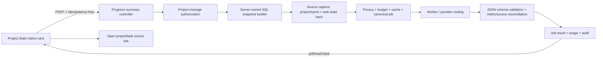

# Qaly AI-native Module Coverage and Increment Plan

**Audit date:** 2026-07-26 (Asia/Saigon)
**Audit baseline:** branch `codex/merge-main-ai-week1`; HEAD `a1367b2ca3b8d2439cefd60a8c8d73f88f06a5f0` (`Merge origin/main while preserving AI and Week 1 flows`)
**Remote relation:** `HEAD == origin/main` tại thời điểm chụp baseline; working tree sạch trước audit.
**Change boundary:** lượt này chỉ tạo file này. Không merge, reset, rebase, push, migration, build frontend, source edit, test edit hoặc sửa tài liệu v4 hiện hữu.

**Current plan amendment baseline (2026-08-01, Asia/Saigon):** branch `main`; HEAD `8ec2e926d23f022da76d35f4a95db3fc024fe9aa`. Working tree trước amendment có sẵn 5 ảnh modified dưới `src/Qaly.Web/ClientApp`; đây là thay đổi của người dùng và không thuộc amendment. Lượt amendment chỉ sửa file plan này, không chạy build/test và không thay đổi source/generated bundle.

## 1. Goal statement và định nghĩa coverage 100%

Goal đang hoạt động:

> Audit 100% bề mặt module/page/card của Qaly để xác định AI-native capability hiện có, capability thiếu và integration gap; tạo một execution plan duy nhất, tự chọn một Primary Slice và tối đa một Stretch Slice đủ nhỏ để implement sâu end-to-end trong một lượt quota tiếp theo.

Trong báo cáo này, “100% coverage” chỉ có nghĩa là toàn bộ inventory tìm thấy đã có disposition; không có nghĩa là 100% chức năng đã được implement. Một capability chỉ được tính là AI native khi đồng thời có entrypoint đúng ngữ cảnh, job/decision cụ thể, input được authorize, output có schema, lifecycle trung thực, grounding, human confirmation cho mutation, canonical platform/privacy/budget/audit/usage, read-back và verification lặp lại được.

Mẫu số audit được khóa như sau:

- 24/24 route records trong router.
- 16/16 page SFC.
- 80/80 embedded tab/card/panel/modal/drawer/flow đáng kể.
- 104/104 `SURF-ID` có đúng một status và rationale.
- 58/58 controller routes thuộc AI và các controller dashboard/group/meeting liên quan.
- 35/35 logical `AI-CAP-ID`.
- 8/8 canonical wrapper job types; 8/8 JSON schema files; 7/7 draft-type families.
- 26/26 file trong `QALY_Docs_v4.0_Draft` được đối chiếu bằng source-first reconciliation.

## 2. Executive verdict

**Coverage gate: PASS. Product completeness: NOT PASS.**

Source hiện tại có canonical AI platform khá đầy đủ, nhưng chưa có capability AI-native nào của module đạt toàn bộ 10 điều kiện ở đầu audit mà không còn verification hoặc integration gap. Các điểm quan trọng nhất:

1. AI-08 project/sprint progress summary có wrapper, job type và validator nhưng không có frontend caller; prompt không được tạo từ snapshot SQL authoritative; project/sprint source hash hiện không bao gồm task state; output không có metric-to-source reconciliation.
2. UI `AiActivityPanel` gửi `create_subtasks` và `save_checklist`, trong khi `AiWorkflowService.ConfirmDraftAsync` chỉ chấp nhận `reject`, `execute_action`, `create_tasks`. AI-06/AI-07 vì vậy không thể confirm end-to-end.
3. `TaskItem` không có parent/subtask relation và không có persisted acceptance-checklist model. AI-06/AI-07 cần prerequisite dữ liệu/domain; không phù hợp slice 1–2 ngày không migration.
4. Tám file schema có `$id` v3.2, trong khi wrapper runtime yêu cầu `*.v4`; validator là nhánh C# theo substring chứ chưa load/validate JSON Schema tương ứng.
5. Project planner, dashboard strategy, meeting checknote và một phần group AI vẫn đi qua synchronous/legacy route song song với canonical platform.
6. `/api/ai/usage`, `/api/ai/budget` và `/api/ai/health` có backend, nhưng chưa có product surface. Toggle “weekly AI report” ở Settings chỉ lưu `localStorage`.
7. Project Workload và Gantt component tồn tại nhưng `tabs` không có id `capacity`/`gantt`; Project Activity nhận `projectId` nhưng gọi global recent-activity endpoint.

Disposition của 104 surfaces: 67 `NO_AI_JUSTIFIED`, 15 `PRESENT_PARTIAL`, 7 `MISSING_HIGH_VALUE`, 7 `GENERIC_CHAT_ONLY`, 5 `FRONTEND_ONLY`, 2 `LEGACY_OR_DUPLICATE`, 1 `BACKEND_ONLY`.

**Primary Slice:** AI-08 Project Progress Summary, canonical và grounded trong Project Stats.
**Stretch Slice:** AI-08 Sprint Progress Summary trong Demo Map, chỉ làm sau khi Primary xanh toàn bộ gate.

## 3. Page/Module/Card Surface Universe

### 3.1 Route và page universe — 24/24

| SURF-ID | Route / page | Role và entity context | Action / data source | AI hiện có và disposition |
|---|---|---|---|---|
| SURF-001 | `/` → `/dashboard` | Authenticated user; none | Redirect từ router | `NO_AI_JUSTIFIED` — navigation deterministic. |
| SURF-002 | `/dashboard` — `DashboardPage.vue` | Member/manager/admin; visible workspace projects/tasks | Workspace metrics, risk, activity | `PRESENT_PARTIAL` — generic “Hỏi AI” và synchronous strategy card, chưa canonical/read-back/grounded sources. |
| SURF-003 | `/profile` — `ProfilePage.vue` | Current user | Read identity/profile | `NO_AI_JUSTIFIED` — deterministic account data tốt hơn. |
| SURF-004 | `/projects` — `ProjectsPage.vue` | Project-capable user; project collection | List/create/edit/import/project planner | `PRESENT_PARTIAL` — planner có review UI nhưng legacy generate/create và mutation không qua canonical draft confirmation. |
| SURF-005 | `/projects/archived` — `ArchivedProjectsPage.vue` | Admin/owner; archive/storage | Restore/delete/deduplicate/storage | `LEGACY_OR_DUPLICATE` — “AI deduplicator” thực tế là deterministic duplicate API; không tính AI native. |
| SURF-006 | `/projects/:projectId` — `ProjectDetailPage.vue` | Project member/manager; project | Stats, tasks, timeline, wiki, members | `PRESENT_PARTIAL` — delay resolution và assignment insight có caller nhưng contract/lifecycle chưa đủ. |
| SURF-007 | `/projects/:projectId/tasks/:taskId` | Authorized task viewer; task/project | Deep-link task drawer | `PRESENT_PARTIAL` — assignment insight native card; breakdown/checklist entrypoint thiếu. |
| SURF-008 | `/projects/:projectId/wiki/:wikiId` — `WikiDetailPage.vue` | Authorized wiki reader; wiki/project | Read document and TOC | `MISSING_HIGH_VALUE` — có thể grounded summary/draft task từ wiki; hiện không có caller. |
| SURF-009 | malformed project-task route | Any | Truthful route error | `NO_AI_JUSTIFIED`. |
| SURF-010 | malformed project route | Any | Truthful route error | `NO_AI_JUSTIFIED`. |
| SURF-011 | `/tasks` — `TasksPage.vue` | User; visible assigned/reported tasks | Global task hub and drawer | `MISSING_HIGH_VALUE` — chưa có native task AI actions; backend wrappers AI-05/06/07 không được gọi ở đây. |
| SURF-012 | `/teams` — `TeamsPage.vue` | Group member/admin/owner; work group | Chat, member, poll, meeting, project, AI tabs | `PRESENT_PARTIAL` — canonical và legacy group AI chạy song song. |
| SURF-013 | `/analytics` — `AnalyticsPage.vue` | Authenticated user; optional project | Full-screen Erumi chat | `GENERIC_CHAT_ONLY` — rich chat shell không phải module-specific analytics capability. |
| SURF-014 | `/admin/users` — `AdminUsersPage.vue` | System Admin; users | User/session/role/project access | `NO_AI_JUSTIFIED` — security mutations phải deterministic và explicit. |
| SURF-015 | `/organizations/users` — `OrganizationUsersPage.vue` | Org owner/admin/moderator scope; org members | Invite/role/remove | `NO_AI_JUSTIFIED` — deterministic authorization workflow. |
| SURF-016 | `/admin/moderators` — `ModeratorAssignmentsPage.vue` | System Admin; delegated scopes | Grant/revoke scoped capability | `NO_AI_JUSTIFIED` — high-risk permission mutation. |
| SURF-017 | `/groups` — `TeamsPage.vue` | Group member; group list | Select/create/chat | `PRESENT_PARTIAL` — shares group AI panel gaps. |
| SURF-018 | `/groups/:groupId` — `TeamsPage.vue` | Group member/admin/owner; group | Group native tabs | `PRESENT_PARTIAL` — AI-03/04 caller exists but range/source/editor evidence partial. |
| SURF-019 | `/groups/:groupId/meeting` — `GroupMeetingPage.vue` | Group participant/manager; meeting | Live meeting, transcript, checknote | `PRESENT_PARTIAL` — privacy-aware AI checknote exists but uses legacy synchronous path. |
| SURF-020 | `/groups/:groupId/polls` — `GroupPollPage.vue` | Group member; polls | Create/vote/read/close | `NO_AI_JUSTIFIED` — vote arithmetic and close policy deterministic. |
| SURF-021 | `/groups/:groupId/polls/:pollId` | Group member; poll | Poll detail/result | `NO_AI_JUSTIFIED`. |
| SURF-022 | malformed group route | Any | Truthful route error | `NO_AI_JUSTIFIED`. |
| SURF-023 | `/settings` — `SettingsPage.vue` | User/project manager/org admin | Settings/privacy/logs/API keys | `FRONTEND_ONLY` — weekly AI report chỉ localStorage; usage/budget product card absent. |
| SURF-024 | catch-all route | Any | 404 truth state | `NO_AI_JUSTIFIED`. |

Page-file closure: `AdminUsersPage`, `AnalyticsPage`, `ArchivedProjectsPage`, `DashboardPage`, `GroupMeetingPage`, `GroupPollPage`, `ModeratorAssignmentsPage`, `OrganizationUsersPage`, `ProfilePage`, `ProjectDetailPage`, `ProjectsPage`, `RouteErrorPage`, `SettingsPage`, `TasksPage`, `TeamsPage`, `WikiDetailPage` = **16/16**.

### 3.2 Embedded tabs, cards, panels và flows — 80/80

| SURF-ID | Module / card / flow | Role; entity; primary action / data source | Status và rationale |
|---|---|---|---|
| SURF-025 | App shell navigation/header | Auth user; route/session; navigate/account action | `NO_AI_JUSTIFIED`. |
| SURF-026 | Global search modal | Auth user; loaded project/task/member collections; filter/open/create | `NO_AI_JUSTIFIED` — current exact/filter search is deterministic; semantic backend remains orphan separately. |
| SURF-027 | Notification popover | Auth user; notification feed; read/dismiss/open | `NO_AI_JUSTIFIED`. |
| SURF-028 | Floating assistant | Auth user; current route prompt | `GENERIC_CHAT_ONLY`. |
| SURF-029 | Erumi composer/model/history/source drawers | Auth user; optional project/chat; ask/upload/open refs | `GENERIC_CHAT_ONLY` — useful transport, not module capability contract. |
| SURF-030 | AI Activity jobs/drafts/health drawer | Project user; canonical jobs/drafts; poll/retry/cancel/edit/confirm | `PRESENT_PARTIAL` — lifecycle/read-back có; renderer generic và confirm-action mismatch cho AI-06/07. |
| SURF-031 | Dashboard active-project metric card | User workspace; dashboard overview; open projects/ask AI | `GENERIC_CHAT_ONLY` — AI action chỉ prefilled generic prompt. |
| SURF-032 | Dashboard open-task metric card | User workspace; dashboard overview; open tasks/ask AI | `GENERIC_CHAT_ONLY`. |
| SURF-033 | Dashboard team-capacity metric card | User workspace; member workload; inspect/ask AI | `GENERIC_CHAT_ONLY`. |
| SURF-034 | Dashboard project-progress chart | User workspace; deterministic series; inspect | `NO_AI_JUSTIFIED` — chart calculation should remain deterministic. |
| SURF-035 | Dashboard Attention Risk card | User; `/api/dashboard/attention-summary`; open risk target | `NO_AI_JUSTIFIED` — rule-based risk is transparent. |
| SURF-036 | Dashboard Recent Activity card | User; `/api/dashboard/recent-activities`; open activity | `NO_AI_JUSTIFIED`. |
| SURF-037 | Dashboard Strategic Overview metrics + AI brief | User; client-posted workspace metrics; generate brief | `PRESENT_PARTIAL` — schema check exists but synchronous, client-trusted input, no canonical job/source/read-back. |
| SURF-038 | Projects spotlight/list/grid | Project user; dashboard/project data; filter/open | `NO_AI_JUSTIFIED`. |
| SURF-039 | Create/edit project modal | Project creator/manager; project DTO; save | `NO_AI_JUSTIFIED` for core CRUD. |
| SURF-040 | AI Planner modal | Project creator; natural-language plan; generate/review/create | `PRESENT_PARTIAL` — legacy synchronous plan and direct mutation; no canonical draft/idempotent confirm. |
| SURF-041 | Import upload/mapping/confirm/undo | Project manager; files/import session; preview/execute/undo | `NO_AI_JUSTIFIED` for parsing/mapping core; import truth states are deterministic. |
| SURF-042 | Archive storage usage card | Admin/owner; `/api/storage/stats`; inspect quota | `NO_AI_JUSTIFIED`. |
| SURF-043 | Archive storage breakdown card | Admin/owner; storage stats; inspect distribution | `NO_AI_JUSTIFIED`. |
| SURF-044 | Archive retention policy card | Admin/owner; retention state; inspect policy | `NO_AI_JUSTIFIED`. |
| SURF-045 | Storage deduplicator card | Admin/owner; duplicate hashes; preview/delete duplicates | `LEGACY_OR_DUPLICATE` — AI branding sai; deterministic hash logic đúng hơn. |
| SURF-046 | Project Trash cards | Project owner/admin; trashed projects; restore/hard-delete | `NO_AI_JUSTIFIED`. |
| SURF-047 | Archived project cards | Project owner/member; archived projects; open/restore | `NO_AI_JUSTIFIED`. |
| SURF-048 | Project Stats health panel | Project member; computed project stats; inspect health | `NO_AI_JUSTIFIED` for score; Primary adds a separate narrative card, không thay score. |
| SURF-049 | Project Stats current metric cards | Project member; task aggregates; inspect counts | `NO_AI_JUSTIFIED` for values. |
| SURF-050 | Project Stats status distribution | Project member; task status aggregate | `NO_AI_JUSTIFIED`. |
| SURF-051 | Project Stats delivery progress | Project member; completion/open metrics | `NO_AI_JUSTIFIED` for metric; native grounded AI-08 card is missing beside it. |
| SURF-052 | Demo Map roadmap/sprint track | Project member; sprint/milestone/task APIs; inspect timeline | `NO_AI_JUSTIFIED` for timeline computation. |
| SURF-053 | Milestone detail + create/edit modal | Project manager; sprint/milestone; edit | `NO_AI_JUSTIFIED`. |
| SURF-054 | Project task board/list | Project member; project tasks; move/open/filter | `MISSING_HIGH_VALUE` — no contextual AI-05/06/07 entrypoint. |
| SURF-055 | Create task + import controls | Project manager/member per role; task/import DTO; create | `NO_AI_JUSTIFIED` for manual create. |
| SURF-056 | Delayed-project resolution trigger/review | Project manager; project; enqueue and review proposed actions | `PRESENT_PARTIAL` — canonical job/draft exists; schema validator/source grounding/fallback content incomplete. |
| SURF-057 | Project task detail core | Task viewer/editor; task; inspect/edit | `MISSING_HIGH_VALUE` — breakdown/checklist surfaces absent. |
| SURF-058 | Assignment Insight card | Task viewer/manager; task + project members/workload; inspect candidates | `PRESENT_PARTIAL` — native caller and explainable output, nhưng synchronous endpoint bypasses canonical wrapper and confirm. |
| SURF-059 | Task timer/attachments/comments cards | Task collaborator; task artifacts; log/upload/comment | `NO_AI_JUSTIFIED` for core actions. |
| SURF-060 | Project Members tab | Project manager/member; project members; add/role/remove | `NO_AI_JUSTIFIED`. |
| SURF-061 | Project Activity tab | Project member; receives projectId but calls global activity endpoint | `FRONTEND_ONLY` — integration context sai; deterministic scoping fix required, không phải AI. |
| SURF-062 | Project Wiki tab | Wiki author/reader; wiki pages; create/read/edit | `MISSING_HIGH_VALUE` — grounded summarize/to-task candidate; no native caller. |
| SURF-063 | Project Workload tab | Project member; `/api/projects/{id}/workload` | `FRONTEND_ONLY` — component có code nhưng tab id `capacity` không có trong `tabs`, nên unreachable. |
| SURF-064 | Project Gantt/Attention/Timeline tab | Project member; gantt/attention/timeline APIs | `FRONTEND_ONLY` — component có code nhưng tab id `gantt` không có trong `tabs`. |
| SURF-065 | Project Webhooks tab | Project manager; webhook APIs; create/test/delete | `NO_AI_JUSTIFIED`. |
| SURF-066 | Tasks “Nhiệm vụ của tôi” stat card | User; visible task aggregate | `NO_AI_JUSTIFIED`. |
| SURF-067 | Tasks overdue stat card | User; deterministic due-date aggregate | `NO_AI_JUSTIFIED`. |
| SURF-068 | Tasks due-soon stat card | User; deterministic due-date aggregate | `NO_AI_JUSTIFIED`. |
| SURF-069 | Tasks completed stat card | User; status aggregate | `NO_AI_JUSTIFIED`. |
| SURF-070 | Tasks filter/list/cards | User; visible tasks; filter/open/complete | `NO_AI_JUSTIFIED` for filter/status calculation. |
| SURF-071 | Global Tasks detail drawer | Authorized task user; task/comments/files/time | `MISSING_HIGH_VALUE` — native task AI entrypoint absent. |
| SURF-072 | Teams chat sidebar/window | Group member; group messages; send/read/search | `NO_AI_JUSTIFIED` for core chat; AI actions live in separate native tab. |
| SURF-073 | Group Members tab | Group admin/member; members; add/role/remove/leave | `NO_AI_JUSTIFIED`. |
| SURF-074 | Group Invites tab | Group admin; invitations; invite/read | `NO_AI_JUSTIFIED`. |
| SURF-075 | Group Polls tab/card | Group member; poll messages; create/vote/close | `NO_AI_JUSTIFIED`. |
| SURF-076 | Group Meeting launcher tab | Group member; meeting session; start | `NO_AI_JUSTIFIED` for launch. |
| SURF-077 | Group Project tab | Group admin/member; group→project DTO; create/open | `NO_AI_JUSTIFIED` for explicit create. |
| SURF-078 | Group AI tab (`GroupAiPanel`) | Group member; selected messages/group; summarize/task draft/action items/project draft | `PRESENT_PARTIAL` — canonical AI-03/04 plus legacy actions; selected-range/source/editor tests incomplete. |
| SURF-079 | Shared attachments panel | Group member; message attachments; open/download/hide | `NO_AI_JUSTIFIED`. |
| SURF-080 | Create Group modal | User; group DTO; create | `NO_AI_JUSTIFIED`. |
| SURF-081 | Meeting prejoin/live media/screen share | Meeting participant; realtime/media | `NO_AI_JUSTIFIED`. |
| SURF-082 | Meeting privacy/consent dialog | Meeting participant/admin; policy/consent | `NO_AI_JUSTIFIED` — policy decision must remain deterministic. |
| SURF-083 | Meeting transcript panel | Authorized participant; transcript | `NO_AI_JUSTIFIED` for transcript capture; source for checknote. |
| SURF-084 | AI Checknote/action-item cards | Authorized participant/manager; transcript/meeting; generate/link/create task | `PRESENT_PARTIAL` — source/consent handling tốt, nhưng legacy sync, no canonical reload/cancel/retry. |
| SURF-085 | Group Poll create form | Group member; poll | `NO_AI_JUSTIFIED`. |
| SURF-086 | Poll result/vote/close panel | Group member/creator; poll options/votes | `NO_AI_JUSTIFIED`. |
| SURF-087 | Wiki document + TOC | Wiki reader; wiki content; read/navigate | `MISSING_HIGH_VALUE` — grounded brief/draft candidate deferred after locked AI-01..08. |
| SURF-088 | Settings profile/workspace/password | User/org/project manager; settings DTOs | `NO_AI_JUSTIFIED`. |
| SURF-089 | Settings Appearance tab | User; local theme | `NO_AI_JUSTIFIED`. |
| SURF-090 | Settings Workflow tab | Project manager; workflow settings | `NO_AI_JUSTIFIED` — state-transition policy deterministic. |
| SURF-091 | Settings Notifications / weekly AI report toggle | User; localStorage only; toggle digest | `FRONTEND_ONLY` — text promises backend AI email without backend schedule/read-back. |
| SURF-092 | Settings API Keys/integration info | User; API key APIs | `NO_AI_JUSTIFIED`. |
| SURF-093 | Settings Privacy tab | Org/project admin; privacy/retention/DSAR | `NO_AI_JUSTIFIED` for policy operations. |
| SURF-094 | Settings personal audit log | User; audit API; inspect | `NO_AI_JUSTIFIED`. |
| SURF-095 | Settings AI usage/budget card (required, absent) | Org Admin/project manager; AI ledger/policy | `BACKEND_ONLY` — GET/PUT endpoints exist; no product surface. |
| SURF-096 | Admin user table/filter | System Admin; users; inspect/filter | `NO_AI_JUSTIFIED`. |
| SURF-097 | Admin user/project-role drawer | System Admin; user/project memberships; edit/revoke sessions | `NO_AI_JUSTIFIED`. |
| SURF-098 | Admin create/transfer flow | System Admin; user/admin ownership; mutate | `NO_AI_JUSTIFIED`. |
| SURF-099 | Organization context/member list | Org member/admin; org members | `NO_AI_JUSTIFIED`. |
| SURF-100 | Organization invite/role flow | Org admin/moderator; memberships | `NO_AI_JUSTIFIED`. |
| SURF-101 | Moderator assignment table | System Admin; delegated scopes | `NO_AI_JUSTIFIED`. |
| SURF-102 | Moderator grant/revoke modal | System Admin; capability scope | `NO_AI_JUSTIFIED`. |
| SURF-103 | Analytics full-screen Erumi panel | Auth user; optional project/chat history | `GENERIC_CHAT_ONLY`. |
| SURF-104 | Profile identity detail cards | Current user; identity/email/role | `NO_AI_JUSTIFIED`. |

State audit rule: mỗi surface có loading/empty/error/permission/degraded state được tính trong chính `SURF-ID`. Các surface deterministic nhìn chung có loading/empty/error; các AI partial thiếu ít nhất một trong queued/running/cancel/retry/degraded/read-back/source-open. Những thiếu này được ghi trong Gap Register.

### 3.3 Current-source delta — 2026-08-01

Các row sau mở rộng inventory lịch sử lên **110 surface records**. `SURF-105/106` là surface runtime xuất hiện sau baseline; `SURF-107..110` là surface của Action Composer và đã được reconciled lại sau implementation closure tại §20.

| SURF-ID | Route / module / card | Role; entity context; primary action / source | Status và rationale |
|---|---|---|---|
| SURF-105 | `/organizations` — `OrganizationsPage.vue` | System Admin; organization collection; create/select organization | `NO_AI_JUSTIFIED` — organization CRUD và ownership là deterministic, explicit security operation. |
| SURF-106 | Project Task Detail — “Kỹ năng cần thiết” / `TaskSkillsAiCard.vue` | Task manager; task + organization skill catalog; manual tag hoặc AI suggestion/review/confirm | `NATIVE_COMPLETE` theo source/test artifacts của CAND-015; release run vẫn phải rerun verification gates. |
| SURF-107 | AppShell compact model control + global `AI Hành động` trigger | Authenticated user; current route and optional project; open action composer | `NATIVE_COMPLETE` cho Task-create v1 — AppShell có shared trigger; chip ghi rõ DeepSeek V4 Pro là model **ưu tiên**, sau khi route thì drawer/receipt hiển thị provider/model thực tế. Runtime model registry/preference selector vẫn là backlog platform, không được giả là đã có. |
| SURF-108 | Contextual `Thực hiện với AI` entrypoint trong Task/Project/Group/Meeting | Authorized module user; current entity/selection; compose module-native action | `PRESENT_PARTIAL` — Project Task context dùng shared context envelope/caller và manager permission; Group/Meeting/Schedule adapters được defer có chủ ý sau Task-create Primary. |
| SURF-109 | AI Action Composer drawer: intent, assumptions, 1–3 options, editable commands, confirm và receipt | Authorized actor; persisted job/draft/action receipt | `NATIVE_COMPLETE` cho `task.create.v1` — structured options, editable/selective task rows, explicit confirmation, atomic idempotent execution và receipt/deep links/read-back. |
| SURF-110 | AI Process Activity chip + expandable operational timeline trong Composer/AppShell | Authorized actor; current/persisted AI job, stage events, elapsed time, retry/cancel/read-back | `NATIVE_COMPLETE` — persisted ordered safe activity events drive elapsed chip/timeline; reload restores stage history; raw reasoning/private payload is not rendered. |

Current route/page delta: router có **25/25** records và page folder có **17/17** SFC sau khi thêm `/organizations`/`OrganizationsPage.vue`. Các route/page còn lại giữ disposition lịch sử; current inventory closure được cập nhật ở §16.1.

## 4. Existing AI Capability Universe

### 4.1 Controller route reconciliation — 58/58

Mỗi route dưới đây nằm trong đúng một `AI-CAP-ID`; cột caller liệt kê caller thật, không suy ra từ docs.

| AI-CAP-ID | Endpoint(s) | Job/schema/draft | Frontend caller / output UI | Source, mutation, tests | Status |
|---|---|---|---|---|---|
| AI-CAP-001 | `POST /api/ai/generate-plan`; `POST /api/ai/create-plan` | Legacy `GenerateProjectPlan`; inline plan DTO | `AiPlannerModal` | Input manual; create-plan mutates project/tasks directly; planner tests only indirect | `PRESENT_PARTIAL` |
| AI-CAP-002 | `POST /api/ai/sync` | Vector ingestion | None | Backend ingestion/outbox; no product status | `BACKEND_ONLY` |
| AI-CAP-003 | `POST/GET /api/ai/jobs`; `GET /jobs/{id}`; `/result`; `POST /retry`; `/cancel` | Canonical `AiJob`, dispatch, attempts, usage | `AiActivityPanel` list/detail | Source guard, privacy, budget, audit, idempotency; unit/integration/E2E shell evidence | `VERIFICATION_GAP` — local platform tests pass, hosted/capability evidence absent |
| AI-CAP-004 | `GET /api/ai/drafts`; `GET/PATCH /drafts/{id}`; `POST /confirm`; `/reject` | `AiGeneratedDraft`; multiple draft types | `AiActivityPanel`, Erumi approval | Supports only `reject`, `execute_action`, `create_tasks`; task draft/meeting tests | `PRESENT_PARTIAL` |
| AI-CAP-005 | `POST /api/ai/agent-runs`; `GET /agent-runs/{id}`; `POST /approve` | `Qaly.AgentRun.v1`, draft-change | Erumi actions | Generic agent flow, explicit approval; unit evidence | `GENERIC_CHAT_ONLY` |
| AI-CAP-006 | `GET /api/ai/usage`; `GET/PUT /api/ai/budget`; `GET /api/ai/health` | Usage ledger/budget policy/platform health | Health only in `AiActivityPanel`; no usage/budget UI | Backend unit evidence; no product E2E | `BACKEND_ONLY` |
| AI-CAP-007 | `POST /api/ai/meetings/{meetingId}/extract-actions` | `meeting_action_extract`, `meeting_action_extract.v4`, `MeetingActionItems` | No caller; meeting page calls another route | Meeting source guard; draft can `create_tasks`; platform tests not wrapper E2E | `BACKEND_ONLY` |
| AI-CAP-008 | `POST /api/ai/groups/{groupId}/summaries` | `chat_summary`, `chat_summary.v4` | `GroupAiPanel` selected-message summary | Message source URLs assembled; range/cache/reload evidence incomplete | `PRESENT_PARTIAL` |
| AI-CAP-009 | `POST /api/ai/task-drafts/from-source` | `task_draft`, `task_draft.v4`, `TaskDraft` | `GroupAiPanel` | Source guard + draft/create_tasks; editor mostly generic JSON | `PRESENT_PARTIAL` |
| AI-CAP-010 | `POST /api/ai/tasks/{taskId}/recommend-assignees` | `assignee_recommendation.v4` | None; Project Detail calls sync insight instead | Task source guard; read-only recommendation | `BACKEND_ONLY` |
| AI-CAP-011 | `POST /api/ai/tasks/{taskId}/breakdown` | `task_breakdown.v4`, `TaskBreakdown` | No native caller; generic draft may list | Confirm action emitted by UI unsupported; no persisted subtask relation | `BACKEND_ONLY` |
| AI-CAP-012 | `POST /api/ai/tasks/{taskId}/acceptance-checklist` | `acceptance_checklist.v4`, `AcceptanceChecklist` | No native caller; generic draft may list | Confirm action unsupported; no checklist persistence model | `BACKEND_ONLY` |
| AI-CAP-013 | `POST /api/ai/projects/{projectId}/progress-summary` | `progress_summary`, `progress_summary.v4` | None | Project source hash omits task state; generic prompt; no metric reconciliation/test | `BACKEND_ONLY` |
| AI-CAP-014 | `POST /api/ai/projects/{projectId}/suggest-resolution` | `project_delay_resolution.v4`, `ProjectDelayResolution` | Project Detail trigger + visual draft editor | Canonical draft/confirm exists; unknown schema passes generic validator; fallback contains invented/hard-coded content | `PRESENT_PARTIAL` |
| AI-CAP-015 | `POST /api/ai/projects/{projectId}/sprints/{sprintId}/progress-summary` | Same generic `progress_summary.v4` | None | Sprint hash omits task state; no renderer/test | `BACKEND_ONLY` |
| AI-CAP-016 | `POST /api/ai/priority` | Legacy `SuggestTaskPriority` | None | Manual text; sync gateway | `BACKEND_ONLY` |
| AI-CAP-017 | `GET /api/ai/projects/{id}/summary`; `/risks`; `/insights` | Legacy sync jobs | None | Backend-only, overlapping AI-08/dashboard | `BACKEND_ONLY` |
| AI-CAP-018 | `GET /api/ai/tasks/{id}/assignment`; `/assignment-insight` | Sync heuristic/AI service | Project task assignment card calls insight | Authorized task/project query; read-only output; no canonical job/confirm | `PRESENT_PARTIAL` |
| AI-CAP-019 | `GET /api/ai/search` | Semantic/vector search | None; global search is client filter | Vector auth/visibility needs product proof | `BACKEND_ONLY` |
| AI-CAP-020 | `POST /api/ai/subtasks` | Legacy `GenerateSubtasks` | None | Free string output, no source/task authorization/draft | `BACKEND_ONLY` |
| AI-CAP-021 | `POST /api/ai/chat`; `/chat/fast`; `/chat/stream` | `Chat`, `ChatStream`, `TextAnswer.v1` | Erumi/Floating assistant | Generic route/project context; not per-module contract | `GENERIC_CHAT_ONLY` |
| AI-CAP-022 | `GET /api/ai/export/{projectId}` | Deterministic Word/Excel export | No current caller found | Not an AI decision; project auth required | `NO_AI_JUSTIFIED` |
| AI-CAP-023 | `POST /api/groups/{groupId}/ai/action-items` | Legacy `ActionItem` | `GroupAiPanel` | Group source, sync output; no canonical draft/read-back | `PRESENT_PARTIAL` |
| AI-CAP-024 | `POST /api/groups/{groupId}/ai/../meetings/{meetingId}/hook` | Legacy meeting hook | None | Odd relative route; no caller | `BACKEND_ONLY` |
| AI-CAP-025 | `GET /api/groups/{groupId}/ai/context` | Deterministic group context | None | Support endpoint only | `BACKEND_ONLY` |
| AI-CAP-026 | `POST /api/groups/{groupId}/ai/summary` | Legacy `DiscussionSummary` | `GroupAiPanel` | Duplicates canonical AI-CAP-008 | `LEGACY_OR_DUPLICATE` |
| AI-CAP-027 | `POST /api/groups/{groupId}/ai/draft-project` | Legacy `DraftProject` | `GroupAiPanel` | Review-only payload, no canonical confirm | `PRESENT_PARTIAL` |
| AI-CAP-028 | `POST /api/meetings/import/meetily` | `meetily_import.v4`, canonical meeting records | Import/meeting flows indirectly | Privacy/source/audit present; mixed legacy/canonical orchestration | `PRESENT_PARTIAL` |
| AI-CAP-029 | `POST /api/meetings/{sessionId}/auto-checknote` | `AutoChecknote`; meeting extract records | `GroupMeetingPage` | Privacy consent/policy; synchronous run; no retry/cancel/read-back job | `PRESENT_PARTIAL` |
| AI-CAP-030 | `POST create-task`; `GET action-items`; `POST link-task`; `GET task-link` under `/api/meetings/{id}/action-items` | Human confirmation/link workflow | Checknote action-item cards | Explicit mutation and mapping; capability support, not model invocation | `PRESENT_PARTIAL` |
| AI-CAP-031 | `GET /api/dashboard/overview` | Deterministic aggregate | Dashboard/App | No AI | `NO_AI_JUSTIFIED` |
| AI-CAP-032 | `GET /api/dashboard/attention-summary` | Deterministic attention rules | `AttentionRiskCard` | No AI | `NO_AI_JUSTIFIED` |
| AI-CAP-033 | `GET /api/dashboard/recent-activities` | Deterministic audit/activity read | Dashboard + incorrectly Project Activity | No AI; project-scope integration gap | `NO_AI_JUSTIFIED` |
| AI-CAP-034 | `GET /api/dashboard/strategic-overview` | Deterministic metrics | `StrategicOverviewAI` | Server-authorized metrics; correct deterministic layer | `NO_AI_JUSTIFIED` |
| AI-CAP-035 | `POST /api/dashboard/ai-strategy` | Sync `WorkspaceStrategy.v1` | `StrategicOverviewAI` | Client posts metrics; validator exists; no canonical source/job/usage read-back | `PRESENT_PARTIAL` |

Route total check: `AiController` 42 + `GroupAiController` 5 + `MeetingsController` 6 + `DashboardController` 5 = **58/58**.

### 4.2 Service, platform, provider, schema và configuration inventory

| Layer | Runtime evidence | Audit disposition |
|---|---|---|
| Application facade | `IAiService`/`AiService` | Nhiều legacy sync function còn song song canonical workflow. |
| Canonical workflow | `IAiWorkflowService`/`AiWorkflowService`, `AiPlatformQueryService` | Job/source/privacy/budget/cache/idempotency/draft/read-back mạnh; capability confirm và schema-specific validation chưa đều. |
| Group/chat | `IGroupAiService`/`GroupAiService`, `ErumiChatService`, `AgentRunService`, `AiTools` | Generic chat và group legacy/canonical overlap. |
| Gateway/router | `IAiGateway`/`AiGateway`, `MicrosoftAgentOrchestrator`, `AiProviderFactory` | Backend-only provider access; repair/fallback/label support. |
| Providers | Ollama, DeepSeek, OpenAI, Gemini | Routed server-side; policy/budget/provider settings exist. |
| Worker/lifecycle | `AiJobWorker`, `AiJobDispatchStore`, `AiJobProcessor` | Queue/lease/retry/cancel/usage/audit implemented and locally tested. |
| Guard/control | `AiSourceGuard`, `AiComplianceService`, `AiCostService`, `AiOutputValidator` | Authorization/freshness/privacy/budget present; entity hash coverage và schema loader incomplete. |
| Feature flags | `AI_JOB_V4_ENABLED`, `AI_JOB_V4_WORKER_ENABLED`, platform `Enabled`, `WorkerEnabled`, `AllowProviderDegradedMock` | Có disable/degraded path; native card phải surface state trung thực. |
| Vector support | `IAiIngestionService`, vector outbox/worker, Qdrant/Ollama embeddings | Semantic search backend exists; no native caller. |

Schema file closure:

| Schema file | Runtime wrapper ID | Finding |
|---|---|---|
| `acceptance_checklist.schema.json` (`$id ...v3.2`) | `acceptance_checklist.v4` | Version identity mismatch; hardcoded validator only. |
| `assignee_recommendation.schema.json` (`v3.2`) | `assignee_recommendation.v4` | Same mismatch. |
| `chat_summary.schema.json` (`v3.2`) | `chat_summary.v4` | Same mismatch; source-range evidence partial. |
| `meeting_action_extract.schema.json` (`v3.2`) | `meeting_action_extract.v4` | Same mismatch. |
| `privacy_data_request.schema.json` (`v3.2`) | no product wrapper in `AiController` | Schema orphan has explicit disposition: platform/privacy support, not current module AI. |
| `progress_summary.schema.json` (`v3.2`) | `progress_summary.v4` | Primary contract target; lacks structured source refs/reconciliation fields. |
| `task_breakdown.schema.json` (`v3.2`) | `task_breakdown.v4` | Draft generated; mutation target absent. |
| `task_draft.schema.json` (`v3.2`) | `task_draft.v4` | Canonical wrapper/caller exists, product editor evidence partial. |

Canonical wrapper job types = `meeting_action_extract`, `chat_summary`, `task_draft`, `assignee_recommendation`, `task_breakdown`, `acceptance_checklist`, `progress_summary`, `project_delay_resolution` = **8/8**.

Draft families = `MeetingActionItems`, `TaskDraft`, `TaskBreakdown`, `AcceptanceChecklist`, `DraftChange`, `ProjectDelayResolution`, dynamic agent tool draft = **7/7**. Backend confirmation supports only `reject`, `execute_action`, `create_tasks`; frontend additionally emits unsupported `create_subtasks`, `save_checklist`, `save_report`.

### 4.3 Current-source capability delta — 2026-08-01

| AI-CAP-ID | Endpoint/job/schema/caller | Runtime evidence và disposition |
|---|---|---|
| AI-CAP-036 | `POST /api/ai/tasks/{taskId}/skill-suggestions`; canonical `task_skill_suggestion`; `task_skill_suggestion.v1`; `TaskSkillsAiCard.vue` | `NATIVE_COMPLETE` theo implementation closure CAND-015: authorized task/catalog context, schema + semantic reconciliation, persisted draft, `apply_task_skills`, source/privacy/budget/usage/audit/read-back và native review. |
| AI-CAP-037 | `POST /api/ai/actions/compose`; `GET /api/ai/jobs/{jobId}/activity`; `action_intent_compose`; `ai_action_intent_envelope.v1`; `AiActionPlan`; `execute_action_set`; AppShell/Project Task callers | `NATIVE_COMPLETE` cho bounded Task-create v1 — authorized server snapshot, versioned `task.create.v1`, canonical job/draft/activity, semantic validation, edit/selective confirm, atomic/idempotent mutation, receipt/audit/usage/read-back và repeatable unit/integration/E2E evidence. Project/Group/Meeting/Schedule tool adapters không được tính vào capability này. |

Current controller-route reconciliation sau closure: `AiController` 46 + `GroupAiController` 5 + `MeetingsController` 6 + `DashboardController` 5 = **62/62 runtime routes**. Hai route mới của CAND-018 là compose và authorized incremental activity read-back. Current schema folder có **10/10 runtime schema files**, gồm `ai_action_intent_envelope.v1` của AI-CAP-037.

## 5. Bidirectional UI ↔ API/job/schema/test matrix

| Flow | UI → backend reconciliation | Backend → UI reconciliation | Verdict |
|---|---|---|---|
| Dashboard generic metric “Hỏi AI” | Opens generic chat with prompt; no capability request schema | Chat endpoints have generic renderer only | GAP-017; `GENERIC_CHAT_ONLY`. |
| Dashboard Strategic Brief | Real caller to `/api/dashboard/ai-strategy`, loading/error/result UI | Sync endpoint has caller, but trusts client metrics and bypasses canonical job/source/read-back | GAP-011; `PRESENT_PARTIAL`. |
| Project AI planner | Generate then create caller; UI review before create | Legacy endpoints both have caller; create mutates directly | GAP-010; `PRESENT_PARTIAL`. |
| Project delay resolution | Native trigger enqueues canonical job; review opens AI Activity | Wrapper has caller and visual editor; schema-specific validator/source-grounded fallback tests absent | GAP-018/019/021; `PRESENT_PARTIAL`. |
| Task assignment insight | Native card calls sync insight | Sync endpoint has caller; canonical recommendation wrapper orphan | GAP-006; sync capability partial + canonical backend-only. |
| AI-06 Task breakdown | No native caller; generic draft renderer may receive result | Wrapper/schema/draft exist; UI confirm action rejected by backend; no subtask model | GAP-004; `BACKEND_ONLY`. |
| AI-07 Acceptance checklist | No native caller | Wrapper/schema/draft exist; UI confirm action rejected; no checklist model | GAP-005; `BACKEND_ONLY`. |
| AI-08 Project summary | No native caller | Endpoint/job/schema exist; no SQL snapshot prompt/reconciliation/read-back evidence | GAP-001/002/003; `BACKEND_ONLY`. |
| AI-08 Sprint summary | No native caller | Same, plus sprint source hash omits task state | GAP-001/003; `BACKEND_ONLY`. |
| Group selected summary (AI-03) | `GroupAiPanel` sends selected message sources | Canonical wrapper has caller/result path; selected-range/cache/source-open tests incomplete | GAP-007; `PRESENT_PARTIAL`. |
| Group task draft (AI-04) | `GroupAiPanel` enqueues source-linked draft | Wrapper has caller and draft confirmation; native structured editor/selective evidence partial | GAP-008; `PRESENT_PARTIAL`. |
| Group legacy summary/action/project | Real callers | Duplicates canonical transport or bypasses it | GAP-020; partial/legacy. |
| Meeting AI checknote | Privacy dialog → sync auto-checknote → summary/action cards | Legacy endpoint has caller; canonical extract wrapper orphan | GAP-009; `PRESENT_PARTIAL`. |
| AI usage/budget | No UI caller except health | GET/PUT/health backend and tests exist | GAP-012; `BACKEND_ONLY`. |
| Weekly AI report | Toggle writes localStorage only | No schedule/config/read-back endpoint | GAP-013; `FRONTEND_ONLY`. |
| Analytics | Full-screen Erumi only | Generic chat backend has caller and source drawer | GAP-014; `GENERIC_CHAT_ONLY`. |
| Semantic search | Global search uses loaded deterministic arrays | `/api/ai/search` has no caller | Explicit defer: exact search remains `NO_AI_JUSTIFIED`; backend route is `BACKEND_ONLY`. |
| Project Activity | Component passes projectId but ignores it in API call | Dashboard recent activity serves global authorized feed | GAP-015; deterministic integration fix, not AI candidate. |
| Workload/Gantt | Components implemented | Backend endpoints have UI code, but no reachable tab id | GAP-016; navigation fix, not AI candidate. |
| Conversational write/action intent | Legacy Erumi still has a keyword/`erumi_autonomous_tasks` path, while the new shared caller uses explicit `action_intent_compose` | Native Task-create v1 now has schema/job/draft/confirm/receipt evidence; legacy path is `LEGACY_OR_DUPLICATE`, and missing Project/Group/Meeting/Schedule catalog is explicit deferred breadth | GAP-026/027 closed for bounded path; AI-CAP-037 / CAND-018 `NATIVE_COMPLETE` for `task.create.v1`. |
| Global/contextual AI Action UX + process visibility | AppShell and Project Task now use the shared composer; other contextual adapters are deferred | Persisted safe stage events drive elapsed timeline; truthful strong-profile/actual model is shown. Shared runtime model registry/preference API remains partial platform work | GAP-028/030 closed for bounded path; GAP-029 `PRESENT_PARTIAL`; SURF-107/109/110 complete, SURF-108 partial. |

Orphan reconciliation result: mọi caller-less backend route đã nhận `BACKEND_ONLY`, `LEGACY_OR_DUPLICATE`, `NO_AI_JUSTIFIED` hoặc explicit defer; mọi UI-only promise đã nhận `FRONTEND_ONLY`; **undispositioned orphan = 0**.

## 6. AI-native coverage matrix theo route/page/tab/card

| Module | SURF count | Native/partial signal | Missing/high-value | Explicit no-AI / integration-only |
|---|---:|---|---|---|
| App shell/search/assistant | 6 | Generic chat + partial AI Activity | Capability-specific entrypoints absent by design | Search/notifications deterministic. |
| Dashboard | 13 | Strategic brief partial; generic prompts | Canonical, source-grounded workspace brief deferred | Metrics/charts/risk/activity deterministic. |
| Projects/archive/import | 10 | Legacy AI planner | Planner canonicalization candidate | Storage/dedup/import should remain deterministic. |
| Project Detail/Task | 18 | Delay resolution + assignment insight partial | AI-05 canonical UI, AI-06/07, AI-08 project summary, wiki brief | CRUD/stats/timeline/member/webhook deterministic; 3 non-AI integration defects. |
| Global Tasks | 7 | None native | Native task action hub | Counts/filter/status deterministic. |
| Teams/Groups | 12 | AI-03/04 + legacy group actions partial | Source-range/editor closure | Member/invite/poll/meeting launch deterministic. |
| Meeting | 4 | Privacy-aware checknote partial | Canonical migration/read-back | Media/transcript/policy deterministic. |
| Poll | 4 | None | No forced AI | Vote/result deterministic. |
| Wiki | 3 | None | Grounded brief/to-task candidate | Authoring/navigation deterministic. |
| Settings | 8 | Health visible elsewhere | AI usage/budget missing; weekly report UI-only | Policy/account/log settings deterministic. |
| Admin/Organization/Moderator | 10 | None | No AI proposed | High-risk role/permission operations deterministic. |
| Analytics/Profile/Error routes | 9 | Generic Erumi only | Analytics native capability deferred pending real job definition | Profile/error deterministic. |
| **Total** | **104** | **15 partial + 7 generic** | **7 high-value surfaces** | **67 no-AI + 5 frontend-only + 2 legacy + 1 backend-only** |

## 7. Gap Register

| GAP-ID | Severity | Finding / runtime evidence | Resolution disposition |
|---|---|---|---|
| GAP-001 | P0 Product | AI-08 project/sprint wrappers have no caller or native result card. | CAND-001 Primary; CAND-002 Stretch. |
| GAP-002 | P0 Contract | Schema files declare v3.2 while runtime wrapper requests v4; JSON Schema is not loaded as authority. | CAND-001 establishes real `progress_summary.v4`; other schemas deferred by dependency. |
| GAP-003 | P0 Grounding | Generic processor prompt does not hydrate project/task/sprint entity content; project/sprint source hashes omit task state. | CAND-001/002. |
| GAP-004 | P0 Product/Data | AI-06 emits `create_subtasks`, backend rejects it; no `ParentTaskId`/subtask relation. | CAND-004, vetoed until domain/storage decision and migration. |
| GAP-005 | P0 Product/Data | AI-07 emits `save_checklist`, backend rejects it; no checklist persistence model. | CAND-003, vetoed until domain/storage decision and migration. |
| GAP-006 | P1 Integration | Native assignment card calls sync insight while canonical assignee wrapper has no caller. | CAND-006 backlog. |
| GAP-007 | P1 Contract | AI-03 selected range/source/cache/reload/source-open evidence incomplete. | CAND-007 backlog. |
| GAP-008 | P1 UX/Contract | AI-04 source selection and draft creation exist; capability-native structured edit/reject/confirm E2E incomplete. | CAND-008 backlog. |
| GAP-009 | P1 Integration | Meeting page uses legacy auto-checknote; canonical meeting extract endpoint is orphan. | CAND-010 backlog. |
| GAP-010 | P1 Safety | AI planner creates project/tasks through legacy mutation instead of persisted draft + idempotent confirmation. | CAND-011 backlog. |
| GAP-011 | P1 Platform | Dashboard strategy trusts client-posted metrics and bypasses canonical job/source/usage/read-back. | CAND-009 backlog. |
| GAP-012 | P0 Requirement | AI usage/budget endpoints have no product UI/read-back workflow. | CAND-005 backlog, dependency after Primary due locked AI-08 tie-break. |
| GAP-013 | P1 Truthfulness | Weekly AI report toggle is localStorage-only; UI promises email behavior not configured server-side. | CAND-013 backlog or remove label; feature-off until backend exists. |
| GAP-014 | P2 Product | Analytics page is only generic chat; no analytics-specific job/decision contract. | Explicit defer; require validated user job before AI proposal. |
| GAP-015 | P1 Integration | Project Activity calls global activity endpoint despite project context. | Deterministic fix; `NO_AI_JUSTIFIED`, not in AI goal. |
| GAP-016 | P1 Navigation | Workload/Gantt components are unreachable because tab ids are absent. | Deterministic navigation fix; not in AI goal. |
| GAP-017 | P2 UX | Dashboard metric-card AI buttons only prefill generic chat. | Keep generic label or remove; no native credit. CAND-009 covers composite brief, not three duplicate buttons. |
| GAP-018 | P0 Validation | Unknown schemas such as project-delay-resolution can pass after JSON parse; validator is substring-based, not schema-authoritative. | CAND-001 closes progress schema only; platform-wide loader remains backlog. |
| GAP-019 | P0 Grounding | Some results/fallbacks lack source links or include invented/hard-coded identity/content. | CAND-001 mandates no fabricated fallback; capability owners must remediate others. |
| GAP-020 | P1 Architecture | Legacy/canonical endpoint pairs coexist for planner, group summary, meeting, assignment, progress-like reads. | Strangler backlog by capability; no big-bang removal. |
| GAP-021 | P0 Evidence | Current E2E AI Activity uses mocked APIs; no real capability E2E for AI-06/07/08 or provider failure/read-back. | CAND-001 test matrix; others backlog. |
| GAP-022 | P1 Lifecycle | Most partial AI cards omit at least one of queued/running/cancel/retry/degraded/source-open/reload states. | CAND-001 establishes reusable card state pattern; reuse in backlog. |
| GAP-023 | P0 Product/Data | Task labels hiện là project-local labels dùng chung cho risk/domain/category; chưa có organization skill taxonomy, proficiency requirement, provenance hoặc AI-review draft. Vì vậy không thể coi label `Frontend`/`Backend` là skill evidence đáng tin cậy. | CAND-015 — implementation closure đã được ghi nhận tại §17.8; release evidence vẫn phải rerun. |
| GAP-024 | P0 Evidence/Fairness | Assignment hiện tại chỉ biết người được giao; `TaskItem` không có completion attribution. Không thể kết luận ai “mạnh” chỉ vì họ từng nằm trong assignee list, đặc biệt với task nhiều assignee. Thiếu confidence, source evidence, recency, self-declared/manager-endorsed signal và correction/appeal path. | CAND-016; blocked until CAND-015 and completion-attribution policy/persistence are approved. |
| GAP-025 | P0 Product/Safety | Workload chỉ aggregate trong một project; chưa có working capacity, availability, leave/calendar hoặc portfolio permission contract. Chưa thể đề xuất assignee/deadline xuyên nhiều project mà không gây overload hoặc rò rỉ task riêng tư. | CAND-017; depends on CAND-015/016 plus deterministic capacity/availability foundation. |
| GAP-026 | P0 Runtime/Product | Legacy Erumi write-intent gọi một job type không có schema mapping và đòi draft trước khi worker tạo xong. | **CLOSED cho native Task-create path** — shared UI không gọi legacy flow; explicit `action_intent_compose` dùng canonical async job → result → draft. Legacy path còn lại mang disposition `LEGACY_OR_DUPLICATE` và không được tính native. |
| GAP-027 | P0 Contract/Safety | Generic XML/regex/ad-hoc tool path thiếu typed registry, selective confirmation và receipt. | **CLOSED cho Task-create v1** — fixed schema/tool/version allowlist, semantic reconciliation, editable selection, atomic/idempotent `execute_action_set` và read-back receipt; generic legacy executor không được mở rộng. |
| GAP-028 | P0 UX/Integration | Thiếu global/contextual trigger, option/review/receipt surface. | **CLOSED cho AppShell + Project Task scope** — shared composer và contextual Project Task caller đã có. Group/Meeting/Schedule breadth vẫn explicit defer, không phải orphan. |
| GAP-029 | P0 Model/Truthfulness | Static model labels có thể nói “live” khi runtime chưa xác nhận; thiếu registry/preference API. | **PRESENT_PARTIAL / platform backlog** — Action Composer dùng server-owned strong profile ưu tiên DeepSeek V4 Pro, chip trước-run ghi “Ưu tiên”, sau-run/receipt ghi actual provider/model và không giả fallback. Runtime model registry + user preference API dùng chung toàn hệ thống chưa được implement trong slice này. |
| GAP-030 | P0 UX/Observability | Thiếu persisted ordered operational steps; spinner/client timer không đủ và raw chain-of-thought không được lộ. | **CLOSED** — additive `AiJobActivityEvent`, authorized incremental feed, backend-derived stage labels, elapsed chip, retry/cancel states và reload/read-back timeline. |

Gap closure accounting after current amendment: **30/30** gaps have a candidate, explicit deterministic/no-AI disposition, or explicit defer.

## 8. Candidate catalog và scoring

### 8.1 Score table

Score = outcome 25 + requirement closure 20 + AI-native fit 15 + canonical reuse 15 + testability 10 + quota fit 15.

| CAND-ID | Candidate | Outcome | Gap | Fit | Reuse | Test | Quota | Total | Risk veto / decision |
|---|---|---:|---:|---:|---:|---:|---:|---:|---|
| CAND-001 | Grounded Project Progress Summary card | 24 | 20 | 15 | 15 | 10 | 15 | **99** | None; **PRIMARY**. |
| CAND-018 | Conversational Intent-to-Action / AI Action Composer | 25 | 20 | 15 | 15 | 9 | 12 | **96** | **IMPLEMENTED for Task-create v1**; full Project/Group/Meeting/Schedule adapters remain separately gated backlog. |
| CAND-002 | Grounded Sprint Progress Summary card | 22 | 20 | 15 | 15 | 9 | 12 | **93** | None if Primary green; **STRETCH**. |
| CAND-015 | Task Skill Taxonomy + AI Skill Tag Draft | 25 | 20 | 15 | 14 | 9 | 12 | **95** | **IMPLEMENTED**; bounded additive migration, release evidence vẫn phải rerun. |
| CAND-008 | AI-04 native source-linked task-draft review | 23 | 18 | 15 | 15 | 8 | 8 | 87 | No migration, but larger cross-module editor/source work. |
| CAND-005 | AI usage/budget Settings card | 23 | 20 | 8 | 15 | 10 | 10 | 86 | Platform control, not a module AI decision; defer behind locked AI-08. |
| CAND-007 | AI-03 selected-range group summary closure | 20 | 18 | 15 | 15 | 8 | 9 | 85 | Source-range/editor breadth exceeds Primary. |
| CAND-006 | Canonical skill/evidence-aware assignee recommendation in task drawer | 23 | 17 | 14 | 15 | 9 | 7 | 85 | Depends on CAND-015/016; confirm-assignment mutation must be explicit. |
| CAND-014 | Task hub native AI-06/07 launcher/review | 22 | 20 | 15 | 14 | 9 | 4 | 84 | **VETO:** depends on GAP-004/005 domain migrations. |
| CAND-003 | Persisted acceptance checklist draft | 21 | 20 | 15 | 14 | 8 | 5 | 83 | **VETO:** missing persistence model/migration; cannot close in one run. |
| CAND-004 | Persisted selective task breakdown | 22 | 18 | 15 | 14 | 8 | 5 | 82 | **VETO:** missing parent/subtask model/migration. |
| CAND-016 | Evidence-backed Member Skill Profile | 25 | 18 | 13 | 13 | 8 | 5 | 82 | **VETO for next run:** completion attribution and fairness/privacy policy are prerequisites. |
| CAND-017 | Cross-project Assignment & Schedule Copilot | 25 | 18 | 15 | 13 | 8 | 3 | 82 | **VETO for next run:** needs CAND-015/016, availability/capacity and portfolio permission; too broad for one slice. |
| CAND-010 | Canonical Meeting Checknote | 22 | 15 | 15 | 14 | 8 | 8 | 82 | Privacy/import/action mapping breadth; defer. |
| CAND-009 | Canonical Dashboard Strategic Brief | 20 | 10 | 14 | 15 | 9 | 11 | 79 | Good partial closure, but locked AI-08 wins tie-break. |
| CAND-011 | Canonical AI Project Planner draft | 22 | 12 | 14 | 13 | 8 | 7 | 76 | Multi-entity atomic mutation and rollback increase risk. |
| CAND-012 | Grounded Wiki Brief / task draft entry | 18 | 8 | 14 | 15 | 8 | 9 | 72 | New P2 breadth blocked until locked AI-01..08 green. |
| CAND-013 | Persisted weekly AI progress digest | 17 | 10 | 12 | 15 | 8 | 8 | 70 | Scheduler/email preference and AI-08 dependency; defer. |

### 8.2 Decision-ready candidate definitions

**CAND-001 — Project Progress Summary.** User job: project manager quyết định việc nào cần can thiệp dựa trên tiến độ hiện tại. AI cần để tổng hợp narrative/risk/action từ nhiều metric và task signal; metric calculation vẫn deterministic. Trigger: card mới trong Project Stats. Authorized inputs: project và toàn bộ non-deleted, progress-contributing tasks mà project manager được phép xem; private data tự động đặt `Sensitive=true`. Output: `progress_summary.v4` với scope, snapshot period, authoritative metrics, grounded summary points, risk/action objects và `source_refs`. UI: native card có generate/poll/cancel/retry/read-back và source links. Endpoint: existing project progress route, server-owned context builder, canonical job. Mutation: none. States: idle/queued/running/success/empty/degraded/error/canceled/stale; retry explicit. Tests: happy/deny/private/provider/schema/idempotency/cache/stale/reload/audit/usage. Dependency: canonical platform only; no migration. Effort: 1–2 person-days. Rollback: feature flag/card hidden; endpoint returns platform-disabled without falling back to fake success.

**CAND-002 — Sprint Progress Summary.** User job: project manager/scrum master quyết định sprint intervention. Trigger: active milestone detail in Demo Map. Inputs: project, sprint, sprint tasks; same privacy/source rules. Output: same schema with `scope.type=sprint`. UI: same renderer and lifecycle. Endpoint: existing sprint progress route, reuse Primary context/reconciler. Mutation: none. Tests mirror Primary plus wrong-project sprint deny. Dependency: Primary must be fully green; no migration. Effort: 0.5–1 day. Rollback: independent sprint feature flag/entrypoint hidden.

**CAND-003 — Acceptance Checklist.** User job: task author tạo draft validation criteria có cấu trúc. Inputs: task description/comments/wiki refs explicitly selected. Output: checklist items with type, required flag, rationale, source refs. UI: task drawer structured editable rows, selective confirm/reject. Endpoint/job: existing AI-07 wrapper plus new persistence/confirmation action. Controls: project/task permission, private-source policy, idempotent confirm, audit. States/tests: full draft lifecycle, cross-tenant/private/stale/concurrent confirm. Dependency: approve checklist storage model and migration. Effort: 3–5 days including migration/evidence. Rollback: disable generation, preserve saved checklist. Vetoed for next run.

**CAND-004 — Task Breakdown.** User job: task owner tách một task lớn thành ordered child tasks. Inputs: parent task and selected context. Output: child title/description/estimate/order/dependency/source refs. UI: structured draft rows with selection/edit/reject/confirm. Endpoint/job: existing AI-06 wrapper plus `create_subtasks`. Controls: task-manage permission, same-project parent, idempotency/concurrency/audit. Dependency: parent-child domain relation/migration and progress semantics. Effort: 3–5 days. Rollback: disable generator, keep existing children. Vetoed for next run.

**CAND-005 — AI Usage/Budget Settings.** User job: Org Admin kiểm soát cost/hard-stop. AI is not used to calculate cost; this is required AI platform product control. Inputs: ledger/policy APIs. Output: daily/monthly/provider/function/cache breakdown and warning/hard-stop state. UI: Settings card, editable policy with row version/confirm. Tests: role/tenant/concurrency/ledger unavailable/read-back. Dependency: ownership semantics verification, no migration expected. Effort: 1–2 days. Rollback: read-only mode/hide editor.

**CAND-006 — Canonical Skill/Evidence-aware Assignee Recommendation.** User job: project manager chọn assignee phù hợp cho một task cụ thể. Inputs: task skill requirements từ CAND-015, authorized evidence bands từ CAND-016, current assignments/due dates/estimated hours và project membership; không dùng protected attributes, private messages, sentiment hoặc raw task content từ project mà người gọi không được xem. Output: ranked candidates với deterministic skill-coverage/workload/availability sub-scores, evidence confidence, overload/conflict risks, reasons và source metric refs; AI chỉ tổng hợp trade-off/explanation. UI: replace sync card with canonical lifecycle; selecting candidate creates editable assignment draft, explicit confirm. Tests: private task, external member, insufficient evidence, stale workload, cross-project aggregate privacy, concurrent assignment. Dependency: CAND-015/016, availability policy and `assign_task` confirm action. Effort after dependencies: 2–3 days. Rollback: retain current deterministic insight read-only.

**CAND-007 — AI-03 Group Summary closure.** User job: group member hiểu một selected message range. Inputs: exact ordered selected message IDs only. Output: range identity, summary, decisions/questions/action candidates, per-item message source URLs. UI: Group AI tab with source open/cache/stale/read-back. Tests: deleted/private/mixed-group message, empty range, stale cache. No mutation. Effort: 2 days. Rollback: disable canonical summary action, leave chat intact.

**CAND-008 — AI-04 Task Draft closure.** User job: convert selected chat/meeting/wiki/manual source into task draft. Inputs: authorized selected sources. Output: structured task draft plus source refs/confidence. UI: native form fields, edit/reject/confirm; no raw JSON. Tests: selective source, private deny, stale confirm, duplicate confirm. Dependency: reuse existing `create_tasks`; no migration. Effort: 2–3 days. Rollback: disable generator, manual task creation remains.

**CAND-009 — Dashboard Strategic Brief canonicalization.** User job: workspace manager chọn top intervention across visible projects. Inputs must be server-built strategic metrics, never client-trusted. Output: summary/risks/priorities with metric refs and project/task links. UI: existing Strategic Overview card gains canonical lifecycle/read-back. No mutation. Tests: role-scoped metrics, zero data, provider/schema failures. Effort: 1–2 days. Rollback: keep deterministic strategic metrics, hide AI brief.

**CAND-010 — Canonical Meeting Checknote.** User job: participant review meeting summary/action items. Inputs: authorized transcript/import and consent/policy. Output: summary, decisions, risks, action drafts with quotes/source offsets. UI: existing checknote cards backed by job/draft, retry/cancel/read-back and selective create/link. Tests: consent deny/revoke, private transcript, stale source, duplicate action mapping. Effort: 2–4 days. Rollback: retain transcript and manual action-item creation.

**CAND-011 — Canonical Project Planner.** User job: creator draft project/sprints/tasks. Inputs: manual brief and allowed organization/group context. Output: structured multi-entity plan draft. UI: existing modal, editable tree, explicit atomic confirm. Tests: idempotent atomic create, partial failure rollback, permissions, stale group. Dependency: multi-entity transaction/confirm action. Effort: 3–4 days. Rollback: manual project create.

**CAND-012 — Wiki Brief / Task Draft.** User job: reader hiểu dài document hoặc tạo task từ selected section. Inputs: authorized wiki ID plus selected heading/range. Output: grounded summary or existing task-draft schema with heading anchors. UI: Wiki detail side card/review. Tests: private wiki, edited/deleted source, source link, confirm. Dependency: locked AI-01..08 policy gate. Effort: 2 days. Rollback: hide AI entrypoint; wiki unaffected.

**CAND-013 — Weekly AI Digest.** User job: project manager nhận digest tiến độ có nguồn. Inputs: selected projects and server schedule/preference. Output: AI-08 summaries with links, never ungrounded email. UI: Settings persists cadence/projects/opt-in and last-run status. Tests: unsubscribe, no data, provider failure, tenant isolation, send idempotency. Dependency: CAND-001 and scheduler/email config. Effort: 2–3 days. Rollback: disable scheduler and label toggle unavailable.

**CAND-014 — Task Hub AI launcher.** User job: open AI-05/06/07 directly from global task drawer. Inputs/output inherit capability contracts. UI: native action strip + review surfaces. Tests: same task deep link in global/project contexts. Dependency: CAND-003/004/006; no independent implementation allowed. Effort after dependencies: 1 day. Rollback: hide strip.

**CAND-015 — Task Skill Taxonomy + AI Skill Tag Draft.** User job: task author/manager mô tả các kỹ năng thực sự cần để hoàn thành task, theo cách có thể dùng lại xuyên các project trong cùng organization. Manual tagging luôn khả dụng; AI chỉ đề xuất mapping từ task title/description, accepted checklist và selected authorized sources vào organization skill catalog. Output `task_skill_suggestion.v1` gồm `taskId`, `sourceVersion`, `suggestions[{skillId, canonicalName, requiredLevel, confidence, rationale, sourceRefs}]`, `unmappedTerms` và `generatedAt`; AI không tự tạo skill mới hoặc tự gắn tag. UI: native “Kỹ năng cần thiết” card trong Project Task Detail, structured rows cho add/edit/remove, review/reject/selective confirm và source-open. Persistence: additive `OrganizationSkill` + `TaskSkillRequirement`; confirmed AI row lưu provenance `AI_CONFIRMED`, manual row lưu `MANUAL`; unique tenant-normalized skill name và task-skill pair, row-version concurrency. Endpoint/job: canonical `task_skill_suggestion`, schema validation, source guard, budget/usage/audit/read-back; manual PUT dùng domain API riêng. Permission: task-manage/project-manage; organization isolation bắt buộc. States/tests: full canonical lifecycle, empty/unmapped, private source deny, provider/timeout/schema-invalid, retry/cancel/cache/stale, duplicate/stale confirm and manual-only feature-off. Dependency: bounded additive migration; no dependency on CAND-016/017. Effort: 1.5–2 person-days when limited to Project Task Detail. Rollback: disable AI suggestion while retaining manual skill tags and stored taxonomy.

**CAND-016 — Evidence-backed Member Skill Profile.** User job: member và authorized manager hiểu member đã có bằng chứng thực hành kỹ năng nào để hỗ trợ phát triển và staffing; đây không phải performance score. Deterministic inputs: confirmed task skill requirements, explicit completion contributors, completion timestamp, task complexity/required level, outcome state và optional self-declared/manager-endorsed signals. Missing evidence means “chưa đủ dữ liệu”, không có nghĩa là “không có kỹ năng”. Output: per-skill evidence band (`emerging`/`practiced`/`experienced`), confidence, recency, verified task count, source links user is allowed to open and explanation; no opaque global ranking. UI: member skill profile with evidence drawer, correction/appeal and visibility controls. AI may summarize evidence but cannot fabricate or promote a band; band calculation is versioned deterministic logic. Privacy: no private task title/source leakage across project boundaries; aggregate only when viewer lacks source permission; no protected attributes, peer sentiment or message surveillance. Dependency: CAND-015 plus explicit `TaskCompletionAttribution` semantics for multi-assignee work. Effort: 3–5 days. Rollback: disable AI narrative, preserve deterministic evidence ledger/profile.

**CAND-017 — Cross-project Assignment & Schedule Copilot.** User job: portfolio/org manager cân bằng task, assignee, start/due date khi một member tham gia nhiều project. Authorized inputs: open task requirements, task dependencies, estimates, current assignments, CAND-016 evidence bands, working capacity/availability/leave windows and only projects within an authorized organization scope. Hard constraints and overload math are deterministic; AI proposes and explains trade-offs. Output `assignment_schedule_proposal.v1` gồm per-task candidate, proposed assignee/start/due, skill coverage, load before/after, dependency conflicts, deadline risk, alternatives and metric/source refs. UI: Workload/portfolio review board with before/after timeline; manager can edit, select, reject and explicitly confirm each change. AI never auto-assigns or silently changes deadlines. Confirmation requires per-project permission, source row versions, idempotency, transaction/audit and partial-selection rules. Tests: cross-tenant/project deny, private aggregate redaction, no availability, infeasible deadline, overload, stale/concurrent change, selective confirm/rollback/read-back. Dependency: CAND-015 → CAND-016 → CAND-006, organization portfolio permission and deterministic availability/capacity model. Effort: 5–8 days minimum; must be split before implementation. Rollback: disable proposal generation, keep deterministic workload/calendar and manual assignment.

**CAND-018 — Conversational Intent-to-Action / AI Action Composer.** User job: nói điều muốn đạt được thay vì tự tìm module và điền nhiều form; Qaly hiểu intent, tự hoàn thiện một structured draft, đưa 1–3 option có trade-off thật, cho sửa/chọn từng command và chỉ thực thi sau explicit confirmation. Global trigger nằm tại AppShell; contextual trigger truyền route/module/entity/selection nhưng server phải re-resolve authorization. Primary chỉ hỗ trợ tạo một hoặc nhiều Task trong một Project đã resolve; input là message + context identifiers, authorized project/task/member/workload/skill/deadline sources. Output là `ai_action_intent_envelope.v1` với intent/confidence/assumptions/missing fields/grounded action sets và registered `task.create.v1` commands. Assignee suggestion chỉ được ghi là `workload_only` khi CAND-016/006 chưa tồn tại; không được tuyên bố skill-fit. UI là shared composer drawer với honest lifecycle, editable task rows, option selection, selective confirm, execution receipt/deep links và compact process chip mở được timeline operational theo backend event; timeline không lộ chain-of-thought. Backend dùng canonical job/draft/source/privacy/budget/usage/audit/read-back, persisted `ai_action_activity_event.v1`, strong-model profile ưu tiên DeepSeek V4 Pro khi runtime registry xác nhận eligible, schema + semantic reconciliation và `execute_action_set` idempotent. Full project/group/meeting/schedule scope là phased backlog dùng cùng framework; không gộp vào Primary. Dependency Primary: existing TaskService, CAND-015 skill catalog, canonical job/draft và một bounded additive `AiJobActivityEvent` migration vì `AiJob` hiện không có ordered event collection. Effort: 1.75–2 person-days với task-only bounds. Rollback: disable `AiActionComposer:Enabled`, giữ manual forms/chat/read-only AI và persisted receipts/activity.

## 9. Primary Slice được chọn và lý do

### PRIMARY SLICE — CAND-001: AI-08 Grounded Project Progress Summary

Maps: `SURF-006`, `SURF-048..051`; `AI-CAP-003`, `AI-CAP-013`; `GAP-001`, `GAP-002`, `GAP-003`, `GAP-018`, `GAP-019`, `GAP-021`, `GAP-022`.

Lý do chọn:

1. Đóng một locked AI contract đang Partial theo source, không tạo capability mới trước AI-01..08.
2. Không cần migration hoặc destructive mutation.
3. Tận dụng canonical job/source/privacy/budget/cache/usage/audit/read-back hiện có.
4. Có native context rõ: Project Stats, nơi manager đang xem đúng metrics.
5. Có thể chứng minh hoàn chỉnh bằng unit + integration + web-feature + browser E2E trong 1–2 person-days.
6. Làm sâu một workflow: deterministic SQL metrics → AI narrative grounded → native lifecycle card → source open/read-back.

Không dùng Dashboard synchronous strategy làm Primary vì nó không đóng locked AI-08 trực tiếp. Không dùng AI-06/07 vì domain persistence chưa tồn tại và sẽ vi phạm quota-fit/no-stub gate.

## 10. Stretch Slice

### STRETCH SLICE — CAND-002: AI-08 Grounded Sprint Progress Summary

Maps: `SURF-052`, `SURF-053`; `AI-CAP-003`, `AI-CAP-015`; cùng `GAP-001/002/003/021/022`.

Stretch qua gate vì dùng cùng `progress_summary.v4`, context builder, metric reconciler, job lifecycle client và renderer với Primary; chỉ khác scope query `sprint`. Không có migration hoặc confirmation action riêng. Chỉ bắt đầu khi mọi Primary test xanh và không có open defect P0/P1. Nếu quota không đủ, bỏ Stretch hoàn toàn; không để button/stub/partial state.

## 11. Decision-complete contract cho selected slices

### 11.1 API, I/O và schema

**Primary endpoint giữ route:** `POST /api/ai/projects/{projectId}/progress-summary`.

Request body tối thiểu:

```json
{
  "period": "current_snapshot",
  "language": "vi",
  "providerHint": "auto",
  "maximumEstimatedCostUsd": 0.05,
  "cacheMode": "use"
}
```

Không nhận `sourceText`, metric, source IDs hoặc prompt do client cung cấp. Header bắt buộc: `Idempotency-Key`, `X-CSRF-TOKEN`; `X-Request-Id` optional. Role: Project Owner/Manager/ScrumMaster hoặc system/org admin có project-manage permission. Read-only project members không được tạo summary toàn dự án vì aggregate private-task leakage; họ chỉ có thể đọc job do chính họ tạo nếu sau này policy mở rộng.

Accepted response dùng canonical `AiJobCreatedDto` với `jobId`, `status=queued`, `pollUrl`, `resultUrl`, `requestId`.

Runtime job types tách rõ:

- Primary: `project_progress_summary`.
- Stretch: `sprint_progress_summary`.
- Cả hai resolve `schemaId=progress_summary.v4`, `schemaVersion=4.0`.

`progress_summary.v4` đề xuất:

```json
{
  "scope": {
    "type": "project",
    "id": "guid",
    "name": "Qaly v4"
  },
  "period": {
    "kind": "current_snapshot",
    "snapshotAt": "2026-07-26T16:00:00Z",
    "timezone": "Asia/Saigon"
  },
  "coverage": {
    "taskCount": 18,
    "visibility": "manager_full_project",
    "dataState": "sufficient"
  },
  "metrics": {
    "total": 18,
    "done": 7,
    "inProgress": 5,
    "todo": 6,
    "overdue": 3,
    "dueSoon": 2,
    "completionRate": 38.89
  },
  "summaryPoints": [
    {
      "text": "Tiến độ cần can thiệp vì có 3 nhiệm vụ quá hạn.",
      "metricRefs": ["overdue", "completionRate"],
      "sourceRefs": ["project:guid", "task:guid"]
    }
  ],
  "risks": [
    {
      "code": "OVERDUE_CONCENTRATION",
      "severity": "high",
      "title": "Công việc quá hạn tập trung ở milestone hiện tại",
      "metricRefs": ["overdue"],
      "sourceRefs": ["task:guid"]
    }
  ],
  "nextActions": [
    {
      "title": "Rà soát ba nhiệm vụ quá hạn",
      "rationale": "Giảm rủi ro trễ milestone",
      "metricRefs": ["overdue"],
      "sourceRefs": ["task:guid"]
    }
  ],
  "sourceRefs": [
    {
      "key": "task:guid",
      "type": "task",
      "entityId": "guid",
      "label": "QALY-142 — Fix auth",
      "url": "/projects/guid/tasks/guid",
      "version": "row-version-or-updated-at"
    }
  ],
  "warnings": []
}
```

Rules:

- Server, không phải model, sở hữu `scope`, `period`, `coverage`, `metrics`, `sourceRefs`.
- Model chỉ tạo `summaryPoints`, `risks`, `nextActions` từ snapshot server cấp.
- Post-processor reject output nếu `metricRefs` không tồn tại, `sourceRefs` không thuộc authorized snapshot, severity/code sai enum, hoặc model cố thay metric/scope.
- Mọi factual narrative item cần ít nhất một `metricRef` hoặc `sourceRef`; item không grounded bị reject, không render.
- `dataState=empty` khi không có progress-contributing task: canonical worker tạo deterministic zero-cost result, không gọi provider, vẫn ghi job/audit/usage với provider class `deterministic`.
- File JSON schema phải có `$id=progress_summary.v4` và là authority được test; không chỉ substring validation.

Stretch request giống Primary và thêm route `sprintId`; server không tin `projectId`/`sprintId` trong body. Output `scope.type=sprint`. Wrong-project sprint trả 404/403 không phân biệt existence.

### 11.2 Data flow



Snapshot rules:

- Query only `!IsDeleted`, `ContributesToProgress=true`, status not `Cancelled`.
- Normalize status through existing task status rules.
- Overdue = not done and due date before server `snapshotAt`; dueSoon uses one documented 48-hour window.
- Project summary requires manage permission, therefore private task aggregate is authorized. If any private/restricted source participates, force `Sensitive=true`; client cannot downgrade.
- Project/sprint source state hash must include task id, row version/updated timestamp, status, priority, due date and progress contribution flag in stable order. A task mutation makes cache/source stale.
- Prompt contains only server-built metric snapshot and bounded top-risk task facts. No client prompt passthrough.
- Cache key includes job type, scope id, schema version, language and source hashes.

### 11.3 Native UI và honest lifecycle

Primary card nằm trong `ProjectStatsTab`, nhận `projectId` và permission capability từ `ProjectDetailPage`.

| State | Required UI behavior |
|---|---|
| Idle | “Tạo báo cáo tiến độ AI”; giải thích dữ liệu nào sẽ được dùng. |
| Queued | Job id ngắn, timestamp, spinner, nút Cancel. |
| Running | Progress/attempt state thật từ job; không hiển thị seed/mock như result. |
| Success | Authoritative metrics, grounded narrative, risk/action cards, source links, generated time, cache/provider label an toàn. |
| Empty | “Chưa đủ task đóng góp tiến độ”; zero metrics; không gọi/giả model. |
| Degraded/mock | Chỉ render nếu policy cho phép và `isMock=true`; badge “Mô phỏng/Degraded”, không gọi đó là live insight. |
| Error | Map permission, privacy, budget, provider timeout/unavailable, schema invalid, source stale; retry chỉ khi backend `LastErrorRetryable`. |
| Canceled | Giữ lịch sử/read-back; cho tạo job mới, không reuse result. |
| Reload | On mount gọi list jobs theo project, chọn latest `project_progress_summary`, rồi get detail/result. URL/deep-link optional nhưng state phải phục hồi. |
| Stale result | Khi source guard hoặc current snapshot hash khác, badge “Dữ liệu đã thay đổi”; không dùng cache cũ; offer generate new. |

Không có mutation trong Primary/Stretch, vì vậy không tạo draft và không có confirm action. Test phải assert `draftIds=[]`, không domain row bị sửa. Narrative “next action” chỉ là recommendation/link, không phải executable action.

### 11.4 Permissions, privacy, budget, audit và compatibility

- Create: project-manage permission; read/cancel/retry: canonical job visibility plus existing role checks.
- Tenant ID lấy từ project organization server-side. Mọi task/sprint query buộc project scope.
- Private/restricted task → sensitive processing policy; local/cloud eligibility và consent/retention được evaluate trước dispatch và khi retry.
- Budget/hard-stop errors giữ structured code, không đổi thành success/mock.
- Audit events: request accepted, source/policy decision, provider attempt, success/failure/cancel/retry, source-stale. Usage ledger: một row mỗi provider attempt; deterministic empty path zero-cost row.
- Idempotency replay cùng request/hash trả cùng job; khác snapshot/request với cùng key trả conflict.
- Không migration. Existing generic `progress_summary` seeded jobs vẫn readable; UI chỉ auto-restores new explicit job types. Legacy route payload fields không được silently trusted.
- Feature-disable: `AI_JOB_V4_ENABLED=false` hoặc capability flag `AiFeatures:ProjectProgressSummary=false`; card hiển thị unavailable, deterministic stats vẫn hoạt động.

## 12. Implementation task breakdown

### Primary — tối đa ba task

| Task | Scope | Trace mapping | Acceptance |
|---|---|---|---|
| TASK-P1 | Khóa `progress_summary.v4`; thêm server snapshot/context builder, project-manage/privacy rules, source-state hash, capability prompt, deterministic empty path và metric/source reconciler; enqueue explicit project job type. | SURF-006/048..051; AI-CAP-003/013; CAND-001; GAP-001/002/003/018/019; TEST-P01..P10 | Endpoint không nhận client metric/prompt; source stale/cache/schema/privacy/budget behavior có unit/integration proof. |
| TASK-P2 | Thêm native Project Progress AI card trong Stats; API client/poll/cancel/retry/read-back/source-open; đủ lifecycle và feature-off/degraded label. | SURF-006/048..051; AI-CAP-003/013; CAND-001; GAP-001/022; TEST-P11..P15 | Reload phục hồi latest job; no stub/raw JSON/fake success; deterministic stats không regression. |
| TASK-P3 | Thêm unit, integration, web-feature và Playwright evidence; chạy full relevant gates và record exact output trong PR/goal handoff. | Tất cả mapping Primary; GAP-021; TEST-P01..P15 | Tất cả test matrix xanh; no draft/domain mutation; AI/chat/Week 1 regression xanh. |

### Stretch — tối đa ba task, chỉ sau Primary xanh

| Task | Scope | Trace mapping | Acceptance |
|---|---|---|---|
| TASK-S1 | Extend context builder/reconciler cho sprint, explicit `sprint_progress_summary`, wrong-project/private/stale checks. | SURF-052/053; AI-CAP-003/015; CAND-002; GAP-001/003; TEST-S01..S06 | Reuse schema/platform; không branch logic copy-paste hoặc migration. |
| TASK-S2 | Reuse renderer/lifecycle client trong active milestone detail; read-back latest job đúng sprint. | SURF-052/053; AI-CAP-015; CAND-002; GAP-001/022; TEST-S07..S10 | Full states; không ảnh hưởng milestone CRUD. |
| TASK-S3 | Add sprint integration/E2E/regression tests và chạy Definition of Done. | Same mappings; GAP-021; TEST-S01..S10 | Chỉ merge khi toàn bộ Stretch xanh; nếu không, revert/hide Stretch hoàn toàn. |

## 13. Test/evidence matrix

Các file test dưới đây là target của lượt implementation tiếp theo; **chưa được tạo trong lượt audit**.

| TEST-ID | Scenario | Target project/spec và assertion |
|---|---|---|
| TEST-P01 | Authorized happy path | New `tests/Qaly.IntegrationTests/AiProgressSummaryApiTests.cs`: manager POST → queued → validated result; metric values reconcile SQL. |
| TEST-P02 | Empty/minimal data | Unit + integration: zero progress task → deterministic `dataState=empty`, no provider call, zero-cost usage/audit. |
| TEST-P03 | Cross-project/cross-tenant deny | Integration: manager A cannot request/read/cancel/retry project B; route does not leak existence. |
| TEST-P04 | Private/restricted source | Unit `AiProgressSummaryContextTests`: non-manager denied; manager request forced sensitive; policy/consent deny is explicit. |
| TEST-P05 | Provider unavailable/timeout | Extend `AiJobProcessorTests`/gateway tests: retryable code, queued→retrying/failed truth, UI retry gating. |
| TEST-P06 | Invalid schema + repair exhaustion | Extend `AiGatewayRouterTests`: bad metric/source refs and malformed JSON fail `AI_SCHEMA_INVALID`; no unvalidated render. |
| TEST-P07 | Retry/cancel/idempotency | Integration: cancel idempotent, retry policy/budget/source rechecked, duplicate key same hash one job, different hash conflict. |
| TEST-P08 | Cache hit + stale source | Unit/integration: unchanged task state cache hit; task status/row-version mutation invalidates source/cache and returns stale. |
| TEST-P09 | Audit + usage | Integration/database assertion: one attempt ledger, linked job/attempt/audit; failure and deterministic empty recorded correctly. |
| TEST-P10 | No mutation/draft | Integration: `draftIds=[]`; task/project/sprint rows and row versions unchanged after success. |
| TEST-P11 | Native happy/queued/running/success | New `tests/e2e/project-progress-ai.spec.ts`, preferably real test API; render metrics/narrative/source links. |
| TEST-P12 | Reload/read-back | E2E: reload Project Stats while queued and after success; latest `project_progress_summary` restored. |
| TEST-P13 | Error/degraded/offline labels | E2E route fixtures or controlled test provider: provider/budget/privacy/schema/platform-disabled/mock states visibly distinct. |
| TEST-P14 | Cancel/retry and double click | E2E: button disabled/one idempotency key; cancel terminal; retry only when allowed. |
| TEST-P15 | Regression | Existing `ai-activity.spec.ts`, project/task/group navigation and Week 1 task flow remain green. |
| TEST-S01 | Authorized sprint happy path | Integration: manager gets sprint-only reconciled metrics. |
| TEST-S02 | Wrong project/tenant sprint deny | Integration: sprint belonging to another project is 404/403 without leakage. |
| TEST-S03 | Empty sprint | Deterministic empty result, no provider. |
| TEST-S04 | Private/sensitive sprint source | Policy forced sensitive and deny behavior. |
| TEST-S05 | Sprint stale/cache/idempotency | Task move/status change invalidates sprint source; replay semantics correct. |
| TEST-S06 | Schema/provider/audit/usage | Reuse Primary suite parametrized by scope. |
| TEST-S07 | Demo Map native states | E2E renders idle→success and source links in milestone detail. |
| TEST-S08 | Sprint reload/read-back | E2E restores latest matching sprint, not project/other sprint job. |
| TEST-S09 | Degraded/offline/cancel/retry | Same truthful lifecycle behavior as Primary. |
| TEST-S10 | Milestone regression | Sprint/milestone create/edit/task navigation remains green. |

Mutation-only cases `draft edit/reject/selective confirm/concurrent stale confirmation` are **not applicable** to selected read-only slices. Verification method: assert no draft is created and no confirm endpoint/action is presented. This is intentional, not a missing test.

Exact implementation verification commands:

```powershell
npm run typecheck
npm run build
dotnet test tests/Qaly.UnitTests/Qaly.UnitTests.csproj --no-restore --filter "FullyQualifiedName~AiProgressSummary|FullyQualifiedName~AiJobProcessorTests|FullyQualifiedName~AiGatewayRouterTests|FullyQualifiedName~AiSourceGuardTests"
dotnet test tests/Qaly.IntegrationTests/Qaly.IntegrationTests.csproj --no-restore --filter "FullyQualifiedName~AiProgressSummaryApiTests|FullyQualifiedName~AiJobApiTests"
dotnet test tests/Qaly.WebFeatureTests/Qaly.WebFeatureTests.csproj --no-restore --filter "FullyQualifiedName~AiProgressSummary"
npx playwright test tests/e2e/project-progress-ai.spec.ts tests/e2e/ai-activity.spec.ts tests/e2e/minh-task-and-settings.spec.ts
dotnet test Qaly_project.slnx --no-restore
git diff --check
git status --short
```

Audit-only checks đã chạy:

- `npm run typecheck` — PASS.
- Focused AI unit tests (`AiJobProcessorTests`, `AiSourceGuardTests`, `AiGatewayRouterTests`, `AiPlatformQueryServiceTests`) — 31/31 PASS.
- `AiJobApiTests` integration — 6/6 PASS; có hai analyzer warnings hiện hữu ở `DashboardController`, không phải audit modification.
- Không chạy frontend build hoặc E2E trong audit.

## 14. File-overlap và merge order

Expected implementation files, không phải files đã sửa trong audit:

| Area | Likely files | Overlap/risk |
|---|---|---|
| Contract/DTO | `docs/schemas/ai/progress_summary.schema.json`, AI workflow DTOs, new progress context DTO/service | Schema ID compatibility with seeded v4 job and existing v3.2 doc. |
| API/workflow | `AiController.cs`, `AiWorkflowService.cs`, source guard/context builder | Preserve canonical idempotency/privacy/budget behavior and existing Week 1 authorization. |
| Worker/validation | `AiJobProcessor.cs`, `AiOutputValidator.cs` or new schema/reconciler service | Shared hotspot with all AI work; Primary must merge before Stretch/other AI capability work. |
| UI | `ProjectDetailPage.vue`, `ProjectStatsTab.vue`, new reusable progress-summary card/client | Preserve task drawer, delay-resolution trigger, AI Activity and Project Stats deterministic cards. |
| Tests | AI unit/integration/web-feature and new E2E spec | Parametrize scope so Stretch reuses, not duplicates. |

Merge order:

1. TASK-P1 contract/backend + unit/integration.
2. TASK-P2 native UI + typecheck/browser spec.
3. TASK-P3 full evidence and regression.
4. Only then TASK-S1 → S2 → S3.
5. Do not parallel-merge AI-03/04/06/07 or budget UI changes into shared `AiWorkflowService`, `AiJobProcessor`, `AiOutputValidator`, `AiActivityPanel` without rebasing on Primary and rerunning all selected gates.

Protected regression scope: current AI chat, AI Activity deep link, task/project/group flow và Week 1 fixes. No legacy route deletion in this increment; deprecation occurs only after its native replacement has production evidence.

## 15. Deferred AI-native backlog

| Priority | Candidate / module | Dependency | Backlog outcome |
|---|---|---|---|
| **IMPLEMENTED** | **CAND-018 AI Action Composer v1 — Task create action set** | Canonical job/draft, Task domain, CAND-015; typed action schema/tool registry; additive activity-event migration | Global/contextual natural-language request → backend-derived process → grounded editable task options → explicit/selective confirm → idempotent create + receipt/read-back. |
| **P0 selection gate next** | CAND-018 Project setup bundle | Primary green + multi-entity atomic/compensation policy | Candidate kế tiếp trong Action Composer network, nhưng phải decision-complete lại atomicity/rollback và quota fit trước khi implementation. |
| P1 | CAND-018 Group/team action adapter | Primary green + group-admin permission/tool contracts | Draft group and membership options; no invite/role mutation without explicit per-command confirmation. |
| P1 | CAND-018 Meeting/schedule action adapter | Primary green + scheduling/timezone/conflict source contract | Draft meeting/schedule and kickoff options; external calendar is blocked until a real integration exists. |
| IMPLEMENTED | CAND-015 Task Skill Taxonomy + AI Skill Tag Draft | Bounded additive taxonomy/task-skill migration; existing canonical job/draft platform | Manual or AI-assisted, human-confirmed required-skill tags on task; foundation for evidence-based staffing. |
| P0 | CAND-016 Evidence-backed Member Skill Profile | CAND-015 + completion attribution/fairness policy | Grounded skill evidence bands with confidence, recency, source visibility and correction path; not a performance score. |
| P0 | CAND-006 Skill/evidence-aware assignee recommendation | CAND-015/016 + assignment confirm action | Recommend the right member for one task using skill coverage and workload, with explanation and explicit confirmation. |
| P0 | CAND-017 Cross-project Assignment & Schedule Copilot | CAND-015/016/006 + capacity/availability + portfolio permission | Editable assignment/deadline plan across authorized projects; deterministic constraints and human-confirmed mutation. |
| P0 | CAND-005 Settings AI usage/budget | Canonical ledger/policy ownership verification | Close P0-04 product surface and remove backend-only status. |
| P0 | CAND-003 AI-07 checklist | Approved persistence/domain model + migration | Native structured checklist draft and selective confirm. |
| P0 | CAND-004 AI-06 breakdown | Parent-child task semantics + migration | Native structured subtasks and idempotent selective create. |
| P1 | CAND-008 AI-04 task draft | Existing canonical create_tasks | Native field editor/source refs/read-back E2E. |
| P1 | CAND-007 AI-03 group summary | Message-range/cache contract | Exact range identity and source-open evidence. |
| P1 | CAND-010 Meeting Checknote | Privacy/import/action mapping | Migrate legacy sync flow to canonical job/draft. |
| P1 | CAND-009 Dashboard Strategic Brief | Reuse CAND-001 context/reconciler pattern | Server-owned workspace snapshot + canonical lifecycle. |
| P1 | CAND-011 Project Planner | Atomic multi-entity draft confirm | Remove direct AI mutation. |
| P1 | CAND-013 Weekly digest | CAND-001 + scheduler/preference API | Replace localStorage-only promise with persisted truth or remove toggle. |
| P2 | CAND-012 Wiki Brief/task draft | Locked AI-01..08 green | Grounded section-aware summary/draft. |
| P2 | CAND-014 Global Task Hub launcher | CAND-003/004/006 | Reuse complete task capabilities; no new backend. |
| P1 non-AI | Project Activity | Project-scoped activity endpoint/query | Fix GAP-015 deterministically. |
| P1 non-AI | Workload/Gantt navigation | Add/authorize tab ids and route state | Fix GAP-016; do not label AI. |
| P2 no-AI | Poll, admin users, org roles, moderator scopes, profile, archive/storage, webhooks | None | Retain deterministic logic; AI not justified. |
| Architecture | Legacy endpoint strangler | Per-capability native replacement green | Remove duplicate planner/group/meeting/assignment/progress routes gradually. |
| Platform | Schema authority/source refs | Primary pattern | Apply actual v4 schema loader/reconciler to remaining capabilities. |

## 16. Coverage Closure Report

| Closure condition | Numerator / denominator | Result |
|---|---:|---|
| Router records inventoried | 24/24 | PASS |
| Page `.vue` inventoried | 16/16 | PASS |
| Embedded tab/card/panel/modal/drawer/flow inventoried | 80/80 | PASS |
| All surfaces dispositioned | 104/104 | PASS |
| AI + dashboard/group/meeting controller routes inventoried | 58/58 | PASS |
| Logical AI capabilities inventoried | 35/35 | PASS |
| Canonical wrapper job types inventoried | 8/8 | PASS |
| JSON schema files inventoried | 8/8 | PASS |
| Draft families inventoried | 7/7 | PASS |
| v4 draft docs reconciled | 26/26 | PASS |
| SURF-ID without status/rationale | 0 | PASS |
| AI-CAP-ID without caller or orphan disposition | 0 | PASS |
| Backend AI orphan without disposition | 0 | PASS |
| Frontend AI promise/orphan without disposition | 0 | PASS |
| Gaps without candidate/defer/no-AI disposition | 0/25 | PASS |
| Selected task without SURF/CAP/CAND/GAP/TEST mapping | 0/6 | PASS |
| Selected acceptance item without repeatable verification | 0 | PASS |
| Primary decision-complete | 1/1 | PASS |
| Stretch selection gate | 1/1; conditional after Primary | PASS |
| Files changed by audit outside this plan | 0 | PASS |

**Coverage gate PASSED.** Mẫu số đã xác định; orphan count bằng 0 sau disposition; Primary đủ decision-complete để giao agent khác mà không cần hỏi lại.

### 16.1 Current amendment closure — 2026-08-01

Phần này supersede **các con số tổng hiện hành** nhưng không xóa baseline lịch sử ở trên.

| Current closure condition | Numerator / denominator | Result |
|---|---:|---|
| Router records inventoried | 25/25 | PASS |
| Page `.vue` inventoried | 17/17 | PASS |
| Historical + post-baseline surface records dispositioned | 110/110 | PASS |
| Runtime AI/dashboard/group/meeting controller routes inventoried | 62/62 | PASS |
| Runtime logical AI capabilities including Task Skill and Task Action Composer | 37/37 | PASS |
| Required-but-missing Action Composer capability | 0; AI-CAP-037 Task-create v1 implemented | PASS |
| Current JSON schema files inventoried | 10/10 | PASS |
| Runtime Action Composer schema inventoried | 1/1 | PASS |
| New gaps without candidate/defer | 0/5 | PASS |
| Total gaps without candidate/defer/no-AI disposition | 0/30 | PASS |
| Current backend or frontend orphan without disposition | 0 | PASS |
| CAND-018 Primary acceptance item without verification method | 0 | PASS |
| Implementation files/evidence without disposition | 0 | PASS; see §20 |

**Current coverage gate: PASS. Product completeness: NOT PASS.** Coverage có nghĩa là mọi runtime/post-baseline/planned required surface và capability đã có disposition. AI-CAP-037 is complete only for bounded Task-create v1; Group/Meeting/Schedule adapters and runtime model registry remain dispositioned backlog.

## 17. Priority amendment — Skill-aware task assignment and cross-project scheduling

**Amendment date:** 2026-07-27 (Asia/Saigon)
**Reason:** Product owner ưu tiên chuỗi capability gắn kỹ năng cho task → ghi nhận năng lực có bằng chứng → đề xuất assignee → cân bằng lịch/deadline xuyên nhiều project. Audit baseline ở đầu file không bị viết lại; phần này bổ sung requirement mới và cập nhật execution priority.

### 17.1 Kết luận và runtime evidence

Plan trước amendment **mới tính một phần** qua CAND-006/AI-CAP-010/018: card hiện tại xếp hạng assignee dựa trên workload trong project, label/keyword của task đã hoàn thành và một số history signal. Nó chưa đáp ứng đầy đủ ý tưởng vì:

- `ProjectLabel`/`TaskLabel` là nhãn tự do theo từng project, có thể là `High Risk`, `Customer Demo`, `Frontend`, `Backend`; chưa có loại `Skill`, canonical identity xuyên project, proficiency hoặc provenance.
- Heuristic hiện coi label của task `Done` được assign cho member là `SkillSignals`; không có completion contributor nên có thể ghi công sai cho task nhiều assignee.
- `ProjectMember` không có capacity/availability/working-hours; workload endpoint chỉ nhìn một project.
- Chưa có evidence profile, confidence/recency, correction path, portfolio permission, cross-project privacy aggregation hoặc assignment/deadline draft confirmation.

Tại thời điểm skill-assignment amendment, catalog có **17 candidate**. §18 bổ sung CAND-018, nên catalog hiện tại có **18 candidate tổng cộng**: CAND-001, CAND-002, CAND-005, CAND-015 và bounded CAND-018 Task-create v1 đã được triển khai; **13 candidate còn lại deferred**. CAND-016/CAND-006/CAND-017 vẫn là chuỗi staffing/scheduling ưu tiên sau Action Composer, phải qua selection gate mới và không được gộp vào cùng implementation run.

### 17.2 Sau mỗi capability, người dùng làm được gì?

| Thứ tự | Capability | Chức năng có thể dùng ngay sau khi hoàn thành | Giới hạn an toàn |
|---:|---|---|---|
| 1 | **CAND-015 — Task Skill Tagging** | Tạo/chỉnh task và gắn thủ công các skill chuẩn như Frontend, Vue, Accessibility, Backend, .NET, PostgreSQL; hoặc nhờ AI đọc nội dung task để đề xuất skill + level, rồi người có quyền sửa/chọn/xác nhận. Skill dùng lại được giữa các project cùng organization. | AI không tự tạo taxonomy, không tự gắn tag và không giao task. |
| 2 | **CAND-016 — Member Skill Evidence** | Member/manager xem từng skill đã có bao nhiêu task hoàn thành được xác nhận, mức evidence, độ mới và link nguồn được phép xem; có thể bổ sung/correct attribution. | Không gọi đây là điểm hiệu suất; thiếu evidence không có nghĩa là yếu; không dùng dữ liệu nhạy cảm/sentiment. |
| 3 | **CAND-006 — Smart Assignee Recommendation** | Tại một task, AI đề xuất người phù hợp dựa trên skill coverage có bằng chứng + workload/availability, hiển thị lý do, confidence, rủi ro quá tải và phương án thay thế; manager review rồi mới assign. | Không auto-assign; mọi mutation là draft, có quyền, row-version và confirm. |
| 4 | **CAND-017 — Cross-project Schedule Copilot** | Với nhiều project trong cùng phạm vi quản lý, AI đề xuất ai làm task nào, start/deadline nào, cảnh báo conflict/overload/dependency và cho phép chỉnh/chọn từng thay đổi trước khi áp dụng. | Hard constraints do deterministic engine kiểm tra; AI không tự đổi assignee/deadline và không lộ task riêng tư giữa project. |

### 17.3 IMPLEMENTED PRIMARY closure

**Implemented:** `CAND-015 — Task Skill Taxonomy + AI Skill Tag Draft`.

Maps: `SURF-006`, `SURF-007`, `SURF-054`, `SURF-057`; reuse `AI-CAP-003`, `AI-CAP-004`; `CAND-015`; `GAP-023`; `TEST-SKILL-01..12`.

Lý do:

1. Là dữ liệu nền bắt buộc cho member evidence, assignee recommendation và cross-project scheduling.
2. Tạo giá trị độc lập ngay: manual skill tag và AI-assisted tag dùng được trước khi có auto-assignment.
3. Migration có phạm vi nhỏ, additive và rollback được; không cần availability/calendar hoặc thay assignment semantics.
4. Reuse canonical job/draft/source/privacy/budget/audit/usage/read-back đã có.
5. Có thể giữ slice trong khoảng 1.5–2 person-days bằng cách chỉ làm native card ở Project Task Detail; Global Task drawer reuse được defer.

**Không chọn Stretch.** CAND-016 cần completion-attribution migration/policy độc lập; CAND-006 chưa được phép suy luận skill từ nhãn cũ; CAND-017 cần capacity/availability và portfolio authorization. Bắt đầu một trong ba capability này cùng lượt sẽ làm Primary nông hoặc tạo profile/schedule không đáng tin cậy.

### 17.4 Decision-complete contract — CAND-015

#### Domain and persistence

- `OrganizationSkill`: `Id`, `OrganizationId`, `Name`, `NormalizedName`, optional `Description`, `IsActive`, timestamps và row version. Unique `(OrganizationId, NormalizedName)`.
- `TaskSkillRequirement`: `TaskItemId`, `OrganizationSkillId`, `RequiredLevel` (`Familiar|Proficient|Expert`), `Provenance` (`MANUAL|AI_CONFIRMED`), `ConfirmedByUserId`, `ConfirmedAt`, timestamps và row version. Unique `(TaskItemId, OrganizationSkillId)`.
- Project không thuộc organization: feature ở trạng thái unavailable/degraded có nhãn rõ; không tạo hidden global tenant và không tự đoán tenant.
- AI suggestion dùng existing persisted `AiJob` + `AiGeneratedDraft` với draft type `TaskSkillSuggestion`; không tạo bảng job song song.

Migration là additive. Nếu persistence thực tế biểu diễn được cùng invariants mà không migration thì ghi evidence và dùng model hiện có; không được đổi mọi `ProjectLabel` thành skill vì label hiện chứa cả risk/category/domain.

#### API, job and schema

1. `GET /api/organizations/{organizationId}/skills?query=&includeInactive=false` — authorized catalog read.
2. `POST/PUT /api/organizations/{organizationId}/skills` — deterministic catalog manage, organization owner/admin only; normalized-name conflict trả `409`.
3. `GET /api/tasks/{taskId}/skills` — authorized task viewer; trả confirmed requirements và row versions.
4. `PUT /api/tasks/{taskId}/skills` — manual replace/selective update cho task manager, yêu cầu task row version.
5. `POST /api/ai/tasks/{taskId}/skill-suggestions` — enqueue canonical job; body chỉ nhận optional authorized selected source IDs, không nhận client-supplied task text, skill names, prompt hoặc tenant/project identity. `Idempotency-Key` và CSRF bắt buộc.
6. Existing job/result/retry/cancel/read-back routes xử lý lifecycle.
7. Existing draft patch/reject/confirm được mở rộng với `apply_task_skills`; confirmation mang selected/edited rows + expected task/draft versions và idempotency key.

Canonical job type: `task_skill_suggestion`. Schema ID: `task_skill_suggestion.v1`.

```json
{
  "schemaId": "task_skill_suggestion.v1",
  "taskId": "guid",
  "sourceVersion": "opaque-server-version",
  "dataState": "ready",
  "suggestions": [
    {
      "skillId": "guid",
      "canonicalName": "ASP.NET Core",
      "requiredLevel": "Proficient",
      "confidence": 0.86,
      "rationale": "Task requires an authenticated API endpoint and EF Core query.",
      "sourceRefs": ["task:guid"]
    }
  ],
  "unmappedTerms": ["specialized framework not present in catalog"],
  "generatedAt": "2026-07-27T00:00:00Z"
}
```

Contract rules:

- `skillId` phải active và thuộc task organization; schema-valid nhưng foreign/unknown ID vẫn fail semantic validation.
- `canonicalName` được reconcile từ database, không được override stored identity.
- `requiredLevel` là enum; confidence trong `[0,1]`; mỗi suggestion có ít nhất một authorized source ref.
- `dataState=empty` khi task không có signal hoặc catalog rỗng. Không fabricated fallback `Frontend`/`Backend`.
- Unmapped terms chỉ là review hint; AI không được tạo organization skill.
- Source-state hash gồm task ID/row version/title/description, confirmed checklist version nếu dùng, selected-source versions và active-catalog version. Thay đổi bất kỳ nguồn nào làm draft stale.

#### Native UI and lifecycle

Native entrypoint: card “Kỹ năng cần thiết” trong Project Task Detail.

- Confirmed skill chips hiển thị level và provenance.
- Manual “Thêm kỹ năng” chỉ search authorized organization catalog.
- “AI đề xuất” hiển thị queued/running/cancel/retry.
- Success mở structured review rows; user edit level, remove/select, reject all hoặc confirm selected.
- Empty phân biệt “catalog chưa có skill” và “AI không tìm thấy skill phù hợp”.
- Provider unavailable/timeout/schema-invalid/policy deny/budget hard-stop được ghi đúng; manual tagging vẫn dùng được khi domain permission cho phép.
- Reload đọc confirmed skills, latest job/draft và stale status; không raw JSON/fake success.
- Source links chỉ mở entity người xem vẫn được authorize.

#### Authorization, privacy and mutation

- Catalog manage: organization owner/admin. Project/task manager được chọn skill có sẵn nhưng không được ngầm create/rename organization skill.
- Suggest/review/confirm: dùng cùng task-manage/project-manage permission với task editing; ordinary viewer chỉ đọc confirmed tags.
- Tenant/project derive server-side từ task → project → organization; cross-tenant mismatch là nondisclosing `404`.
- Private/restricted source buộc sensitive routing/policy; client không thể downgrade.
- Không có member/protected-attribute data trong input CAND-015.
- Manual update và AI confirm đều có optimistic concurrency, idempotency khi cần và before/after audit.
- Feature disable ẩn AI trigger, reject job mới nhưng giữ catalog/manual tags/read-back.

#### Errors and edge cases

- Organization-less project, empty catalog, inactive skill, duplicated normalized name, deleted task, archived project, removed membership.
- Task/source đổi khi job queued/running hoặc draft đang mở.
- Provider unavailable/timeout, retry exhaustion, invalid JSON/schema, unknown skill ID, source-ref mismatch.
- Duplicate idempotency key với request khác, repeated confirm, concurrent manual update và stale draft.
- Skill bị deactivate sau suggestion nhưng trước confirmation.
- AI platform/budget disabled: manual path vẫn truthful và functional.

### 17.5 Implementation breakdown — tối đa ba task

| Task | Scope | Traceability | Done gate |
|---|---|---|---|
| TASK-SKILL-1 | Add organization skill/task requirement model, config, additive migration, repositories/domain APIs, permissions, normalization, concurrency và audit. | SURF-006/007/057; CAND-015; GAP-023; TEST-SKILL-01/02/04/05/10 | Manual skill CRUD/select tenant-safe; migration không destructive; duplicate/stale writes deterministic. |
| TASK-SKILL-2 | Add schema/context/source hash/reconciler, canonical job + draft `apply_task_skills`, privacy/budget/cache/usage/audit/read-back và failure behavior. | AI-CAP-003/004; CAND-015; GAP-023; TEST-SKILL-03..11 | Không trust client prompt/content, không fabricated/foreign skill, selective confirm idempotent/stale-safe. |
| TASK-SKILL-3 | Add Project Task Detail card/structured review; complete lifecycle, manual fallback, feature flag, unit/integration/web-feature/E2E và regressions. | SURF-006/007/054/057; AI-CAP-003/004; CAND-015; GAP-023; TEST-SKILL-01..12 | Reload/read-back works; không UI-only stub; progress/budget/Week 1 flows không regression. |

### 17.6 Test/evidence matrix

| TEST-ID | Required scenario and repeatable evidence |
|---|---|
| TEST-SKILL-01 | Authorized happy path: org admin manages catalog; project manager manually tags task and runs AI suggestion; edits/selects/confirms; reload shows persisted provenance. |
| TEST-SKILL-02 | Tenant/project permission: cross-tenant, wrong-project, removed member and ordinary viewer mutation deny without data disclosure. |
| TEST-SKILL-03 | Structured grounding: only active same-org skills and authorized source refs pass schema + semantic reconciliation. |
| TEST-SKILL-04 | Empty/minimal: empty catalog and content with no skill signal render distinct honest states; no fake fallback. |
| TEST-SKILL-05 | Private/restricted source: sensitive policy route enforced; denied source absent from prompt/output/source links. |
| TEST-SKILL-06 | Provider unavailable/timeout: job fails/degrades honestly; manual tagging remains; retry follows policy. |
| TEST-SKILL-07 | Invalid schema/repair exhaustion: foreign/inactive skill, invalid level/confidence or missing source ref never becomes valid review. |
| TEST-SKILL-08 | Retry/cancel/idempotency/cache: duplicate request same job; changed request conflict; cancel terminal; task/catalog change invalidates cache. |
| TEST-SKILL-09 | Draft edit/remove/select/reject/selective confirm; AI cannot create catalog skill. |
| TEST-SKILL-10 | Stale task/draft/catalog and duplicate confirm return conflict, reload winner and require new review. |
| TEST-SKILL-11 | Reload restores latest job/draft/confirmed tags; before/after audit and usage ledger queryable. |
| TEST-SKILL-12 | Regression: CAND-001/002/005, AI Activity/chat, task CRUD/labels/assignment, task drawers và Week 1 auth remain green. |

Planned commands:

```powershell
dotnet build Qaly_project.slnx --no-restore
dotnet test tests/Qaly.UnitTests/Qaly.UnitTests.csproj --filter "FullyQualifiedName~TaskSkill"
dotnet test tests/Qaly.IntegrationTests/Qaly.IntegrationTests.csproj --filter "FullyQualifiedName~TaskSkill"
dotnet test tests/Qaly.WebFeatureTests/Qaly.WebFeatureTests.csproj --filter "FullyQualifiedName~TaskSkill"
dotnet test Qaly_project.slnx --no-build
dotnet ef migrations has-pending-model-changes --project src/Qaly.Infrastructure --startup-project src/Qaly.Web
Push-Location src/Qaly.Web/ClientApp
npm run typecheck
npm run build
npx playwright test tests/e2e/task-skills-ai.spec.ts tests/e2e/project-progress-ai.spec.ts tests/e2e/sprint-progress-ai.spec.ts tests/e2e/ai-usage-budget.spec.ts tests/e2e/minh-task-and-settings.spec.ts
Pop-Location
```

### 17.7 File overlap, merge order and rollback

Likely hotspots: new domain entities/configuration/migration; `QalyDbContext`; task DTO/service/controller; AI workflow/job processor/source guard/validator/schema registry; `AiController`; Project Task Detail UI; AI platform unit/integration/E2E tests.

Merge order:

1. TASK-SKILL-1 domain/persistence/manual API and tests.
2. TASK-SKILL-2 canonical AI contract/job/draft and tests.
3. TASK-SKILL-3 UI/E2E/full regression.

Không implement CAND-016/006/017 song song trên task/assignment/workload files. Rollback: disable `TaskSkillSuggestionEnabled`, giữ manual taxonomy/confirmed tags; migration additive và không drop dữ liệu đã xác nhận.

### 17.8 Implementation closure — 2026-07-27

CAND-015 hiện có đủ persistence, manual organization/task APIs, canonical AI job, runtime schema artifact, source/privacy/budget/cache/usage/audit controls, persisted draft, selective confirmation, native Project Task Detail card và reload/read-back. Confirmation chỉ được giữ provenance `AI_CONFIRMED` cho skill nằm trong output AI gốc; skill khác phải đi qua manual tagging. Feature flag chỉ tắt AI suggestion, không làm mất manual taxonomy hoặc confirmed tags.

Release gate phải xác minh migration P004/P005, full .NET suite, frontend typecheck/build, full Playwright suite, secret/artifact scan và remote-main reconciliation trước khi commit/push.

## 18. Priority amendment — Conversational Intent-to-Action / AI Action Composer

**Amendment date:** 2026-08-01 (Asia/Saigon)
**Normative priority:** phần này supersede next-primary selection ở §17.8/old NEXT_IMPLEMENTATION_GOAL. CAND-016 vẫn ở backlog và không bị xóa; product owner đã đặt CAND-018 thành capability chưa triển khai có ưu tiên cao nhất. §20 records the later implementation closure.

### 18.1 Executive verdict và runtime evidence

Tại planning baseline trước §20, Qaly đã có các primitive đáng tái sử dụng: canonical `AiJob`/dispatch/retry/cancel, `AiGeneratedDraft`, source guard, privacy/budget/cache/usage/audit, draft edit/reject/confirm, `ToolParameterGuard`, task domain service, task skill taxonomy và selected-provider/model receipt. Khi đó chúng **chưa tạo thành Action Composer**:

1. `TopHeader.vue`/`AppShell.vue` chưa có global `AI Hành động` hoặc global runtime model control. `AiModelSelector` chỉ nằm trong `ErumiChatPanel`.
2. `AI_MODEL_OPTIONS` là static frontend list; nó không chứng minh API key/provider health/model availability. DeepSeek V4 Pro được ghi `live` dù checked-in config chỉ chứa placeholder key.
3. `ErumiChatService.IsWriteIntent` là keyword router cho `tạo/cập nhật/phân công task`; không hiểu project/group/meeting/schedule intent và không có confidence/missing-field contract.
4. Write path gọi `erumi_autonomous_tasks`, nhưng `AiWorkflowService.ResolveSchemaId` không map job type này. Canonical request vì vậy không thể enqueue hợp lệ nếu không có explicit schema.
5. `AgentRunService.StartAsync` yêu cầu `DraftId` ngay từ create response, trong khi canonical job chỉ tạo draft sau worker success. Unit test mock `DraftReady`/`DraftId`; không có runtime integration proof.
6. Generic `AiGateway` tool calling parse XML/regex/ad-hoc JSON, hardcode một write tool, wrap một draft và bypass schema validation cho wrapper response. Nó không hỗ trợ 1–3 option, multi-command preconditions, selective confirm hoặc action-set receipt.
7. Existing `AiTools` có task read/write tools nhưng không có project/group/meeting/schedule action catalog; write tools không được version như domain contract.
8. Client fallback tự tạo quick-action label từ keyword trong câu trả lời; đó không phải callable native action và không được tính capability.

Kết luận tại planning baseline: không sửa flow cũ bằng cách chỉ gắn thêm button. CAND-018 phải tạo một typed orchestration layer mới. §20 confirms that bounded Task-create v1 now uses this new layer; the generic legacy path remains isolated rather than silently counted as native.

### 18.2 Người dùng làm được gì và rollout theo module

| Phase | Module/surface | Ví dụ người dùng nói | AI soạn và đưa option | Mutation gate / dependency |
|---|---|---|---|---|
| **Primary** | Global/AppShell hoặc Project Task context | “Tạo các task để hoàn thiện đăng nhập trước thứ Sáu; chia frontend/backend.” | 1–3 task action sets: title, description/acceptance, priority, estimate, due date, authorized assignee mode, required skill tags và trade-off | `execute_action_set` sau edit/selective confirm; reuse TaskService + CAND-015. |
| Next | Projects | “Tạo dự án landing page trong hai tuần và chia task.” | Project draft + initial task tree + milestones/options | Requires atomic multi-entity create/compensation; không thuộc Primary. |
| Next | Groups/Teams | “Tạo group mobile và đề xuất thành viên.” | Group metadata + proposed membership options | Group-admin policy; invitation/role actions confirm riêng. |
| Next | Meeting/Schedule | “Tạo lịch kickoff tuần sau khi mọi người rảnh.” | Meeting/schedule options, timezone, conflicts, agenda | Requires persisted scheduling/availability source; external calendar không được giả định. |
| Later | Cross-project assignment | “Sắp lại việc tuần này cho Minh trên ba dự án.” | Assignment/deadline action sets with before/after load | Depends on CAND-016 → CAND-006 → CAND-017 and portfolio permission/capacity model. |

“Tự động hoàn thành” trong mọi phase có nghĩa: AI tự hoàn thiện **draft có cấu trúc**, ghi assumption và đưa option; không có nghĩa AI tự ghi dữ liệu.

### 18.3 Unified UI contract

#### Global entrypoint — SURF-107

- AppShell có một cụm nhỏ ở góc phải: runtime model pill + button `AI Hành động`.
- Default label đơn giản: `AI Hành động`; tooltip: “Mô tả mục tiêu, Qaly sẽ soạn phương án để bạn duyệt.”
- Mở shared `AiActionComposerDrawer`; không mở một chatbot thứ hai.
- Current route được prefill. Nếu không resolve được đúng một project, hiển thị authorized project picker hoặc `needs_input`; không gửi toàn workspace cho model chỉ để đoán project.
- Model pill đọc registry server-side. Nó hiển thị requested profile và actual provider/model sau execution; không dùng static `Live` claim.

#### Contextual entrypoint — SURF-108

- Label thống nhất: `Thực hiện với AI`.
- Primary placements: Project Task board/list toolbar và Task Detail drawer/card; cả hai mở cùng drawer.
- Context envelope từ client chỉ là hint: `route`, `module`, `projectId`, `entityType`, `entityId`, `selectedEntityIds`. Server re-resolve toàn bộ entity và quyền.
- Các module Project/Group/Meeting được phép render disabled/feature-planned state chỉ trong dev/admin discovery; production không hiện stub button trước khi adapter tương ứng hoàn chỉnh.

#### Composer/review surface — SURF-109

Default view chỉ cần bốn khối dễ hiểu:

1. Ô “Bạn muốn Qaly làm gì?”.
2. “AI đã hiểu” — intent, target, confidence, assumption và field còn thiếu.
3. “Chọn phương án” — 1–3 option khác nhau thực sự.
4. “Kiểm tra và xác nhận” — editable rows, per-command checkbox, warnings và CTA `Xác nhận thực hiện`.

Advanced detail (sources, permissions, model, usage, request/job ID) nằm trong expandable section, không làm flow chính phức tạp.

#### AI Process Activity — SURF-110

- Khi job bắt đầu, drawer và AppShell hiển thị compact chip dạng `Đang thực hiện · 16 giây ›`; khi kết thúc đổi thành `Hoàn thành trong 1 phút 42 giây ›`, `Cần bạn bổ sung ›`, `Đã hủy ›` hoặc `Không thành công · Thử lại ›` theo trạng thái thật.
- Bấm chip mở timeline theo thứ tự thời gian. Mỗi row có icon/status, nhãn dễ hiểu, thời điểm hoặc duration và safe detail: `Đang hiểu yêu cầu`, `Đang xác định dự án và quyền`, `Đang thu thập dữ liệu được phép`, `Đang soạn phương án bằng DeepSeek V4 Pro`, `Đang kiểm tra schema và ràng buộc`, `Đang chờ bạn xác nhận`, `Đang tạo task 2/4`, `Đã ghi nhận kết quả`.
- Chip chỉ đếm elapsed time từ `startedAt` backend. Stage/status/command count phải đến từ persisted backend event; frontend không tự suy ra bước từ timer, text streaming hoặc animation.
- Khi tổng command xác định được, hiển thị tiến độ định lượng như `2/4 task`; khi không xác định được, chỉ hiển thị stage và elapsed time, không tạo phần trăm giả.
- Timeline phân biệt `queued`, `running`, `waiting_user`, `succeeded`, `warning`, `failed`, `cancelled`, `skipped`; stage retry tạo attempt row mới, không rewrite lịch sử như chưa từng lỗi.
- Chỉ hiển thị **operational trace** đã sanitize: tool/stage công khai, nguồn ở mức label/count được phép, model thực tế, warning và receipt link. Không hiển thị chain-of-thought, hidden reasoning, system/developer prompt, raw provider payload, secret, token, stack trace hoặc nội dung private mà viewer không được xem.
- Active job có CTA `Hủy` chỉ khi backend báo cancellable. Failed/retryable có `Thử lại`; `waiting_user` đưa focus tới field/confirmation đang chờ. Completed activity có thể collapse nhưng vẫn đọc lại được sau reload và từ AI Activity.
- Nhiều job đồng thời: chip hiển thị job đang active gần nhất và badge số lượng; menu liệt kê job theo status, không trộn event giữa tenant/project/job.
- Accessibility: `aria-live=polite` chỉ announce stage transition, không announce timer mỗi giây; keyboard mở/đóng timeline, icon luôn kèm text, duration dùng định dạng locale và không phụ thuộc màu.

### 18.4 Khung tiêu chuẩn bắt buộc cho mọi AI Action

| Stage | Contract và gate bắt buộc |
|---|---|
| 1. Understand | Natural-language request → allowlisted `intentType`, target module/entities, confidence, assumptions, missing required fields. Confidence thấp/target mơ hồ chuyển `needs_input`; không đoán entity ID. |
| 2. Resolve Authorized Context | Derive user/tenant/project server-side; capture versioned authorized sources; classify privacy; entity content là untrusted data, không phải instruction. |
| 3. Compose Draft | Strong-profile model nhận bounded context và registered tool definitions; output structured intent envelope. Deterministic schema + semantic/domain validator chạy sau model. |
| 4. Generate Options | Tạo 1–3 action sets có trade-off thật. Nếu chỉ có một phương án hợp lệ thì trả một; không nhân bản wording để đủ ba. |
| 5. Review | Persist `AiActionPlan` draft; render native fields; cho edit/remove/select/reject. Source/version đổi làm draft stale. Chưa mutation. |
| 6. Confirm and Execute | Recheck permission/privacy/source/concurrency/budget-independent domain rules; execute only selected registered commands with idempotency. LLM không chạy trong transaction và không chạm repository/DbContext. |
| 7. Receipt and Read-back | Persist truthful success/partial/failed receipt, created/updated entity links, audit/usage/model receipt; reload restores job/draft/receipt. |

Khung này là Definition of AI Action. Capability/module adapter nào thiếu một stage không được gọi `NATIVE_COMPLETE`.

Mỗi stage phải phát ít nhất một activity event khi bắt đầu và một terminal event khi kết thúc, bỏ qua hoặc thất bại. Activity là telemetry nghiệp vụ có thể kiểm chứng, không phải bản ghi suy nghĩ của model. Event được append-only theo sequence; nhãn public do server map từ allowlist stage code để provider/user content không thể tự chèn HTML hoặc giả trạng thái hệ thống.

### 18.5 API, job, draft và I/O contract

#### Compose endpoint

`POST /api/ai/actions/compose`

Headers: `X-CSRF-TOKEN`, `Idempotency-Key`; optional `X-Request-Id`.

Primary request:

```json
{
  "message": "Tạo task sửa màn hình đăng nhập trước thứ Sáu",
  "context": {
    "route": "/projects/{projectId}",
    "module": "tasks",
    "projectId": "guid",
    "entityType": "project",
    "entityId": "guid",
    "selectedEntityIds": []
  },
  "language": "vi",
  "modelProfile": "action_composer_strong",
  "maximumOptions": 3,
  "maximumEstimatedCostUsd": 0.08
}
```

Rules:

- `message` 1–4,000 characters after normalization; control-character and abuse/rate limits apply.
- Client cannot send `tenantId`, `userId`, raw authorized context, permissions, tool definitions, source versions or system prompt.
- `projectId/entityId` are selectors only. Unknown/cross-tenant/unviewable IDs return nondisclosing 404/403.
- Primary requires exactly one authorized current Project before AI dispatch. Ambiguous global project returns structured `needs_input` choices without provider call when possible.
- Accepted response reuses `AiJobCreatedDto`: `jobId`, queued status, poll/result URLs and request ID.

Canonical identities:

- Job type: `action_intent_compose`.
- Schema: `ai_action_intent_envelope.v1`.
- Draft type: `AiActionPlan`.
- Confirm action: `execute_action_set`.
- Receipt schema: `ai_action_execution_receipt.v1`; persisted in draft confirmation result/read-back without a new table in Primary.
- Activity schema: `ai_action_activity_event.v1`; persisted/readable theo job, không phụ thuộc kết nối browser còn mở. Source audit khóa một bounded additive `AiJobActivityEvent` entity/table vì `AiJob.ProgressPercent` và audit rows hiện tại không bảo đảm ordered per-stage sequence/read-back contract.
- Feature flag: `AiActionComposer:Enabled`; capability flag for Primary: `AiActionComposer:TaskCreateEnabled`.

#### Activity/read-back endpoint và event contract

Primary có thể enrich canonical job read DTO hoặc dùng endpoint tương đương:

`GET /api/ai/jobs/{jobId}/activity?afterSequence={n}`

SSE/WebSocket là tối ưu tùy chọn; polling incremental vẫn là baseline bắt buộc. Cả hai phải đọc cùng persisted event source và tuân thủ cùng job authorization.

```json
{
  "jobId": "guid",
  "status": "Running",
  "startedAt": "2026-08-01T09:00:00Z",
  "lastSequence": 6,
  "cancellable": true,
  "events": [
    {
      "eventId": "guid",
      "sequence": 6,
      "stage": "compose_options",
      "status": "running",
      "publicLabel": "Đang soạn phương án",
      "safeDetail": "Model: DeepSeek V4 Pro",
      "current": null,
      "total": null,
      "attempt": 1,
      "startedAt": "2026-08-01T09:00:09Z",
      "completedAt": null,
      "durationMs": null,
      "retryable": false,
      "receiptLink": null
    }
  ]
}
```

Contract rules:

- `stage` là enum allowlist: `understand_intent`, `resolve_context`, `collect_sources`, `route_model`, `compose_options`, `validate_output`, `await_confirmation`, `execute_commands`, `persist_receipt`, `read_back`.
- `status` là enum allowlist: `queued`, `running`, `waiting_user`, `succeeded`, `warning`, `failed`, `cancelled`, `skipped`.
- `(jobId, sequence)` unique và tăng đơn điệu; client deduplicate theo `eventId/sequence`. Out-of-order delivery được sort, sequence gap được refetch.
- `publicLabel/safeDetail` là server-generated localization key/render data; không nhận HTML và không chứa raw model reasoning. `current/total` chỉ dùng cho bounded command execution.
- Authorization giống job detail: owner/admin theo policy hiện có, tenant/project recheck ở mỗi read; expired/unauthorized job không leak existence.
- Retention theo canonical AI audit policy. Usage/activity có correlation ID nhưng activity endpoint không expose token cost/private audit payload nếu role không đủ quyền.

#### Intent envelope

```json
{
  "schemaVersion": "1.0",
  "requestId": "opaque-request-id",
  "conversationId": "opaque-conversation-id",
  "userIntent": "Tạo task sửa màn hình đăng nhập trước thứ Sáu",
  "intentType": "task.create",
  "confidence": 0.94,
  "targetModule": "tasks",
  "targetEntities": [
    { "type": "project", "id": "guid", "label": "Qaly Web" }
  ],
  "authorizedContextReferences": ["project:guid", "project-members:guid", "skill-catalog:guid"],
  "assumptions": [
    { "field": "priority", "value": "High", "reason": "Deadline gần", "editable": true }
  ],
  "missingRequiredFields": [],
  "proposedActionSets": [
    {
      "optionId": "balanced",
      "label": "Cân bằng tiến độ",
      "rationale": "Tách frontend và backend để có thể làm song song.",
      "tradeOffs": ["Cần hai lượt review trước khi merge"],
      "commands": [
        {
          "commandId": "cmd-1",
          "toolName": "task.create.v1",
          "arguments": {
            "projectId": "guid",
            "title": "Hoàn thiện UI đăng nhập",
            "description": "...\n\nAcceptance criteria:\n- ...",
            "priority": "High",
            "dueDate": "2026-08-07T10:00:00+07:00",
            "estimatedHours": 8,
            "assigneeMode": "workload_only_suggestion",
            "assigneeIds": ["guid"],
            "skillRequirements": [
              { "skillId": "guid", "requiredLevel": "Proficient" }
            ]
          },
          "preconditions": [
            { "type": "project.version", "value": "opaque" },
            { "type": "member.active", "value": "guid" }
          ],
          "sourceRefs": ["project:guid", "workload:guid", "skill-catalog:guid"],
          "requiredPermission": "task.create",
          "requiresConfirmation": true
        }
      ],
      "expectedOutcome": "Hai task có acceptance rõ và deadline trong phạm vi dự án.",
      "affectedEntities": [{ "type": "task", "state": "new", "count": 2 }],
      "conflicts": [],
      "requiredPermissions": ["task.create"],
      "estimatedImpact": { "taskCreates": 2, "memberLoadDeltaHours": 16 }
    }
  ],
  "warnings": [
    {
      "code": "ASSIGNEE_SKILL_EVIDENCE_UNAVAILABLE",
      "message": "Phân công chỉ dựa trên workload hiện tại; chưa có member skill evidence.",
      "blocking": false
    }
  ],
  "sourceGrounding": [
    {
      "key": "workload:guid",
      "type": "project_workload",
      "entityId": "guid",
      "label": "Workload hiện tại",
      "url": "/projects/guid?tab=capacity",
      "version": "opaque-server-version",
      "observedAt": "2026-08-01T09:00:00Z"
    }
  ],
  "confirmationRequirement": {
    "required": true,
    "mode": "selective",
    "confirmAction": "execute_action_set"
  }
}
```

Schema/semantic rules:

- `intentType`, `toolName`, permission, warning/precondition types và enums là closed allowlists.
- Server owns/reconciles target labels, permissions, source grounding, member/skill identity and versions. Model cannot introduce IDs absent from authorized context.
- Every factual rationale/conflict/assignee/deadline claim has source refs or deterministic metric refs.
- `maximumOptions` is 1–3; output with zero valid option becomes `needs_input`/empty, not success.
- Task titles are unique within action set after normalized comparison; 1–5 tasks per Primary request.
- Project deadline, task date, priority, estimated hours, assignee membership, skill tenant and privacy constraints are revalidated deterministically.
- Until CAND-016/006 is complete, `assigneeMode` may be `unassigned`, `user_selected` or `workload_only_suggestion`; `skill_fit` is rejected.
- Prompt/model text never becomes direct HTML; UI renders escaped structured fields.

### 18.6 Versioned AI Action Tool Contract và catalog

Mỗi tool registration bắt buộc có:

- `toolName`, semantic version, description.
- `inputSchema` và `outputSchema` authority.
- `readOnly` hoặc `mutation`; mutation luôn `planOnlyDuringComposition=true`.
- `tenantScope` và entity-scope resolver.
- `requiredPermission` và authorization handler.
- `privacyClassification` và allowed provider classes.
- `requiresConfirmation`.
- `idempotencyPolicy`.
- `concurrency/versionPolicy`.
- `auditEvent`.
- `readBackMethod` và deep-link builder.
- rollback/compensation behavior.
- registered application command handler; không có handler thì tool không được expose cho model.

Primary read catalog:

| Tool | Purpose | Primary status |
|---|---|---|
| `project.context.read.v1` | Project identity, lifecycle, dates and authorized summary | Required; server may prehydrate. |
| `project.members.read.v1` | Active project members and allowed assignment identities | Required; no protected attributes. |
| `project.workload.read.v1` | Deterministic active-task/hour load within current project | Required for workload-only option. |
| `organization.skills.read.v1` | Active CAND-015 catalog identities/levels | Required when organization exists; honest empty otherwise. |
| `project.deadline_constraints.read.v1` | Project/sprint/dependency date boundaries | Required for proposed due dates. |

Primary mutation catalog:

| Tool | Input/output | Execution rule |
|---|---|---|
| `task.create.v1` | Input maps to validated `CreateTaskDto` plus confirmed skill requirements; output contains task ID/key/row version/deep link | During compose: only create command draft. During confirm: application handler rechecks context and creates selected tasks; no direct `AiTools.CreateTask` invocation. |

Deferred adapters, not exposed until complete:

- `project.create.v1` and `project.bootstrap_tasks.v1`.
- `group.create.v1` and `group.membership.propose.v1`.
- `meeting.create.v1` and `schedule.propose.v1`.
- `task.assign.v1` and `task.reschedule.v1` after CAND-016/006/017.

Provider-native function calling may be used, but all providers must normalize to the same registry contract. Provider without reliable function calling may return schema-constrained JSON; XML/regex parser is not authority for AI-CAP-037.

### 18.7 Execution, receipt, idempotency và read-back

Confirm request uses existing draft endpoint:

`POST /api/ai/drafts/{draftId}/confirm`

```json
{
  "confirmAction": "execute_action_set",
  "rowVersion": "draft-row-version",
  "idempotencyKey": "action-confirm-opaque",
  "confirmationNote": "Chọn phương án cân bằng",
  "editedPayloadJson": "{ selectedOptionId, selectedCommandIds, editedCommands, expectedSourceVersions }"
}
```

Execution rules:

1. Draft phải `PendingReview`, không expired/stale; confirmation key claim dùng optimistic concurrency.
2. Recheck current user permission, tenant/project, privacy policy, current member/skill state và every precondition.
3. Revalidate edited commands with registered input schema; user không thể đổi `toolName`, project, permission hoặc source identity qua payload edit.
4. Execute only selected `task.create.v1` commands through a bounded application action handler. Primary aims all-or-nothing for database writes; if infrastructure side effect cannot join transaction, persist a truthful compensation/pending-side-effect receipt and never retry-create tasks blindly.
5. Same confirmation key + same payload returns the same receipt. Same key + different payload returns 409. A second key on confirmed draft returns the original receipt/409 without mutation.
6. Persist original option, user edits, selected command IDs, before/after audit, created entity IDs and actual model/provider.

`ai_action_execution_receipt.v1` minimum:

```json
{
  "schemaVersion": "1.0",
  "executionId": "draft-or-confirmation-id",
  "selectedOptionId": "balanced",
  "confirmedCommands": ["cmd-1", "cmd-2"],
  "commandResults": [
    {
      "commandId": "cmd-1",
      "toolName": "task.create.v1",
      "status": "succeeded",
      "entity": {
        "type": "task",
        "id": "guid",
        "label": "QALY-151 — Hoàn thiện UI đăng nhập",
        "url": "/projects/guid/tasks/guid",
        "rowVersion": "opaque"
      }
    }
  ],
  "createdOrUpdatedEntities": ["task:guid"],
  "partialFailures": [],
  "auditId": "guid",
  "provider": "DeepSeek",
  "model": "deepseek-v4-pro",
  "usage": { "ledgerId": "guid" },
  "executedAt": "2026-08-01T09:05:00Z",
  "readBackLinks": ["/projects/guid/tasks/guid"]
}
```

Draft detail/read-back DTO phải expose confirmation receipt cho confirmed Action Plan; reload drawer bằng route query `aiAction=1&aiJob=&aiDraft=` hoặc equivalent stable state.

### 18.8 Data flow

```mermaid
flowchart LR
  A["Global/contextual AI Hành động"] --> B["Compose API + idempotency"]
  B --> C["Resolve user, project, permission"]
  C --> D["Capture authorized versioned context"]
  D --> E["Privacy, budget, strong-model routing"]
  E --> F["Function/schema constrained composition"]
  F --> G["Schema + semantic + domain reconciliation"]
  G --> H["Persist AiActionPlan draft + 1–3 options"]
  H --> I["Editable review/select/reject"]
  I -->|"explicit confirm"| J["Recheck permission/source/concurrency"]
  J --> K["Registered application command handler"]
  K --> L["Receipt + audit + read-back links"]
```



No edge lets the model call a mutation handler directly. Read tool results are bounded, authorized and recorded as sources.

### 18.9 Honest lifecycle

`idle → understanding → resolving_context → needs_input | queued → drafting → options_ready → awaiting_confirmation → executing → success | partial_success | failed → read_back`

| State/error | Required UI behavior |
|---|---|
| Idle | Show examples and current context; manual forms remain available. |
| Understanding/resolving | Step label and cancel; no fabricated progress percentage. |
| Needs input | Ask only blocking field; project ambiguity offers authorized choices. |
| Queued/running/drafting | Poll canonical job; show retry/cancel only when backend allows. |
| Options ready | Show 1–3 meaningful options, assumptions, sources, warnings and editable commands. |
| Awaiting confirmation | Persist draft; no mutation; show stale/source state. |
| Executing | Disable duplicate confirm; show exact selected command count. |
| Success | Receipt, created task links, actual provider/model, audit/usage metadata. |
| Partial success | Exact succeeded/failed commands and safe next action; never generic success toast. |
| Empty | “Chưa đủ thông tin để tạo phương án”; no fake default task. |
| Permission/privacy deny | Explain safe reason without leaking entity existence/private source. |
| Provider unavailable/timeout | Retryable state or approved fallback; manual form remains. |
| Invalid schema/repair exhaustion/tool hallucination | Terminal validation error; nothing confirmable is rendered. |
| Stale source/concurrent edit | Block confirm, reload latest context and require regenerated/re-reviewed draft. |
| Degraded/offline | Label requested vs actual model; no write-plan generation with unqualified weak fallback. |

### 18.10 Model routing và truthfulness

- Add server-owned model/feature registry or extend health API so UI receives model ID, provider, capability (`structured_output`, `function_calling`), availability, privacy class, budget state and disabled reason.
- Primary model profile `action_composer_strong` prefers configured DeepSeek V4 Pro. The literal UI ID `deepseek-v4-pro` maps server-side to `DeepSeek`; UI never sends API key/base URL.
- Explicit DeepSeek selection is strict only when user intentionally locks it. Default profile may fallback to another policy-approved **strong** model and must display actual provider/model.
- Erumi/Ollama small model is not allowed to make mutation plans merely to keep the feature “working”. It may classify a low-risk route only if evaluation evidence meets threshold; otherwise capability returns degraded/manual-only.
- Sensitive/private context cannot silently fall back to cloud. If DeepSeek is privacy-ineligible and no qualified local model exists, block generation and keep manual task creation.
- Static `AI_MODEL_OPTIONS` must be replaced/overlaid by registry response. `Live`, `Fallback`, `Privacy`, `Budget`, `Unavailable` labels derive from runtime state.
- Usage ledger records every attempt and actual model; action receipt references the winning attempt.

### 18.11 Permissions, privacy, prompt injection và compatibility

- Primary compose/review/confirm is limited to project Owner/Manager/ScrumMaster/system admin until a documented member task-create policy is intentionally opened. Manual task CRUD behavior remains unchanged.
- Tenant/project derives from authorized project. Cross-tenant or foreign member/skill/source IDs are rejected without disclosure.
- Private/restricted task/wiki/chat/file content is excluded unless explicitly selected and policy permits. Sensitive flag is server-forced and cannot be downgraded.
- Every entity field, chat message, wiki text, task description, attachment parse and tool result is delimited/tagged as **untrusted data**. Instructions inside source data cannot change system rules, tool registry or confirmation policy.
- Tool least privilege: Primary request exposes only task-create-related read/plan tools. Project/group/meeting mutation tools do not exist in Primary registry.
- Output is schema validated, reconciled against authorized IDs and HTML escaped. Unknown tool/version or parameter is rejected; no fuzzy matching to a similarly named mutation.
- Preserve CAND-001/002/005/015, AI Activity, Erumi read-only chat, Week 1 auth/task/project/group flows. Legacy generic write-intent path remains feature-disabled or routed to Action Composer only after Primary integration evidence; no big-bang deletion.
- Primary reuse `AiJob`, `AiGeneratedDraft`, task, task assignment và task skill tables, nhưng thêm đúng một bounded additive `AiJobActivityEvent` migration với FK job, unique `(AiJobId, Sequence)`, stage/status allowlist fields, safe detail JSON, attempt/timestamps và retention-compatible indexes. Không sửa/destructive existing rows. Nếu receipt không thể biểu diễn an toàn trong `ConfirmationResultJson`, hoặc activity cần platform redesign ngoài table này, dừng và cập nhật plan trước khi mở rộng persistence.

### 18.12 PRIMARY SLICE — CAND-018 Task Action Composer v1

Maps: `SURF-054`, `SURF-057`, `SURF-071`, `SURF-107..110`; `AI-CAP-003`, `AI-CAP-004`, `AI-CAP-036`, `AI-CAP-037`; `GAP-026..030`; `CAND-018`; `TEST-ACTION-01..19`.

Primary boundaries:

- One resolved current Project.
- Intent allowlist: `task.create` only.
- 1–5 new task commands; 1–3 option sets.
- Editable title, description/acceptance, priority, due date, estimate, assignee and confirmed CAND-015 skill rows.
- No project/group/meeting creation, no update/delete, no cross-project reassign/reschedule, no external calendar.
- No autonomous follow-up loop after execution.

Selection rationale:

1. Highest product outcome: turns chat from answer surface into safe completion surface.
2. Closes a proven broken/illusory write path rather than adding another UI-only button.
3. Reuses shipped canonical platform and task-skill capability; persistence mới chỉ là một ordered activity-event table additive, không đổi task/job semantics.
4. Task-only slice can complete end-to-end in 1.5–2 person-days with at most three implementation tasks.
5. Establishes the shared tool/schema/review/receipt standard for every later module.

Definition of Done:

1. Global and contextual native entrypoints use one shared drawer.
2. Request/response/schema/tool versions are fixed and validated.
3. Project/tenant authorization is server-owned.
4. Canonical asynchronous job, draft and read-back are used.
5. Every ID/tool/source is semantically reconciled.
6. Factual/assignment/deadline claims are grounded.
7. Full honest lifecycle is visible through backend-derived elapsed-time chip and persisted operational timeline; no fake percentage or exposed chain-of-thought.
8. User can edit/reject/selectively confirm; no pre-confirm mutation.
9. Confirmation is idempotent/concurrency-safe and audited.
10. Execution receipt links every created task.
11. Provider timeout/unavailable, invalid schema/repair exhaustion, unknown tool, policy/budget deny and stale source are truthful.
12. Reload restores job/draft/receipt.
13. Actual provider/model is shown; strong-model fallback is truthful.
14. Unit + integration + web-feature + E2E evidence passes.
15. CAND-001/002/005/015, AI chat/Activity and Week 1 flows do not regress.
16. Feature flags disable compose/execute without disabling manual task creation.

### 18.13 Stretch decision

**Không chọn Stretch trong NEXT_IMPLEMENTATION_GOAL.** Project setup bundle shares the framework but adds project authorization, multi-entity dependency ordering, atomic creation/compensation and rollback. It is only eligible after Primary is fully green, runtime evidence is recorded and a new selection gate confirms it still fits one independent quota run. Group/Meeting/Schedule adapters are further backlog, not hidden Stretch work.

### 18.14 Implementation breakdown — tối đa ba task

| Task | Scope | Traceability | Done gate |
|---|---|---|---|
| TASK-ACTION-1 | Add `ai_action_intent_envelope.v1`, execution receipt + `ai_action_activity_event.v1` contracts, bounded additive `AiJobActivityEvent` entity/config/migration, typed tool registry, server-owned project/task/member/workload/skill/deadline context builder, `action_intent_compose` job, persisted stage event/read-back, strong-model registry routing and schema/semantic validator. | SURF-107..110; AI-CAP-003/037; GAP-026/027/029/030; CAND-018; TEST-ACTION-01..10, TEST-ACTION-19 | Runtime no longer uses unmapped `erumi_autonomous_tasks`; no XML/regex authority; foreign/unknown tool/ID/source cannot become reviewable draft; activity state comes from authorized append-only backend events. |
| TASK-ACTION-2 | Add `AiActionPlan` draft + `execute_action_set`, editable/selective payload validation, task-create application handler, CAND-015 skill application, idempotency/concurrency/stale checks, receipt/audit/read-back. | SURF-054/057/071/109; AI-CAP-004/036/037; GAP-027; CAND-018; TEST-ACTION-03..15 | No mutation before confirm; same confirmation replays same receipt; created tasks/skills/read-back are correct; partial/failed execution is truthful. |
| TASK-ACTION-3 | Add AppShell model/action control, contextual Task entrypoints, shared composer/options/review/receipt UI, compact elapsed-time activity chip + expandable safe timeline, complete lifecycle/error states, feature flags and unit/integration/web-feature/Playwright regression evidence. | SURF-107..110; all selected IDs; GAP-028/029/030; TEST-ACTION-01..19 | No stub/fake quick action/progress; responsive/light/dark/a11y UI; actual model and backend stage shown; reload restores activity/job/draft/receipt; all selected and regression gates green. |

### 18.15 Test/evidence matrix

| TEST-ID | Required scenario and repeatable evidence |
|---|---|
| TEST-ACTION-01 | Authorized contextual happy path: manager opens Project Task context, asks for tasks, receives valid options and no mutation before confirm. |
| TEST-ACTION-02 | Authorized global path: project picker/resolution selects exactly one visible project; ambiguous name returns `needs_input` without leakage. |
| TEST-ACTION-03 | Minimal input: “Tạo task sửa màn hình đăng nhập” produces editable title/description/acceptance/skill draft and only asks truly blocking fields. |
| TEST-ACTION-04 | Multi-task/options: 1–3 options differ by deadline/workload trade-off; duplicate wording/options rejected; max 5 task commands enforced. |
| TEST-ACTION-05 | Cross-tenant/project/foreign member/foreign skill IDs denied nondisclosing at compose, draft edit and confirm. |
| TEST-ACTION-06 | Private/restricted source deny and sensitive routing; source content/prompt injection cannot add tool or override confirmation. |
| TEST-ACTION-07 | Provider unavailable/timeout: correct retryability; manual task form remains; no fake option or success. |
| TEST-ACTION-08 | Invalid JSON/schema and repair exhaustion: no draft/options rendered as valid. |
| TEST-ACTION-09 | Unknown/unregistered/version-mismatched tool and invalid parameters rejected; no fuzzy fallback or generic execute. |
| TEST-ACTION-10 | Cancel/retry/idempotency/cache: same compose key/hash one job; changed payload conflict; cancel terminal; stale source invalidates cache. |
| TEST-ACTION-11 | Draft edit/remove/reject/selective confirm: only selected validated commands execute; edited tool/project/permission fields cannot escalate. |
| TEST-ACTION-12 | Assignee evidence honesty: before CAND-016/006 only `unassigned`, user-selected or workload-only labels; skill-fit claim is rejected. |
| TEST-ACTION-13 | Stale/concurrent confirmation: project/member/catalog/task source changes block old draft; double click/second key does not duplicate tasks. |
| TEST-ACTION-14 | Execution failure/compensation: exact command receipt, no blind retry-created duplicates, truthful partial/failed UI. |
| TEST-ACTION-15 | Receipt/audit/usage: created IDs/deep links, actual provider/model, ledger/audit correlation and before/after payload are queryable. |
| TEST-ACTION-16 | Reload/read-back: queued job, pending edited draft, confirmed receipt and stale status restore after page reload/deep link. |
| TEST-ACTION-17 | Model truth: DeepSeek eligible route, privacy block, budget block, strong fallback and unqualified local fallback all display actual state/model. |
| TEST-ACTION-18 | Regression: CAND-001/002/005/015, AI Activity/Erumi read chat, task CRUD/skills/assignment, project/group/meeting navigation and Week 1 authorization remain green. |
| TEST-ACTION-19 | Process Activity: ordered backend events render the correct compact label/duration and expanded timeline; unknown duration shows no fake percent; command execution shows `n/total`; retry/sequence gap/duplicate/out-of-order/reload/multiple jobs/cancel/a11y are correct; unauthorized viewer, raw chain-of-thought/private payload and provider HTML never render. |

Planned test locations:

- `tests/Qaly.UnitTests/AiActionComposerServiceTests.cs`
- `tests/Qaly.UnitTests/AiActionToolRegistryTests.cs`
- `tests/Qaly.UnitTests/AiActionOutputValidatorTests.cs`
- `tests/Qaly.IntegrationTests/AiActionComposerApiTests.cs`
- `tests/Qaly.IntegrationTests/AiActionComposerActivityMigrationSqlServerTests.cs`
- `tests/Qaly.WebFeatureTests/AiActionComposerControllerTests.cs`
- `tests/e2e/ai-action-composer.spec.ts`

Planned verification commands, **không chạy trong amendment plan-only này**:

```powershell
dotnet build Qaly_project.slnx --no-restore
dotnet test tests/Qaly.UnitTests/Qaly.UnitTests.csproj --no-restore --filter "FullyQualifiedName~AiAction"
dotnet test tests/Qaly.IntegrationTests/Qaly.IntegrationTests.csproj --no-restore --filter "FullyQualifiedName~AiActionComposer"
dotnet test tests/Qaly.WebFeatureTests/Qaly.WebFeatureTests.csproj --no-restore --filter "FullyQualifiedName~AiActionComposer"
dotnet test Qaly_project.slnx --no-build
Push-Location src/Qaly.Web/ClientApp
npm run typecheck
npm run build
npx playwright test tests/e2e/ai-action-composer.spec.ts tests/e2e/task-skills-ai.spec.ts tests/e2e/project-progress-ai.spec.ts tests/e2e/sprint-progress-ai.spec.ts tests/e2e/ai-usage-budget.spec.ts tests/e2e/ai-activity.spec.ts tests/e2e/minh-task-and-settings.spec.ts
Pop-Location
git diff --check
git status --short
```

### 18.16 File overlap, merge order và rollback

Likely implementation hotspots:

| Area | Likely files | Merge/compatibility risk |
|---|---|---|
| Contracts/schema | New AI action DTOs and `docs/schemas/ai/ai_action_intent_envelope.schema.json`; receipt/activity schemas/validators | Do not weaken existing schema validators or reuse `draft_change.v4` as untyped catch-all. |
| Activity persistence | New `AiJobActivityEvent` entity/configuration/additive migration/repository-read contract | Unique ordered sequence per job; safe public payload only; retention/tenant/job authorization; no reuse of unrestricted audit JSON as user-facing text. |
| Workflow/API | `AiController.cs`, `IAiWorkflowService`, `AiWorkflowService`, `AiJobProcessor`, source guard/context builder | Shared hotspots with every AI capability; preserve canonical idempotency/privacy/budget/cache/audit semantics. |
| Tool broker | New typed registry/handlers; limited interaction with `AiTools`, `ToolParameterGuard`, `AiGateway` | Do not add more hardcoded switches/regex parsing; legacy path remains isolated until strangled. |
| Domain execution | Task application service/action handler and CAND-015 task skill service | Preserve manual task policy, row versions, notifications/webhooks and AI-confirmed provenance. |
| Model registry | Gateway settings/health/provider availability DTO/API and frontend model client | Checked-in placeholder keys must never be interpreted as live provider evidence. |
| UI | `AppShell.vue`, `TopHeader.vue`, Task Project/Detail entrypoints, new shared `AiActionComposerDrawer.vue` | Avoid header/sidebar overlap regression; one drawer shared across entrypoints; responsive/dark mode. |
| Tests | New unit/integration/web-feature/E2E plus existing AI/task/Week 1 suites | Replace mocked DraftReady-only proof with runtime create→worker→draft→confirm→receipt evidence. |

Merge order:

1. TASK-ACTION-1 contracts/context/registry/job + unit/integration validation.
2. TASK-ACTION-2 draft/confirmation/execution/receipt + mutation/read-back evidence.
3. TASK-ACTION-3 global/contextual UI + browser/full regressions.
4. Do not merge Project/Group/Meeting/Schedule adapters before Primary closure and a new plan selection gate.

Rollback:

- `AiActionComposer:Enabled=false` hides global/contextual trigger and rejects new compose requests with truthful platform-disabled state.
- `TaskCreateEnabled=false` can disable mutation while leaving previously created job/draft/receipt readable.
- Manual task forms, AI read capabilities and CAND-015 manual skills remain operational.
- Activity migration is additive and retained on rollback; code/flag rollback stops new event writes and hides the chip without deleting receipt/activity/audit/usage history.

## 19. NEXT_IMPLEMENTATION_GOAL

> Implement only `CAND-018 — AI Action Composer v1: Task create action set` as specified in §18 on branch `main` after reconciling the latest remote without overwriting user changes. Preserve CAND-001/002/005/015 and Week 1 flows. Complete at most TASK-ACTION-1..3 end-to-end: typed `ai_action_intent_envelope.v1` and tool registry; canonical `action_intent_compose` job with authorized Project context and strong-model profile preferring runtime-eligible DeepSeek V4 Pro; persisted `AiActionPlan` with 1–3 meaningful editable task options; `execute_action_set` selective/idempotent confirmation through application services; truthful receipt/read-back/audit/usage; global AppShell `AI Hành động` plus contextual Task entrypoints; and bounded additive `AiJobActivityEvent` persistence with `ai_action_activity_event.v1`, rendered as a compact elapsed-time process chip plus expandable, accessible, backend-derived operational timeline that survives reload and never exposes chain-of-thought/private payload. Do not implement Project/Group/Meeting/Schedule adapters, CAND-016/006/017, autonomous mutation, generic XML/regex execution, fake client progress or UI-only stubs. Run TEST-ACTION-01..19 and the exact regression commands in §18.15. Choose no Stretch; stop and update this plan if safe multi-task confirmation/activity persistence requires persistence or platform redesign beyond the one planned additive activity-event table.

**Status:** executed and closed by §20; do not reuse this prompt for a new implementation run.

## 20. CAND-018 Task-create v1 implementation closure — 2026-08-01

### 20.1 Outcome

`CAND-018` Primary is implemented for the bounded `task.create` action set. User can open **AI hành động** globally or from Project Task context, describe desired work in Vietnamese, watch persisted operational steps, review one to three structured options, edit/select task commands and explicitly confirm. Only confirmed commands create tasks; the result contains deep links and can be restored after reload.

DeepSeek V4 Pro is the preferred strong profile, not a fake availability claim. Before routing, UI says **Ưu tiên DeepSeek V4 Pro**. After routing, job/draft/receipt show the actual provider/model returned by the backend. Erumi/local weak fallback cannot be persisted as a grounded native action result.

### 20.2 Traceability and status

| Item | Closure |
|---|---|
| TASK-ACTION-1 | `IMPLEMENTED` — `ai_action_intent_envelope.v1`, authorized Project/member/workload/skill snapshot, `action_intent_compose`, semantic validator, `task.create.v1` allowlist, additive ordered activity persistence/read API and DeepSeek strong-profile hint. |
| TASK-ACTION-2 | `IMPLEMENTED` — persisted `AiActionPlan`, edit/selective `execute_action_set`, protected-field/source/member/skill reconciliation, atomic task/assignment/skill persistence, idempotency/stale guard, audit and execution receipt/read-back. |
| TASK-ACTION-3 | `IMPLEMENTED` — AppShell + Project Task entrypoints, shared responsive drawer, honest elapsed activity timeline, options/editor/confirm/receipt UI, session restore, feature flags and generated production bundle. |
| SURF-107/109/110 | `NATIVE_COMPLETE` for Task-create v1. |
| SURF-108 | `PRESENT_PARTIAL` by design: Project Task complete; Group/Meeting/Schedule adapters deferred. |
| AI-CAP-037 | `NATIVE_COMPLETE` for `task.create.v1`; no credit for unimplemented tool adapters. |
| GAP-026/027/028/030 | Closed for the bounded native path; legacy generic write flow remains isolated/duplicate. |
| GAP-029 | Partial platform gap: truthful strong-profile/actual receipt complete; shared runtime model registry/preference API deferred. |

### 20.3 Security and mutation boundary

- Project/organization and caller permission are resolved server-side; only manager-class roles can compose/confirm in v1.
- Cross-project member/skill/source IDs and protected edits to project/source/intent/tool/version fail closed.
- Provider sees a bounded server snapshot; task private content is not injected. Sensitive source state cannot be downgraded by client input.
- AI only creates a structured draft. Domain rows are written once, atomically, after editable/selective human confirmation.
- Same confirmation idempotency key replays the same receipt; stale source blocks mutation.
- Activity public labels/details are server allowlisted; no chain-of-thought, raw prompt, private source body or provider HTML is exposed.

### 20.4 Evidence executed

| Evidence | Result | TEST-ACTION coverage |
|---|---|---|
| `dotnet test tests/Qaly.UnitTests/Qaly.UnitTests.csproj --no-restore --filter FullyQualifiedName~AiActionComposerContractTests` | **7/7 PASS** | Authorized structured plan; hallucinated tool; foreign member/skill/source; user-selected assignment; protected project/source/intent edits. |
| Related unit regression filter: Action contract + `AiJobProcessorTests` + task-skill contract | **26/26 PASS** | Provider retry/cancel/no fake result, schema/semantic failure, source grounding and CAND-015 compatibility. |
| `dotnet test tests/Qaly.IntegrationTests/Qaly.IntegrationTests.csproj --no-restore --filter FullyQualifiedName~AiActionComposerApiTests` | **3/3 PASS** | Compose/activity→draft→editable confirm→task/assignment/AI-confirmed skill→receipt/audit/read-back; viewer/foreign project deny; stale-source deny; idempotent replay. |
| Related integration filter: Action Composer + Task Skill APIs | **10/10 PASS** | Tenant/private/catalog/cancel/cache/idempotency/feature-disable regression. |
| `AiActionComposerMigrationTests` | **1/1 PASS** | Idempotent SQL contains additive event table, FK, unique `(AiJobId, Sequence)`, read index and no drop table/column. |
| `npm run typecheck` | **PASS** | Vue/TypeScript contracts compile. `vue-tsc` moved from broken published 3.3.8 package to 3.3.9. |
| `npm run build` | **PASS** | Production bundle generated; only relevant `main` and Project Detail tracked artifacts retained. |
| `npx playwright test tests/e2e/ai-action-composer.spec.ts --project=chromium --reporter=list` | **1/1 PASS** | Real login + native header button; mocked AI transport; backend stage timeline/elapsed chip; editable review; confirm payload; receipt/deep link; page reload and receipt restoration; actual model display. |
| `dotnet build Qaly_project.slnx --no-restore` | **PASS, 0 warnings / 0 errors** | Compile/regression gate. |
| `git diff --check` | **PASS** | No whitespace error; only repository line-ending notices. |

### 20.5 Coverage closure for this implementation slice

| Gate | Result |
|---|---|
| Selected tasks mapped to SURF + AI-CAP + GAP + TEST | 3/3 — PASS |
| Selected API/job/schema/caller/renderer without disposition | 0 — PASS |
| Selected acceptance item without repeatable verification | 0 — PASS |
| Pre-confirm or autonomous mutation path added | 0 — PASS |
| Untruthful fake success/progress/model label | 0 — PASS |
| Unbounded Project/Group/Meeting/Schedule adapter hidden in Primary | 0 — PASS |
| Existing user image modifications overwritten | 0 — PASS |

**Implementation coverage gate: PASS.** This means 100% of the bounded Task-create inventory has a disposition and verification method; it does not claim that every deferred Action Composer adapter is implemented.

### 20.6 Rollback and next priority

- `AiJobPlatform:ActionComposerEnabled=false` disables compose/entrypoint while leaving manual Task CRUD and prior read-back intact.
- `AiJobPlatform:ActionComposerTaskCreateEnabled=false` blocks execution without deleting job/draft/activity/audit history.
- Migration is additive and retained on rollback.
- No Stretch was selected or implemented.

`NEXT_IMPLEMENTATION_GOAL` is intentionally not auto-set to another mutation adapter. The next plan gate must compare the **CAND-018 Project setup bundle** against **CAND-008 native task-draft closure** and **CAND-005 AI usage/budget control**, and choose exactly one decision-complete Primary. Project setup wins only if atomic Project + initial Task creation, compensation/read-back and rollback fit one quota run without weakening CAND-018 Task-create v1.

## 21. Priority amendment — Unified Trợ lý AI Workspace, conversational artifact UX và CSRF preview gate

**Amendment date:** 2026-08-02 (Asia/Saigon)
**Request interpretation:** product owner không muốn thêm một form AI riêng cạnh chatbot. Qaly phải có một **Trợ lý AI duy nhất**: người dùng nói mục tiêu, hệ thống hiểu intent trong context hiện tại, chỉ hỏi phần thực sự thiếu, tạo artifact có cấu trúc để xem/sửa/chọn, và chỉ mutation sau explicit confirmation. Ảnh Mentimeter/Typeform được dùng để học interaction pattern `conversation → clarification → suggested artifact → preview → create`, không copy thương hiệu hoặc ép Qaly thành công cụ presentation/form.

Phần này supersede `NEXT_IMPLEMENTATION_GOAL` ở cuối §20. Nó chỉ đặc tả/audit/selection; tại thời điểm amendment này **chưa sửa source** cho Unified Assistant.

### 21.1 Baseline và bằng chứng runtime

- Branch `main`, HEAD `8ec2e926d23f022da76d35f4a95db3fc024fe9aa`, bằng `origin/main` trước các thay đổi đang nằm trong working tree.
- Working tree đã dirty bởi CAND-018 và các ảnh người dùng; amendment này chỉ sửa file plan hiện tại, không overwrite ảnh hoặc source.
- Preview đang được mở tại `http://127.0.0.1:5010`.
- Reproduction thật với login `admin@qaly.dev`:
  - cùng binary, `Production` + HTTP tại cổng 5012: `GET /api/security/csrf` trả **500**;
  - cùng binary, `Development` + HTTP tại cổng 5011: endpoint trả **200** và request token hợp lệ.
- `QalyWebServiceExtensions` đặt antiforgery/auth cookie `SecurePolicy.Always` ngoài Development. Repo không có `launchSettings.json`, nên `dotnet run` local mặc định Production. ASP.NET không thể phát secure antiforgery cookie trên HTTP và controller trở thành 500.
- Data Protection hiện bị đăng ký hai lần, ghi cả `.keys` và `dp-keys`. Đây là config ambiguity cần dọn, nhưng reproduction environment chứng minh trigger trực tiếp của lỗi hiện tại là local preview chạy Production qua HTTP.
- Production vẫn phải giữ secure cookie. Không sửa bằng cách đổi Production sang `SameAsRequest`, bỏ CSRF, tạo token giả hoặc catch exception rồi cho mutation chạy.

### 21.2 Current UX verdict

Hiện có ba đường trải nghiệm không tạo thành một hệ thống thống nhất:

1. `FloatingChatbot.vue` mở drawer 380 px tên **Trợ lý Erumi**, có tab chat và Activity.
2. `/analytics` chứa một Erumi cockpit lớn; header event cũ điều hướng tới route này.
3. `TopHeader.vue` có nút **AI hành động**, mở một `AiActionComposerDrawer` độc lập 680 px với form Project + textarea.

Runtime gap cụ thể:

- Erumi gửi `/api/ai/chat/fast`; write intent vẫn đi qua `AgentRunService`/`erumi_autonomous_tasks`, job không có schema mapping và service đòi `DraftId` ngay khi job vừa enqueue.
- CAND-018 Task Action Composer đã có canonical job/schema/draft/confirm, nhưng Erumi không route vào capability này.
- Frontend tự suy keyword trong reply rồi bịa quick action như “Giao việc cho tôi”, “Gia hạn thêm 3 ngày”; những nút đó không chứng minh callable contract và không được tính AI native.
- Generic chat confirmation gửi `execute_action`, không gửi đầy đủ row version/idempotency/edit payload của CAND-018; không phải native review flow.
- Action Composer là form-first: không có conversational clarification, không giữ assistant response cạnh artifact preview và không cho người dùng thấy “AI hiểu gì / còn thiếu gì” theo turn.
- Chat history chủ yếu ở local browser; không có canonical assistant session/turn read-back.
- Model selector/static labels phân tán giữa analytics/chat/header. Actual model chỉ đáng tin sau job/receipt.
- Poll domain hiện chỉ có một `GroupPoll.Question`, `Options`, `AllowMultiple`, `ExpiredAt`; không có multi-question form, correct answer, score, branching, anonymous mode hoặc presentation deck.

### 21.3 Pattern học từ Mentimeter và Typeform screenshots

| Pattern quan sát | Cách áp dụng đúng cho Qaly | Không được copy/hiểu sai |
|---|---|---|
| AI hỏi một câu làm rõ ngắn trước khi tạo | Hỏi đúng blocking field: Project nào, deadline nào, muốn task hay poll; cung cấp option chip + free text. | Không hỏi lại dữ liệu đã có từ route/entity/permission. |
| Conversation ở cạnh artifact/editor | Desktop split view: transcript bên trái, Task/Poll preview bên phải; mobile chuyển theo step. | Không trả raw JSON hoặc bắt người dùng rời assistant sang modal khác. |
| “Suggested changes” khác “applied result” | Badge rõ `Bản nháp — chưa thay đổi dữ liệu`; edit/select rồi mới `Xác nhận và tạo`. | Không render seed/mock như kết quả vừa chạy. |
| Preview trước CTA cuối | Task cards/poll question/options hiển thị gần giống kết quả domain thật và có validation inline. | Preview không được tự gọi mutation khi mở/chọn option. |
| Một CTA rõ ràng | `Tạo N task`, `Tạo poll` hoặc `Áp dụng thay đổi đã chọn` với confirmation summary. | Không dùng “Yes” mơ hồ cho destructive/multi-command action. |
| Feedback/disclaimer/history | Thumbs feedback gắn job/model/schema; disclaimer ngắn; job/draft/receipt đọc lại được. | Feedback không thay cho test, source grounding hoặc audit. |

### 21.4 Target information architecture

Chỉ còn một global product surface mang tên **Trợ lý AI**:

- Floating launcher hiện tại được đổi accessible name, tooltip và visible compact label thành `Trợ lý AI`.
- Nút `AI hành động` độc lập trên header bị loại bỏ. Nếu giữ shortcut ở header/mobile thì nó chỉ mở **cùng một singleton workspace**, không tạo overlay/state khác.
- `FloatingChatbot` được thay bằng `AiAssistantWorkspace`; tên Erumi có thể giữ như avatar/persona nhỏ (`Powered by Erumi`) nhưng không phải tên capability hoặc model.
- Analytics full page trở thành chế độ `Expand` của cùng workspace; conversation/job/draft không bị reset khi chuyển route.
- Model/privacy/budget control nằm trong assistant header menu. Trước-run chỉ ghi profile ưu tiên; sau-run hiển thị actual provider/model từ job/receipt.
- Activity không còn là silo. Mỗi assistant turn/job có compact process row; tab Activity vẫn dùng cho lịch sử cross-job và deep link.

Desktop layout:

```text
┌ Trợ lý AI ─ context ─ model/profile ─ history ─ close ┐
│ Conversation 38%       │ Artifact / Preview 62%       │
│ user + assistant turns │ Task plan / Poll draft       │
│ clarification cards    │ option tabs + editable rows  │
│ process activity       │ sources + warnings           │
│                        │ review summary + confirm CTA  │
├────────────────────────┴───────────────────────────────┤
│ attachment · prompt composer · send                   │
└────────────────────────────────────────────────────────┘
```

- Khi chưa có artifact, conversation dùng toàn width hợp lý (không để pane trắng).
- Khi artifact xuất hiện, workspace mở rộng tối đa khoảng 1040–1120 px nhưng không che navigation thiết yếu; ở viewport hẹp dùng tabs `Trao đổi` / `Bản nháp`.
- Focus trap, Escape, restore focus, aria-live chỉ announce safe status; không announce mỗi token hoặc raw reasoning.

### 21.5 End-to-end assistant state machine

| Step | Backend truth | UI behavior |
|---:|---|---|
| 1. Open | Route/module/entity IDs từ client chỉ là hint; server chưa tin. | Hiện context chip như `Project · Qaly Native AI`; user có thể đổi entity được phép. |
| 2. User goal | Bounded message, attachments metadata, language, mode=`auto`. | Thêm user bubble; chưa nói “đang tạo task” trước khi route xong. |
| 3. Resolve + authorize | Re-resolve user/tenant/entity/permission và allowed capability adapters. | Process: `Đang kiểm tra context và quyền`. Deny nondisclosing. |
| 4. Intent route | Structured `assistant_turn.v1`: `answer`, `clarify`, `artifact_job`, `unsupported`, `blocked`. | Không dùng client keyword quick action làm authority. |
| 5. Clarify when needed | Trả `questionId`, blocking field, 2–5 allowed choices, free-text policy và max turn. | Hỏi một câu ngắn; chips chỉ điền answer, không mutation. Tối đa 3 clarification turns rồi yêu cầu manual scope. |
| 6. Compose | Adapter Task v1 gọi canonical CAND-018 job; future adapters dùng schema/tool riêng. | Hiện backend-derived activity + elapsed time, cancel/retry/degraded. |
| 7. Suggested artifact | Schema + semantic + source validation thành công, draft persisted. | Split preview; badge `Bản nháp`; show assumptions/missing/warnings/sources và 1–3 meaningful options. |
| 8. Edit/select | Patch chỉ editable fields; protected project/tool/schema/source stay server-owned. | Inline validation; preview cập nhật; remove/select command rõ ràng. |
| 9. Confirm | Re-authorize, stale/concurrency/idempotency check; atomic domain handler. | Confirmation summary nêu chính xác N action, project, assignees, deadline; explicit CTA. |
| 10. Receipt | Persist actual outcome, IDs/links, model/usage/audit; read-back domain entities. | Success/partial/failed truthful; mỗi entity có deep link; reload restores job/draft/receipt. |

### 21.6 Unified assistant contracts

#### `assistant_turn.v1`

Proposed endpoint: `POST /api/ai/assistant/turns` with CSRF, auth, rate/budget/privacy enforcement.

Request:

```json
{
  "previousTurnJobId": null,
  "message": "Tạo các task frontend/backend để hoàn tất đăng nhập trước thứ Sáu",
  "context": {
    "route": "/projects/{id}",
    "module": "project_tasks",
    "entityType": "project",
    "entityId": "{id}",
    "selectionIds": []
  },
  "mode": "auto",
  "language": "vi",
  "modelProfile": "assistant_strong",
  "maximumEstimatedCostUsd": 0.08
}
```

Structured result:

```json
{
  "schemaId": "assistant_turn.v1",
  "disposition": "artifact_job",
  "intent": "task.create",
  "confidence": 0.94,
  "assistantMessage": "Mình sẽ soạn các task để bạn duyệt.",
  "clarification": null,
  "artifact": {
    "kind": "task_action_plan",
    "jobId": "...",
    "schemaId": "ai_action_intent_envelope.v1"
  },
  "sourceRefs": ["/projects/{id}"],
  "actualProvider": null,
  "actualModel": null
}
```

Rules:

- `previousTurnJobId` phải thuộc caller và cùng authorized scope; server đọc previous request/result/draft thay vì tin transcript client gửi lại.
- `clarify` không được kèm domain command. `artifact_job` phải tham chiếu registered adapter/schema/job.
- Model output không được tự chọn tool ID, tenant, project permission hoặc confirmation policy ngoài registry.
- `answer` factual phải có verified source refs/metric grounding; nếu không có thì confidence/degraded state phải trung thực.
- Unknown disposition/intent/artifact/schema fails closed; không fallback sang regex/XML executor.
- Prompt template/version/evaluation case được version-control; no raw chain-of-thought in turn/activity/audit payload.

#### Adapter registry v1

| Adapter | Status in Primary | Job/schema/draft/confirm |
|---|---|---|
| `task.create.v1` | Enabled; reuse CAND-018 | `action_intent_compose` / `ai_action_intent_envelope.v1` / `AiActionPlan` / `execute_action_set` |
| `read.answer.v1` | Reuse existing grounded chat paths only when source contract is satisfied | capability-specific result, no mutation |
| `group.poll.create.v1` | Deferred CAND-020 | `group_poll_compose` / `group_poll_draft.v1` / `AiGroupPollDraft` / `create_group_poll` |
| Project/Group/Meeting/Schedule mutation | Disabled in Primary | no advertised quick action until adapter is complete |

### 21.7 New surface/capability inventory

| SURF-ID | Surface | Disposition |
|---|---|---|
| SURF-111 | Global floating `Trợ lý AI` launcher / optional same-state header shortcut | `MISSING_HIGH_VALUE`; current launcher is Erumi-only and header action is duplicate. |
| SURF-112 | Unified conversation + structured clarification turns | `MISSING_HIGH_VALUE`; current write route is broken legacy and client keywords are not authority. |
| SURF-113 | Split artifact preview/review workspace | `FRONTEND_ONLY/PRESENT_PARTIAL`; Task editor exists in separate composer, not unified with conversation. |
| SURF-114 | Per-turn safe process activity + elapsed time | `PRESENT_PARTIAL`; CAND-018 activity exists but not inside unified assistant turn. |
| SURF-115 | Unified job/draft/receipt history/read-back | `PRESENT_PARTIAL`; Activity panel exists but session/turn linkage and artifact reopen are incomplete. |
| SURF-116 | Group Poll native AI draft preview | `MISSING_HIGH_VALUE`; manual single-poll form only. |
| SURF-117 | Multi-question Form/Quiz/interactive deck builder | `BLOCKED_BY_PLATFORM_OR_POLICY`; domain/storage/results model does not exist. |

| AI-CAP-ID | Contract | Disposition |
|---|---|---|
| AI-CAP-038 | Planned `assistant_turn.v1` router + unified shell, reusing CAND-018 Task adapter | `MISSING_HIGH_VALUE`; Primary candidate CAND-019. |
| AI-CAP-039 | Planned `group_poll_draft.v1` + `create_group_poll` native review | `MISSING_HIGH_VALUE`; CAND-020, after Primary. Multi-question quiz is explicitly not included. |

### 21.8 Gap register

| GAP-ID | Severity | Finding | Resolution disposition |
|---|---|---|---|
| GAP-031 | P0 Blocking | Local `dotnet run` defaults Production+HTTP; CSRF token endpoint returns 500. Data Protection has duplicate key repositories. | Deterministic preflight in CAND-019: explicit Development launch profile, one Data Protection registration, HTTPS/proxy-safe production behavior and real-login CSRF tests. |
| GAP-032 | P0 UX | Separate Erumi floating chat, Analytics chat and header Action Composer create conflicting state/mental models. | CAND-019 singleton `Trợ lý AI` workspace; remove independent header action overlay. |
| GAP-033 | P0 Runtime | Erumi write intent uses broken legacy agent job instead of AI-CAP-037. | CAND-019 route registered `task.create.v1` to CAND-018; legacy write executor disabled/isolated. |
| GAP-034 | P0 Contract | No structured intent/clarification turn; form requires user to know Project/action fields upfront. | `assistant_turn.v1`, server route and max-three blocking clarification turns. |
| GAP-035 | P1 UX | Conversation and artifact cannot be compared/edited side-by-side. | Shared split preview with mobile step fallback and honest draft/apply distinction. |
| GAP-036 | P0 Truthfulness | Frontend fabricates quick actions from reply keywords. | Delete heuristic mutation-like actions; only backend registered adapter action renders. |
| GAP-037 | P1 Lifecycle | Conversation snippets are local; no canonical turn chain/read-back. | Reuse canonical jobs: each turn/result references authorized `previousTurnJobId`; latest job/draft/receipt stored for reload. A dedicated session migration is deferred unless this chain cannot meet retention/query needs. |
| GAP-038 | P1 Product | Group Poll has no AI-native draft/preview/confirm. | CAND-020 single-poll adapter; question/options/multi-select/expiry only. |
| GAP-039 | P0 Product/Data | Mentimeter/Typeform-like multi-question quiz/form cannot be represented. | New later candidate only after `Form/Question/Response` domain, scoring/anonymity/branching policy and migration are approved; no fake bundle of unrelated polls. |
| GAP-040 | P1 Model/QA | Model/profile controls and evidence are fragmented; no end-to-end assistant route evaluation. | CAND-019 server registry truth, actual model receipt, prompt version/eval fixtures and browser matrix. |

### 21.9 Candidate scoring and selection

| CAND-ID | Candidate | Outcome | Gap | Fit | Reuse | Test | Quota | Total | Decision |
|---|---|---:|---:|---:|---:|---:|---:|---:|---|
| CAND-019 | Unified Trợ lý AI Workspace v1 — Task intent/clarification/artifact | 25 | 20 | 15 | 15 | 10 | 13 | **98** | **PRIMARY**; bounded to read answer + `task.create.v1`, one shared shell. |
| CAND-020 | Native Group Poll Draft v1 | 20 | 16 | 14 | 15 | 9 | 12 | **86** | Backlog after Primary; no Stretch because different group permission/schema/domain UI. |

Catalog after amendment: **20 candidates total**. Five bounded capabilities are implemented, CAND-019 is selected Primary, and 14 candidates remain deferred/dispositioned. CAND-020 does not imply multi-question Form/Quiz support.

### 21.10 PRIMARY SLICE — CAND-019 Unified Trợ lý AI Workspace v1

Boundaries:

- One singleton global assistant workspace named `Trợ lý AI`.
- Intent allowlist: grounded read answer, `task.create`, clarify, unsupported/blocked.
- Task action reuses CAND-018 without weakening schema/permission/source/confirm/receipt behavior.
- At most three clarification turns; one blocking question per turn.
- No Project/Group/Meeting/Schedule mutation adapter, no Poll adapter, no multi-question Form/Quiz, no autonomous execution.
- No new persistence migration unless canonical previous-job chain demonstrably cannot restore/retain turns. If migration becomes necessary, stop and re-gate scope before implementation.

Definition of Done:

1. Local preview CSRF works after real login without weakening Production secure cookie.
2. One shared `Trợ lý AI` state; no independent `AI hành động` overlay.
3. Header/floating/context triggers open the same workspace with same current job/draft.
4. Server-owned structured turn route; no client keyword authority.
5. Ambiguous task request yields persisted/reloadable clarification, not guessed mutation.
6. Complete task intent enqueues CAND-018 and shows safe process timeline.
7. Conversation and editable artifact appear in one responsive workspace.
8. No mutation before explicit, precise confirmation summary.
9. Task receipt/deep links/model/usage/audit/read-back survive reload.
10. Legacy Erumi write path and fabricated quick actions cannot execute/render as native.
11. Provider unavailable/timeout/schema-invalid/policy-budget deny/cancel/retry states are truthful.
12. Read-only chat, CAND-001/002/005/015/018, Group chat/AI Activity and Week 1 flows do not regress.
13. Light/dark, keyboard/focus, 1280/1024/768/390 px verification passes.
14. Feature flags can restore current manual/read-only experience without losing history.

### 21.11 Implementation breakdown — maximum three tasks

| Task | Scope | Traceability | Done gate |
|---|---|---|---|
| TASK-UA-1 | Fix local CSRF/runtime config: explicit Development launch profile for HTTP preview, single Data Protection application/key repository, production HTTPS/forwarded-header guard design; add real-auth endpoint tests. Add `assistant_turn.v1` schema/DTO/router contract and registered disposition/adapter validation. | GAP-031/034/036/040; AI-CAP-038; TEST-UA-01..08 | CSRF 200 in supported local profile; Production security not weakened; unknown route/tool/previous job fails closed; no client heuristic authority. |
| TASK-UA-2 | Replace duplicate entrypoints with singleton `AiAssistantWorkspace`; rename UI to `Trợ lý AI`; integrate conversation, clarification, CAND-018 Task preview, process activity, Activity/history and model truth in responsive split/step layout. | SURF-111..115; GAP-032/035/037/040; CAND-019; TEST-UA-09..16 | Same state from every trigger; conversation→clarify/compose→review stays in one surface; no blank pane/overlay collision/header-sidebar regression. |
| TASK-UA-3 | Route `task.create` turns to canonical CAND-018, remove/disable legacy write and fake quick actions, complete confirmation/receipt/reload wiring plus unit/integration/Playwright/regression evidence. | AI-CAP-037/038; GAP-033/036/037; CAND-018/019; TEST-UA-17..26 | No mutation from generic chat; only registered task plan is confirmable; reload/read-back and all safety/failure gates green. |

**Stretch decision:** không chọn Stretch. AI Poll Draft dùng group permission/schema/preview khác; multi-question Form/Quiz cần domain migration độc lập. Gộp chúng sẽ làm Unified Assistant Primary nông.

### 21.12 Test/evidence matrix

| TEST-ID | Required verification |
|---|---|
| TEST-UA-01 | Real login on supported local preview → `/api/security/csrf` 200 + non-empty token; POST with token succeeds. |
| TEST-UA-02 | Production secure-cookie configuration is unchanged; HTTPS request succeeds; untrusted forwarded headers cannot spoof HTTPS. |
| TEST-UA-03 | Data Protection restart/key persistence: auth + CSRF token remains decryptable across normal app restart; one configured repository/application name. |
| TEST-UA-04 | `assistant_turn.v1` valid read/task/clarify/unsupported dispositions pass JSON + semantic validation. |
| TEST-UA-05 | Unknown intent/disposition/schema/tool/adapter and malformed JSON/repair exhaustion fail without renderable artifact. |
| TEST-UA-06 | Previous turn belongs to caller/same tenant/entity; foreign/cross-project ID is nondisclosing deny. |
| TEST-UA-07 | Prompt/source injection cannot change adapter registry, project, permission, confirmation or expose system prompt/raw reasoning. |
| TEST-UA-08 | Budget/privacy/model/provider unavailable/timeout returns honest blocked/degraded/retryable behavior and actual model truth. |
| TEST-UA-09 | Floating launcher is named `Trợ lý AI`; independent `AI hành động` overlay is absent. |
| TEST-UA-10 | Header/context/floating triggers open same singleton state and restore focus on close. |
| TEST-UA-11 | Ambiguous request asks one blocking question with allowed choices; known route fields are not re-asked; max 3 turns. |
| TEST-UA-12 | Clear task request routes to CAND-018 with no legacy `erumi_autonomous_tasks` call. |
| TEST-UA-13 | Split preview shows exact option/task fields, assumptions, warnings and source links; mobile step layout retains edits. |
| TEST-UA-14 | Client reply keyword cannot create mutation-like quick action; backend unregistered action never renders. |
| TEST-UA-15 | Cancel/retry/network loss/sequence duplicate/out-of-order activity remains truthful and accessible. |
| TEST-UA-16 | Light/dark and 1280/1024/768/390 layouts; no sidebar/header overlap or hidden confirm CTA. |
| TEST-UA-17 | No task/assignment/skill row exists before confirmation. |
| TEST-UA-18 | Edit/remove/selective confirm applies only selected validated commands. |
| TEST-UA-19 | Double-click/same idempotency key replays same receipt; stale source/concurrent row version blocks. |
| TEST-UA-20 | Page reload/reopen restores latest turn/job/activity/draft/receipt and actual provider/model. |
| TEST-UA-21 | Reject draft leaves domain unchanged and remains auditable. |
| TEST-UA-22 | Read-only factual answer includes authorized sources; unsupported request offers safe manual route, not fake success. |
| TEST-UA-23 | Viewer/private/foreign project/member/skill source deny remains nondisclosing. |
| TEST-UA-24 | Usage/audit correlation maps assistant turn → action job → draft → execution receipt. |
| TEST-UA-25 | Regression: CAND-001/002/005/015/018, AI Activity, manual Task CRUD, Project/Group/Meeting navigation and Week 1 auth. |
| TEST-UA-26 | Feature-off hides create adapter but keeps manual Task flow, grounded read chat and historical read-back available. |

Planned test locations and commands:

```powershell
dotnet test tests/Qaly.UnitTests/Qaly.UnitTests.csproj --no-restore --filter "FullyQualifiedName~AiAssistant|FullyQualifiedName~AiActionComposer"
dotnet test tests/Qaly.IntegrationTests/Qaly.IntegrationTests.csproj --no-restore --filter "FullyQualifiedName~Csrf|FullyQualifiedName~AiAssistant|FullyQualifiedName~AiActionComposer"
dotnet test tests/Qaly.WebFeatureTests/Qaly.WebFeatureTests.csproj --no-restore --filter "FullyQualifiedName~Security|FullyQualifiedName~AiAssistant"
dotnet build Qaly_project.slnx --no-restore
Push-Location src/Qaly.Web/ClientApp
npm ci
npm run typecheck
npm run build
Pop-Location
$env:E2E_BASE_URL='http://127.0.0.1:5010'
npx playwright test tests/e2e/ai-assistant-workspace.spec.ts tests/e2e/ai-action-composer.spec.ts --project=chromium
git diff --check
git status --short
```

### 21.13 CAND-020 deferred contract — Native Group Poll Draft v1

Supported without domain migration:

- Group Owner/Admin says: “Tạo poll chọn lịch retro tuần sau”.
- AI may ask topic/audience/expiry/multi-select clarification.
- Authorized input: group identity, caller role, optional selected non-private message refs.
- Output `group_poll_draft.v1`: one question ≤500 chars, 2–10 unique options ≤300 chars, `allowMultiple`, optional `expiredAt`, rationale/source refs/warnings.
- Unified assistant renders exact Poll preview; user edits and confirms `create_group_poll`; application service revalidates permission/idempotency/stale source and returns poll/result deep link.

Explicitly unsupported until a separate domain slice:

- multiple questions in one form/deck;
- correct answer, score, leaderboard, timer per question;
- anonymous response, branching/logic jumps, free-text/scale/ranking question types;
- presentation mode or importing Mentimeter/Typeform content.

### 21.14 File overlap, merge order and rollback

Likely hotspots:

- CSRF/config: `QalyWebServiceExtensions.cs`, `QalyWebApplicationExtensions.cs`, new local launch profile, Security integration tests.
- Server turn route: `AiController.cs` or a focused `AiAssistantController.cs`, application DTO/service, schema/validator, workflow processor/DI.
- Shared UI: `App.vue`, `AppShell.vue`, `TopHeader.vue`, `FloatingChatbot.vue`, `ErumiChatPanel.vue`, `AiActionComposerDrawer.vue` and generated `main` assets.
- Tests: new assistant unit/integration/web-feature/E2E plus existing action/chat/activity suites.

Merge order:

1. TASK-UA-1 config + contracts + tests.
2. TASK-UA-2 singleton shell/preview with feature flag, while current paths remain available behind flag.
3. TASK-UA-3 canonical Task route, remove legacy/fake path only after end-to-end evidence passes.

Rollback:

- `AiAssistantWorkspaceEnabled=false` restores current read-only Erumi/Activity surface and direct CAND-018 entrypoint during rollout.
- `AiAssistantTaskAdapterEnabled=false` keeps unified read/clarify UI but removes Task mutation affordance.
- Manual Task/Group Poll forms remain available.
- Never rollback by disabling antiforgery or accepting mutation without confirmation.

### 21.15 Coverage closure

| Gate | Result |
|---|---|
| Historical + new surfaces dispositioned | 117/117 — PASS |
| Runtime AI capabilities inventoried | 37/37 — PASS |
| New planned capabilities dispositioned | 2/2 — PASS |
| Runtime JSON schemas falsely counted | 0 — PASS |
| Total gaps with candidate/defer/block disposition | 40/40 — PASS |
| UI/backend orphan without disposition | 0 — PASS |
| Selected Primary acceptance without verification | 0 — PASS |
| Poll/Form feature claimed beyond domain | 0 — PASS |

**Coverage gate: PASS. Product completeness: NOT PASS.** CAND-019 and CAND-020 remain unimplemented at this amendment point; multi-question Form/Quiz remains blocked rather than hidden as a fake capability.

### 21.16 NEXT_IMPLEMENTATION_GOAL

> Implement only `CAND-019 — Unified Trợ lý AI Workspace v1` from §21 on current `main` without overwriting existing CAND-018 or user image changes. Complete TASK-UA-1..3 and no Stretch: fix supported local preview CSRF through explicit Development launch/runtime configuration while retaining secure Production cookies and one Data Protection key ring; add schema-validated server-owned `assistant_turn.v1` routing for grounded read, clarification, registered `task.create.v1`, unsupported and policy-blocked dispositions; replace separate Erumi/AI Action entrypoints with one singleton `Trợ lý AI` workspace using conversational clarification plus responsive artifact preview; route task creation only through canonical CAND-018 job/draft/activity/edit/selective-confirm/receipt; remove legacy `erumi_autonomous_tasks` write routing and client-fabricated mutation-like quick actions after evidence is green. Do not implement Group Poll, multi-question Form/Quiz, Project/Group/Meeting/Schedule mutation adapters, autonomous execution or a new persistence migration unless the previous-job chain fails the reload/retention gate and the plan is re-approved. Run TEST-UA-01..26 and the exact commands in §21.12; keep manual flows and CAND-001/002/005/015/018 green.

### 21.17 Implementation checkpoint — first deep increment

**Checkpoint date:** 2026-08-02 (Asia/Saigon)

Implemented and verified in this increment:

- Local preview now has an explicit `Qaly.LocalPreview` Development profile on `http://127.0.0.1:5010`; Production still requires secure cookies. Data Protection uses one durable `Qaly` key ring. Authenticated `/api/security/csrf` returned HTTP 200 in runtime verification.
- The header and floating control now expose one product name and one singleton entrypoint: `Trợ lý AI`. The standalone header `AI hành động` overlay was removed.
- Clear task-create/assignment language is routed on the server to a structured `compose_task_plan` function-call payload with `schemaId=assistant_turn.v1`, `intent=task.create.v1`, `disposition=registered_action` and `executionPolicy=draft_then_confirm`.
- Natural phrases containing quantities, for example “Tạo 3 task frontend, backend và QA”, are recognized without requiring the exact adjacent phrase “tạo task”.
- The unified workspace follows the Mentimeter/Typeform interaction pattern without copying their unsupported domain: conversation remains on the left and the structured Task artifact appears on the right. The existing canonical CAND-018 job/draft/activity/edit/selective-confirm/receipt pipeline remains the only write path.
- Client-fabricated mutation-like quick actions and direct confirmation of legacy chat drafts were removed. Legacy cards are read-only and explain why they cannot be confirmed under the current contract.
- The narrow assistant drawer no longer allows the model badge to cover the Send button.
- A formal JSON schema exists at `docs/schemas/ai/assistant_turn.schema.json`; the registered Task action is also guarded by the existing `ai_action_intent_envelope.v1` validation before draft/confirmation.

Evidence completed:

| Evidence | Result |
|---|---|
| Vue/TypeScript typecheck | PASS |
| Solution build | PASS |
| Erumi + Action Composer unit regression | 20/20 PASS |
| Action Composer integration tests | 3/3 PASS |
| Unified assistant manual + chat function-call Chromium E2E | 2/2 PASS |
| Authenticated runtime CSRF request | HTTP 200 PASS |
| `git diff --check` | PASS at checkpoint |

Honest disposition after this increment:

- `task.create.v1` through the unified assistant: `NATIVE_COMPLETE` for the registered Task action path, subject to a configured provider for generation.
- CAND-019 as a whole: `PRESENT_PARTIAL`. Grounded-read responses still use the existing Erumi response contract rather than emitting `assistant_turn.v1` for every disposition; multi-turn structured clarification, explicit `unsupported`/`policy_blocked` envelopes and server-persisted assistant sessions remain for the next CAND-019 closure increment.
- Provider/model runtime: `BLOCKED_BY_PLATFORM_OR_POLICY` in the current local preview until DeepSeek credentials or a reachable approved provider are configured. The UI shows a truthful failed/degraded state; it does not claim generation succeeded.
- CAND-020 Group Poll Draft: still deferred. Multi-question quiz/form, scoring, leaderboard, branching and presentation mode remain blocked by missing domain support and are not claimed.

**Next priority order:** close the remaining CAND-019 routing/clarification/persistence contract first; then implement CAND-020 single Group Poll Draft only; schedule a separate domain slice before any Mentimeter/Typeform-style multi-question Form/Quiz capability.

### 21.18 Implementation checkpoint — chat-first contract closure increment

**Checkpoint date:** 2026-08-02 (Asia/Saigon)

This increment removes the intermediate “chat beside a blank manual AI form” behavior. The unified assistant now starts as one conversation surface; the artifact pane is created and opened only after the server returns a registered action.

Implemented behavior:

- `POST /api/ai/assistant/turns` is the canonical drawer turn endpoint. Every successful turn is represented by `assistant_turn.v1` with one explicit disposition: `grounded_answer`, `registered_action`, `clarification_required`, `unsupported` or `policy_blocked`.
- The server, not a client quick-action heuristic, decides whether a request is the registered `task.create.v1` action. The response carries a structured Task artifact and `draft_then_confirm`; it does not perform a domain mutation.
- When the Task request has no authorized Project context, the server returns at most five authorized Project choices. Selecting one keeps the original user intent, adds the selection to the conversation and resubmits it with the selected Project context.
- A registered Task artifact automatically expands the responsive workspace and starts the existing CAND-018 canonical job. Before an artifact exists there is no blank right pane, no duplicate Project selector and no separate “Bạn muốn Qaly chuẩn bị việc gì?” form.
- Existing-task assignment/status/update requests and unregistered Project, Group, Meeting/Schedule, Poll and Form/Quiz mutations return an honest unsupported response with no artifact, job or mutation. Grounded read requests remain read-only and are wrapped in the same turn contract.
- The artifact pane remains review-first: visible activity stages, provider/degraded failure, structured options, editable fields, selective command confirmation, stale-source/idempotency checks, execution receipt and reload/read-back.
- `assistant_turn.schema.json` is copied into the runtime schema output alongside the Action Composer schema. Endpoint integration tests verify authorized action, authorized clarification and unsupported/no-job behavior.

Evidence for this increment:

| Evidence | Result |
|---|---|
| `npm run typecheck` | PASS |
| `dotnet build Qaly_project.slnx --no-restore` | PASS, 0 warnings / 0 errors |
| Targeted Erumi/router/gateway/composer unit tests | 44/44 PASS |
| Assistant Turn + Action Composer integration tests | 6/6 PASS |
| Unified assistant + canonical composer Chromium E2E | 2/2 PASS |
| `assistant_turn.schema.json` JSON parse and runtime copy declaration | PASS |
| Old blank composer copy in application source/runtime bundle | 0 occurrences — PASS |

Updated disposition:

- `task.create.v1` native entry → server route → clarification → artifact → canonical job/review/confirm/read-back: `NATIVE_COMPLETE` for the currently registered adapter.
- CAND-019 chat-first UI and single-turn disposition contract: `NATIVE_COMPLETE` for the current registered/read/deny capability set.
- CAND-019 durable multi-turn session chain: `PRESENT_PARTIAL`; conversation state is still browser-held and `previousTurnJobId`/server-persisted assistant session reload is not implemented in this increment.
- Project/Group/Meeting/Schedule/Poll/Form mutation adapters: `MISSING_HIGH_VALUE` or deferred exactly as catalogued; the assistant reports them as unsupported rather than fabricating success.

**Next priority order after this checkpoint:** implement the server-persisted assistant turn/session chain as the next CAND-019 depth slice; only after it is green, evaluate CAND-020 single Group Poll Draft. Do not add multiple mutation adapters in one quota slice.

## 22. Amendment — Qaly Agent Workspace and Open Assistant Foundation

**Decision date:** 2026-08-02 (Asia/Saigon)

**Baseline:** branch `main`, commit `8ec2e926d23f022da76d35f4a95db3fc024fe9aa`, equal to `origin/main` before this plan checkpoint.
**Workspace note:** the working tree already contains uncommitted AI-native source, test, configuration, image and generated-bundle changes from prior increments. This amendment does not classify those files as new plan work and must be committed by staging this plan file only.

### 22.1 Product decision and normative priority

The intended product is not a Task form wrapped in chat. Qaly must become an agent workspace where a user can state a short outcome, let the assistant inspect authorized context, receive grounded findings and options, and then convert selected options into typed drafts. The assistant may reason broadly, but execution remains closed to registered capabilities:

> **Open-world understanding, closed-world execution.** Read and analysis tools may run after authorization. Every mutation must resolve to a versioned capability, validated draft, explicit human confirmation, domain permission, idempotency, audit and read-back.

This section supersedes the next-priority sentence at the end of §21.18. The new order is:

1. `CAND-021A` — Resizable Agent Workspace Shell v1.
2. `CAND-021B` — Durable Assistant Session/Turn Chain.
3. `CAND-021C` — Context Source Registry + Capability Registry.
4. `CAND-021D` — Grounded Research Plan + Action Graph.
5. Only then select one additional mutation adapter such as CAND-020 Poll or the staffing/scheduling chain.

The sequence is deliberate: do not add breadth through more ad-hoc intent branches or legacy tools before the common workspace, session, context and capability contracts exist.

### 22.2 User outcome

The target interaction accepts requests such as:

- “Phân tích project Alpha và đề xuất những việc quan trọng cần làm tuần tới.”
- “Đọc Wiki, task và PR gần đây, tìm gap trước release.”
- “Đề xuất ba phương án phân công nhưng chưa áp dụng.”
- “Từ phương án 2, soạn task, cuộc họp và lịch dự kiến để tôi duyệt.”

The assistant must determine what it can inspect, show useful progress, ask only blocking questions, cite sources for factual claims, distinguish fact/inference/assumption, and present editable options. It must never imply that unsupported work was executed.

### 22.3 Assistant UI surface inventory

| SURF-ID | Surface | Current disposition | Required disposition |
|---|---|---|---|
| SURF-118 | Floating `Trợ lý AI` launcher | `NATIVE_COMPLETE` as singleton entrypoint | Preserve route-independent singleton and focus restoration. |
| SURF-119 | Agent workspace window | `PRESENT_PARTIAL`; fixed 380 px drawer or fixed 1080 px artifact workspace | User-resizable desktop workspace with bounded size, reset and persisted preference. |
| SURF-120 | Workspace header | `PRESENT_PARTIAL` | Fixed header with title, context/model truth, layout controls, activity and close; never overlap content. |
| SURF-121 | Empty conversation state | `PRESENT_PARTIAL`; composer is vertically centered | Lightweight welcome/suggestions in scroll area; the same composer remains docked at the bottom from the first turn onward. |
| SURF-122 | Active conversation thread | `PRESENT_PARTIAL` | Independently scrollable transcript, follow-latest behavior only when user is already near the bottom, accessible jump-to-latest. |
| SURF-123 | Chat composer | `PRESENT_PARTIAL` | Sticky bottom composer, auto-growing input, attachments/context/model controls, submit/cancel, safe-area padding and no duplicate composer DOM. |
| SURF-124 | Context/source disclosure | `PRESENT_PARTIAL` | Show selected scope, sources read, skipped/denied sources and freshness without exposing private titles. |
| SURF-125 | Agent process/activity | `PRESENT_PARTIAL`; job activity is a separate tab and Task artifact timeline | Contextual collapsible process strip inside the conversation plus full Activity history; expose stages and tool/result summaries, never hidden chain-of-thought. |
| SURF-126 | Artifact/review rail | `PRESENT_PARTIAL`; Task-specific and appears only for `task.create.v1` | Optional resizable/collapsible artifact rail with typed renderers and conversation remaining usable. |
| SURF-127 | Conversation/artifact splitter | `MISSING_HIGH_VALUE` | Keyboard and pointer accessible splitter with min widths and double-click reset. |
| SURF-128 | Mobile/tablet assistant | `PRESENT_PARTIAL` | Full-screen single-column workspace; conversation/artifact/activity are navigable views, composer is never hidden by virtual keyboard. |
| SURF-129 | Resize/error/degraded accessibility states | `VERIFICATION_GAP` | Honest labels, focus containment/restoration, Escape policy, zoom/reduced-motion/high-contrast verification. |

Assistant UI delta coverage: **12/12 surfaces inventoried and dispositioned**.

### 22.4 Detailed UI contract — CAND-021A

#### Desktop geometry

- The assistant remains anchored to the right/bottom application viewport but behaves as an agent workspace, not a permanent full-height navigation drawer.
- Default chat size: `440 × min(760, viewport height − 32)` CSS pixels.
- Default artifact workspace: `min(1120, viewport width − 32) × min(820, viewport height − 32)`.
- Minimum size: `380 × 520`; maximum size: `calc(100vw − 24px) × calc(100vh − 24px)`.
- The user may resize from the left edge, top edge and top-left corner. Width and height are clamped after viewport/zoom changes so the close button and composer always remain reachable.
- Store only presentation preferences—width, height, artifact ratio and collapsed state—in versioned local storage. Do not put entity data, prompts, source text, jobs or drafts in the layout record.
- Provide “Đặt lại kích thước” in the header overflow menu. A corrupt/out-of-range saved value falls back to defaults.

#### Layout

- Root uses three fixed/scroll regions: fixed header, `min-height: 0` content, fixed bottom composer.
- Empty and active states share one composer instance. Welcome copy and suggestions live in the transcript/empty content region above it.
- The transcript scrolls independently. The artifact rail never causes the composer to scroll off-screen.
- When an artifact exists, a splitter controls conversation/artifact width. Default ratio is 40/60; conversation minimum 360 px and artifact minimum 480 px. If the available width cannot satisfy both, switch to a single-view tab layout.
- Activity appears first as a compact stage card in the relevant assistant turn. The full Activity view remains available from the header.
- No raw model chain-of-thought is rendered. Allowed process data: stage name, status, elapsed time, authorized source/tool label, item count, retry/cancel state and safe error code.

#### Input behavior

- `Enter` submits and `Shift+Enter` inserts a line break; IME composition must not submit early.
- Input grows to a bounded height, then scrolls internally.
- Submit changes to Stop/Cancel only when the server operation is actually cancellable.
- Attachments show upload/scan/index status before being eligible as sources.
- The model control is compact. It displays the actual selected model after execution; “Auto” describes routing policy, not a model identity.
- The composer remains usable for follow-up/refinement while an artifact is open, unless a blocking confirmation transaction is in progress.

#### Responsive behavior

- At widths below 800 px, assistant is full-screen and resizing is disabled.
- Conversation, Artifact and Activity become explicit views with preserved scroll positions.
- The composer uses `env(safe-area-inset-bottom)` and viewport/keyboard-safe height.
- At 200% browser zoom, all controls remain reachable without horizontal document scrolling.

### 22.5 Open-assistant implementation audit and gap register

| GAP-ID | Priority | Finding | Closure requirement |
|---|---|---|---|
| GAP-041 | P0 UX | Workspace width is fixed to 380 px and jumps to a fixed 1080 px only for Task artifacts. | CAND-021A bounded user resize and responsive fallback. |
| GAP-042 | P0 UX | Empty-state composer is centered; active-state composer is separately rendered at the bottom. | One persistent bottom composer for zero-to-many turns. |
| GAP-043 | P1 UX | Spacious workspace is coupled to `activeView=create`, so broad analysis remains narrow. | Workspace size independent from Task artifact existence. |
| GAP-044 | P1 UX | Conversation/artifact ratio is fixed; there is no collapse/split interaction. | Accessible splitter, collapse and reset. |
| GAP-045 | P1 UX | Layout preference is not persisted or validated. | Versioned presentation-only storage with clamps. |
| GAP-046 | P0 Accessibility | Resize keyboard behavior, focus trap/restore, zoom, mobile keyboard and reduced motion lack evidence. | TEST-AW-01..12 coverage. |
| GAP-047 | P1 Trust | Process is split between a generic Activity tab and Task-only activity timeline. | Turn-linked safe progress model; no chain-of-thought. |
| GAP-048 | P0 Platform | Conversation history is browser-held; reopen/reload cannot restore a canonical session. | CAND-021B server-owned session and ordered turns. |
| GAP-049 | P0 Platform | `previousTurnJobId` is not a durable conversation chain or optimistic-concurrency contract. | Session version, sequence, idempotency and nondisclosing ownership validation. |
| GAP-050 | P0 Product | Server routing is centered on Task-create keyword classification. | General planner disposition and registered capability resolution. |
| GAP-051 | P0 Platform | There is no single typed capability registry describing read/artifact/mutation tools. | CAND-021C registry with schemas, scopes, risk, renderer and tests. |
| GAP-052 | P0 Safety | Legacy tools exist but are not equivalent to canonical AI-native adapters. | Keep unavailable to general execution until individually adapterized; XML/regex parsing is never authority. |
| GAP-053 | P0 Retrieval | Project/task/workload, Wiki, meeting, group/chat, attachments and GitHub are assembled through fragmented paths. | Authorized Context Source Registry with common references and freshness. |
| GAP-054 | P0 Runtime | Semantic retrieval is disabled in current configuration. | Explicit feature/config readiness, ingestion health and honest lexical-only degradation. |
| GAP-055 | P1 Retrieval | GitHub integration exposes connection/development metadata but is not an assistant source; raw repository content is absent. | Metadata adapter first; code reader is a separate read-only security slice. |
| GAP-056 | P0 Security | Retrieved content has no unified trust class, injection handling, token budget or source-priority policy. | Sanitize, delimit, classify, rank, cap and record retrieved chunks. |
| GAP-057 | P0 Trust | Broad answers do not yet guarantee claim-level verified source references. | Structured finding → source refs; unsupported facts become assumptions/unknowns. |
| GAP-058 | P0 Product | No general research-plan/action-graph artifact exists. | CAND-021D `assistant_research_plan.v1`. |
| GAP-059 | P0 Model | Task composition targets DeepSeek strong while general agent chat may use the configured local `IChatClient`; actual routing is fragmented. | Server-owned model profiles and actual provider/model truth per turn/job. |
| GAP-060 | P1 UX/Runtime | Chat and job activity primarily wait/poll; no unified reconnectable event stream. | Ordered event contract with polling baseline and optional SSE/SignalR transport. |
| GAP-061 | P1 Quality | General planner prompts and behavioral evaluations are not versioned as a complete product contract. | Prompt IDs/versions, golden cases, adversarial and regression evaluation. |
| GAP-062 | P0 Audit | Session → turn → retrieval → provider attempt → job → draft → receipt is not one correlation chain. | Correlation IDs and read-back audit across every stage. |
| GAP-063 | P0 Privacy | Per-source privacy/retention/cloud-processing rules are not normalized for an open assistant. | Source policy evaluated server-side before retrieval/provider routing. |
| GAP-064 | P0 Authorization | Cross-project analysis/assignment lacks portfolio authorization and deterministic capacity/availability. | Preserve CAND-017 veto until foundation exists. |
| GAP-065 | P1 Reliability | Turn-level cancel, retry, duplicate submit, reconnect and stale-context behavior are incomplete. | Idempotent turn creation, resumable status and source-version checks. |
| GAP-066 | P1 Source | Attachment upload does not itself prove parse/index/authorization readiness. | Explicit upload → scan → parse → index → eligible lifecycle. |
| GAP-067 | P0 Security | A future repository-code reader needs path/size/type allowlists, commit-SHA grounding, secret redaction and indirect-prompt-injection defense. | Separate read-only connector gate; no repository write tool. |
| GAP-068 | P1 UX | Users cannot inspect what the assistant can read/do versus what is unsupported. | Capability/source disclosure and safe manual route. |
| GAP-069 | P1 Operations | No end-to-end targets for first progress, first answer, retrieval quality, completion and user cancellation. | Telemetry and service-level indicators per model profile/capability. |
| GAP-070 | P0 Trust | Offline fallback code contains plausible fixed metrics that can look like fresh analysis. | Remove or label demo fixtures; degraded production output must not present invented operational facts. |
| GAP-071 | P1 Extensibility | Artifact rendering is Task-specific. | Renderer registry keyed by schema ID with unknown-schema safe fallback. |
| GAP-072 | P1 Rollout | Common foundation flags and compatibility order are not explicit. | Independent UI/session/context/planner flags and reversible merge order. |

All 32 newly identified gaps have one owner candidate or explicit prerequisite/defer disposition. None is treated as closed merely because a similarly named service or button exists.

### 22.6 Target foundation architecture

```text
Agent Workspace UI
  ├─ Session/Turn client
  ├─ Process event renderer
  ├─ Source/grounding drawer
  └─ Artifact renderer registry
          │
Assistant Turn API + Session Store
          │
Intent/Research Planner (DeepSeek strong profile for complex work)
  ├─ Context Source Registry
  │    ├─ Project / Task / Workload
  │    ├─ Wiki / Meeting / Group / Attachment
  │    └─ GitHub metadata; repository code only after separate gate
  └─ Capability Registry
       ├─ read.*       → authorized, auditable, no mutation
       ├─ artifact.*   → structured proposal/review
       └─ mutation.*   → typed draft → confirm → domain service
          │
Canonical AI Job / Provider Router / Validator
  ├─ privacy + budget + cache + retries
  ├─ source guard + schema validation
  └─ audit + usage + read-back
```

The model never chooses an arbitrary backend method. It proposes a capability ID and arguments; the server resolves that ID against the caller-specific registry and revalidates every argument.

### 22.7 Capability Registry contract

Every registered capability descriptor must contain:

```json
{
  "capabilityId": "task.create.v1",
  "kind": "mutation_draft",
  "inputSchemaId": "task_create_request.v1",
  "outputSchemaId": "ai_action_intent_envelope.v1",
  "requiredScopes": ["project.read", "task.create"],
  "contextSources": ["project.summary", "project.members", "project.skills"],
  "riskClass": "project_mutation",
  "confirmationPolicy": "explicit_selective_confirm",
  "modelProfile": "reasoning_strong",
  "rendererId": "task-plan-review.v1",
  "featureFlag": "AiAssistantTaskAdapterEnabled"
}
```

Registry rules:

- The server filters descriptors before the model sees them.
- Read capabilities may return structured evidence automatically after authorization.
- Artifact capabilities create proposals but no domain mutation.
- Mutation capabilities can create editable drafts only; domain services execute after confirmation.
- Unknown capability/schema/renderer IDs fail closed and display an honest unsupported state.
- Provider-native function calling or schema JSON may be used, but both normalize to this registry. XML/regex text extraction is not execution authority.

### 22.8 Context Source Registry contract

Each source adapter returns a common envelope:

```json
{
  "sourceRef": "qaly://project/{projectId}/tasks/{taskId}@{rowVersion}",
  "sourceType": "task",
  "title": "Authorized display title",
  "freshnessAt": "2026-08-02T00:00:00Z",
  "trustClass": "qaly_domain_record",
  "privacyClass": "project_private",
  "contentHash": "sha256:...",
  "facts": {},
  "redactions": [],
  "retrievalMethod": "deterministic"
}
```

Required source behavior:

- Authorize tenant, organization, project, entity and private visibility before content is materialized.
- Prefer deterministic domain queries for metrics; use hybrid retrieval only for unstructured text.
- Preserve row version/content hash so stale proposals and confirmations can be rejected.
- Reserve output tokens before selecting context; rank and cap chunks rather than stuffing all content.
- Treat user files, Wiki, chat and repository text as untrusted data, not system instructions.
- Record which sources were read, skipped, redacted, stale or denied using nondisclosing labels.

### 22.9 Durable session and turn contract

`CAND-021B` must introduce a server-owned session without storing raw chain-of-thought:

- `AssistantSession`: tenant/user owner, optional organization/project scope, title, status, version, created/updated/archived times.
- `AssistantTurn`: monotonic sequence, user request, normalized disposition, safe assistant response, artifact refs, source refs, model profile/actual provider, correlation ID and status.
- `AssistantProcessEvent`: safe stage/status/tool/source summary, sequence, timestamps and retry/cancel metadata.
- `AssistantArtifactRef`: schema ID/version, job/draft/receipt IDs and renderer ID.

The client submits `sessionId`, `expectedVersion`, `clientTurnId` and an idempotency key. Duplicate requests replay the same turn. Foreign session/project IDs return a nondisclosing deny. Reload reads ordered turns and reconnects to running work.

### 22.10 Research-plan artifact

`CAND-021D` output schema `assistant_research_plan.v1`:

- `objective` and resolved scope;
- `findings[]`: statement, severity, confidence, source refs;
- `unknowns[]` and blocking/non-blocking clarifications;
- `assumptions[]`, visibly separated from facts;
- `options[]`: outcome, trade-offs, cost/time/risk;
- `recommendedOptionId` with rationale;
- `proposedActions[]`: abstract capability ID, dependency IDs, draft input, source refs and execution eligibility;
- `warnings[]`, `privacyNotes[]`, freshness and actual provider/model.

Actions whose adapter is not registered remain proposals with “Chưa thể áp dụng tự động”; they must not render a confirm button.

### 22.11 Model, retrieval and degraded policy

- `reasoning_strong`: DeepSeek V4 Pro alias/profile for multi-source research, planning and complex draft composition.
- `fast_local`: small local model for cheap classification/summarization only when privacy and quality policy allow.
- `auto`: a server routing policy, never a promise that a specific model ran.
- Every answer/artifact records the actual provider/model or “not reached”.
- Provider unavailable: preserve the session and user request; offer retry/model fallback/manual inspection. Do not generate fake findings.
- Semantic unavailable: deterministic and keyword sources may continue with a visible “semantic search unavailable” limitation.
- Budget hard-stop/policy deny: no provider request; explain the available manual or narrower route.

### 22.12 Security and mutation boundaries

- No autonomous destructive mutation, bulk confirm-by-default or client-supplied permissions.
- Tool results and retrieved text are data; they cannot register capabilities, alter scopes, suppress confirmation or reveal hidden prompts.
- Private source titles/content are excluded before the model request, not merely hidden after generation.
- Confirmation rechecks permission, tenant/project membership, source versions and domain invariants.
- Repository analysis is read-only and commit-SHA grounded; repository write, shell or deployment capabilities are outside this candidate.
- Logs/audit must avoid raw secrets, tokens, attachment contents and unnecessary prompt bodies.

### 22.13 Candidate score and selection

| Candidate | Outcome 25 | Gap closure 20 | AI-native fit 15 | Platform reuse 15 | Testability 10 | Quota fit 15 | Total | Gate |
|---|---:|---:|---:|---:|---:|---:|---:|---|
| CAND-021A Resizable Agent Workspace Shell v1 | 20 | 17 | 11 | 15 | 10 | 15 | **88** | **PRIMARY; no migration, works with current canonical Task path.** |
| CAND-021B Durable Session/Turn Chain | 23 | 20 | 15 | 14 | 9 | 8 | 89 | Next slice; migration and concurrency contract make it ineligible as Stretch. |
| CAND-021C Context + Capability Registry | 25 | 20 | 15 | 15 | 9 | 5 | 89 | Next foundation slice; must not be reduced to placeholder interfaces. |
| CAND-021D Grounded Research Plan | 25 | 20 | 15 | 14 | 9 | 6 | 89 | Depends on B/C and retrieval readiness. |

**Selected Primary:** CAND-021A. It closes the immediately visible UX problem and establishes the stable shell used by every later native capability without changing domain behavior.

**Stretch:** none. Session persistence requires a migration and concurrency/security work; combining it with UI resizing would weaken both verification sets.

Catalog after this amendment: **21 top-level candidates**. CAND-021 is a foundation candidate with independently gated A–D increments; its phases are not counted as four unrelated product capabilities.

### 22.14 CAND-021A implementation tasks — maximum three

1. **TASK-AW-1 — Resizable shell state and controls.** Add bounded left/top/top-left resizing, pointer capture cleanup, viewport clamp, versioned presentation-only persistence, reset action and mobile disable behavior to the singleton assistant shell.
2. **TASK-AW-2 — Bottom composer and adaptive workspace.** Render one composer at the bottom in both empty and active states; keep welcome/suggestions in the scroll region; decouple spacious workspace from Task artifact; add collapsible artifact rail and accessible splitter only when an artifact exists.
3. **TASK-AW-3 — Verification and compatibility.** Add focused component/E2E coverage for resize, persistence, reset, empty/active composer, artifact transition, mobile/zoom/keyboard/focus; run typecheck and existing CAND-019/CAND-018 regression suites. Do not introduce a backend migration in this task.

### 22.15 CAND-021A Definition of Done

1. User can resize width and height on desktop and reset them.
2. Saved geometry is presentation-only, versioned, bounded and survives reopen/reload.
3. Composer is at the bottom before the first message and remains the same functional surface afterward.
4. Chat-only analysis can use the expanded workspace; width is not gated by a Task artifact.
5. Opening an artifact preserves conversation and composer; splitter/collapse cannot hide both panes.
6. Mobile is full-screen single-column and does not expose unusable resize handles.
7. Header, close control, model control, transcript and composer never overlap the application sidebar/header or each other.
8. Keyboard resize/reset and focus restoration work; pointer listeners are removed on end/unmount.
9. Current `assistant_turn.v1`, `task.create.v1`, activity, draft review, selective confirmation and receipt behavior remain unchanged.
10. No generated bundle is hand-edited; any bundle update comes only from the standard frontend build after source verification.
11. Feature disable/rollback is possible by reverting the shell source change without data migration.
12. No claim is made that session, context registry, source-code analysis or new mutation adapters are complete.

### 22.16 Test and evidence matrix

| TEST-ID | Required scenario / evidence |
|---|---|
| TEST-AW-01 | Default desktop opens within viewport; header and bottom composer visible. |
| TEST-AW-02 | Drag left/top/top-left resizes, respects min/max and releases pointer/listeners. |
| TEST-AW-03 | Resize preference survives close/reopen and reload; corrupt/old storage falls back safely. |
| TEST-AW-04 | Reset returns to responsive defaults. |
| TEST-AW-05 | Empty state shows welcome content above one bottom composer; no centered duplicate input. |
| TEST-AW-06 | First send transitions to active thread without composer remount/data loss/focus jump. |
| TEST-AW-07 | Task artifact opens review rail; conversation remains available; split/collapse/reset work. |
| TEST-AW-08 | 1280/1024/800/768/390 widths and 200% zoom have no hidden close/submit/confirm control. |
| TEST-AW-09 | Mobile virtual-keyboard-safe layout and safe-area padding; resizing disabled. |
| TEST-AW-10 | Keyboard-only operation, focus containment/restoration, Escape behavior and reduced motion. |
| TEST-AW-11 | DeepSeek/provider unavailable and semantic-off labels remain honest; layout still usable. |
| TEST-AW-12 | Regression: chat grounded answer, clarification, unsupported, Task compose, activity, edit/selective confirm, reload/read-back. |

Commands for the implementation increment:

```powershell
Push-Location src/Qaly.Web/ClientApp
npm run typecheck
Pop-Location
npx playwright test tests/e2e/ai-assistant-workspace.spec.ts tests/e2e/ai-action-composer.spec.ts --project=chromium
dotnet test tests/Qaly.UnitTests/Qaly.UnitTests.csproj --no-restore --filter "FullyQualifiedName~AiAssistant|FullyQualifiedName~AiActionComposer|FullyQualifiedName~Erumi"
dotnet test tests/Qaly.IntegrationTests/Qaly.IntegrationTests.csproj --no-restore --filter "FullyQualifiedName~AiAssistant|FullyQualifiedName~AiActionComposer"
dotnet build Qaly_project.slnx --no-restore
git diff --check
```

The frontend production build is run only after source/type/E2E verification and only if the generated `wwwroot/dist` update is intentionally included; never use a build as an audit step.

### 22.17 File overlap and merge order

Likely CAND-021A files:

- `src/Qaly.Web/ClientApp/components/chat/FloatingChatbot.vue` — shell geometry, resize controls, persistence, artifact splitter.
- `src/Qaly.Web/ClientApp/components/chat/ErumiChatPanel.vue` — one persistent bottom composer and empty-state layout.
- `tests/e2e/ai-assistant-workspace.spec.ts` — primary browser contract.
- Existing `tests/e2e/ai-action-composer.spec.ts` — regression only unless a selector must be stabilized.

Merge order:

1. Commit this plan amendment alone as the remote checkpoint.
2. Implement TASK-AW-1 and verify pointer/viewport/storage behavior.
3. Implement TASK-AW-2 and verify empty/active/artifact layouts.
4. Implement TASK-AW-3 tests; build generated assets only after source gates pass.
5. Do not mix CAND-021B migration/session files into the UI commit.

### 22.18 Deferred foundation backlog

| Priority | Increment | Dependency | Exit outcome |
|---|---|---|---|
| P0 next | CAND-021B Durable Session/Turn Chain | CAND-021A stable shell | Reloadable server-owned conversation with ordered, idempotent turns and activity. |
| P0 next | CAND-021C Context + Capability Registry | B plus privacy/authorization review | One safe discovery/execution contract; legacy tools cannot bypass adapters. |
| P0 next | CAND-021D Grounded Research Plan | B/C + source readiness | Short prompt → authorized research → sourced options/action graph, no mutation. |
| P0 | Remove misleading offline fixed metrics | Can be paired only with a read-answer trust slice | No operational-looking fake facts in degraded mode. |
| P1 | GitHub metadata context adapter | C + repository permission mapping | Commits/PR/release evidence in plans. |
| P1 gated | Read-only repository code analysis | Separate security design | Commit-SHA-grounded code findings with secrets/injection defenses. |
| P0 gated | Staffing/scheduling adapters | CAND-015/016/006 + capacity/portfolio permission | Editable, confirmed assignment/schedule proposals. |
| P1 | CAND-020 Poll draft | C registry + Group permission/schema | One native Group Poll draft; no fake Form/Quiz domain. |

### 22.19 Coverage closure

| Gate | Result |
|---|---|
| Previous global surface inventory | 117/117 dispositioned — retained PASS |
| New/re-audited assistant UI surfaces | 12/12 dispositioned — PASS |
| Runtime AI capability inventory | 37/37 retained with caller/orphan disposition — PASS |
| New foundation contracts A–D | 4/4 selected or dependency-deferred — PASS |
| Previous gaps | 40/40 retained — PASS |
| New gaps GAP-041..GAP-072 | 32/32 candidate/prerequisite/defer disposition — PASS |
| UI orphan without disposition | 0 — PASS |
| Backend/tool/source orphan without disposition | 0; legacy tools explicitly GAP-052 — PASS |
| Primary acceptance item without verification | 0 — PASS |

**Coverage gate: PASS. Product completeness: NOT PASS.** Coverage means every discovered assistant surface and foundation gap has a disposition. It does not mean durable sessions, broad context research, repository-code analysis or additional mutations have been implemented.

### 22.20 NEXT_IMPLEMENTATION_GOAL

> Implement only `CAND-021A — Resizable Agent Workspace Shell v1` on the current checkpointed `main`. Preserve the existing `assistant_turn.v1` and canonical `task.create.v1` job/draft/activity/edit/selective-confirm/read-back behavior. Make the singleton `Trợ lý AI` desktop workspace user-resizable from its left/top/top-left boundaries with bounded, versioned presentation-only persistence and a reset action; decouple spacious chat from Task artifact existence; render one chat composer docked at the bottom for both empty and active conversation states; keep welcome/suggestions in the independently scrolling transcript area; when a Task artifact exists, keep chat available and provide an accessible collapsible/resizable artifact rail. Use full-screen single-view behavior below 800 px, maintain focus/zoom/reduced-motion/mobile-keyboard accessibility, and expose safe process status without chain-of-thought. Complete TASK-AW-1..3 and TEST-AW-01..12. Do not add migrations, session persistence, context/capability registry, repository scanning, new mutation adapters or autonomous execution in this increment. Run the exact commands in §22.16 and report generated-bundle handling explicitly.

## 23. Implementation checkpoint — CAND-021A + CAND-021B

**Checkpoint date:** 2026-08-02 (Asia/Saigon)
**Baseline:** `main` at `60f2cd4e9ae9f21a25855b6fd4cdb781b0beaf46`, equal to `origin/main` before this local implementation increment.
**Workspace note:** this checkpoint is implemented and verified in the existing dirty working tree; it is not a commit/push statement and does not reclassify earlier AI-native changes as newly authored here.

### 23.1 Completed user outcome

- `CAND-021A` is now implemented in source: the singleton Trợ lý AI workspace can resize from the left/top/corner on desktop, persist bounded presentation geometry, reset layout, keep one composer at the bottom, and retain chat while the Task artifact rail opens/collapses/resizes. Mobile remains full-screen without unusable resize controls.
- `CAND-021B` is now implemented end-to-end: the server owns an authorized assistant session; each turn has a monotonic sequence, session version, client turn ID, idempotency key, correlation ID, safe process events, model routing truth, source/artifact references and reloadable response.
- Reload/reopen reads the latest session and ordered turns from the server. The browser no longer supplies conversational history as execution authority; the server rebuilds the bounded history from completed owned turns.
- Duplicate `clientTurnId`/idempotency key with the same request replays the same completed turn. A changed payload or stale `expectedVersion` fails closed with `409` and creates no extra turn.
- A foreign user receives nondisclosing `404` for another user's session. Optional project scope is checked before use; the existing capability-specific Project authorization remains authoritative.
- Process UI displays only safe stages such as accepted/routing/answer/artifact, status and elapsed time. Raw chain-of-thought is not stored or rendered.
- The existing `task.create.v1` path remains draft-first and confirmation-gated. Session persistence does not create a Task, Project, Group, Meeting, Poll or Schedule mutation adapter.

### 23.2 Runtime contract and persistence

New/extended API:

- `POST /api/ai/assistant/sessions` — CSRF-protected creation of an owned active session.
- `GET /api/ai/assistant/sessions/recent` — latest active owned session or `null`.
- `GET /api/ai/assistant/sessions/{sessionId}` — ordered turn/process/artifact read-back with nondisclosing ownership guard.
- `POST /api/ai/assistant/turns` — now requires `sessionId`, `expectedVersion`, `clientTurnId` and `Idempotency-Key`; successful responses return turn/session/version/correlation/process/model metadata.

Migration `20260802063926_P007AssistantSessionTurnChain` adds only:

- `AssistantSessions`;
- `AssistantTurns`;
- `AssistantProcessEvents`;
- `AssistantArtifactRefs`.

Unique constraints close sequence and duplicate-submit races per session. `AssistantSession.Version` is an optimistic concurrency token. P007 is additive; its forward migration contains no drop table/column behavior. The feature can be disabled through `AiJobsV4:AssistantSessionEnabled` / `AI_ASSISTANT_SESSION_ENABLED`.

### 23.3 Security, privacy and failure behavior

- Session queries always include the authenticated owner ID; caller-supplied identity, tenant and permissions are never accepted.
- Stored process records contain public labels and safe error codes, not hidden reasoning, prompts from other sessions, secrets or raw attachment bodies.
- Request hashing includes normalized intent/context and attachment metadata without persisting attachment preview contents in the session record.
- Provider/model is recorded as the actual model when reached, otherwise explicitly `not_reached`; `Auto` remains a routing profile.
- Accepted requests are persisted before provider/intent execution. A failed provider turn remains reloadable with safe failed state and retryability metadata instead of fabricated success.
- Session and turn accepted/completed/failed lifecycle writes `AiAuditEvent` correlation entries without raw prompt bodies.

### 23.4 Verification evidence

| Gate | Result |
|---|---|
| Frontend `npm run typecheck` | PASS |
| Frontend production build from source | PASS; generated `wwwroot/dist` refreshed by Vite, not hand-edited |
| `dotnet build Qaly_project.slnx --no-restore` | PASS, 0 errors |
| Erumi / gateway / Action Composer unit regression | **44/44 PASS** |
| Assistant session/turn + Action Composer integration and migration tests | **12/12 PASS**; targeted session suite **8/8 PASS** |
| CAND-021A workspace + CAND-021B reload + CAND-018/019 composer Chromium E2E | **5/5 PASS** |
| Preview health at `http://127.0.0.1:5010/Account/Login` | HTTP 200 |

Covered scenarios include authorized create/read-back, structured clarification, unsupported no-mutation response, idempotent replay, stale-version conflict, foreign-session deny, additive migration constraints, desktop resize/persistence/reset, mobile layout, reload restoration, safe process rendering and Task draft/confirm receipt regression.

### 23.5 Updated disposition and remaining gaps

- `CAND-019` current registered/read/deny v1 plus durable session closure: `NATIVE_COMPLETE` for its bounded contract.
- `CAND-021A`: `NATIVE_COMPLETE`.
- `CAND-021B`: `NATIVE_COMPLETE` using polling/read-back baseline; reconnectable SSE/SignalR remains GAP-060 and is not falsely claimed.
- `CAND-021` top-level foundation remains `PRESENT_PARTIAL` because CAND-021C Context + Capability Registry and CAND-021D Grounded Research Plan are not implemented.
- Catalog remains **21 top-level candidates**. Six top-level candidates are now closed for their bounded contract, CAND-021 remains partial, and 14 candidates remain deferred/not started. Therefore **15 top-level candidates still contain implementation work**.

### 23.6 Superseding NEXT_IMPLEMENTATION_GOAL

> Implement only `CAND-021C — Authorized Context Source Registry + Capability Registry` on top of the verified CAND-021A/B foundation. Introduce typed, server-owned descriptors for the existing grounded read and `task.create.v1` capabilities; include input/output schema IDs, required scopes, context sources, risk class, confirmation policy, model profile, renderer ID and feature flag. Add authorized source envelopes for the currently supported Project/Task/Workload deterministic data, with source ref, freshness, trust/privacy class, content hash, redactions and retrieval method. Filter sources and capabilities before model routing, fail closed for unknown IDs, and expose read/skipped/denied nondisclosing disclosure in the existing assistant session/turn read-back. Do not add repository-code reading, new mutation adapters, Poll/Form, staffing/scheduling or autonomous execution. Preserve session version/idempotency/audit, Task draft-confirm behavior and all CAND-021A/B tests; add unit, integration and Chromium evidence for authorization, cross-tenant deny, private-source exclusion, unknown-capability deny, source freshness and reload.

## 24. Implementation checkpoint — CAND-021C Authorized Context + Capability Registry

**Checkpoint date:** 2026-08-02 (Asia/Saigon)
**Baseline:** `main` at `60f2cd4e9ae9f21a25855b6fd4cdb781b0beaf46`, equal to `origin/main` before this local increment.
**Scope guard:** this increment implements only the registry foundation. It adds no repository scanner, broad research planner, new mutation adapter, autonomous execution or migration.

### 24.1 Completed user outcome

- Every durable assistant turn now passes through a server-owned authorization/context gate before intent execution or provider routing.
- The registry exposes typed descriptors for only the two existing bounded capabilities: `grounded.read.v1` and `task.create.v1`. Each descriptor includes input/output schema IDs, scopes, source IDs, risk class, confirmation policy, model profile, renderer ID and feature flag.
- `task.create.v1` is available only when the current user can manage the selected Project and both Action Composer flags are enabled. A read-only member receives a structured policy block; the provider is not reached and no artifact/job/task is created.
- Deterministic adapters materialize capped Project, Task, selected Task detail, Workload, Project member, organization skill and authorized workspace Project envelopes. Every envelope has `sourceRef`, freshness, trust/privacy class, SHA-256 content hash, facts, redaction labels and retrieval method.
- Private tasks are excluded before prompt construction unless the authenticated user is entitled to see them. Selected restricted tasks produce a nondisclosing `denied` disclosure without title, facts or source reference.
- Provider-backed assistant reads receive only the filtered envelope JSON as untrusted data and receive no tool list. Unknown capability/source IDs and capability-intent mismatch fail closed before a turn is persisted.
- Completed turn responses persist the filtered capability descriptors and `read`/`skipped`/`denied` disclosures. Reload renders them in an expandable “Ngữ cảnh đã kiểm tra” panel.

### 24.2 Decision-complete runtime contract

Request additions on `POST /api/ai/assistant/turns`:

- optional `requestedCapabilityId`; if supplied it must be registered and match the deterministic intent classifier;
- optional `requestedSourceIds`; unknown IDs are rejected and known but inapplicable IDs are disclosed as `skipped`.

Response/read-back additions on `assistant_turn.v1`:

- `capabilities[]`: authorized descriptors only;
- `sourceDisclosures[]`: safe source ID, `read|skipped|denied`, label, optional authorized source ref and safe reason code;
- `sourceRefs[]`: canonical `qaly://...@version/hash` refs from materialized envelopes, replacing generic service-name grounding for this assistant path.

Execution order is now:

1. validate owned session/version/idempotency/context scope;
2. infer or validate the requested capability;
3. authorize Project/tenant/user and filter registered capabilities;
4. materialize/cap/redact deterministic sources;
5. persist the accepted turn plus safe context event/audit record;
6. route the capability or provider using only authorized envelopes;
7. persist structured response, actual provider/model, process events and disclosures for read-back.

Feature disable path: `AiJobsV4:AssistantContextRegistryEnabled` / `AI_ASSISTANT_CONTEXT_REGISTRY_ENABLED`. Defaults remain off in base/production example and on only in Development/integration evidence configuration.

### 24.3 Security and compatibility closure

- No client-supplied permission, tenant, descriptor, schema, renderer, facts or source reference is trusted.
- Unknown capability/source IDs return safe `400`; foreign Project context returns nondisclosing `404`; neither path creates an AssistantTurn.
- Project Task aggregation uses the same private-task visibility boundary as the task domain path; hidden titles/content are absent before serialization and model routing.
- Context is size-capped at 25 workspace projects, 50 tasks, 100 members and 100 skills with visible `context_limit_applied` disclosure.
- Context payload is explicitly marked untrusted data in the system prompt. The authorized assistant provider request has `Tools = null`; retrieved data cannot register tools, alter scopes or bypass confirmation.
- `task.create.v1` remains `mutation_draft` with `explicit_selective_confirm`; this registry does not mutate Tasks or weaken CAND-019 draft/edit/selective-confirm/read-back behavior.
- CAND-021A resizing/composer and CAND-021B session/version/idempotency contracts remain compatible. No database migration is required because disclosure is stored inside the versioned turn response JSON.

### 24.4 Verification evidence

| Gate | Result |
|---|---|
| Registry + Erumi unit slice | **22/22 PASS**; includes five focused registry authorization/privacy tests |
| Assistant API integration slice | **11/11 PASS**; includes unknown capability, read-only member policy block, foreign Project deny and reload disclosure |
| Full selected AI unit regression | **49/49 PASS** |
| Assistant + Action Composer integration regression | **15/15 PASS** |
| Frontend TypeScript/Vue typecheck | PASS |
| Frontend production build | PASS; generated `wwwroot/dist` refreshed only by Vite |
| Workspace/Action Composer Chromium E2E | **5/5 PASS**; includes reload and disclosure UI |
| Full .NET build, schema JSON and diff hygiene | PASS after final gate |
| Preview `http://127.0.0.1:5010/Account/Login` | HTTP 200 |

### 24.5 Updated disposition

- `CAND-021A`: `NATIVE_COMPLETE`.
- `CAND-021B`: `NATIVE_COMPLETE` for polling/read-back baseline.
- `CAND-021C`: `NATIVE_COMPLETE` for the registered Project/Task/Workload context and the existing read/Task-draft capabilities.
- `CAND-021` top-level remains `PRESENT_PARTIAL`: CAND-021D Grounded Research Plan and broader capability adapters are not implemented.
- Catalog remains 21 top-level candidates; 15 top-level candidates still contain implementation work because the CAND-021 umbrella is not complete.

### 24.6 Superseding NEXT_IMPLEMENTATION_GOAL

> Implement only `CAND-021D — Grounded Research Plan v1` on top of the verified CAND-021A/B/C foundation. Accept a short natural-language objective, resolve only authorized registry capabilities/sources, and produce validated `assistant_research_plan.v1` with facts linked to source refs, unknowns, assumptions separated from facts, options/trade-offs, recommendation, and proposed abstract actions. Unregistered actions must remain non-executable proposals; only the existing `task.create.v1` adapter may open its canonical editable draft/explicit selective-confirm flow. Add clarification bounds, provider/schema-invalid/timeout/budget/policy degraded states, reload/read-back and unit/integration/Chromium evidence. Do not add repository scanning, Project/Group/Meeting/Poll/Form/staffing/scheduling mutation adapters or autonomous execution.

## 25. Implementation checkpoint — CAND-021D Grounded Research Plan v1

**Checkpoint date:** 2026-08-02 (Asia/Saigon)
**Baseline:** `main` at `60f2cd4e9ae9f21a25855b6fd4cdb781b0beaf46`, equal to `origin/main` before this local increment.
**Scope guard:** no migration, repository scanner, new domain mutation adapter or autonomous execution was added. Existing dirty-worktree changes remain outside this checkpoint unless listed by the CAND-021D diff.

### 25.1 Completed user outcome

- A short request such as “Phân tích rủi ro và đề xuất phương án xử lý” now resolves to registered capability `research.plan.v1`, not generic chat or Task-create keyword routing.
- The server materializes only CAND-021C authorized source envelopes, calls the canonical AI gateway with `Tools = null`, and returns structured `assistant_research_plan.v1` rather than unbounded prose.
- The native card separates grounded facts, blocking/non-blocking unknowns, assumptions, 1–3 options with trade-offs/effort/risk, one recommendation, an action dependency graph, warnings, privacy notes, freshness and actual provider/model.
- Every factual finding must cite only an allowed versioned `qaly://...` source ref. A foreign/hallucinated ref, invalid severity/confidence, duplicate ID, missing recommendation, oversized draft input or cyclic action graph fails validation and enters the gateway repair/failure path; no fake plan is rendered.
- Execution is closed-world: only an authorized, registered `task.create.v1` proposed action receives “Mở bản nháp task”. It hands off to the existing editable Task Action Composer and explicit/selective confirmation path. Unknown or unauthorized Project/Group/Meeting/Poll/Schedule actions remain proposals labelled “Chưa thể áp dụng tự động” without a confirm button.
- Research Plan survives session reload inside the canonical turn response. A typed artifact ref records schema `assistant_research_plan.v1` and renderer `research-plan-review.v1`; the safe process timeline records artifact completion without chain-of-thought.
- Provider/model truth, privacy/freshness notes and objective/scope are reconciled server-side. The model cannot promote an action, replace the user's objective, rewrite authorization scope or claim a provider/model.

### 25.2 Decision-complete contract

| Field | Value |
|---|---|
| capability | `research.plan.v1` |
| kind | `artifact` / read-only proposal |
| request schema | `assistant_research_request.v1` |
| output schema | `assistant_research_plan.v1` |
| renderer | `research-plan-review.v1` |
| model profile | `reasoning_strong`; routing may prefer eligible DeepSeek strong profile; response always reports actual provider/model |
| confirmation | `explicit_adapter_handoff`; Research Plan itself cannot mutate |
| feature disable | `AiJobsV4:AssistantResearchPlanEnabled` / `AI_ASSISTANT_RESEARCH_PLAN_ENABLED` |

Canonical synchronous flow is retained for this bounded single-turn artifact because durable AssistantTurn already persists accepted/failed/completed state, request cancellation propagates to the provider, gateway timeout/repair/fallback policy is canonical, and reload reads the stored result. A future multi-minute or repository-scale run must use a background job and is outside this contract.

Execution order:

1. classify direct Task-create vs analysis/option-plan intent;
2. authorize user/project and remove private sources before provider routing;
3. build validation context with objective, server scope, freshness/privacy, allowed source refs and authorized capability IDs;
4. call canonical gateway for provider routing, privacy/budget policy, usage ledger, cache and bounded repair;
5. validate schema, IDs/counts, confidence/severity, source membership, action DAG and draft size;
6. overwrite server-owned objective/scope/freshness/privacy/provider/model and recalculate `executionEligible`;
7. persist response, artifact ref, process events and audit for read-back;
8. render proposals and expose only the registered Task draft handoff.

### 25.3 Security, failure and compatibility closure

- Cross-project/foreign context keeps the CAND-021C nondisclosing `404`; restricted Task facts are removed before prompt creation.
- Permission/sensitive policy, consent/stale source, budget/rate limit, payload size, schema-invalid and provider-unavailable errors map to honest `403/409/429/413/422/503` behavior. Accepted failed turns remain durable; no offline findings are synthesized.
- Prompt `assistant-research-plan@1.0.0` treats retrieved content as untrusted data, forbids tool calls/mutation and requires exact JSON.
- Strong model output cannot register capabilities. Client-supplied `executionEligible`, scope, provider/model and source claims are ignored or revalidated.
- No Task is created by Research Plan. Clicking the eligible handoff still opens CAND-018/019 draft; mutation requires existing permission, edit/selective confirm, idempotency, concurrency, audit and receipt.
- `AssistantResearchPlanEnabled=false` removes this capability while leaving grounded read, manual modules, Task Action Composer and historical response JSON readable.

### 25.4 Verification evidence

| Gate | Result |
|---|---|
| Research contract + Erumi/context unit slice | **29/29 PASS**; strict schema dispatch, hallucinated source deny, cyclic graph deny, server action reconciliation, provider-unavailable and schema-invalid behavior |
| Assistant API integration slice | **11/11 PASS**; authorized plan, no mutation, action eligibility, artifact ref, audit, reload/read-back and existing foreign/private/idempotency/stale regression |
| Frontend Vue/TypeScript typecheck | PASS |
| Frontend production build | PASS; generated `wwwroot/dist` refreshed by Vite only |
| Research Plan Chromium E2E | **1/1 PASS**; card facts/unknowns/model/source render, one eligible Task draft button and one unavailable action gate |
| JSON schema/config parse + full .NET build | PASS after final checkpoint gate |
| Preview `http://127.0.0.1:5010/dashboard` | HTTP 200 after restart on final binary |

### 25.5 Updated disposition and coverage closure

- `CAND-021A/B/C/D`: `NATIVE_COMPLETE` for their bounded contracts.
- Top-level `CAND-021 — Open Assistant Foundation`: `NATIVE_COMPLETE` for shell + durable turn + authorized registry + grounded research plan. Streaming transport, repository reading and each additional mutation adapter remain separately dispositioned backlog.
- GAP-050, GAP-051, GAP-057 and GAP-058 are closed for the current registered source/capability universe. GAP-053/054/055/056/059/060/063/066/067 remain explicit breadth/platform backlog.
- Catalog remains **21 top-level candidates**: seven are closed for their bounded contracts and **14 still contain implementation work**.
- Inventory denominators remain 117/117 surfaces and 37/37 previously audited capabilities dispositioned. New `research.plan.v1` has caller, renderer, schema, source mapping and verification; UI orphan = 0, backend capability orphan = 0, selected acceptance item without verification = 0.

**Coverage gate: PASS. Product completeness: NOT PASS.** The assistant can now research and propose safely over registered Qaly sources, but it cannot execute unregistered domain actions or infer cross-project staffing without the deferred evidence/capacity prerequisites.

### 25.6 Superseding NEXT_IMPLEMENTATION_GOAL

> Implement only the next safe staffing prerequisite under `CAND-016 — Evidence-backed Member Skill Profile`, starting with explicit completion-contributor attribution and tenant/private-source-safe deterministic evidence aggregation on top of completed CAND-015. Keep this bounded to one deep Project/Member workflow and at most three tasks: decision-complete attribution semantics and additive persistence; permission-aware evidence band/read model with recency/confidence/source visibility; native member evidence card with correction path and unit/integration/Chromium evidence. Do not implement opaque performance scoring, protected-attribute/message sentiment, cross-project auto-assignment, scheduling, CAND-006 ranking or CAND-017 mutation until this prerequisite is complete. If completion attribution policy cannot be made decision-complete without a product-owner choice, stop after updating this plan rather than inventing attribution.

## 26. Implementation checkpoint — CAND-016 Member Skill Evidence + CAND-006 Grounded Assignee Recommendation

**Checkpoint date:** 2026-08-02 (Asia/Saigon)
**Baseline:** `main` at `60f2cd4e9ae9f21a25855b6fd4cdb781b0beaf46`, equal to `origin/main` before this local increment.
**Workspace note:** implemented and verified in the existing dirty working tree; this section is not a commit/push statement and does not claim unrelated working-tree files as part of these two candidates.

### 26.1 Completed user outcome

- `CAND-016` is closed for the bounded evidence-profile contract. After a Task is `Done` and has confirmed CAND-015 skill requirements, a Project manager can explicitly select which assigned contributors actually completed the work. Assignment history, labels, chat sentiment and model inference never create evidence by themselves.
- The Task Detail native card shows honest loading/error/ineligible/read-only/confirmed/correction-pending states. A contributor may request correction for their own record; a Project manager may resolve the request by reconfirming or revoking it. A correction-pending/revoked record is immediately excluded from skill evidence.
- The Organization Member evidence drawer aggregates only manager-confirmed completion records into deterministic `emerging|practiced|experienced` bands, confidence, verified-task count, recency/staleness and source links. Missing evidence is explicitly not interpreted as low skill or poor performance.
- Private/restricted source Tasks still contribute to an authorized aggregate, but their title and deep link are redacted for a profile viewer who cannot access the Task. Cross-organization/member access returns nondisclosing `404`.
- `CAND-006` is closed for Project-local, evidence-aware decision support. At a Task, a Project manager receives candidates ranked from confirmed required-skill coverage plus workload visible in the current Project. The response shows coverage, confidence, missing skills, workload, scoring version and authorized Task source links.
- No LLM is used for hard skill/workload scoring. This is intentional: deterministic, versioned matching is more testable and fair than asking DeepSeek or another model to invent a score. A future strong model may explain already-grounded trade-offs, but cannot add evidence, alter bands or override the ranking inputs.
- When Task skills or visible confirmed evidence are missing, the UI says `task_skills_missing` or `insufficient_evidence`; it does not claim skill-fit. Private evidence outside the viewer's Task scope is excluded before scoring.
- “Mở form giao việc” only opens the existing editable Task form with a proposed assignee. The original Task title/description/status/options are preserved, the form is labelled as edit mode, and no mutation occurs until the manager presses “Lưu thay đổi”. Cancel clears the draft. There is no auto-assignment.
- Legacy `GET /api/ai/tasks/{taskId}/assignment` remains only as a compatibility wrapper and delegates to the same grounded result; it no longer calls a free-text LLM assignment prompt. The native caller uses `/assignment-insight`.

### 26.2 Decision-complete contracts

#### CAND-016 evidence ledger

| Contract | Decision |
|---|---|
| persistence | additive `TaskCompletionAttributions`; unique `(TaskItemId, ContributorUserId)`, SQL row-version, status `Confirmed|CorrectionRequested|Revoked`, confirmer, timestamps and policy version |
| eligible input | Task is `Done`; Task has confirmed organization skills; contributor is an explicit primary/multi-assignee; caller explicitly confirms current Task row-version |
| confirmation authority | system admin, Project owner/manager/scrum master or authorized organization manager through canonical `CanManageProjectAsync`; an assignee/reporter alone cannot self-confirm |
| correction authority | attributed contributor for their own record, or Project manager; current attribution row-version and non-empty reason required |
| profile authority | member self or organization manager only; tenant/member existence and Task source visibility are re-resolved server-side |
| calculation | `member-skill-evidence.v1`; deterministic evidence band/confidence, capped at 95%, 180-day stale label; no global performance score |
| source behavior | visible source returns `/projects/{projectId}/tasks/{taskId}`; restricted source returns neither title nor URL |
| rollback | rollback UI/API via deployment/feature release; P008 is additive and can remain dormant without deleting evidence |

API/read-back:

- `GET /api/tasks/{taskId}/completion-contributors`;
- `PUT /api/tasks/{taskId}/completion-contributors` — CSRF + explicit confirmation + Task row-version;
- `POST /api/tasks/{taskId}/completion-contributors/{attributionId}/correction` — CSRF + attribution row-version;
- `GET /api/organizations/{organizationId}/members/{memberId}/skill-evidence`.

Migration `20260802114055_P008MemberSkillEvidence` creates only `TaskCompletionAttributions` plus its foreign keys/indexes. The generated forward migration contains no drop table/column behavior.

#### CAND-006 recommendation

| Contract | Decision |
|---|---|
| API | `GET /api/ai/tasks/{taskId}/assignment-insight?projectId={projectId}` |
| output | typed `TaskAssignmentInsightDto` / `TaskAssignmentCandidateDto`, scoring `assignee-evidence-score.v1`, evidence state, required/missing skills, source links, authorized workload scope and Task row-version |
| inputs | current Task confirmed skill requirements; `Done` Tasks with `Confirmed` completion attribution; Project members/owner; open workload returned by `ApplyVisibilityFilter` |
| forbidden inputs | Task labels/keywords, generic assignee history without attribution, private chat/sentiment, protected attributes, foreign/private Tasks not visible to caller |
| ranking | candidates with at least one confirmed skill match precede workload-only candidates; within that set use deterministic skill coverage, conservative evidence band/confidence, recent verified evidence and visible workload |
| empty/degraded | no required skills or no visible evidence returns no recommendation; no provider timeout/schema-invalid state is applicable because this bounded scorer does not call a provider |
| mutation | none in the insight API; UI opens an editable existing Task form and requires standard domain permission plus explicit save |
| compatibility | old assignment endpoint delegates to the grounded service result; no parallel hallucination-prone runtime path remains |

### 26.3 Security, fairness and failure closure

- Confirmation uses Project-management permission, not the broader Task-management permission; a normal assignee cannot certify their own evidence.
- All Task/profile/recommendation lookups are caller-filtered. Hidden source titles/URLs and cross-tenant identities are not disclosed through counts, recommendation prose or source lists.
- Task and attribution row-versions fail stale writes with `409`. Contributor/task eligibility and the maximum contributor count are revalidated on every write. Every confirm/correction writes an audit record.
- Empty evidence produces no negative member label. The implementation has no protected-attribute, message sentiment, activity surveillance or opaque “performance score”.
- Provider/budget/model routing is not invoked for these deterministic calculations, so a missing DeepSeek key cannot fabricate or block evidence/read-only scoring. This also avoids unnecessary token cost.
- The recommendation never auto-mutates. Existing manual Task authorization remains the final boundary for assignment.

### 26.4 Verification evidence

| Gate | Result |
|---|---|
| CAND-016/006 focused API + deterministic + migration tests | **6/6 PASS** |
| AI/Task Skill/Assistant/Action Composer integration regression | **27/27 PASS** |
| full unit suite | **402/402 PASS** after fixing the calendar-boundary budget fixture discovered by this audit |
| Chromium native staffing flow | **1/1 PASS**; Task evidence card, grounded source, editable assignee form preserving description, cancel behavior and Member evidence drawer |
| Vue/TypeScript typecheck | PASS |
| Vite production build | PASS; generated `wwwroot/dist` refreshed only by Vite |
| full `.NET` solution build | PASS, 0 errors; existing analyzer/performance warnings remain outside the runtime closure and are recorded rather than hidden |
| preview | `http://127.0.0.1:5010/dashboard` running on the final binary |

Covered deny/failure scenarios: manager-only confirmation, assignee write deny, outsider/cross-tenant nondisclosing deny, private-source redaction, explicit confirmation, stale Task/attribution row-version, correction exclusion/read-back, empty evidence honesty, label/description non-evidence, private source excluded from recommendation, source deep-link grounding, no auto-assignment and existing assistant/Task Skill/Action Composer regression.

### 26.5 Updated disposition and coverage closure

- `CAND-016`: `NATIVE_COMPLETE` for explicit completion attribution + deterministic Member skill evidence profile.
- `CAND-006`: `NATIVE_COMPLETE` for bounded Project-local evidence/workload recommendation + human-controlled assignment draft.
- The CAND catalog remains **21 top-level candidates**: **9 are closed** for their bounded contracts and **12 still contain implementation work**.
- Previous inventory denominators remain 117/117 surfaces and 37/37 previously audited capabilities dispositioned. All new endpoints have native callers or an explicit compatibility disposition; new UI orphan = 0, new backend orphan = 0, selected acceptance item without verification = 0.

**Coverage gate: PASS. Product completeness: NOT PASS.** Cross-project capacity/calendar constraints and automatic schedule proposals remain CAND-017; these two candidates do not claim portfolio scheduling or autonomous assignment.

### 26.6 Superseding NEXT_IMPLEMENTATION_GOAL

> Implement only the next safe prerequisite of `CAND-017 — Portfolio Capacity + Schedule Proposal`, bounded to a read-only, deterministic member availability/capacity model before any rescheduling mutation. Reconcile authorized open assignments across Projects that the manager and member may both access; define working capacity, date window, estimated-hours fallback, deadline collisions, source visibility, freshness and unknown-capacity states; render a native member/project capacity card with source links and no protected-attribute/activity-surveillance inference. Add typed API/read-back, tenant/private-source guards, tests for partial portfolio visibility and conflicting deadlines, and Chromium evidence. Do not auto-assign, auto-change dates, introduce a scheduling LLM, or add `task.assign.v1`/`task.reschedule.v1` until the capacity model is complete and review/confirmation semantics pass a later selection gate.

## 27. Implementation checkpoint — CAND-017 Portfolio Schedule Copilot + CAND-008 source-linked Task Draft

**Checkpoint date:** 2026-08-02 (Asia/Saigon)
**Baseline:** `main` at `60f2cd4e9ae9f21a25855b6fd4cdb781b0beaf46`, equal to `origin/main` before this local increment.
**Workspace note:** implemented and verified in the existing dirty working tree; no commit or push is claimed by this checkpoint.

### 27.1 Completed user outcomes

#### CAND-017 — Cross-project Assignment & Schedule Copilot

- Project managers now have a real **Phân công & Capacity** tab in Project Detail. It reads organization-wide capacity and open assignments for the selected window, then shows workload by Project, missing estimates, deadline collisions and privacy-restricted aggregate load.
- A manager or member can maintain explicit weekly capacity, time zone and non-overlapping leave/reduced-capacity windows. The system never infers availability from activity, protected attributes, messages or sentiment.
- The manager selects current-Project open Tasks and requests an `assignment_schedule_proposal.v1`. Deterministic `portfolio-capacity-scheduler.v1` uses confirmed CAND-015/016 skill evidence, cross-project workload, availability, deadlines and dependencies. Missing estimates use a visible 8-hour fallback.
- The proposal shows before/after load, skill coverage, evidence confidence, risks, alternatives and authorized source refs. Private Tasks from another Project affect aggregate load only; identity, title and link are not exposed.
- No Task changes when a proposal is generated. The manager edits rows, selects desired changes and explicitly confirms. Confirmation rechecks permission, Task row version and source version, applies assignment/start/due changes, writes audit/usage/receipt records and is idempotent. Reject keeps Tasks unchanged.
- Reload restores pending or confirmed proposal and receipt from the canonical draft/job; this is not a client-only success state.

#### CAND-008 — AI-04 native selected-message Task Draft review

- In a Group, a user selects authorized messages and chooses **Tạo task draft**. Qaly creates canonical job `task_draft_native`, prefers the eligible strong `deepseek-v4-pro` profile and requires exact schema `task_draft.v5`.
- The model receives only server-authorized Group message snapshots and allowed Project members. Output is limited to 1–20 structured Task drafts, or honest `insufficient_evidence`. Every factual draft carries allowed message source refs and confidence.
- The **Dự thảo** tab renders native editable fields instead of raw JSON: title, description/acceptance, priority, due date, assignee, selection, confidence and source links. Provider/model shown are actual runtime values.
- Users can save, reject or selectively confirm. No Task is created before `create_tasks`. Duplicate confirmation replays the same receipt; stale/deleted/foreign/private sources, stale row versions and unauthorized assignees are rejected without partial mutation.
- Queued/running/retrying/succeeded/failed/canceled states are honest. Provider timeout/unavailable, invalid schema/repair exhaustion, policy/budget deny and empty evidence never render fabricated success. Reload now reopens the native Draft tab and reads back the current job/draft/receipt.
- This closes locked AI-04 for the Group selected-message path. Meeting transcript and Wiki-section adapters remain separately dispositioned under CAND-010 and CAND-012.

### 27.2 Decision-complete contracts

| Candidate | Contract |
|---|---|
| CAND-017 capacity read | `GET /api/projects/{projectId}/portfolio-capacity?from&to`; typed `PortfolioCapacityDto`; 1–90 day window; organization/project-management authorization; active-organization boundary; partial-private aggregate label. |
| CAND-017 capacity write | `PUT /api/organizations/{organizationId}/members/{userId}/capacity`; explicit confirmation, row-version concurrency, 1–168 weekly hours, time-zone string and non-overlapping availability windows. |
| CAND-017 proposal | `POST/GET/PATCH /api/projects/{projectId}/schedule-proposals...`; schema `assignment_schedule_proposal.v1`; local canonical model `portfolio-capacity-scheduler.v1`; draft `AssignmentScheduleProposal`; source/version snapshot, audit and zero-token local usage ledger. |
| CAND-017 mutation | `POST .../{draftId}/confirm` or `/reject`; selected rows only, permission + Task/source concurrency recheck, idempotency key and receipt/read-back links. |
| CAND-008 generation | `POST /api/ai/groups/{groupId}/task-drafts`; job `task_draft_native`; schema `task_draft.v5`; snapshot `task_draft_source_snapshot.v1`; strong-model hint `deepseek-v4-pro`, canonical privacy/budget/provider routing and strict semantic validation. |
| CAND-008 review | Canonical `/api/ai/drafts/{draftId}` GET/PATCH/reject plus confirm action `create_tasks`; Group source refs and Project member IDs are server allowlists; Project-management permission is required. |
| Persistence | P009 additively creates `OrganizationMemberCapacityProfiles` and `MemberAvailabilityWindows`; CAND-008 reuses canonical AI job/draft/source/usage/audit storage and needs no migration. |
| Rollback | Hide/disable Capacity/Schedule while retaining manual Task editing and dormant additive P009 data; disable Group native Task Draft generation while retaining Group messages and manual Task creation. Historical drafts/receipts remain readable. |

### 27.3 Security, privacy and compatibility closure

- Both paths derive tenant, Project, member and source scopes server-side. Cross-tenant IDs return nondisclosing deny results and never create a job/draft.
- CAND-017 uses deterministic logic for capacity, deadlines, dependencies and evidence scoring. A model cannot override hard constraints, manufacture capacity or infer performance. The local canonical job is intentional and has no provider-failure state; persistence, sources, usage, audit and lifecycle still apply.
- CAND-008 rejects hallucinated source refs, unsupported fields/statuses, duplicate client IDs, unauthorized assignees and non-reviewable provider output. No offline/mock fallback is presented as a newly generated draft.
- Both mutation paths require editable draft, explicit selective confirmation, current domain permission, row/source concurrency and idempotency. Neither performs autonomous mutation.
- Browser closure found and fixed a first-open watcher race where Group reset could erase the selected message IDs before the native request was submitted. The captured request is now reapplied only when its Group and nonce still match.
- A regression gate discovered that a deactivated Organization member could still read a Project. `ProjectService` now checks the active-Organization boundary before non-admin Project access/manage decisions; the existing security test is retained as evidence.
- Existing CAND-001/002/005/006/015/016/018/020/021, AI chat/Activity, Task/Project/Group and Week 1 authorization flows remain compatibility requirements.

### 27.4 Verification evidence

| Gate | Result |
|---|---|
| Full unit suite | **407/407 PASS**, including strict `task_draft.v5` contract tests. |
| Focused CAND-017/CAND-008 integration | **5/5 PASS**: happy/edit/selective confirm/read-back/idempotency, private aggregate, cross-tenant and stale source. |
| P009 migration evidence | PASS: `Up` contains only additive capacity/profile tables, indexes and foreign keys; normal rollback drops only those newly added tables. |
| Full WebFeature suite | **37/37 PASS**. |
| Chromium native E2E | **2/2 PASS** after closure: portfolio proposal stays non-mutating until confirm; real Group message selection opens the native draft on first click, reload restores the Draft tab, and edit/selective confirm returns a receipt. |
| Vue/TypeScript typecheck | PASS. |
| Vite production build | PASS; generated `wwwroot/dist` refreshed only by Vite. |
| Full `.NET` solution build | PASS, 0 errors; existing analyzer/performance warnings remain recorded rather than hidden. |
| Full integration regression | **134/134 PASS** after the active-Organization security closure. |
| Preview | `http://127.0.0.1:5010/dashboard` running from the final rebuilt binary with AI worker enabled; login endpoint HTTP 200. |

Named evidence: `TEST-PORTFOLIO-SCHEDULE-E2E`, `TEST-TASK-DRAFT-E2E`, `PortfolioScheduleApiTests`, `PortfolioScheduleMigrationTests`, `SourceLinkedTaskDraftApiTests` and `TaskDraftAiContractTests`.

### 27.5 Updated disposition and coverage closure

- `CAND-017`: `NATIVE_COMPLETE` for declared capacity/availability, authorized cross-project workload, deterministic assignment/date proposal, native edit/selective confirm/reject and durable receipt. External Google/Outlook calendar sync remains optional future integration, not an undispositioned gap in this bounded Qaly contract.
- `CAND-008`: `NATIVE_COMPLETE` for locked AI-04 Group selected-message → structured Task draft → native review/selective confirm/read-back. Meeting/Wiki source adapters retain explicit CAND-010/CAND-012 dispositions.
- GAP-008 and GAP-025 are closed for these bounded contracts. New frontend orphan = 0; new backend route/job/schema orphan = 0; selected acceptance item without verification method = 0.
- The catalog remains **21 top-level candidates**: **11 are closed** for bounded contracts and **10 still contain implementation work**.
- Inventory denominators remain 117/117 previously audited surfaces and 37/37 previously audited capabilities dispositioned. New Capacity and native Task Draft route/schema/caller/renderer/test chains have explicit dispositions.

**Coverage gate: PASS. Product completeness: NOT PASS.** All discovered items remain dispositioned, but 10 candidate areas are intentionally still backlog.

### 27.6 Superseding NEXT_IMPLEMENTATION_GOAL

> Implement only `CAND-007 — AI-03 selected-range Group Summary closure` on the current main baseline while preserving all completed candidates and Week 1 flows. Bind the request to an exact ordered 1–50 message selection from one authorized Group; persist range identity/version/hash and canonical sources; return structured summary, decisions, unresolved questions and action candidates with per-item message source links; render a native Group review card with queued/running/cancel/retry/success/empty/degraded/error, cache/freshness and reload/read-back. Reject deleted, foreign, mixed-group, private or stale sources without fabricated fallback. Add strict schema/semantic validation plus unit, integration and Chromium evidence. Do not add Meeting/Wiki adapters, autonomous actions or another candidate until CAND-007 is green end-to-end.

## 28. Implementation checkpoint — CAND-007 Group Summary + CAND-009 Dashboard Strategic Brief + CAND-010 Meeting Checknote

**Checkpoint date:** 2026-08-02 (Asia/Saigon)
**Baseline:** `main` at `60f2cd4e9ae9f21a25855b6fd4cdb781b0beaf46`, equal to `origin/main` before this local increment.
**Workspace note:** implemented and verified inside the existing dirty working tree. This checkpoint does not claim a commit/push and does not reclassify unrelated local changes.

### 28.1 Completed user outcomes

#### CAND-007 — Selected-message Group Summary

- A Group member selects the exact messages to analyze and opens the native AI Summary action. Qaly sends only those ordered, authorized message IDs; it does not silently summarize the entire conversation.
- The result is a structured `group_selected_summary.v1`: bounded range identity, summary points, decisions, unresolved questions, action candidates and message-level source references. Every factual item can open its originating Group message.
- The Group panel reports honest queued/running/retrying/succeeded/empty/failed/canceled states, provider/model truth, cache/freshness and reload/read-back. It never renders a seed/mock result as a fresh model response.
- This is read-only decision support. An action candidate is not a Task mutation; the existing source-linked Task Draft capability remains the explicit review/confirm path.

#### CAND-009 — Dashboard Strategic Brief

- A workspace manager can generate a native strategic brief from the selected authorized organization/project scope instead of sending client-supplied metrics to a generic prompt.
- The server builds the snapshot, computes authoritative project/task metrics and excludes private Tasks before provider routing. The result returns structured summary points, risks and priorities grounded by metric keys and authorized Project/Task source links.
- The Dashboard card now owns generation, polling, cancel/retry, success/empty/degraded/error, provider/model truth, stale indication and reload/read-back. The deterministic dashboard remains available when AI is disabled or fails.
- The legacy `/api/dashboard/ai-strategy` parallel path is explicitly retired with HTTP `410`; it cannot bypass the canonical job/source/privacy/usage path.

#### CAND-010 — Canonical Meeting Checknote

- An authorized Meeting participant can submit an allowed transcript/import and receive a native checknote containing a grounded summary, decisions, risks and editable action-item drafts with transcript evidence offsets/quotes.
- The canonical `meeting_checknote` AI job is persisted before provider invocation. Success stores the strict provider output and the compatible editable Meeting draft; provider unavailable, timeout, schema-invalid/repair exhaustion or request cancellation persists an honest terminal job rather than fabricating a checknote.
- Reload uses `GET /api/meetings/{meetingId}/auto-checknote?projectId=...` to restore the durable checknote, draft ID, source evidence and actual provider/model. No Task is created automatically; action items remain reviewable Meeting data and any domain mutation still needs the existing explicit flow.
- The orphan generic `/api/ai/meetings/{meetingId}/extract-actions` path is retired with HTTP `410`, so Meeting AI has one canonical behavior rather than two inconsistent transports.

### 28.2 Decision-complete contracts

| Candidate | API / job / schema | Authorized input and grounding | Native output / UI | Mutation and rollback |
|---|---|---|---|---|
| CAND-007 | `POST /api/ai/groups/{groupId}/summaries`; canonical job `group_selected_summary`; schema `group_selected_summary.v1`; standard job detail/result/cancel/retry/read-back | Project ID plus 1–50 exact ordered message IDs from one accessible Group; server snapshot/version/hash and `group_message` job sources; deleted/foreign/mixed Group IDs fail closed | Group AI panel renders range, summary, decisions, questions, actions, message source links, provider/model, freshness and lifecycle | No mutation. Disable native Summary action to roll back; Group chat and manual workflows remain available. |
| CAND-009 | `POST /api/ai/dashboard/strategic-brief`; canonical job `dashboard_strategic_brief`; schema `dashboard_strategic_brief.v1` | Server-resolved organization/project visibility and server-calculated metrics; private Tasks excluded before prompt; metric/source allowlist validated | Existing Strategic Overview card renders typed coverage, metrics, summary, risks, priorities, source links, lifecycle and reload | No mutation. Hide/disable brief while preserving deterministic Dashboard metrics. Legacy route remains `410`. |
| CAND-010 | `POST` and `GET /api/meetings/{meetingId}/auto-checknote`; canonical job `meeting_checknote`; schema `meeting_checknote.v1`; compatible editable draft `meeting_action_extract.v4` | Authorized Meeting/Project, privacy-eligible transcript/import, participant list and transcript snapshot; evidence ranges must be within the submitted transcript | Meeting checknote surface renders safe progress stages, summary evidence, decisions, risks, action drafts, actual provider/model, retry/cancel/failure and durable read-back | No autonomous Task mutation. Disable AI checknote while retaining transcript/manual notes. Orphan generic extraction route remains `410`. |

All three schemas have strict JSON Schema plus semantic validation. Unknown source references, invalid IDs/ranges, malformed structures and unsupported enum values fail before a result is exposed.

### 28.3 Security, privacy, lifecycle and compatibility closure

- Tenant, Project, Group, Meeting and source scope are resolved server-side; client IDs never widen visibility. Cross-tenant/foreign sources return nondisclosing failures and do not create a usable artifact.
- Group Summary read-back is requester-bound for non-admin users. A user who can access the linked Project but is not the requester cannot read summarized Group messages; this closes the project-membership-to-chat leakage found during final reconciliation.
- Dashboard Strategic Brief read-back is requester-bound and its prompt snapshot excludes private Tasks. Metric values shown in the response are reconciled against the server snapshot rather than trusted from model prose.
- Meeting Checknote persists Running before gateway execution and persists Succeeded, Failed or Canceled terminal truth. Its gateway receives the canonical AI job ID, allowing provider routing, usage and audit correlation rather than an unlinked synchronous call.
- Provider unavailable/timeout, invalid schema/repair exhaustion, budget/policy deny and cancellation never become fake success. Actual provider/model and `IsMock` are carried to the native surfaces.
- Existing AI Assistant/Action Composer, Project/Task/Group workflows, staffing/scheduling candidates and Week 1 permission rules remain regression requirements. These candidates add no migration and no autonomous destructive behavior.

### 28.4 Verification evidence

| Gate | Result |
|---|---|
| Strict contract unit tests for Group/Dashboard/Meeting | **3/3 PASS** within the full unit suite |
| Focused native API/lifecycle/security tests | **5/5 PASS**: Group grounded read-back plus outsider/project-only deny; Dashboard private exclusion plus legacy `410`; Meeting success/read-back plus provider/schema failure terminal jobs and legacy `410` |
| Full unit suite | **410/410 PASS** |
| Full integration suite | **139/139 PASS** |
| Full WebFeature suite | **37/37 PASS** |
| Chromium native journeys | **3/3 PASS**: Dashboard generate/reload; exact Group message selection/generate/reload; Meeting durable checknote read-back |
| Vue/TypeScript typecheck | PASS |
| Vite production build | PASS; generated `wwwroot/dist` refreshed by the standard build |
| Full `.NET` solution build | PASS, **0 warnings / 0 errors** on the final build |
| Diff hygiene | `git diff --check` PASS; only existing line-ending notices were emitted |
| Preview | `http://127.0.0.1:5010/dashboard` running from the final rebuilt binary with canonical AI and privacy workers enabled |

Named evidence: `TEST-CAND-007-GROUP-SUMMARY`, `TEST-CAND-009-DASHBOARD-BRIEF`, `TEST-CAND-010-MEETING-CHECKNOTE`, `TEST-CAND-010-MEETING-FAILURE-LIFECYCLE`, `TEST-CAND-007-E2E`, `TEST-CAND-009-E2E` and `TEST-CAND-010-E2E`.

### 28.5 Updated disposition and coverage closure

- `CAND-007`: `NATIVE_COMPLETE` for exact selected-message Group summary, canonical lifecycle, source-open and durable read-back.
- `CAND-009`: `NATIVE_COMPLETE` for a server-snapshot Dashboard Strategic Brief with private-data exclusion, metric grounding and canonical lifecycle.
- `CAND-010`: `NATIVE_COMPLETE` for the bounded privacy-gated Meeting transcript → strict checknote/draft → durable read-back contract. Selective Task creation remains a separate explicit capability and is not falsely claimed here.
- GAP-007, GAP-009 and GAP-011 are closed for these bounded contracts. The two displaced legacy endpoints have explicit `LEGACY_OR_DUPLICATE`/HTTP `410` disposition rather than remaining backend orphans.
- The catalog remains **21 top-level candidates**: **14 are closed** for their bounded contracts and **7 still contain implementation work**.
- Inventory denominators remain 117/117 audited surfaces and 37/37 previously audited capabilities dispositioned. Each new route/job/schema has a native caller, renderer and verification; new UI orphan = 0, new backend orphan = 0, selected acceptance item without verification = 0.

**Coverage gate: PASS. Product completeness: NOT PASS.** All discovered surfaces/capabilities retain a disposition; the seven remaining candidate areas are intentional backlog, not hidden coverage gaps.

### 28.6 Superseding NEXT_IMPLEMENTATION_GOAL

> Implement only `CAND-020 — Native Group Poll Draft v1` on top of the completed Assistant Foundation and Group permission/source contracts. From the singleton `Trợ lý AI` and the native Group Poll surface, accept a short poll intent, clarify only missing required fields, and create a structured editable `group_poll_draft.v1` containing one question, 2–10 options, multi-select flag and optional expiry. Route through the registered capability/context registry, canonical AI job, strict schema/semantic validation, actual model/provider receipt, privacy/budget/usage/audit and durable session/draft read-back. Require Group-management permission, explicit confirm, idempotency and concurrency before creating the poll; support edit/reject/retry/cancel and honest provider/timeout/schema-invalid/policy-deny states. Add unit, integration and Chromium evidence for cross-Group/tenant deny, stale Group/source, duplicate confirm and reload. Do not implement multi-question Form/Quiz, scoring, leaderboard, branching, presentation mode, Project creation or another mutation adapter in this slice.

## 29. Plan amendment — CAND-022 Adaptive Skill-Aware AI Work Orchestrator

**Amendment date:** 2026-08-03 (Asia/Saigon)
**Baseline inspected:** `main` at `60f2cd4e9ae9f21a25855b6fd4cdb781b0beaf46`; existing local implementation remains uncommitted at this amendment point.
**Change boundary:** planning only. No source, schema file, migration, component, test, generated bundle, commit or push is created by this amendment.

### 29.1 Product intent

Qaly Assistant must stop behaving like a narrow keyword dispatcher and become a bounded native work orchestrator:

1. understand the user's outcome, not only match a noun/verb;
2. identify entity scope, constraints, unknowns and risk;
3. discover and rank the authorized AI skills/capabilities that could help;
4. build a visible, structured work plan;
5. retrieve only authorized sources and execute only registered tools;
6. verify schema, sources and domain results after every step;
7. answer with what was learned, what was executed, what remains unknown and what needs confirmation;
8. preserve/reload the plan and safe activity timeline without exposing chain-of-thought.

“AI skill” in this section means an assistant reasoning/retrieval/action capability such as `research.plan.v1` or `task.create.v1`. It is distinct from the member programming-skill taxonomy delivered by CAND-015/016, though an authorized staffing skill may consume that evidence later.

This does not mean autonomous unrestricted execution. A model may propose a skill or plan step, but the server-owned registry decides whether it exists, whether the caller is authorized and whether it is read-only, draft-only or executable after confirmation.

### 29.2 Verified current-state gaps

| GAP-ID | Runtime evidence | Consequence | Required disposition |
|---|---|---|---|
| GAP-073 | `AiAssistantCapabilityIntentClassifier.Infer` uses deterministic Vietnamese/English phrase matching. | Broad or compound goals are reduced to one of three intents; wording outside the phrase list is misrouted. | Replace as authority with structured goal analysis plus deterministic server reconciliation. Keep rules only as a low-cost hint/fallback. |
| GAP-074 | `AiAssistantCapabilityCatalog` is a static dictionary containing grounded read, Research Plan and Task create only. | The assistant cannot discover the 14 completed native workflows or explain which skill/surface can complete a request. | Add versioned discovery descriptors; only eligible workflows receive executable adapters, while other surfaces remain navigation/manual guidance. Native workflows remain the execution authority. |
| GAP-075 | Context registry infers one capability before materializing sources. | The model cannot decompose one request into retrieve → compare → recommend → draft → verify steps. | Introduce a bounded `assistant_work_plan.v1` DAG and step reconciler. |
| GAP-076 | `AssistantTurnAsync` returns unsupported mutation before general analysis. | Unsupported requests become dead ends instead of an analysis, safe manual path or implementation-gap proposal. | Add `unsupported_but_analyzed` with understood goal, missing skill, safe alternatives and no fabricated execution. |
| GAP-077 | Research Plan explicitly runs with `Tools = null`; only `task.create.v1` can hand off from its action graph. | Research is grounded but cannot iteratively retrieve missing authorized evidence or verify a proposed step. | Add a read-only executor loop after the plan contract is stable. |
| GAP-078 | Legacy `AiTools` exposes multiple reads/writes outside the canonical capability catalog. | Opening those tools directly would bypass native draft/confirmation contracts and create duplicate mutation paths. | Quarantine legacy write tools; wrap each allowed operation in a canonical skill adapter or retire it. |
| GAP-079 | No repository/source-code or test-manifest context adapter exists in the product assistant. | “Run tests for all CAND” cannot be fulfilled or even mapped to repeatable evidence. | Add a separate developer/demo-only allowlisted Test Orchestrator after the read-only loop. Never expose free-form shell. |
| GAP-080 | Current UI exposes operational activity but not a decision-complete goal/scope/selected-skill/work-plan artifact. | The user sees routing failure without knowing what AI understood or what capability is missing. | Add a native Work Plan card and safe step timeline to the existing singleton workspace. |
| GAP-081 | There is no evaluated prompt corpus for compound intent, skill ranking, plan convergence or unsupported-goal usefulness. | A more agentic router could look flexible while becoming nondeterministic and unsafe. | Version prompts and add offline/live-contract evals, tool traces and regression thresholds. |

The desired behavior is therefore not “let DeepSeek call every method”. It is “let a strong model propose a structured goal and plan, then let deterministic policy narrow it to safe registered skills”.

### 29.3 Candidate definition and score

**CAND-022 — Adaptive Skill-Aware AI Work Orchestrator.**

- User job: describe an outcome naturally, even when it spans several Qaly modules, and receive either a grounded answer, a safe executable plan or a precise explanation of the missing capability.
- Why AI: goal decomposition, ambiguous-language interpretation, option generation and skill ranking benefit from a strong reasoning model; permission checks, hard constraints, calculations, execution and verification remain deterministic.
- Trigger: the existing singleton `Trợ lý AI` composer from any route; native page/card buttons may prefill context but do not create a separate assistant.
- Model routing: `reasoning_strong`/preferred `deepseek-v4-pro` for ambiguous or multi-step goal analysis and plan synthesis; deterministic/small routing for greeting, exact commands and already-known navigation. The actual provider/model must be shown; user model choice cannot bypass policy.
- Rollback: feature-disable adaptive planning and fall back to the current registered single-capability paths. Existing native cards and manual workflows remain intact.

Score: outcome **25/25** + gap closure **20/20** + AI-native fit **15/15** + canonical reuse **15/15** + testability **10/10** + quota fit **13/15** = **98/100** for Phase A. Full A–D delivery has a quota veto and must not be attempted in one run.

Risk vetoes for the whole candidate:

- unrestricted shell, dynamic code execution or model-authored SQL;
- tool/capability use before server authorization;
- autonomous Project/Group/Meeting/Poll/Task mutation;
- model-selected cross-tenant sources;
- hidden recursion, unlimited steps or unbounded token/cost consumption;
- storing or displaying private chain-of-thought;
- self-installing/self-modifying skills without reviewed code and contracts;
- production test execution against real tenant data.

### 29.4 Target architecture

```text
User message + current route + durable session
                  |
                  v
       Goal Interpreter (strong model)
       assistant_goal_analysis.v1
                  |
                  v
 Server Skill Discovery + Policy Filter
  permission / tenant / feature / budget
                  |
                  v
       Work Planner + Reconciler
         assistant_work_plan.v1
                  |
          +-------+-------+
          |               |
   Read/research steps   Mutation proposal
          |               |
 authorized adapters    editable draft only
          |               |
          +-------+-------+
                  v
 Schema/source/domain verifier
                  |
                  v
 Answer + sources + safe activity + read-back
```

The model never receives an unrestricted tool list. Discovery follows this order:

1. server filters skill descriptors by authenticated user, tenant, route/entity, feature flag, privacy and budget;
2. model ranks only the filtered descriptor metadata and explains the fit;
3. server validates selected skill IDs, input schemas, dependencies, maximum steps and confirmation policy;
4. context sources are materialized after the selected plan is authorized;
5. executor invokes adapters; every result is schema/source/domain validated;
6. mutation steps stop at an editable draft and require explicit domain confirmation.

### 29.5 Skill descriptor standard

Every assistant skill must declare:

| Field | Required meaning |
|---|---|
| `skillId`, `version`, `status` | Stable identity, semantic version and enabled/degraded/disabled state. |
| `title`, `description`, `userJobs` | What decision/outcome it supports; not generic “AI insights”. |
| `positiveExamples`, `negativeExamples` | Routing evidence and explicit non-goals. |
| `inputSchemaId`, `outputSchemaId`, `rendererId` | Machine-valid contract and native UI renderer. |
| `requiredScopes`, `entityTypes`, `contextSourceIds` | Authorization and data boundaries. |
| `riskClass`, `confirmationPolicy` | `read_only`, `artifact`, `mutation_draft`; none/handoff/explicit confirm. |
| `executorKind`, `adapterId` | Deterministic read, canonical AI job, native draft action or demo manifest. |
| `modelProfile`, `maxTokens`, `maxCost`, `timeout`, `maxAttempts` | Budget and latency envelope. |
| `verificationPolicy` | Schema, source, domain invariant, read-back and evidence requirements. |
| `featureFlag`, `rollbackPath`, `owner` | Operational ownership and safe disable path. |

Unknown or disabled skill IDs fail closed. A model-proposed skill that is absent from the registry becomes a visible capability-gap proposal, never an invented successful action.

### 29.6 Goal-analysis and work-plan contracts

`assistant_goal_analysis.v1` must return:

- normalized objective and user job;
- read/analysis/artifact/mutation/demo intent facets rather than one flat keyword label;
- candidate entity scopes with confidence and why each scope applies;
- explicit constraints, unknowns and assumptions;
- required data classes and capability traits;
- ranked candidate skill IDs with fit reason;
- risk level and whether confirmation is required;
- disposition: `answerable`, `clarification_required`, `plannable`, `unsupported_but_analyzed` or `policy_blocked`.

`assistant_work_plan.v1` must return a bounded DAG:

```json
{
  "schemaId": "assistant_work_plan.v1",
  "objective": "...",
  "scope": { "type": "workspace|project|task|group|meeting", "entityIds": [] },
  "selectedSkills": [{ "skillId": "research.plan.v1", "version": "1", "reason": "..." }],
  "steps": [{
    "stepId": "S1",
    "kind": "retrieve|analyze|call_skill|verify|present",
    "skillId": null,
    "sourceIds": [],
    "dependencyIds": [],
    "expectedOutputSchemaId": "...",
    "verificationIds": [],
    "mutationClass": "none|draft|confirm",
    "state": "planned"
  }],
  "blockingUnknowns": [],
  "maxSteps": 8,
  "maxAttemptsPerStep": 2,
  "stopConditions": ["objective_satisfied", "blocking_unknown", "policy_denied", "budget_exhausted"],
  "requiresPlanApproval": false
}
```

Phase A does not execute an arbitrary multi-step loop. It analyzes/reconciles the plan, then hands off to exactly one already-registered bounded capability (`grounded.read`, `research.plan.v1` or `task.create.v1`) or returns `unsupported_but_analyzed`. Phase B introduces bounded read-only iteration only after Phase A is green.

### 29.7 Native workspace interaction

After the user sends a prompt, the existing Assistant workspace shows:

1. **Đã hiểu mục tiêu** — one-sentence objective, detected scope and confidence;
2. **Kỹ năng được chọn** — skill name, why selected, permission/risk badge and actual model profile;
3. **Kế hoạch thực hiện** — expandable ordered/DAG steps with queued/running/verified/skipped/blocked/failed states;
4. **Nguồn đã dùng** — read/redacted/skipped/denied disclosures and freshness;
5. **Kết quả** — grounded answer or existing native artifact renderer;
6. **Chưa thể làm tự động** — missing skill plus manual path and optional “Đưa vào backlog”, never a generic failure;
7. **Xác nhận** — only for a canonical editable mutation draft.

The activity timeline may expose safe operational facts such as “đang xác định phạm vi” or “đã kiểm quyền 3 nguồn”. It must not show hidden chain-of-thought, system prompts, secrets or raw private payloads.

Example behavior for the screenshot request:

- before CAND-022C: understand “demo all implemented CAND”, identify `demo.test.run.v1` as missing, list the 14 completed CAND from the plan/evidence source if authorized, provide current repeatable commands/manual demo paths and offer the capability-gap plan;
- after CAND-022C in Development/Test only: select the allowlisted manifest, display the proposed suites and cost/time, require confirmation, run in isolated test data, stream safe stages and produce a durable PASS/FAIL evidence report;
- in Production: return `policy_blocked` with no test process started.

### 29.8 Phased execution plan

| Phase | Outcome | Scope guard | Status |
|---|---|---|---|
| CAND-022A — Goal Understanding + Skill Discovery | Free-form prompt becomes validated goal analysis, ranked authorized skills and visible work plan; handoff to one existing capability or useful unsupported analysis. | No migration, recursive loop, new mutation or shell. | **PRIMARY** |
| CAND-022B — Bounded Read-only Agent Loop | Execute up to eight dependency-ordered retrieval/analysis/verification steps with retry/cancel/resume/read-back. | Read-only skills first; no write tool. | Deferred behind A |
| CAND-022C — Safe Demo/Test Orchestrator | Development/Test-only allowlisted manifests can run selected CAND test/demo evidence with progress and report. | No arbitrary command, production deny, isolated data. | Deferred behind B |
| CAND-022D — Native Skill Packs | Register eligible completed CAND as discoverable read/artifact/mutation-draft adapters; register non-executable native surfaces as navigation/manual guidance only. | One adapter per reviewed slice; mutation draft/confirm rules unchanged. | Incremental backlog |

### 29.9 PRIMARY SLICE — CAND-022A

Selection rationale: it closes the architectural cause of the screenshot failure while reusing CAND-021 session/context/capability/research infrastructure. It is implementable in 1–2 person-days, needs no migration and makes unsupported requests useful without pretending to execute them. No Stretch is selected because the recursive executor and test runner introduce independent security/operational gates.

Maximum three implementation tasks:

1. **TASK-SO-1 — Contracts and reconciler.** Add strict `assistant_goal_analysis.v1`, `assistant_work_plan.v1` and versioned skill descriptors for only the three existing canonical assistant capabilities. Use a strong-model planner with prompt versioning, schema repair limit and deterministic permission/source/risk reconciliation.
2. **TASK-SO-2 — Router and native Work Plan UI.** Replace keyword-first authority with analyze → reconcile → one-capability handoff; preserve deterministic fast hints/fallback. Render goal/scope/selected skills/plan/disclosures and `unsupported_but_analyzed` inside the existing durable session and bottom-composer workspace.
3. **TASK-SO-3 — Evaluation and regression closure.** Add prompt fixtures, unit/integration/Chromium evidence, provider/schema/budget/policy failure behavior and regression for Task draft, Research Plan, context registry, reload and Week 1 authorization.

### 29.10 CAND-022A Definition of Done

- A natural-language request may express multiple intent facets; it is not forced through a keyword rule before analysis.
- Only server-authorized descriptor metadata is offered for selection; model-proposed unknown skills fail closed.
- The selected skill and why it fits are visible without revealing chain-of-thought.
- Work plan is schema-valid, acyclic, capped and persisted in the current Assistant turn/session read-back.
- Phase A invokes at most one existing bounded capability and never calls a legacy write tool.
- Unsupported requests return understood goal, missing capability, safe alternatives and no fabricated result.
- Grounded factual answers retain source refs/freshness/redaction disclosure.
- Task mutation retains editable draft, selective confirm, idempotency, concurrency, audit and usage behavior.
- Provider unavailable/timeout, schema repair exhaustion, budget deny and context-policy deny have distinct honest states.
- Actual provider/model, prompt version, selected skill IDs, cost/usage and correlation IDs are auditable.
- Reload restores goal, selected skill, plan state, disclosures and resulting artifact/answer.
- Feature disable restores current single-capability router without breaking existing native pages/cards.

### 29.11 Required verification

Minimum prompt/evidence matrix:

- simple grounded question selects `grounded.read.v1`;
- ambiguous risk/option prompt selects `research.plan.v1`;
- Task creation prompt selects `task.create.v1`, clarifies missing Project and stops at draft;
- compound “analyze risk then create tasks” produces a bounded plan and Phase-A single handoff instead of autonomous two-step mutation;
- “run all 14 CAND tests” returns `unsupported_but_analyzed` and identifies missing `demo.test.run.v1` before CAND-022C;
- create Project/Group/Meeting/Poll produces a useful gap/manual-path response, not fake completion;
- unknown skill, forged requested capability and forged source ID fail closed;
- cross-tenant/private source is excluded before model routing;
- prompt injection inside retrieved source cannot alter the work plan or tools;
- provider unavailable/timeout, invalid goal schema and invalid work-plan DAG;
- step/budget/token/repair limit exhaustion;
- cancel, duplicate client turn, stale session version and reload/read-back;
- Vietnamese, English, typo, short prompt and compound prompt corpus;
- existing Assistant Task draft, Research Plan, Dashboard/Group/Meeting native cards and Week 1 permission regression.

Evaluation release gates:

- known-intent top-3 skill recall ≥ 95% on the versioned fixture set;
- unauthorized skill selection accepted by reconciler = 0;
- unsupported prompt with useful goal/gap/manual-path response ≥ 90%;
- factual claims without an authorized source ref = 0 for grounded modes;
- autonomous mutation before explicit confirmation = 0;
- plan cycle, step overflow or unknown schema accepted = 0.

### 29.12 Coverage and priority update

- Runtime status remains unchanged: the 14 previously closed candidates stay `NATIVE_COMPLETE` for their bounded contracts.
- `CAND-022` is newly dispositioned `MISSING_HIGH_VALUE`; this amendment does not claim implementation.
- The catalog is now **22 top-level candidates**: **14 closed** and **8 containing implementation work**.
- Existing runtime inventory denominators remain 117/117 audited surfaces and 37/37 previously audited capabilities dispositioned. Planned CAND-022 surfaces/contracts are not counted as runtime implementations.
- CAND-022A becomes the next Primary because it is a platform prerequisite for broad natural-language use of CAND-020 and every later skill adapter. CAND-020 remains the highest-priority domain mutation adapter after the orchestrator foundation is green.
- New discovered planning gaps GAP-073..081 all map to CAND-022 phases; unowned new gap = 0.

**Coverage gate: PASS. Product completeness: NOT PASS.** This is 100% disposition coverage, not an implementation claim.

### 29.13 Superseding NEXT_IMPLEMENTATION_GOAL

> Implement only `CAND-022A — Goal Understanding + Skill Discovery` from §29 on the current verified workspace. Add strict versioned `assistant_goal_analysis.v1`, `assistant_work_plan.v1` and skill descriptors for only `grounded.read.v1`, `research.plan.v1` and `task.create.v1`; use the preferred strong reasoning profile for ambiguous/compound goals, then deterministically reconcile selected skills against authenticated tenant/entity permission, feature, source, privacy, risk and budget policy. Replace keyword-first authority with analyze → reconcile → exactly one existing bounded capability handoff or `unsupported_but_analyzed`; retain rules only as a cheap hint/fallback. Render and persist goal, scope, selected skills, bounded acyclic plan, source disclosures, safe activity and actual provider/model in the existing singleton Assistant session/workspace. Preserve canonical Task editable/selective-confirm behavior and all existing native cards. Complete TASK-SO-1..3 and the §29.11 matrix. Do not add a recursive executor, free-form shell, repository scanner, test runner, new domain mutation, migration or CAND-020 in this slice.

## 30. Implementation checkpoint — CAND-022A Goal Understanding + Skill Discovery

**Implementation date:** 2026-08-03 (Asia/Saigon)
**Baseline:** `main` at `60f2cd4e9ae9f21a25855b6fd4cdb781b0beaf46`; this checkpoint is still an uncommitted local workspace and has not been pushed.

### 30.1 Delivered behavior

- A free-form Assistant turn now enters `assistant_goal_analysis.v1` before context materialization and capability execution when `AiJobsV4:AssistantGoalPlannerEnabled` is on.
- The preferred provider hint for this strong reasoning step is `deepseek-v4-pro`. Actual provider/model remain runtime receipts; unavailable, mock or schema-invalid output becomes an explicitly labelled deterministic fallback rather than fake model success.
- The server exposes descriptor metadata for exactly `grounded.read.v1`, `research.plan.v1` and `task.create.v1`. Each descriptor now carries version, product job, entity scope, schemas, risk, confirmation, renderer, verification, rollback and owner metadata.
- The model may rank only discovered descriptors. The server then replaces model-authored entity IDs with the authorized client scope, rejects unknown/unauthorized skill IDs, caps selection at one skill and rebuilds an acyclic `assistant_work_plan.v1` with at most eight steps and two attempts per step.
- The selected skill is handed to one existing bounded path without keyword-first authority. Task remains draft/selective-confirm; Research remains read-only proposal; grounded read retains authorized sources. Legacy `AiTools`, shell, SQL, recursive execution and new mutation adapters are not exposed.
- Unsupported goals such as Project creation or “run every CAND demo/test” return `unsupported_but_analyzed`, a concrete missing skill (`project.create.v1` or `demo.test.run.v1`), a safe implementation/manual path and zero mutation.
- Goal analysis, selected/missing skill, Work Plan, source disclosures, five safe activity stages and actual provider/model are stored in the existing durable turn JSON and restored after reload without a migration.
- The singleton Assistant renders a native `assistant-work-plan` card above the answer/artifact. It shows objective, user job, authorized scope, disposition, selected or missing skill, verification-labelled steps and honest fallback warnings without chain-of-thought.
- A dedicated feature flag and environment override (`AI_ASSISTANT_GOAL_PLANNER_ENABLED`) provide rollback to the previous single-capability flow.

### 30.2 Contract and security closure

| Control | Implemented evidence |
|---|---|
| Model contract | Strict schema/prompt/version identity, bounded fields and enums for `assistant_goal_analysis.v1`. |
| Work-plan safety | Unique known step IDs, known dependencies, cycle rejection, one selected skill maximum, allowed step/state/mutation enums, 8-step/2-attempt caps. |
| Authorization | Discovery returns descriptor metadata only; source facts are materialized after selection. Project/tenant access remains server-owned and nondisclosing. |
| Model distrust | Model scope IDs and provider/model claims are not trusted; selected descriptor and plan are reconstructed from server registry/context. |
| Mutation safety | Phase A invokes no new write path. `task.create.v1` still stops at the existing editable draft and explicit selective confirmation. |
| Provider/schema failure | No mock is accepted. Failures produce `UsedFallback=true`, `not_reached` receipts and a warning containing the safe failure/schema reason. |
| Unsupported request | Missing capability is visible and no legacy tool, shell or guessed endpoint is called. |
| Durability/audit | Goal/plan survive session read-back; `assistant_goal.planned` is written beside accepted/context/completed audit events. |
| Rollback | Disable `AiJobsV4:AssistantGoalPlannerEnabled`; existing native cards and legacy bounded Assistant router remain available. |

### 30.3 Verification evidence

| Gate | Result |
|---|---|
| Goal/reconciler unit plus Assistant/context regression | **29/29 PASS** focused; includes authorized selection, model scope replacement, invented skill rejection, demo missing-skill fallback and cyclic plan rejection. |
| Assistant integration | **12/12 PASS**; includes task/research/grounded handoff, read-only deny, unknown capability/source, unsupported Project/demo goal, five-stage activity, audit and reload. |
| Full unit suite | **414/414 PASS** |
| Full integration suite | **140/140 PASS** |
| Full WebFeature suite | **37/37 PASS** |
| Chromium evidence | **7/7 PASS** across new Goal/Skill/Work Plan reload, Assistant workspace/read-back, Research Plan and Action Composer/Task handoff. A parallel login run temporarily locked the in-memory test account; the affected Action Composer specs passed 2/2 after restarting the clean preview and running serially. |
| Vue/TypeScript typecheck | PASS |
| Vite production build | PASS; generated `wwwroot/dist` refreshed. |
| Release `.NET` build | PASS, **0 errors**. There are **29 non-blocking analyzer warnings** in the accumulated workspace, chiefly existing performance/style findings and test fixture arrays; this checkpoint does not claim a zero-warning baseline. |
| Diff hygiene | `git diff --check` PASS; only line-ending notices. |
| Preview | `http://127.0.0.1:5010/dashboard` running from the rebuilt Development binary. |

Named new evidence: `TEST-GS-01`, `TEST-GS-E2E` and `AiAssistantGoalPlanningContractTests`.

### 30.4 Updated disposition and remaining gaps

- `CAND-022A`: `NATIVE_COMPLETE` for goal understanding, three-skill discovery/reconciliation, exactly-one-capability handoff, useful unsupported analysis, durable Work Plan UI and feature rollback.
- Top-level `CAND-022`: `PRESENT_PARTIAL`, because the read-only multi-step executor (B), safe demo/test orchestrator (C) and remaining native skill packs (D) are intentionally not implemented.
- GAP-073, GAP-076 and GAP-080 are closed for Phase A. GAP-074 and GAP-075 are partial by design: the descriptor/reconciler base is live for three skills, while broader packs and multi-step execution are deferred. GAP-077, GAP-078, GAP-079 and the full evaluation corpus in GAP-081 remain explicit backlog.
- Catalog count remains **22 top-level CAND**: **14 top-level candidates closed**, **CAND-022A closed inside a partial CAND-022**, and **8 top-level candidate areas still containing work**. No new UI/backend orphan was introduced.

**Coverage gate: PASS. Product completeness: NOT PASS.** CAND-022A is decision-complete and verified; remaining breadth is explicit, not hidden.

### 30.5 Superseding NEXT_IMPLEMENTATION_GOAL

> Implement only `CAND-022B — Bounded Read-only Agent Loop` on top of the completed CAND-022A contracts. Add a server-owned executor for a maximum of eight dependency-ordered `retrieve`, `analyze`, `verify` and `present` steps using only registered read-only adapters and the sources authorized after planning. Persist step queued/running/verified/skipped/blocked/failed state, attempts, safe error codes, provider/model, usage and source receipts in the existing durable Assistant session; support cancel, retry, resume and reload without exposing chain-of-thought. Enforce tenant/entity/privacy/budget checks before every adapter call, reject cycles/unknown skills/stale or private sources, and stop on policy deny, blocking unknown, budget exhaustion or schema repair exhaustion. Render live safe progress in the existing Work Plan card and preserve the current grounded read, Research Plan, Task draft/selective-confirm and Week 1 flows. Add unit, integration and Chromium evidence for bounded convergence, source grounding, provider timeout, invalid schema, retry exhaustion, cancellation, stale read-back and prompt injection in source content. Do not expose write tools, shell, SQL, repository scanning, production test execution, a new mutation adapter, CAND-022C, CAND-022D or CAND-020 in this slice.

### 30.6 Routing correction for natural demo/test wording

The live preview exposed a phrase-shape gap after the original checkpoint. The request `chạy tự động để test các CAND đã implement` did not contain the older contiguous hints `chạy test` or `test CAND`. A provider-produced plan could therefore rank `grounded.read.v1`, causing an unrelated grounded-answer call and a failed `capability_handoff` event instead of the required missing-skill analysis.

The closure has two server-owned layers:

1. known CAND test-execution wording is resolved before provider routing to `unsupported_but_analyzed` with missing `demo.test.run.v1`; neither provider nor executor is called;
2. the output reconciler independently vetoes any model-selected read/research/task skill for the same controlled missing intent, so provider variance cannot reopen the handoff.

The resulting Work Plan has no `call_skill` step, the final process event is completed rather than failed, the user receives the safe adapter/sandbox path, and production behavior still exposes no arbitrary shell or unrestricted test runner.

Verification evidence:

| Gate | Result |
|---|---|
| Exact-phrase contract/provider-bypass unit evidence | **6/6 PASS** in `AiAssistantGoalPlanningContractTests`; the strict gateway mock confirms zero provider calls. |
| Exact-phrase API/session evidence | **2/2 PASS** for `TEST-GS-01` and new `TEST-GS-02`; no failed process event and no selected/called skill. |
| Related Assistant regression | **35/35 unit PASS**, **13/13 integration PASS**. |
| Debug build | PASS, **0 errors**; existing analyzer warnings remain non-blocking. |
| Live preview | Exact phrase returned in **167 ms** with `unsupported_but_analyzed`, `demo.test.run.v1`, `capability_handoff=completed`, `failed events=0`; preview restarted at `http://127.0.0.1:5010/dashboard`. |

`CAND-022A` remains `NATIVE_COMPLETE`; this is a correctness closure, not a new candidate or a claim that `CAND-022C` is implemented.

### 30.7 Real relational demo source packs for five AI-native scenarios

The canonical rich seed now supplies decision-grade relational source data instead of frontend mocks or pre-baked AI answers. It runs for both the InMemory preview and SQL databases after migration, and it idempotently enriches an existing `qaly-demo-2026` database without overwriting user-edited records.

| Demo scenario | Real seeded source | Native behavior enabled |
|---|---|---|
| Dashboard / grounded research | Five active projects with tasks, risks, comments, meetings, groups and operational history already present in the rich seed | Strategic brief, grounded answer and Research Plan can cite current project facts. |
| Group and meeting intelligence | Two populated work groups plus poll, messages, meeting session, transcript import and action mappings already present | Group selected-summary and Meeting Checknote have native context rather than placeholder cards. |
| Member Skill Evidence | Nine organization skills, ten confirmed skill requirements on five completed tasks and five manager-confirmed completion attributions | A member profile can show evidence-backed skills and source tasks across all five active projects. |
| Assignee Recommendation | The same confirmed evidence plus ten skill requirements on five open target tasks | Recommendation can compare required skills with demonstrated delivery evidence instead of guessing from role/title. |
| Portfolio Schedule / Capacity | Twelve organization-member capacity profiles and five future reduced/unavailable windows | Portfolio scheduling can detect cross-project load and availability conflicts with a durable read-back source. |

Data integrity rules:

- the five completed evidence tasks cover `qaly-workos-demo`, `erumi-local-analytics`, `nova-retail-pilot`, `field-ops-mobile` and `ops-compliance-readiness`;
- Nova receives one additional realistic completed task, `Xác nhận dữ liệu POS Wave 1`, because that project previously had no completed evidence source;
- skill evidence is created only from a Done task, a confirmed skill requirement and a named eligible contributor;
- capacity and availability are stored in the canonical P008/P009 entities and therefore work in SQL as well as the local InMemory preview;
- the extension adds only missing records. A second seed produces no duplicate task, skill, requirement, attribution, profile or window;
- no provider result, AI success state or recent model output is seeded. DeepSeek and other configured providers must still generate runtime results from these sources with normal permission, grounding, usage and failure controls.

Verification evidence: `RichDemoSeedTests` **2/2 PASS**, including exact counts (5 active projects, 9 skills, 20 requirements, 5 confirmed attributions, 12 profiles and 5 availability windows), project-by-project evidence closure and second-run idempotency. Infrastructure Debug build PASS with 0 errors; accumulated analyzer warnings remain pre-existing and non-blocking.
