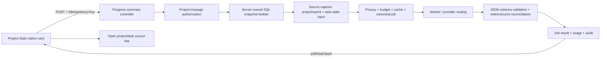

# Qaly AI-native Module Coverage and Increment Plan

**Audit date:** 2026-07-26 (Asia/Saigon)
**Audit baseline:** branch `codex/merge-main-ai-week1`; HEAD `a1367b2ca3b8d2439cefd60a8c8d73f88f06a5f0` (`Merge origin/main while preserving AI and Week 1 flows`)
**Remote relation:** `HEAD == origin/main` tại thời điểm chụp baseline; working tree sạch trước audit.
**Change boundary:** lượt này chỉ tạo file này. Không merge, reset, rebase, push, migration, build frontend, source edit, test edit hoặc sửa tài liệu v4 hiện hữu.

## 1. Goal statement và định nghĩa coverage 100%

Goal đang hoạt động:

> Audit 100% bề mặt module/page/card của Qaly để xác định AI-native capability hiện có, capability thiếu và integration gap; tạo một execution plan duy nhất, tự chọn một Primary Slice và tối đa một Stretch Slice đủ nhỏ để implement sâu end-to-end trong một lượt quota tiếp theo.

Trong báo cáo này, “100% coverage” chỉ có nghĩa là toàn bộ inventory tìm thấy đã có disposition; không có nghĩa là 100% chức năng đã được implement. Một capability chỉ được tính là AI native khi đồng thời có entrypoint đúng ngữ cảnh, job/decision cụ thể, input được authorize, output có schema, lifecycle trung thực, grounding, human confirmation cho mutation, canonical platform/privacy/budget/audit/usage, read-back và verification lặp lại được.

Mẫu số audit được khóa như sau:

- 24/24 route records trong router.
- 16/16 page SFC.
- 80/80 embedded tab/card/panel/modal/drawer/flow đáng kể.
- 104/104 `SURF-ID` có đúng một status và rationale.
- 58/58 controller routes thuộc AI và các controller dashboard/group/meeting liên quan.
- 35/35 logical `AI-CAP-ID`.
- 8/8 canonical wrapper job types; 8/8 JSON schema files; 7/7 draft-type families.
- 26/26 file trong `QALY_Docs_v4.0_Draft` được đối chiếu bằng source-first reconciliation.

## 2. Executive verdict

**Coverage gate: PASS. Product completeness: NOT PASS.**

Source hiện tại có canonical AI platform khá đầy đủ, nhưng chưa có capability AI-native nào của module đạt toàn bộ 10 điều kiện ở đầu audit mà không còn verification hoặc integration gap. Các điểm quan trọng nhất:

1. AI-08 project/sprint progress summary có wrapper, job type và validator nhưng không có frontend caller; prompt không được tạo từ snapshot SQL authoritative; project/sprint source hash hiện không bao gồm task state; output không có metric-to-source reconciliation.
2. UI `AiActivityPanel` gửi `create_subtasks` và `save_checklist`, trong khi `AiWorkflowService.ConfirmDraftAsync` chỉ chấp nhận `reject`, `execute_action`, `create_tasks`. AI-06/AI-07 vì vậy không thể confirm end-to-end.
3. `TaskItem` không có parent/subtask relation và không có persisted acceptance-checklist model. AI-06/AI-07 cần prerequisite dữ liệu/domain; không phù hợp slice 1–2 ngày không migration.
4. Tám file schema có `$id` v3.2, trong khi wrapper runtime yêu cầu `*.v4`; validator là nhánh C# theo substring chứ chưa load/validate JSON Schema tương ứng.
5. Project planner, dashboard strategy, meeting checknote và một phần group AI vẫn đi qua synchronous/legacy route song song với canonical platform.
6. `/api/ai/usage`, `/api/ai/budget` và `/api/ai/health` có backend, nhưng chưa có product surface. Toggle “weekly AI report” ở Settings chỉ lưu `localStorage`.
7. Project Workload và Gantt component tồn tại nhưng `tabs` không có id `capacity`/`gantt`; Project Activity nhận `projectId` nhưng gọi global recent-activity endpoint.

Disposition của 104 surfaces: 67 `NO_AI_JUSTIFIED`, 15 `PRESENT_PARTIAL`, 7 `MISSING_HIGH_VALUE`, 7 `GENERIC_CHAT_ONLY`, 5 `FRONTEND_ONLY`, 2 `LEGACY_OR_DUPLICATE`, 1 `BACKEND_ONLY`.

**Primary Slice:** AI-08 Project Progress Summary, canonical và grounded trong Project Stats.
**Stretch Slice:** AI-08 Sprint Progress Summary trong Demo Map, chỉ làm sau khi Primary xanh toàn bộ gate.

## 3. Page/Module/Card Surface Universe

### 3.1 Route và page universe — 24/24

| SURF-ID | Route / page | Role và entity context | Action / data source | AI hiện có và disposition |
|---|---|---|---|---|
| SURF-001 | `/` → `/dashboard` | Authenticated user; none | Redirect từ router | `NO_AI_JUSTIFIED` — navigation deterministic. |
| SURF-002 | `/dashboard` — `DashboardPage.vue` | Member/manager/admin; visible workspace projects/tasks | Workspace metrics, risk, activity | `PRESENT_PARTIAL` — generic “Hỏi AI” và synchronous strategy card, chưa canonical/read-back/grounded sources. |
| SURF-003 | `/profile` — `ProfilePage.vue` | Current user | Read identity/profile | `NO_AI_JUSTIFIED` — deterministic account data tốt hơn. |
| SURF-004 | `/projects` — `ProjectsPage.vue` | Project-capable user; project collection | List/create/edit/import/project planner | `PRESENT_PARTIAL` — planner có review UI nhưng legacy generate/create và mutation không qua canonical draft confirmation. |
| SURF-005 | `/projects/archived` — `ArchivedProjectsPage.vue` | Admin/owner; archive/storage | Restore/delete/deduplicate/storage | `LEGACY_OR_DUPLICATE` — “AI deduplicator” thực tế là deterministic duplicate API; không tính AI native. |
| SURF-006 | `/projects/:projectId` — `ProjectDetailPage.vue` | Project member/manager; project | Stats, tasks, timeline, wiki, members | `PRESENT_PARTIAL` — delay resolution và assignment insight có caller nhưng contract/lifecycle chưa đủ. |
| SURF-007 | `/projects/:projectId/tasks/:taskId` | Authorized task viewer; task/project | Deep-link task drawer | `PRESENT_PARTIAL` — assignment insight native card; breakdown/checklist entrypoint thiếu. |
| SURF-008 | `/projects/:projectId/wiki/:wikiId` — `WikiDetailPage.vue` | Authorized wiki reader; wiki/project | Read document and TOC | `MISSING_HIGH_VALUE` — có thể grounded summary/draft task từ wiki; hiện không có caller. |
| SURF-009 | malformed project-task route | Any | Truthful route error | `NO_AI_JUSTIFIED`. |
| SURF-010 | malformed project route | Any | Truthful route error | `NO_AI_JUSTIFIED`. |
| SURF-011 | `/tasks` — `TasksPage.vue` | User; visible assigned/reported tasks | Global task hub and drawer | `MISSING_HIGH_VALUE` — chưa có native task AI actions; backend wrappers AI-05/06/07 không được gọi ở đây. |
| SURF-012 | `/teams` — `TeamsPage.vue` | Group member/admin/owner; work group | Chat, member, poll, meeting, project, AI tabs | `PRESENT_PARTIAL` — canonical và legacy group AI chạy song song. |
| SURF-013 | `/analytics` — `AnalyticsPage.vue` | Authenticated user; optional project | Full-screen Erumi chat | `GENERIC_CHAT_ONLY` — rich chat shell không phải module-specific analytics capability. |
| SURF-014 | `/admin/users` — `AdminUsersPage.vue` | System Admin; users | User/session/role/project access | `NO_AI_JUSTIFIED` — security mutations phải deterministic và explicit. |
| SURF-015 | `/organizations/users` — `OrganizationUsersPage.vue` | Org owner/admin/moderator scope; org members | Invite/role/remove | `NO_AI_JUSTIFIED` — deterministic authorization workflow. |
| SURF-016 | `/admin/moderators` — `ModeratorAssignmentsPage.vue` | System Admin; delegated scopes | Grant/revoke scoped capability | `NO_AI_JUSTIFIED` — high-risk permission mutation. |
| SURF-017 | `/groups` — `TeamsPage.vue` | Group member; group list | Select/create/chat | `PRESENT_PARTIAL` — shares group AI panel gaps. |
| SURF-018 | `/groups/:groupId` — `TeamsPage.vue` | Group member/admin/owner; group | Group native tabs | `PRESENT_PARTIAL` — AI-03/04 caller exists but range/source/editor evidence partial. |
| SURF-019 | `/groups/:groupId/meeting` — `GroupMeetingPage.vue` | Group participant/manager; meeting | Live meeting, transcript, checknote | `PRESENT_PARTIAL` — privacy-aware AI checknote exists but uses legacy synchronous path. |
| SURF-020 | `/groups/:groupId/polls` — `GroupPollPage.vue` | Group member; polls | Create/vote/read/close | `NO_AI_JUSTIFIED` — vote arithmetic and close policy deterministic. |
| SURF-021 | `/groups/:groupId/polls/:pollId` | Group member; poll | Poll detail/result | `NO_AI_JUSTIFIED`. |
| SURF-022 | malformed group route | Any | Truthful route error | `NO_AI_JUSTIFIED`. |
| SURF-023 | `/settings` — `SettingsPage.vue` | User/project manager/org admin | Settings/privacy/logs/API keys | `FRONTEND_ONLY` — weekly AI report chỉ localStorage; usage/budget product card absent. |
| SURF-024 | catch-all route | Any | 404 truth state | `NO_AI_JUSTIFIED`. |

Page-file closure: `AdminUsersPage`, `AnalyticsPage`, `ArchivedProjectsPage`, `DashboardPage`, `GroupMeetingPage`, `GroupPollPage`, `ModeratorAssignmentsPage`, `OrganizationUsersPage`, `ProfilePage`, `ProjectDetailPage`, `ProjectsPage`, `RouteErrorPage`, `SettingsPage`, `TasksPage`, `TeamsPage`, `WikiDetailPage` = **16/16**.

### 3.2 Embedded tabs, cards, panels và flows — 80/80

| SURF-ID | Module / card / flow | Role; entity; primary action / data source | Status và rationale |
|---|---|---|---|
| SURF-025 | App shell navigation/header | Auth user; route/session; navigate/account action | `NO_AI_JUSTIFIED`. |
| SURF-026 | Global search modal | Auth user; loaded project/task/member collections; filter/open/create | `NO_AI_JUSTIFIED` — current exact/filter search is deterministic; semantic backend remains orphan separately. |
| SURF-027 | Notification popover | Auth user; notification feed; read/dismiss/open | `NO_AI_JUSTIFIED`. |
| SURF-028 | Floating assistant | Auth user; current route prompt | `GENERIC_CHAT_ONLY`. |
| SURF-029 | Erumi composer/model/history/source drawers | Auth user; optional project/chat; ask/upload/open refs | `GENERIC_CHAT_ONLY` — useful transport, not module capability contract. |
| SURF-030 | AI Activity jobs/drafts/health drawer | Project user; canonical jobs/drafts; poll/retry/cancel/edit/confirm | `PRESENT_PARTIAL` — lifecycle/read-back có; renderer generic và confirm-action mismatch cho AI-06/07. |
| SURF-031 | Dashboard active-project metric card | User workspace; dashboard overview; open projects/ask AI | `GENERIC_CHAT_ONLY` — AI action chỉ prefilled generic prompt. |
| SURF-032 | Dashboard open-task metric card | User workspace; dashboard overview; open tasks/ask AI | `GENERIC_CHAT_ONLY`. |
| SURF-033 | Dashboard team-capacity metric card | User workspace; member workload; inspect/ask AI | `GENERIC_CHAT_ONLY`. |
| SURF-034 | Dashboard project-progress chart | User workspace; deterministic series; inspect | `NO_AI_JUSTIFIED` — chart calculation should remain deterministic. |
| SURF-035 | Dashboard Attention Risk card | User; `/api/dashboard/attention-summary`; open risk target | `NO_AI_JUSTIFIED` — rule-based risk is transparent. |
| SURF-036 | Dashboard Recent Activity card | User; `/api/dashboard/recent-activities`; open activity | `NO_AI_JUSTIFIED`. |
| SURF-037 | Dashboard Strategic Overview metrics + AI brief | User; client-posted workspace metrics; generate brief | `PRESENT_PARTIAL` — schema check exists but synchronous, client-trusted input, no canonical job/source/read-back. |
| SURF-038 | Projects spotlight/list/grid | Project user; dashboard/project data; filter/open | `NO_AI_JUSTIFIED`. |
| SURF-039 | Create/edit project modal | Project creator/manager; project DTO; save | `NO_AI_JUSTIFIED` for core CRUD. |
| SURF-040 | AI Planner modal | Project creator; natural-language plan; generate/review/create | `PRESENT_PARTIAL` — legacy synchronous plan and direct mutation; no canonical draft/idempotent confirm. |
| SURF-041 | Import upload/mapping/confirm/undo | Project manager; files/import session; preview/execute/undo | `NO_AI_JUSTIFIED` for parsing/mapping core; import truth states are deterministic. |
| SURF-042 | Archive storage usage card | Admin/owner; `/api/storage/stats`; inspect quota | `NO_AI_JUSTIFIED`. |
| SURF-043 | Archive storage breakdown card | Admin/owner; storage stats; inspect distribution | `NO_AI_JUSTIFIED`. |
| SURF-044 | Archive retention policy card | Admin/owner; retention state; inspect policy | `NO_AI_JUSTIFIED`. |
| SURF-045 | Storage deduplicator card | Admin/owner; duplicate hashes; preview/delete duplicates | `LEGACY_OR_DUPLICATE` — AI branding sai; deterministic hash logic đúng hơn. |
| SURF-046 | Project Trash cards | Project owner/admin; trashed projects; restore/hard-delete | `NO_AI_JUSTIFIED`. |
| SURF-047 | Archived project cards | Project owner/member; archived projects; open/restore | `NO_AI_JUSTIFIED`. |
| SURF-048 | Project Stats health panel | Project member; computed project stats; inspect health | `NO_AI_JUSTIFIED` for score; Primary adds a separate narrative card, không thay score. |
| SURF-049 | Project Stats current metric cards | Project member; task aggregates; inspect counts | `NO_AI_JUSTIFIED` for values. |
| SURF-050 | Project Stats status distribution | Project member; task status aggregate | `NO_AI_JUSTIFIED`. |
| SURF-051 | Project Stats delivery progress | Project member; completion/open metrics | `NO_AI_JUSTIFIED` for metric; native grounded AI-08 card is missing beside it. |
| SURF-052 | Demo Map roadmap/sprint track | Project member; sprint/milestone/task APIs; inspect timeline | `NO_AI_JUSTIFIED` for timeline computation. |
| SURF-053 | Milestone detail + create/edit modal | Project manager; sprint/milestone; edit | `NO_AI_JUSTIFIED`. |
| SURF-054 | Project task board/list | Project member; project tasks; move/open/filter | `MISSING_HIGH_VALUE` — no contextual AI-05/06/07 entrypoint. |
| SURF-055 | Create task + import controls | Project manager/member per role; task/import DTO; create | `NO_AI_JUSTIFIED` for manual create. |
| SURF-056 | Delayed-project resolution trigger/review | Project manager; project; enqueue and review proposed actions | `PRESENT_PARTIAL` — canonical job/draft exists; schema validator/source grounding/fallback content incomplete. |
| SURF-057 | Project task detail core | Task viewer/editor; task; inspect/edit | `MISSING_HIGH_VALUE` — breakdown/checklist surfaces absent. |
| SURF-058 | Assignment Insight card | Task viewer/manager; task + project members/workload; inspect candidates | `PRESENT_PARTIAL` — native caller and explainable output, nhưng synchronous endpoint bypasses canonical wrapper and confirm. |
| SURF-059 | Task timer/attachments/comments cards | Task collaborator; task artifacts; log/upload/comment | `NO_AI_JUSTIFIED` for core actions. |
| SURF-060 | Project Members tab | Project manager/member; project members; add/role/remove | `NO_AI_JUSTIFIED`. |
| SURF-061 | Project Activity tab | Project member; receives projectId but calls global activity endpoint | `FRONTEND_ONLY` — integration context sai; deterministic scoping fix required, không phải AI. |
| SURF-062 | Project Wiki tab | Wiki author/reader; wiki pages; create/read/edit | `MISSING_HIGH_VALUE` — grounded summarize/to-task candidate; no native caller. |
| SURF-063 | Project Workload tab | Project member; `/api/projects/{id}/workload` | `FRONTEND_ONLY` — component có code nhưng tab id `capacity` không có trong `tabs`, nên unreachable. |
| SURF-064 | Project Gantt/Attention/Timeline tab | Project member; gantt/attention/timeline APIs | `FRONTEND_ONLY` — component có code nhưng tab id `gantt` không có trong `tabs`. |
| SURF-065 | Project Webhooks tab | Project manager; webhook APIs; create/test/delete | `NO_AI_JUSTIFIED`. |
| SURF-066 | Tasks “Nhiệm vụ của tôi” stat card | User; visible task aggregate | `NO_AI_JUSTIFIED`. |
| SURF-067 | Tasks overdue stat card | User; deterministic due-date aggregate | `NO_AI_JUSTIFIED`. |
| SURF-068 | Tasks due-soon stat card | User; deterministic due-date aggregate | `NO_AI_JUSTIFIED`. |
| SURF-069 | Tasks completed stat card | User; status aggregate | `NO_AI_JUSTIFIED`. |
| SURF-070 | Tasks filter/list/cards | User; visible tasks; filter/open/complete | `NO_AI_JUSTIFIED` for filter/status calculation. |
| SURF-071 | Global Tasks detail drawer | Authorized task user; task/comments/files/time | `MISSING_HIGH_VALUE` — native task AI entrypoint absent. |
| SURF-072 | Teams chat sidebar/window | Group member; group messages; send/read/search | `NO_AI_JUSTIFIED` for core chat; AI actions live in separate native tab. |
| SURF-073 | Group Members tab | Group admin/member; members; add/role/remove/leave | `NO_AI_JUSTIFIED`. |
| SURF-074 | Group Invites tab | Group admin; invitations; invite/read | `NO_AI_JUSTIFIED`. |
| SURF-075 | Group Polls tab/card | Group member; poll messages; create/vote/close | `NO_AI_JUSTIFIED`. |
| SURF-076 | Group Meeting launcher tab | Group member; meeting session; start | `NO_AI_JUSTIFIED` for launch. |
| SURF-077 | Group Project tab | Group admin/member; group→project DTO; create/open | `NO_AI_JUSTIFIED` for explicit create. |
| SURF-078 | Group AI tab (`GroupAiPanel`) | Group member; selected messages/group; summarize/task draft/action items/project draft | `PRESENT_PARTIAL` — canonical AI-03/04 plus legacy actions; selected-range/source/editor tests incomplete. |
| SURF-079 | Shared attachments panel | Group member; message attachments; open/download/hide | `NO_AI_JUSTIFIED`. |
| SURF-080 | Create Group modal | User; group DTO; create | `NO_AI_JUSTIFIED`. |
| SURF-081 | Meeting prejoin/live media/screen share | Meeting participant; realtime/media | `NO_AI_JUSTIFIED`. |
| SURF-082 | Meeting privacy/consent dialog | Meeting participant/admin; policy/consent | `NO_AI_JUSTIFIED` — policy decision must remain deterministic. |
| SURF-083 | Meeting transcript panel | Authorized participant; transcript | `NO_AI_JUSTIFIED` for transcript capture; source for checknote. |
| SURF-084 | AI Checknote/action-item cards | Authorized participant/manager; transcript/meeting; generate/link/create task | `PRESENT_PARTIAL` — source/consent handling tốt, nhưng legacy sync, no canonical reload/cancel/retry. |
| SURF-085 | Group Poll create form | Group member; poll | `NO_AI_JUSTIFIED`. |
| SURF-086 | Poll result/vote/close panel | Group member/creator; poll options/votes | `NO_AI_JUSTIFIED`. |
| SURF-087 | Wiki document + TOC | Wiki reader; wiki content; read/navigate | `MISSING_HIGH_VALUE` — grounded brief/draft candidate deferred after locked AI-01..08. |
| SURF-088 | Settings profile/workspace/password | User/org/project manager; settings DTOs | `NO_AI_JUSTIFIED`. |
| SURF-089 | Settings Appearance tab | User; local theme | `NO_AI_JUSTIFIED`. |
| SURF-090 | Settings Workflow tab | Project manager; workflow settings | `NO_AI_JUSTIFIED` — state-transition policy deterministic. |
| SURF-091 | Settings Notifications / weekly AI report toggle | User; localStorage only; toggle digest | `FRONTEND_ONLY` — text promises backend AI email without backend schedule/read-back. |
| SURF-092 | Settings API Keys/integration info | User; API key APIs | `NO_AI_JUSTIFIED`. |
| SURF-093 | Settings Privacy tab | Org/project admin; privacy/retention/DSAR | `NO_AI_JUSTIFIED` for policy operations. |
| SURF-094 | Settings personal audit log | User; audit API; inspect | `NO_AI_JUSTIFIED`. |
| SURF-095 | Settings AI usage/budget card (required, absent) | Org Admin/project manager; AI ledger/policy | `BACKEND_ONLY` — GET/PUT endpoints exist; no product surface. |
| SURF-096 | Admin user table/filter | System Admin; users; inspect/filter | `NO_AI_JUSTIFIED`. |
| SURF-097 | Admin user/project-role drawer | System Admin; user/project memberships; edit/revoke sessions | `NO_AI_JUSTIFIED`. |
| SURF-098 | Admin create/transfer flow | System Admin; user/admin ownership; mutate | `NO_AI_JUSTIFIED`. |
| SURF-099 | Organization context/member list | Org member/admin; org members | `NO_AI_JUSTIFIED`. |
| SURF-100 | Organization invite/role flow | Org admin/moderator; memberships | `NO_AI_JUSTIFIED`. |
| SURF-101 | Moderator assignment table | System Admin; delegated scopes | `NO_AI_JUSTIFIED`. |
| SURF-102 | Moderator grant/revoke modal | System Admin; capability scope | `NO_AI_JUSTIFIED`. |
| SURF-103 | Analytics full-screen Erumi panel | Auth user; optional project/chat history | `GENERIC_CHAT_ONLY`. |
| SURF-104 | Profile identity detail cards | Current user; identity/email/role | `NO_AI_JUSTIFIED`. |

State audit rule: mỗi surface có loading/empty/error/permission/degraded state được tính trong chính `SURF-ID`. Các surface deterministic nhìn chung có loading/empty/error; các AI partial thiếu ít nhất một trong queued/running/cancel/retry/degraded/read-back/source-open. Những thiếu này được ghi trong Gap Register.

## 4. Existing AI Capability Universe

### 4.1 Controller route reconciliation — 58/58

Mỗi route dưới đây nằm trong đúng một `AI-CAP-ID`; cột caller liệt kê caller thật, không suy ra từ docs.

| AI-CAP-ID | Endpoint(s) | Job/schema/draft | Frontend caller / output UI | Source, mutation, tests | Status |
|---|---|---|---|---|---|
| AI-CAP-001 | `POST /api/ai/generate-plan`; `POST /api/ai/create-plan` | Legacy `GenerateProjectPlan`; inline plan DTO | `AiPlannerModal` | Input manual; create-plan mutates project/tasks directly; planner tests only indirect | `PRESENT_PARTIAL` |
| AI-CAP-002 | `POST /api/ai/sync` | Vector ingestion | None | Backend ingestion/outbox; no product status | `BACKEND_ONLY` |
| AI-CAP-003 | `POST/GET /api/ai/jobs`; `GET /jobs/{id}`; `/result`; `POST /retry`; `/cancel` | Canonical `AiJob`, dispatch, attempts, usage | `AiActivityPanel` list/detail | Source guard, privacy, budget, audit, idempotency; unit/integration/E2E shell evidence | `VERIFICATION_GAP` — local platform tests pass, hosted/capability evidence absent |
| AI-CAP-004 | `GET /api/ai/drafts`; `GET/PATCH /drafts/{id}`; `POST /confirm`; `/reject` | `AiGeneratedDraft`; multiple draft types | `AiActivityPanel`, Erumi approval | Supports only `reject`, `execute_action`, `create_tasks`; task draft/meeting tests | `PRESENT_PARTIAL` |
| AI-CAP-005 | `POST /api/ai/agent-runs`; `GET /agent-runs/{id}`; `POST /approve` | `Qaly.AgentRun.v1`, draft-change | Erumi actions | Generic agent flow, explicit approval; unit evidence | `GENERIC_CHAT_ONLY` |
| AI-CAP-006 | `GET /api/ai/usage`; `GET/PUT /api/ai/budget`; `GET /api/ai/health` | Usage ledger/budget policy/platform health | Health only in `AiActivityPanel`; no usage/budget UI | Backend unit evidence; no product E2E | `BACKEND_ONLY` |
| AI-CAP-007 | `POST /api/ai/meetings/{meetingId}/extract-actions` | `meeting_action_extract`, `meeting_action_extract.v4`, `MeetingActionItems` | No caller; meeting page calls another route | Meeting source guard; draft can `create_tasks`; platform tests not wrapper E2E | `BACKEND_ONLY` |
| AI-CAP-008 | `POST /api/ai/groups/{groupId}/summaries` | `chat_summary`, `chat_summary.v4` | `GroupAiPanel` selected-message summary | Message source URLs assembled; range/cache/reload evidence incomplete | `PRESENT_PARTIAL` |
| AI-CAP-009 | `POST /api/ai/task-drafts/from-source` | `task_draft`, `task_draft.v4`, `TaskDraft` | `GroupAiPanel` | Source guard + draft/create_tasks; editor mostly generic JSON | `PRESENT_PARTIAL` |
| AI-CAP-010 | `POST /api/ai/tasks/{taskId}/recommend-assignees` | `assignee_recommendation.v4` | None; Project Detail calls sync insight instead | Task source guard; read-only recommendation | `BACKEND_ONLY` |
| AI-CAP-011 | `POST /api/ai/tasks/{taskId}/breakdown` | `task_breakdown.v4`, `TaskBreakdown` | No native caller; generic draft may list | Confirm action emitted by UI unsupported; no persisted subtask relation | `BACKEND_ONLY` |
| AI-CAP-012 | `POST /api/ai/tasks/{taskId}/acceptance-checklist` | `acceptance_checklist.v4`, `AcceptanceChecklist` | No native caller; generic draft may list | Confirm action unsupported; no checklist persistence model | `BACKEND_ONLY` |
| AI-CAP-013 | `POST /api/ai/projects/{projectId}/progress-summary` | `progress_summary`, `progress_summary.v4` | None | Project source hash omits task state; generic prompt; no metric reconciliation/test | `BACKEND_ONLY` |
| AI-CAP-014 | `POST /api/ai/projects/{projectId}/suggest-resolution` | `project_delay_resolution.v4`, `ProjectDelayResolution` | Project Detail trigger + visual draft editor | Canonical draft/confirm exists; unknown schema passes generic validator; fallback contains invented/hard-coded content | `PRESENT_PARTIAL` |
| AI-CAP-015 | `POST /api/ai/projects/{projectId}/sprints/{sprintId}/progress-summary` | Same generic `progress_summary.v4` | None | Sprint hash omits task state; no renderer/test | `BACKEND_ONLY` |
| AI-CAP-016 | `POST /api/ai/priority` | Legacy `SuggestTaskPriority` | None | Manual text; sync gateway | `BACKEND_ONLY` |
| AI-CAP-017 | `GET /api/ai/projects/{id}/summary`; `/risks`; `/insights` | Legacy sync jobs | None | Backend-only, overlapping AI-08/dashboard | `BACKEND_ONLY` |
| AI-CAP-018 | `GET /api/ai/tasks/{id}/assignment`; `/assignment-insight` | Sync heuristic/AI service | Project task assignment card calls insight | Authorized task/project query; read-only output; no canonical job/confirm | `PRESENT_PARTIAL` |
| AI-CAP-019 | `GET /api/ai/search` | Semantic/vector search | None; global search is client filter | Vector auth/visibility needs product proof | `BACKEND_ONLY` |
| AI-CAP-020 | `POST /api/ai/subtasks` | Legacy `GenerateSubtasks` | None | Free string output, no source/task authorization/draft | `BACKEND_ONLY` |
| AI-CAP-021 | `POST /api/ai/chat`; `/chat/fast`; `/chat/stream` | `Chat`, `ChatStream`, `TextAnswer.v1` | Erumi/Floating assistant | Generic route/project context; not per-module contract | `GENERIC_CHAT_ONLY` |
| AI-CAP-022 | `GET /api/ai/export/{projectId}` | Deterministic Word/Excel export | No current caller found | Not an AI decision; project auth required | `NO_AI_JUSTIFIED` |
| AI-CAP-023 | `POST /api/groups/{groupId}/ai/action-items` | Legacy `ActionItem` | `GroupAiPanel` | Group source, sync output; no canonical draft/read-back | `PRESENT_PARTIAL` |
| AI-CAP-024 | `POST /api/groups/{groupId}/ai/../meetings/{meetingId}/hook` | Legacy meeting hook | None | Odd relative route; no caller | `BACKEND_ONLY` |
| AI-CAP-025 | `GET /api/groups/{groupId}/ai/context` | Deterministic group context | None | Support endpoint only | `BACKEND_ONLY` |
| AI-CAP-026 | `POST /api/groups/{groupId}/ai/summary` | Legacy `DiscussionSummary` | `GroupAiPanel` | Duplicates canonical AI-CAP-008 | `LEGACY_OR_DUPLICATE` |
| AI-CAP-027 | `POST /api/groups/{groupId}/ai/draft-project` | Legacy `DraftProject` | `GroupAiPanel` | Review-only payload, no canonical confirm | `PRESENT_PARTIAL` |
| AI-CAP-028 | `POST /api/meetings/import/meetily` | `meetily_import.v4`, canonical meeting records | Import/meeting flows indirectly | Privacy/source/audit present; mixed legacy/canonical orchestration | `PRESENT_PARTIAL` |
| AI-CAP-029 | `POST /api/meetings/{sessionId}/auto-checknote` | `AutoChecknote`; meeting extract records | `GroupMeetingPage` | Privacy consent/policy; synchronous run; no retry/cancel/read-back job | `PRESENT_PARTIAL` |
| AI-CAP-030 | `POST create-task`; `GET action-items`; `POST link-task`; `GET task-link` under `/api/meetings/{id}/action-items` | Human confirmation/link workflow | Checknote action-item cards | Explicit mutation and mapping; capability support, not model invocation | `PRESENT_PARTIAL` |
| AI-CAP-031 | `GET /api/dashboard/overview` | Deterministic aggregate | Dashboard/App | No AI | `NO_AI_JUSTIFIED` |
| AI-CAP-032 | `GET /api/dashboard/attention-summary` | Deterministic attention rules | `AttentionRiskCard` | No AI | `NO_AI_JUSTIFIED` |
| AI-CAP-033 | `GET /api/dashboard/recent-activities` | Deterministic audit/activity read | Dashboard + incorrectly Project Activity | No AI; project-scope integration gap | `NO_AI_JUSTIFIED` |
| AI-CAP-034 | `GET /api/dashboard/strategic-overview` | Deterministic metrics | `StrategicOverviewAI` | Server-authorized metrics; correct deterministic layer | `NO_AI_JUSTIFIED` |
| AI-CAP-035 | `POST /api/dashboard/ai-strategy` | Sync `WorkspaceStrategy.v1` | `StrategicOverviewAI` | Client posts metrics; validator exists; no canonical source/job/usage read-back | `PRESENT_PARTIAL` |

Route total check: `AiController` 42 + `GroupAiController` 5 + `MeetingsController` 6 + `DashboardController` 5 = **58/58**.

### 4.2 Service, platform, provider, schema và configuration inventory

| Layer | Runtime evidence | Audit disposition |
|---|---|---|
| Application facade | `IAiService`/`AiService` | Nhiều legacy sync function còn song song canonical workflow. |
| Canonical workflow | `IAiWorkflowService`/`AiWorkflowService`, `AiPlatformQueryService` | Job/source/privacy/budget/cache/idempotency/draft/read-back mạnh; capability confirm và schema-specific validation chưa đều. |
| Group/chat | `IGroupAiService`/`GroupAiService`, `ErumiChatService`, `AgentRunService`, `AiTools` | Generic chat và group legacy/canonical overlap. |
| Gateway/router | `IAiGateway`/`AiGateway`, `MicrosoftAgentOrchestrator`, `AiProviderFactory` | Backend-only provider access; repair/fallback/label support. |
| Providers | Ollama, DeepSeek, OpenAI, Gemini | Routed server-side; policy/budget/provider settings exist. |
| Worker/lifecycle | `AiJobWorker`, `AiJobDispatchStore`, `AiJobProcessor` | Queue/lease/retry/cancel/usage/audit implemented and locally tested. |
| Guard/control | `AiSourceGuard`, `AiComplianceService`, `AiCostService`, `AiOutputValidator` | Authorization/freshness/privacy/budget present; entity hash coverage và schema loader incomplete. |
| Feature flags | `AI_JOB_V4_ENABLED`, `AI_JOB_V4_WORKER_ENABLED`, platform `Enabled`, `WorkerEnabled`, `AllowProviderDegradedMock` | Có disable/degraded path; native card phải surface state trung thực. |
| Vector support | `IAiIngestionService`, vector outbox/worker, Qdrant/Ollama embeddings | Semantic search backend exists; no native caller. |

Schema file closure:

| Schema file | Runtime wrapper ID | Finding |
|---|---|---|
| `acceptance_checklist.schema.json` (`$id ...v3.2`) | `acceptance_checklist.v4` | Version identity mismatch; hardcoded validator only. |
| `assignee_recommendation.schema.json` (`v3.2`) | `assignee_recommendation.v4` | Same mismatch. |
| `chat_summary.schema.json` (`v3.2`) | `chat_summary.v4` | Same mismatch; source-range evidence partial. |
| `meeting_action_extract.schema.json` (`v3.2`) | `meeting_action_extract.v4` | Same mismatch. |
| `privacy_data_request.schema.json` (`v3.2`) | no product wrapper in `AiController` | Schema orphan has explicit disposition: platform/privacy support, not current module AI. |
| `progress_summary.schema.json` (`v3.2`) | `progress_summary.v4` | Primary contract target; lacks structured source refs/reconciliation fields. |
| `task_breakdown.schema.json` (`v3.2`) | `task_breakdown.v4` | Draft generated; mutation target absent. |
| `task_draft.schema.json` (`v3.2`) | `task_draft.v4` | Canonical wrapper/caller exists, product editor evidence partial. |

Canonical wrapper job types = `meeting_action_extract`, `chat_summary`, `task_draft`, `assignee_recommendation`, `task_breakdown`, `acceptance_checklist`, `progress_summary`, `project_delay_resolution` = **8/8**.

Draft families = `MeetingActionItems`, `TaskDraft`, `TaskBreakdown`, `AcceptanceChecklist`, `DraftChange`, `ProjectDelayResolution`, dynamic agent tool draft = **7/7**. Backend confirmation supports only `reject`, `execute_action`, `create_tasks`; frontend additionally emits unsupported `create_subtasks`, `save_checklist`, `save_report`.

## 5. Bidirectional UI ↔ API/job/schema/test matrix

| Flow | UI → backend reconciliation | Backend → UI reconciliation | Verdict |
|---|---|---|---|
| Dashboard generic metric “Hỏi AI” | Opens generic chat with prompt; no capability request schema | Chat endpoints have generic renderer only | GAP-017; `GENERIC_CHAT_ONLY`. |
| Dashboard Strategic Brief | Real caller to `/api/dashboard/ai-strategy`, loading/error/result UI | Sync endpoint has caller, but trusts client metrics and bypasses canonical job/source/read-back | GAP-011; `PRESENT_PARTIAL`. |
| Project AI planner | Generate then create caller; UI review before create | Legacy endpoints both have caller; create mutates directly | GAP-010; `PRESENT_PARTIAL`. |
| Project delay resolution | Native trigger enqueues canonical job; review opens AI Activity | Wrapper has caller and visual editor; schema-specific validator/source-grounded fallback tests absent | GAP-018/019/021; `PRESENT_PARTIAL`. |
| Task assignment insight | Native card calls sync insight | Sync endpoint has caller; canonical recommendation wrapper orphan | GAP-006; sync capability partial + canonical backend-only. |
| AI-06 Task breakdown | No native caller; generic draft renderer may receive result | Wrapper/schema/draft exist; UI confirm action rejected by backend; no subtask model | GAP-004; `BACKEND_ONLY`. |
| AI-07 Acceptance checklist | No native caller | Wrapper/schema/draft exist; UI confirm action rejected; no checklist model | GAP-005; `BACKEND_ONLY`. |
| AI-08 Project summary | No native caller | Endpoint/job/schema exist; no SQL snapshot prompt/reconciliation/read-back evidence | GAP-001/002/003; `BACKEND_ONLY`. |
| AI-08 Sprint summary | No native caller | Same, plus sprint source hash omits task state | GAP-001/003; `BACKEND_ONLY`. |
| Group selected summary (AI-03) | `GroupAiPanel` sends selected message sources | Canonical wrapper has caller/result path; selected-range/cache/source-open tests incomplete | GAP-007; `PRESENT_PARTIAL`. |
| Group task draft (AI-04) | `GroupAiPanel` enqueues source-linked draft | Wrapper has caller and draft confirmation; native structured editor/selective evidence partial | GAP-008; `PRESENT_PARTIAL`. |
| Group legacy summary/action/project | Real callers | Duplicates canonical transport or bypasses it | GAP-020; partial/legacy. |
| Meeting AI checknote | Privacy dialog → sync auto-checknote → summary/action cards | Legacy endpoint has caller; canonical extract wrapper orphan | GAP-009; `PRESENT_PARTIAL`. |
| AI usage/budget | No UI caller except health | GET/PUT/health backend and tests exist | GAP-012; `BACKEND_ONLY`. |
| Weekly AI report | Toggle writes localStorage only | No schedule/config/read-back endpoint | GAP-013; `FRONTEND_ONLY`. |
| Analytics | Full-screen Erumi only | Generic chat backend has caller and source drawer | GAP-014; `GENERIC_CHAT_ONLY`. |
| Semantic search | Global search uses loaded deterministic arrays | `/api/ai/search` has no caller | Explicit defer: exact search remains `NO_AI_JUSTIFIED`; backend route is `BACKEND_ONLY`. |
| Project Activity | Component passes projectId but ignores it in API call | Dashboard recent activity serves global authorized feed | GAP-015; deterministic integration fix, not AI candidate. |
| Workload/Gantt | Components implemented | Backend endpoints have UI code, but no reachable tab id | GAP-016; navigation fix, not AI candidate. |

Orphan reconciliation result: mọi caller-less backend route đã nhận `BACKEND_ONLY`, `LEGACY_OR_DUPLICATE`, `NO_AI_JUSTIFIED` hoặc explicit defer; mọi UI-only promise đã nhận `FRONTEND_ONLY`; **undispositioned orphan = 0**.

## 6. AI-native coverage matrix theo route/page/tab/card

| Module | SURF count | Native/partial signal | Missing/high-value | Explicit no-AI / integration-only |
|---|---:|---|---|---|
| App shell/search/assistant | 6 | Generic chat + partial AI Activity | Capability-specific entrypoints absent by design | Search/notifications deterministic. |
| Dashboard | 13 | Strategic brief partial; generic prompts | Canonical, source-grounded workspace brief deferred | Metrics/charts/risk/activity deterministic. |
| Projects/archive/import | 10 | Legacy AI planner | Planner canonicalization candidate | Storage/dedup/import should remain deterministic. |
| Project Detail/Task | 18 | Delay resolution + assignment insight partial | AI-05 canonical UI, AI-06/07, AI-08 project summary, wiki brief | CRUD/stats/timeline/member/webhook deterministic; 3 non-AI integration defects. |
| Global Tasks | 7 | None native | Native task action hub | Counts/filter/status deterministic. |
| Teams/Groups | 12 | AI-03/04 + legacy group actions partial | Source-range/editor closure | Member/invite/poll/meeting launch deterministic. |
| Meeting | 4 | Privacy-aware checknote partial | Canonical migration/read-back | Media/transcript/policy deterministic. |
| Poll | 4 | None | No forced AI | Vote/result deterministic. |
| Wiki | 3 | None | Grounded brief/to-task candidate | Authoring/navigation deterministic. |
| Settings | 8 | Health visible elsewhere | AI usage/budget missing; weekly report UI-only | Policy/account/log settings deterministic. |
| Admin/Organization/Moderator | 10 | None | No AI proposed | High-risk role/permission operations deterministic. |
| Analytics/Profile/Error routes | 9 | Generic Erumi only | Analytics native capability deferred pending real job definition | Profile/error deterministic. |
| **Total** | **104** | **15 partial + 7 generic** | **7 high-value surfaces** | **67 no-AI + 5 frontend-only + 2 legacy + 1 backend-only** |

## 7. Gap Register

| GAP-ID | Severity | Finding / runtime evidence | Resolution disposition |
|---|---|---|---|
| GAP-001 | P0 Product | AI-08 project/sprint wrappers have no caller or native result card. | CAND-001 Primary; CAND-002 Stretch. |
| GAP-002 | P0 Contract | Schema files declare v3.2 while runtime wrapper requests v4; JSON Schema is not loaded as authority. | CAND-001 establishes real `progress_summary.v4`; other schemas deferred by dependency. |
| GAP-003 | P0 Grounding | Generic processor prompt does not hydrate project/task/sprint entity content; project/sprint source hashes omit task state. | CAND-001/002. |
| GAP-004 | P0 Product/Data | AI-06 emits `create_subtasks`, backend rejects it; no `ParentTaskId`/subtask relation. | CAND-004, vetoed until domain/storage decision and migration. |
| GAP-005 | P0 Product/Data | AI-07 emits `save_checklist`, backend rejects it; no checklist persistence model. | CAND-003, vetoed until domain/storage decision and migration. |
| GAP-006 | P1 Integration | Native assignment card calls sync insight while canonical assignee wrapper has no caller. | CAND-006 backlog. |
| GAP-007 | P1 Contract | AI-03 selected range/source/cache/reload/source-open evidence incomplete. | CAND-007 backlog. |
| GAP-008 | P1 UX/Contract | AI-04 source selection and draft creation exist; capability-native structured edit/reject/confirm E2E incomplete. | CAND-008 backlog. |
| GAP-009 | P1 Integration | Meeting page uses legacy auto-checknote; canonical meeting extract endpoint is orphan. | CAND-010 backlog. |
| GAP-010 | P1 Safety | AI planner creates project/tasks through legacy mutation instead of persisted draft + idempotent confirmation. | CAND-011 backlog. |
| GAP-011 | P1 Platform | Dashboard strategy trusts client-posted metrics and bypasses canonical job/source/usage/read-back. | CAND-009 backlog. |
| GAP-012 | P0 Requirement | AI usage/budget endpoints have no product UI/read-back workflow. | CAND-005 backlog, dependency after Primary due locked AI-08 tie-break. |
| GAP-013 | P1 Truthfulness | Weekly AI report toggle is localStorage-only; UI promises email behavior not configured server-side. | CAND-013 backlog or remove label; feature-off until backend exists. |
| GAP-014 | P2 Product | Analytics page is only generic chat; no analytics-specific job/decision contract. | Explicit defer; require validated user job before AI proposal. |
| GAP-015 | P1 Integration | Project Activity calls global activity endpoint despite project context. | Deterministic fix; `NO_AI_JUSTIFIED`, not in AI goal. |
| GAP-016 | P1 Navigation | Workload/Gantt components are unreachable because tab ids are absent. | Deterministic navigation fix; not in AI goal. |
| GAP-017 | P2 UX | Dashboard metric-card AI buttons only prefill generic chat. | Keep generic label or remove; no native credit. CAND-009 covers composite brief, not three duplicate buttons. |
| GAP-018 | P0 Validation | Unknown schemas such as project-delay-resolution can pass after JSON parse; validator is substring-based, not schema-authoritative. | CAND-001 closes progress schema only; platform-wide loader remains backlog. |
| GAP-019 | P0 Grounding | Some results/fallbacks lack source links or include invented/hard-coded identity/content. | CAND-001 mandates no fabricated fallback; capability owners must remediate others. |
| GAP-020 | P1 Architecture | Legacy/canonical endpoint pairs coexist for planner, group summary, meeting, assignment, progress-like reads. | Strangler backlog by capability; no big-bang removal. |
| GAP-021 | P0 Evidence | Current E2E AI Activity uses mocked APIs; no real capability E2E for AI-06/07/08 or provider failure/read-back. | CAND-001 test matrix; others backlog. |
| GAP-022 | P1 Lifecycle | Most partial AI cards omit at least one of queued/running/cancel/retry/degraded/source-open/reload states. | CAND-001 establishes reusable card state pattern; reuse in backlog. |
| GAP-023 | P0 Product/Data | Task labels hiện là project-local labels dùng chung cho risk/domain/category; chưa có organization skill taxonomy, proficiency requirement, provenance hoặc AI-review draft. Vì vậy không thể coi label `Frontend`/`Backend` là skill evidence đáng tin cậy. | CAND-015 — ưu tiên làm next Primary. |
| GAP-024 | P0 Evidence/Fairness | Assignment hiện tại chỉ biết người được giao; `TaskItem` không có completion attribution. Không thể kết luận ai “mạnh” chỉ vì họ từng nằm trong assignee list, đặc biệt với task nhiều assignee. Thiếu confidence, source evidence, recency, self-declared/manager-endorsed signal và correction/appeal path. | CAND-016; blocked until CAND-015 and completion-attribution policy/persistence are approved. |
| GAP-025 | P0 Product/Safety | Workload chỉ aggregate trong một project; chưa có working capacity, availability, leave/calendar hoặc portfolio permission contract. Chưa thể đề xuất assignee/deadline xuyên nhiều project mà không gây overload hoặc rò rỉ task riêng tư. | CAND-017; depends on CAND-015/016 plus deterministic capacity/availability foundation. |

Gap closure accounting: 25/25 gaps have a candidate, explicit deterministic/no-AI disposition, or explicit defer.

## 8. Candidate catalog và scoring

### 8.1 Score table

Score = outcome 25 + requirement closure 20 + AI-native fit 15 + canonical reuse 15 + testability 10 + quota fit 15.

| CAND-ID | Candidate | Outcome | Gap | Fit | Reuse | Test | Quota | Total | Risk veto / decision |
|---|---|---:|---:|---:|---:|---:|---:|---:|---|
| CAND-001 | Grounded Project Progress Summary card | 24 | 20 | 15 | 15 | 10 | 15 | **99** | None; **PRIMARY**. |
| CAND-002 | Grounded Sprint Progress Summary card | 22 | 20 | 15 | 15 | 9 | 12 | **93** | None if Primary green; **STRETCH**. |
| CAND-015 | Task Skill Taxonomy + AI Skill Tag Draft | 25 | 20 | 15 | 14 | 9 | 12 | **95** | Bounded additive migration; **NEXT PRIMARY by product priority**. |
| CAND-008 | AI-04 native source-linked task-draft review | 23 | 18 | 15 | 15 | 8 | 8 | 87 | No migration, but larger cross-module editor/source work. |
| CAND-005 | AI usage/budget Settings card | 23 | 20 | 8 | 15 | 10 | 10 | 86 | Platform control, not a module AI decision; defer behind locked AI-08. |
| CAND-007 | AI-03 selected-range group summary closure | 20 | 18 | 15 | 15 | 8 | 9 | 85 | Source-range/editor breadth exceeds Primary. |
| CAND-006 | Canonical skill/evidence-aware assignee recommendation in task drawer | 23 | 17 | 14 | 15 | 9 | 7 | 85 | Depends on CAND-015/016; confirm-assignment mutation must be explicit. |
| CAND-014 | Task hub native AI-06/07 launcher/review | 22 | 20 | 15 | 14 | 9 | 4 | 84 | **VETO:** depends on GAP-004/005 domain migrations. |
| CAND-003 | Persisted acceptance checklist draft | 21 | 20 | 15 | 14 | 8 | 5 | 83 | **VETO:** missing persistence model/migration; cannot close in one run. |
| CAND-004 | Persisted selective task breakdown | 22 | 18 | 15 | 14 | 8 | 5 | 82 | **VETO:** missing parent/subtask model/migration. |
| CAND-016 | Evidence-backed Member Skill Profile | 25 | 18 | 13 | 13 | 8 | 5 | 82 | **VETO for next run:** completion attribution and fairness/privacy policy are prerequisites. |
| CAND-017 | Cross-project Assignment & Schedule Copilot | 25 | 18 | 15 | 13 | 8 | 3 | 82 | **VETO for next run:** needs CAND-015/016, availability/capacity and portfolio permission; too broad for one slice. |
| CAND-010 | Canonical Meeting Checknote | 22 | 15 | 15 | 14 | 8 | 8 | 82 | Privacy/import/action mapping breadth; defer. |
| CAND-009 | Canonical Dashboard Strategic Brief | 20 | 10 | 14 | 15 | 9 | 11 | 79 | Good partial closure, but locked AI-08 wins tie-break. |
| CAND-011 | Canonical AI Project Planner draft | 22 | 12 | 14 | 13 | 8 | 7 | 76 | Multi-entity atomic mutation and rollback increase risk. |
| CAND-012 | Grounded Wiki Brief / task draft entry | 18 | 8 | 14 | 15 | 8 | 9 | 72 | New P2 breadth blocked until locked AI-01..08 green. |
| CAND-013 | Persisted weekly AI progress digest | 17 | 10 | 12 | 15 | 8 | 8 | 70 | Scheduler/email preference and AI-08 dependency; defer. |

### 8.2 Decision-ready candidate definitions

**CAND-001 — Project Progress Summary.** User job: project manager quyết định việc nào cần can thiệp dựa trên tiến độ hiện tại. AI cần để tổng hợp narrative/risk/action từ nhiều metric và task signal; metric calculation vẫn deterministic. Trigger: card mới trong Project Stats. Authorized inputs: project và toàn bộ non-deleted, progress-contributing tasks mà project manager được phép xem; private data tự động đặt `Sensitive=true`. Output: `progress_summary.v4` với scope, snapshot period, authoritative metrics, grounded summary points, risk/action objects và `source_refs`. UI: native card có generate/poll/cancel/retry/read-back và source links. Endpoint: existing project progress route, server-owned context builder, canonical job. Mutation: none. States: idle/queued/running/success/empty/degraded/error/canceled/stale; retry explicit. Tests: happy/deny/private/provider/schema/idempotency/cache/stale/reload/audit/usage. Dependency: canonical platform only; no migration. Effort: 1–2 person-days. Rollback: feature flag/card hidden; endpoint returns platform-disabled without falling back to fake success.

**CAND-002 — Sprint Progress Summary.** User job: project manager/scrum master quyết định sprint intervention. Trigger: active milestone detail in Demo Map. Inputs: project, sprint, sprint tasks; same privacy/source rules. Output: same schema with `scope.type=sprint`. UI: same renderer and lifecycle. Endpoint: existing sprint progress route, reuse Primary context/reconciler. Mutation: none. Tests mirror Primary plus wrong-project sprint deny. Dependency: Primary must be fully green; no migration. Effort: 0.5–1 day. Rollback: independent sprint feature flag/entrypoint hidden.

**CAND-003 — Acceptance Checklist.** User job: task author tạo draft validation criteria có cấu trúc. Inputs: task description/comments/wiki refs explicitly selected. Output: checklist items with type, required flag, rationale, source refs. UI: task drawer structured editable rows, selective confirm/reject. Endpoint/job: existing AI-07 wrapper plus new persistence/confirmation action. Controls: project/task permission, private-source policy, idempotent confirm, audit. States/tests: full draft lifecycle, cross-tenant/private/stale/concurrent confirm. Dependency: approve checklist storage model and migration. Effort: 3–5 days including migration/evidence. Rollback: disable generation, preserve saved checklist. Vetoed for next run.

**CAND-004 — Task Breakdown.** User job: task owner tách một task lớn thành ordered child tasks. Inputs: parent task and selected context. Output: child title/description/estimate/order/dependency/source refs. UI: structured draft rows with selection/edit/reject/confirm. Endpoint/job: existing AI-06 wrapper plus `create_subtasks`. Controls: task-manage permission, same-project parent, idempotency/concurrency/audit. Dependency: parent-child domain relation/migration and progress semantics. Effort: 3–5 days. Rollback: disable generator, keep existing children. Vetoed for next run.

**CAND-005 — AI Usage/Budget Settings.** User job: Org Admin kiểm soát cost/hard-stop. AI is not used to calculate cost; this is required AI platform product control. Inputs: ledger/policy APIs. Output: daily/monthly/provider/function/cache breakdown and warning/hard-stop state. UI: Settings card, editable policy with row version/confirm. Tests: role/tenant/concurrency/ledger unavailable/read-back. Dependency: ownership semantics verification, no migration expected. Effort: 1–2 days. Rollback: read-only mode/hide editor.

**CAND-006 — Canonical Skill/Evidence-aware Assignee Recommendation.** User job: project manager chọn assignee phù hợp cho một task cụ thể. Inputs: task skill requirements từ CAND-015, authorized evidence bands từ CAND-016, current assignments/due dates/estimated hours và project membership; không dùng protected attributes, private messages, sentiment hoặc raw task content từ project mà người gọi không được xem. Output: ranked candidates với deterministic skill-coverage/workload/availability sub-scores, evidence confidence, overload/conflict risks, reasons và source metric refs; AI chỉ tổng hợp trade-off/explanation. UI: replace sync card with canonical lifecycle; selecting candidate creates editable assignment draft, explicit confirm. Tests: private task, external member, insufficient evidence, stale workload, cross-project aggregate privacy, concurrent assignment. Dependency: CAND-015/016, availability policy and `assign_task` confirm action. Effort after dependencies: 2–3 days. Rollback: retain current deterministic insight read-only.

**CAND-007 — AI-03 Group Summary closure.** User job: group member hiểu một selected message range. Inputs: exact ordered selected message IDs only. Output: range identity, summary, decisions/questions/action candidates, per-item message source URLs. UI: Group AI tab with source open/cache/stale/read-back. Tests: deleted/private/mixed-group message, empty range, stale cache. No mutation. Effort: 2 days. Rollback: disable canonical summary action, leave chat intact.

**CAND-008 — AI-04 Task Draft closure.** User job: convert selected chat/meeting/wiki/manual source into task draft. Inputs: authorized selected sources. Output: structured task draft plus source refs/confidence. UI: native form fields, edit/reject/confirm; no raw JSON. Tests: selective source, private deny, stale confirm, duplicate confirm. Dependency: reuse existing `create_tasks`; no migration. Effort: 2–3 days. Rollback: disable generator, manual task creation remains.

**CAND-009 — Dashboard Strategic Brief canonicalization.** User job: workspace manager chọn top intervention across visible projects. Inputs must be server-built strategic metrics, never client-trusted. Output: summary/risks/priorities with metric refs and project/task links. UI: existing Strategic Overview card gains canonical lifecycle/read-back. No mutation. Tests: role-scoped metrics, zero data, provider/schema failures. Effort: 1–2 days. Rollback: keep deterministic strategic metrics, hide AI brief.

**CAND-010 — Canonical Meeting Checknote.** User job: participant review meeting summary/action items. Inputs: authorized transcript/import and consent/policy. Output: summary, decisions, risks, action drafts with quotes/source offsets. UI: existing checknote cards backed by job/draft, retry/cancel/read-back and selective create/link. Tests: consent deny/revoke, private transcript, stale source, duplicate action mapping. Effort: 2–4 days. Rollback: retain transcript and manual action-item creation.

**CAND-011 — Canonical Project Planner.** User job: creator draft project/sprints/tasks. Inputs: manual brief and allowed organization/group context. Output: structured multi-entity plan draft. UI: existing modal, editable tree, explicit atomic confirm. Tests: idempotent atomic create, partial failure rollback, permissions, stale group. Dependency: multi-entity transaction/confirm action. Effort: 3–4 days. Rollback: manual project create.

**CAND-012 — Wiki Brief / Task Draft.** User job: reader hiểu dài document hoặc tạo task từ selected section. Inputs: authorized wiki ID plus selected heading/range. Output: grounded summary or existing task-draft schema with heading anchors. UI: Wiki detail side card/review. Tests: private wiki, edited/deleted source, source link, confirm. Dependency: locked AI-01..08 policy gate. Effort: 2 days. Rollback: hide AI entrypoint; wiki unaffected.

**CAND-013 — Weekly AI Digest.** User job: project manager nhận digest tiến độ có nguồn. Inputs: selected projects and server schedule/preference. Output: AI-08 summaries with links, never ungrounded email. UI: Settings persists cadence/projects/opt-in and last-run status. Tests: unsubscribe, no data, provider failure, tenant isolation, send idempotency. Dependency: CAND-001 and scheduler/email config. Effort: 2–3 days. Rollback: disable scheduler and label toggle unavailable.

**CAND-014 — Task Hub AI launcher.** User job: open AI-05/06/07 directly from global task drawer. Inputs/output inherit capability contracts. UI: native action strip + review surfaces. Tests: same task deep link in global/project contexts. Dependency: CAND-003/004/006; no independent implementation allowed. Effort after dependencies: 1 day. Rollback: hide strip.

**CAND-015 — Task Skill Taxonomy + AI Skill Tag Draft.** User job: task author/manager mô tả các kỹ năng thực sự cần để hoàn thành task, theo cách có thể dùng lại xuyên các project trong cùng organization. Manual tagging luôn khả dụng; AI chỉ đề xuất mapping từ task title/description, accepted checklist và selected authorized sources vào organization skill catalog. Output `task_skill_suggestion.v1` gồm `taskId`, `sourceVersion`, `suggestions[{skillId, canonicalName, requiredLevel, confidence, rationale, sourceRefs}]`, `unmappedTerms` và `generatedAt`; AI không tự tạo skill mới hoặc tự gắn tag. UI: native “Kỹ năng cần thiết” card trong Project Task Detail, structured rows cho add/edit/remove, review/reject/selective confirm và source-open. Persistence: additive `OrganizationSkill` + `TaskSkillRequirement`; confirmed AI row lưu provenance `AI_CONFIRMED`, manual row lưu `MANUAL`; unique tenant-normalized skill name và task-skill pair, row-version concurrency. Endpoint/job: canonical `task_skill_suggestion`, schema validation, source guard, budget/usage/audit/read-back; manual PUT dùng domain API riêng. Permission: task-manage/project-manage; organization isolation bắt buộc. States/tests: full canonical lifecycle, empty/unmapped, private source deny, provider/timeout/schema-invalid, retry/cancel/cache/stale, duplicate/stale confirm and manual-only feature-off. Dependency: bounded additive migration; no dependency on CAND-016/017. Effort: 1.5–2 person-days when limited to Project Task Detail. Rollback: disable AI suggestion while retaining manual skill tags and stored taxonomy.

**CAND-016 — Evidence-backed Member Skill Profile.** User job: member và authorized manager hiểu member đã có bằng chứng thực hành kỹ năng nào để hỗ trợ phát triển và staffing; đây không phải performance score. Deterministic inputs: confirmed task skill requirements, explicit completion contributors, completion timestamp, task complexity/required level, outcome state và optional self-declared/manager-endorsed signals. Missing evidence means “chưa đủ dữ liệu”, không có nghĩa là “không có kỹ năng”. Output: per-skill evidence band (`emerging`/`practiced`/`experienced`), confidence, recency, verified task count, source links user is allowed to open and explanation; no opaque global ranking. UI: member skill profile with evidence drawer, correction/appeal and visibility controls. AI may summarize evidence but cannot fabricate or promote a band; band calculation is versioned deterministic logic. Privacy: no private task title/source leakage across project boundaries; aggregate only when viewer lacks source permission; no protected attributes, peer sentiment or message surveillance. Dependency: CAND-015 plus explicit `TaskCompletionAttribution` semantics for multi-assignee work. Effort: 3–5 days. Rollback: disable AI narrative, preserve deterministic evidence ledger/profile.

**CAND-017 — Cross-project Assignment & Schedule Copilot.** User job: portfolio/org manager cân bằng task, assignee, start/due date khi một member tham gia nhiều project. Authorized inputs: open task requirements, task dependencies, estimates, current assignments, CAND-016 evidence bands, working capacity/availability/leave windows and only projects within an authorized organization scope. Hard constraints and overload math are deterministic; AI proposes and explains trade-offs. Output `assignment_schedule_proposal.v1` gồm per-task candidate, proposed assignee/start/due, skill coverage, load before/after, dependency conflicts, deadline risk, alternatives and metric/source refs. UI: Workload/portfolio review board with before/after timeline; manager can edit, select, reject and explicitly confirm each change. AI never auto-assigns or silently changes deadlines. Confirmation requires per-project permission, source row versions, idempotency, transaction/audit and partial-selection rules. Tests: cross-tenant/project deny, private aggregate redaction, no availability, infeasible deadline, overload, stale/concurrent change, selective confirm/rollback/read-back. Dependency: CAND-015 → CAND-016 → CAND-006, organization portfolio permission and deterministic availability/capacity model. Effort: 5–8 days minimum; must be split before implementation. Rollback: disable proposal generation, keep deterministic workload/calendar and manual assignment.

## 9. Primary Slice được chọn và lý do

### PRIMARY SLICE — CAND-001: AI-08 Grounded Project Progress Summary

Maps: `SURF-006`, `SURF-048..051`; `AI-CAP-003`, `AI-CAP-013`; `GAP-001`, `GAP-002`, `GAP-003`, `GAP-018`, `GAP-019`, `GAP-021`, `GAP-022`.

Lý do chọn:

1. Đóng một locked AI contract đang Partial theo source, không tạo capability mới trước AI-01..08.
2. Không cần migration hoặc destructive mutation.
3. Tận dụng canonical job/source/privacy/budget/cache/usage/audit/read-back hiện có.
4. Có native context rõ: Project Stats, nơi manager đang xem đúng metrics.
5. Có thể chứng minh hoàn chỉnh bằng unit + integration + web-feature + browser E2E trong 1–2 person-days.
6. Làm sâu một workflow: deterministic SQL metrics → AI narrative grounded → native lifecycle card → source open/read-back.

Không dùng Dashboard synchronous strategy làm Primary vì nó không đóng locked AI-08 trực tiếp. Không dùng AI-06/07 vì domain persistence chưa tồn tại và sẽ vi phạm quota-fit/no-stub gate.

## 10. Stretch Slice

### STRETCH SLICE — CAND-002: AI-08 Grounded Sprint Progress Summary

Maps: `SURF-052`, `SURF-053`; `AI-CAP-003`, `AI-CAP-015`; cùng `GAP-001/002/003/021/022`.

Stretch qua gate vì dùng cùng `progress_summary.v4`, context builder, metric reconciler, job lifecycle client và renderer với Primary; chỉ khác scope query `sprint`. Không có migration hoặc confirmation action riêng. Chỉ bắt đầu khi mọi Primary test xanh và không có open defect P0/P1. Nếu quota không đủ, bỏ Stretch hoàn toàn; không để button/stub/partial state.

## 11. Decision-complete contract cho selected slices

### 11.1 API, I/O và schema

**Primary endpoint giữ route:** `POST /api/ai/projects/{projectId}/progress-summary`.

Request body tối thiểu:

```json
{
  "period": "current_snapshot",
  "language": "vi",
  "providerHint": "auto",
  "maximumEstimatedCostUsd": 0.05,
  "cacheMode": "use"
}
```

Không nhận `sourceText`, metric, source IDs hoặc prompt do client cung cấp. Header bắt buộc: `Idempotency-Key`, `X-CSRF-TOKEN`; `X-Request-Id` optional. Role: Project Owner/Manager/ScrumMaster hoặc system/org admin có project-manage permission. Read-only project members không được tạo summary toàn dự án vì aggregate private-task leakage; họ chỉ có thể đọc job do chính họ tạo nếu sau này policy mở rộng.

Accepted response dùng canonical `AiJobCreatedDto` với `jobId`, `status=queued`, `pollUrl`, `resultUrl`, `requestId`.

Runtime job types tách rõ:

- Primary: `project_progress_summary`.
- Stretch: `sprint_progress_summary`.
- Cả hai resolve `schemaId=progress_summary.v4`, `schemaVersion=4.0`.

`progress_summary.v4` đề xuất:

```json
{
  "scope": {
    "type": "project",
    "id": "guid",
    "name": "Qaly v4"
  },
  "period": {
    "kind": "current_snapshot",
    "snapshotAt": "2026-07-26T16:00:00Z",
    "timezone": "Asia/Saigon"
  },
  "coverage": {
    "taskCount": 18,
    "visibility": "manager_full_project",
    "dataState": "sufficient"
  },
  "metrics": {
    "total": 18,
    "done": 7,
    "inProgress": 5,
    "todo": 6,
    "overdue": 3,
    "dueSoon": 2,
    "completionRate": 38.89
  },
  "summaryPoints": [
    {
      "text": "Tiến độ cần can thiệp vì có 3 nhiệm vụ quá hạn.",
      "metricRefs": ["overdue", "completionRate"],
      "sourceRefs": ["project:guid", "task:guid"]
    }
  ],
  "risks": [
    {
      "code": "OVERDUE_CONCENTRATION",
      "severity": "high",
      "title": "Công việc quá hạn tập trung ở milestone hiện tại",
      "metricRefs": ["overdue"],
      "sourceRefs": ["task:guid"]
    }
  ],
  "nextActions": [
    {
      "title": "Rà soát ba nhiệm vụ quá hạn",
      "rationale": "Giảm rủi ro trễ milestone",
      "metricRefs": ["overdue"],
      "sourceRefs": ["task:guid"]
    }
  ],
  "sourceRefs": [
    {
      "key": "task:guid",
      "type": "task",
      "entityId": "guid",
      "label": "QALY-142 — Fix auth",
      "url": "/projects/guid/tasks/guid",
      "version": "row-version-or-updated-at"
    }
  ],
  "warnings": []
}
```

Rules:

- Server, không phải model, sở hữu `scope`, `period`, `coverage`, `metrics`, `sourceRefs`.
- Model chỉ tạo `summaryPoints`, `risks`, `nextActions` từ snapshot server cấp.
- Post-processor reject output nếu `metricRefs` không tồn tại, `sourceRefs` không thuộc authorized snapshot, severity/code sai enum, hoặc model cố thay metric/scope.
- Mọi factual narrative item cần ít nhất một `metricRef` hoặc `sourceRef`; item không grounded bị reject, không render.
- `dataState=empty` khi không có progress-contributing task: canonical worker tạo deterministic zero-cost result, không gọi provider, vẫn ghi job/audit/usage với provider class `deterministic`.
- File JSON schema phải có `$id=progress_summary.v4` và là authority được test; không chỉ substring validation.

Stretch request giống Primary và thêm route `sprintId`; server không tin `projectId`/`sprintId` trong body. Output `scope.type=sprint`. Wrong-project sprint trả 404/403 không phân biệt existence.

### 11.2 Data flow



Snapshot rules:

- Query only `!IsDeleted`, `ContributesToProgress=true`, status not `Cancelled`.
- Normalize status through existing task status rules.
- Overdue = not done and due date before server `snapshotAt`; dueSoon uses one documented 48-hour window.
- Project summary requires manage permission, therefore private task aggregate is authorized. If any private/restricted source participates, force `Sensitive=true`; client cannot downgrade.
- Project/sprint source state hash must include task id, row version/updated timestamp, status, priority, due date and progress contribution flag in stable order. A task mutation makes cache/source stale.
- Prompt contains only server-built metric snapshot and bounded top-risk task facts. No client prompt passthrough.
- Cache key includes job type, scope id, schema version, language and source hashes.

### 11.3 Native UI và honest lifecycle

Primary card nằm trong `ProjectStatsTab`, nhận `projectId` và permission capability từ `ProjectDetailPage`.

| State | Required UI behavior |
|---|---|
| Idle | “Tạo báo cáo tiến độ AI”; giải thích dữ liệu nào sẽ được dùng. |
| Queued | Job id ngắn, timestamp, spinner, nút Cancel. |
| Running | Progress/attempt state thật từ job; không hiển thị seed/mock như result. |
| Success | Authoritative metrics, grounded narrative, risk/action cards, source links, generated time, cache/provider label an toàn. |
| Empty | “Chưa đủ task đóng góp tiến độ”; zero metrics; không gọi/giả model. |
| Degraded/mock | Chỉ render nếu policy cho phép và `isMock=true`; badge “Mô phỏng/Degraded”, không gọi đó là live insight. |
| Error | Map permission, privacy, budget, provider timeout/unavailable, schema invalid, source stale; retry chỉ khi backend `LastErrorRetryable`. |
| Canceled | Giữ lịch sử/read-back; cho tạo job mới, không reuse result. |
| Reload | On mount gọi list jobs theo project, chọn latest `project_progress_summary`, rồi get detail/result. URL/deep-link optional nhưng state phải phục hồi. |
| Stale result | Khi source guard hoặc current snapshot hash khác, badge “Dữ liệu đã thay đổi”; không dùng cache cũ; offer generate new. |

Không có mutation trong Primary/Stretch, vì vậy không tạo draft và không có confirm action. Test phải assert `draftIds=[]`, không domain row bị sửa. Narrative “next action” chỉ là recommendation/link, không phải executable action.

### 11.4 Permissions, privacy, budget, audit và compatibility

- Create: project-manage permission; read/cancel/retry: canonical job visibility plus existing role checks.
- Tenant ID lấy từ project organization server-side. Mọi task/sprint query buộc project scope.
- Private/restricted task → sensitive processing policy; local/cloud eligibility và consent/retention được evaluate trước dispatch và khi retry.
- Budget/hard-stop errors giữ structured code, không đổi thành success/mock.
- Audit events: request accepted, source/policy decision, provider attempt, success/failure/cancel/retry, source-stale. Usage ledger: một row mỗi provider attempt; deterministic empty path zero-cost row.
- Idempotency replay cùng request/hash trả cùng job; khác snapshot/request với cùng key trả conflict.
- Không migration. Existing generic `progress_summary` seeded jobs vẫn readable; UI chỉ auto-restores new explicit job types. Legacy route payload fields không được silently trusted.
- Feature-disable: `AI_JOB_V4_ENABLED=false` hoặc capability flag `AiFeatures:ProjectProgressSummary=false`; card hiển thị unavailable, deterministic stats vẫn hoạt động.

## 12. Implementation task breakdown

### Primary — tối đa ba task

| Task | Scope | Trace mapping | Acceptance |
|---|---|---|---|
| TASK-P1 | Khóa `progress_summary.v4`; thêm server snapshot/context builder, project-manage/privacy rules, source-state hash, capability prompt, deterministic empty path và metric/source reconciler; enqueue explicit project job type. | SURF-006/048..051; AI-CAP-003/013; CAND-001; GAP-001/002/003/018/019; TEST-P01..P10 | Endpoint không nhận client metric/prompt; source stale/cache/schema/privacy/budget behavior có unit/integration proof. |
| TASK-P2 | Thêm native Project Progress AI card trong Stats; API client/poll/cancel/retry/read-back/source-open; đủ lifecycle và feature-off/degraded label. | SURF-006/048..051; AI-CAP-003/013; CAND-001; GAP-001/022; TEST-P11..P15 | Reload phục hồi latest job; no stub/raw JSON/fake success; deterministic stats không regression. |
| TASK-P3 | Thêm unit, integration, web-feature và Playwright evidence; chạy full relevant gates và record exact output trong PR/goal handoff. | Tất cả mapping Primary; GAP-021; TEST-P01..P15 | Tất cả test matrix xanh; no draft/domain mutation; AI/chat/Week 1 regression xanh. |

### Stretch — tối đa ba task, chỉ sau Primary xanh

| Task | Scope | Trace mapping | Acceptance |
|---|---|---|---|
| TASK-S1 | Extend context builder/reconciler cho sprint, explicit `sprint_progress_summary`, wrong-project/private/stale checks. | SURF-052/053; AI-CAP-003/015; CAND-002; GAP-001/003; TEST-S01..S06 | Reuse schema/platform; không branch logic copy-paste hoặc migration. |
| TASK-S2 | Reuse renderer/lifecycle client trong active milestone detail; read-back latest job đúng sprint. | SURF-052/053; AI-CAP-015; CAND-002; GAP-001/022; TEST-S07..S10 | Full states; không ảnh hưởng milestone CRUD. |
| TASK-S3 | Add sprint integration/E2E/regression tests và chạy Definition of Done. | Same mappings; GAP-021; TEST-S01..S10 | Chỉ merge khi toàn bộ Stretch xanh; nếu không, revert/hide Stretch hoàn toàn. |

## 13. Test/evidence matrix

Các file test dưới đây là target của lượt implementation tiếp theo; **chưa được tạo trong lượt audit**.

| TEST-ID | Scenario | Target project/spec và assertion |
|---|---|---|
| TEST-P01 | Authorized happy path | New `tests/Qaly.IntegrationTests/AiProgressSummaryApiTests.cs`: manager POST → queued → validated result; metric values reconcile SQL. |
| TEST-P02 | Empty/minimal data | Unit + integration: zero progress task → deterministic `dataState=empty`, no provider call, zero-cost usage/audit. |
| TEST-P03 | Cross-project/cross-tenant deny | Integration: manager A cannot request/read/cancel/retry project B; route does not leak existence. |
| TEST-P04 | Private/restricted source | Unit `AiProgressSummaryContextTests`: non-manager denied; manager request forced sensitive; policy/consent deny is explicit. |
| TEST-P05 | Provider unavailable/timeout | Extend `AiJobProcessorTests`/gateway tests: retryable code, queued→retrying/failed truth, UI retry gating. |
| TEST-P06 | Invalid schema + repair exhaustion | Extend `AiGatewayRouterTests`: bad metric/source refs and malformed JSON fail `AI_SCHEMA_INVALID`; no unvalidated render. |
| TEST-P07 | Retry/cancel/idempotency | Integration: cancel idempotent, retry policy/budget/source rechecked, duplicate key same hash one job, different hash conflict. |
| TEST-P08 | Cache hit + stale source | Unit/integration: unchanged task state cache hit; task status/row-version mutation invalidates source/cache and returns stale. |
| TEST-P09 | Audit + usage | Integration/database assertion: one attempt ledger, linked job/attempt/audit; failure and deterministic empty recorded correctly. |
| TEST-P10 | No mutation/draft | Integration: `draftIds=[]`; task/project/sprint rows and row versions unchanged after success. |
| TEST-P11 | Native happy/queued/running/success | New `tests/e2e/project-progress-ai.spec.ts`, preferably real test API; render metrics/narrative/source links. |
| TEST-P12 | Reload/read-back | E2E: reload Project Stats while queued and after success; latest `project_progress_summary` restored. |
| TEST-P13 | Error/degraded/offline labels | E2E route fixtures or controlled test provider: provider/budget/privacy/schema/platform-disabled/mock states visibly distinct. |
| TEST-P14 | Cancel/retry and double click | E2E: button disabled/one idempotency key; cancel terminal; retry only when allowed. |
| TEST-P15 | Regression | Existing `ai-activity.spec.ts`, project/task/group navigation and Week 1 task flow remain green. |
| TEST-S01 | Authorized sprint happy path | Integration: manager gets sprint-only reconciled metrics. |
| TEST-S02 | Wrong project/tenant sprint deny | Integration: sprint belonging to another project is 404/403 without leakage. |
| TEST-S03 | Empty sprint | Deterministic empty result, no provider. |
| TEST-S04 | Private/sensitive sprint source | Policy forced sensitive and deny behavior. |
| TEST-S05 | Sprint stale/cache/idempotency | Task move/status change invalidates sprint source; replay semantics correct. |
| TEST-S06 | Schema/provider/audit/usage | Reuse Primary suite parametrized by scope. |
| TEST-S07 | Demo Map native states | E2E renders idle→success and source links in milestone detail. |
| TEST-S08 | Sprint reload/read-back | E2E restores latest matching sprint, not project/other sprint job. |
| TEST-S09 | Degraded/offline/cancel/retry | Same truthful lifecycle behavior as Primary. |
| TEST-S10 | Milestone regression | Sprint/milestone create/edit/task navigation remains green. |

Mutation-only cases `draft edit/reject/selective confirm/concurrent stale confirmation` are **not applicable** to selected read-only slices. Verification method: assert no draft is created and no confirm endpoint/action is presented. This is intentional, not a missing test.

Exact implementation verification commands:

```powershell
npm run typecheck
npm run build
dotnet test tests/Qaly.UnitTests/Qaly.UnitTests.csproj --no-restore --filter "FullyQualifiedName~AiProgressSummary|FullyQualifiedName~AiJobProcessorTests|FullyQualifiedName~AiGatewayRouterTests|FullyQualifiedName~AiSourceGuardTests"
dotnet test tests/Qaly.IntegrationTests/Qaly.IntegrationTests.csproj --no-restore --filter "FullyQualifiedName~AiProgressSummaryApiTests|FullyQualifiedName~AiJobApiTests"
dotnet test tests/Qaly.WebFeatureTests/Qaly.WebFeatureTests.csproj --no-restore --filter "FullyQualifiedName~AiProgressSummary"
npx playwright test tests/e2e/project-progress-ai.spec.ts tests/e2e/ai-activity.spec.ts tests/e2e/minh-task-and-settings.spec.ts
dotnet test Qaly_project.slnx --no-restore
git diff --check
git status --short
```

Audit-only checks đã chạy:

- `npm run typecheck` — PASS.
- Focused AI unit tests (`AiJobProcessorTests`, `AiSourceGuardTests`, `AiGatewayRouterTests`, `AiPlatformQueryServiceTests`) — 31/31 PASS.
- `AiJobApiTests` integration — 6/6 PASS; có hai analyzer warnings hiện hữu ở `DashboardController`, không phải audit modification.
- Không chạy frontend build hoặc E2E trong audit.

## 14. File-overlap và merge order

Expected implementation files, không phải files đã sửa trong audit:

| Area | Likely files | Overlap/risk |
|---|---|---|
| Contract/DTO | `docs/schemas/ai/progress_summary.schema.json`, AI workflow DTOs, new progress context DTO/service | Schema ID compatibility with seeded v4 job and existing v3.2 doc. |
| API/workflow | `AiController.cs`, `AiWorkflowService.cs`, source guard/context builder | Preserve canonical idempotency/privacy/budget behavior and existing Week 1 authorization. |
| Worker/validation | `AiJobProcessor.cs`, `AiOutputValidator.cs` or new schema/reconciler service | Shared hotspot with all AI work; Primary must merge before Stretch/other AI capability work. |
| UI | `ProjectDetailPage.vue`, `ProjectStatsTab.vue`, new reusable progress-summary card/client | Preserve task drawer, delay-resolution trigger, AI Activity and Project Stats deterministic cards. |
| Tests | AI unit/integration/web-feature and new E2E spec | Parametrize scope so Stretch reuses, not duplicates. |

Merge order:

1. TASK-P1 contract/backend + unit/integration.
2. TASK-P2 native UI + typecheck/browser spec.
3. TASK-P3 full evidence and regression.
4. Only then TASK-S1 → S2 → S3.
5. Do not parallel-merge AI-03/04/06/07 or budget UI changes into shared `AiWorkflowService`, `AiJobProcessor`, `AiOutputValidator`, `AiActivityPanel` without rebasing on Primary and rerunning all selected gates.

Protected regression scope: current AI chat, AI Activity deep link, task/project/group flow và Week 1 fixes. No legacy route deletion in this increment; deprecation occurs only after its native replacement has production evidence.

## 15. Deferred AI-native backlog

| Priority | Candidate / module | Dependency | Backlog outcome |
|---|---|---|---|
| **P0 NEXT** | **CAND-015 Task Skill Taxonomy + AI Skill Tag Draft** | Bounded additive taxonomy/task-skill migration; existing canonical job/draft platform | Manual or AI-assisted, human-confirmed required-skill tags on task; foundation for evidence-based staffing. |
| P0 | CAND-016 Evidence-backed Member Skill Profile | CAND-015 + completion attribution/fairness policy | Grounded skill evidence bands with confidence, recency, source visibility and correction path; not a performance score. |
| P0 | CAND-006 Skill/evidence-aware assignee recommendation | CAND-015/016 + assignment confirm action | Recommend the right member for one task using skill coverage and workload, with explanation and explicit confirmation. |
| P0 | CAND-017 Cross-project Assignment & Schedule Copilot | CAND-015/016/006 + capacity/availability + portfolio permission | Editable assignment/deadline plan across authorized projects; deterministic constraints and human-confirmed mutation. |
| P0 | CAND-005 Settings AI usage/budget | Canonical ledger/policy ownership verification | Close P0-04 product surface and remove backend-only status. |
| P0 | CAND-003 AI-07 checklist | Approved persistence/domain model + migration | Native structured checklist draft and selective confirm. |
| P0 | CAND-004 AI-06 breakdown | Parent-child task semantics + migration | Native structured subtasks and idempotent selective create. |
| P1 | CAND-008 AI-04 task draft | Existing canonical create_tasks | Native field editor/source refs/read-back E2E. |
| P1 | CAND-007 AI-03 group summary | Message-range/cache contract | Exact range identity and source-open evidence. |
| P1 | CAND-010 Meeting Checknote | Privacy/import/action mapping | Migrate legacy sync flow to canonical job/draft. |
| P1 | CAND-009 Dashboard Strategic Brief | Reuse CAND-001 context/reconciler pattern | Server-owned workspace snapshot + canonical lifecycle. |
| P1 | CAND-011 Project Planner | Atomic multi-entity draft confirm | Remove direct AI mutation. |
| P1 | CAND-013 Weekly digest | CAND-001 + scheduler/preference API | Replace localStorage-only promise with persisted truth or remove toggle. |
| P2 | CAND-012 Wiki Brief/task draft | Locked AI-01..08 green | Grounded section-aware summary/draft. |
| P2 | CAND-014 Global Task Hub launcher | CAND-003/004/006 | Reuse complete task capabilities; no new backend. |
| P1 non-AI | Project Activity | Project-scoped activity endpoint/query | Fix GAP-015 deterministically. |
| P1 non-AI | Workload/Gantt navigation | Add/authorize tab ids and route state | Fix GAP-016; do not label AI. |
| P2 no-AI | Poll, admin users, org roles, moderator scopes, profile, archive/storage, webhooks | None | Retain deterministic logic; AI not justified. |
| Architecture | Legacy endpoint strangler | Per-capability native replacement green | Remove duplicate planner/group/meeting/assignment/progress routes gradually. |
| Platform | Schema authority/source refs | Primary pattern | Apply actual v4 schema loader/reconciler to remaining capabilities. |

## 16. Coverage Closure Report

| Closure condition | Numerator / denominator | Result |
|---|---:|---|
| Router records inventoried | 24/24 | PASS |
| Page `.vue` inventoried | 16/16 | PASS |
| Embedded tab/card/panel/modal/drawer/flow inventoried | 80/80 | PASS |
| All surfaces dispositioned | 104/104 | PASS |
| AI + dashboard/group/meeting controller routes inventoried | 58/58 | PASS |
| Logical AI capabilities inventoried | 35/35 | PASS |
| Canonical wrapper job types inventoried | 8/8 | PASS |
| JSON schema files inventoried | 8/8 | PASS |
| Draft families inventoried | 7/7 | PASS |
| v4 draft docs reconciled | 26/26 | PASS |
| SURF-ID without status/rationale | 0 | PASS |
| AI-CAP-ID without caller or orphan disposition | 0 | PASS |
| Backend AI orphan without disposition | 0 | PASS |
| Frontend AI promise/orphan without disposition | 0 | PASS |
| Gaps without candidate/defer/no-AI disposition | 0/25 | PASS |
| Selected task without SURF/CAP/CAND/GAP/TEST mapping | 0/6 | PASS |
| Selected acceptance item without repeatable verification | 0 | PASS |
| Primary decision-complete | 1/1 | PASS |
| Stretch selection gate | 1/1; conditional after Primary | PASS |
| Files changed by audit outside this plan | 0 | PASS |

**Coverage gate PASSED.** Mẫu số đã xác định; orphan count bằng 0 sau disposition; Primary đủ decision-complete để giao agent khác mà không cần hỏi lại.

## 17. Priority amendment — Skill-aware task assignment and cross-project scheduling

**Amendment date:** 2026-07-27 (Asia/Saigon)
**Reason:** Product owner ưu tiên chuỗi capability gắn kỹ năng cho task → ghi nhận năng lực có bằng chứng → đề xuất assignee → cân bằng lịch/deadline xuyên nhiều project. Audit baseline ở đầu file không bị viết lại; phần này bổ sung requirement mới và cập nhật execution priority.

### 17.1 Kết luận và runtime evidence

Plan trước amendment **mới tính một phần** qua CAND-006/AI-CAP-010/018: card hiện tại xếp hạng assignee dựa trên workload trong project, label/keyword của task đã hoàn thành và một số history signal. Nó chưa đáp ứng đầy đủ ý tưởng vì:

- `ProjectLabel`/`TaskLabel` là nhãn tự do theo từng project, có thể là `High Risk`, `Customer Demo`, `Frontend`, `Backend`; chưa có loại `Skill`, canonical identity xuyên project, proficiency hoặc provenance.
- Heuristic hiện coi label của task `Done` được assign cho member là `SkillSignals`; không có completion contributor nên có thể ghi công sai cho task nhiều assignee.
- `ProjectMember` không có capacity/availability/working-hours; workload endpoint chỉ nhìn một project.
- Chưa có evidence profile, confidence/recency, correction path, portfolio permission, cross-project privacy aggregation hoặc assignment/deadline draft confirmation.

Sau amendment, catalog có **17 candidate tổng cộng**. CAND-001, CAND-002, CAND-005 và CAND-015 đã được triển khai end-to-end trong working tree hiện tại; còn **13 candidate deferred**. CAND-016/CAND-006/CAND-017 là chuỗi ưu tiên tiếp theo, nhưng phải qua một selection gate mới và không được gộp vào cùng một implementation run.

### 17.2 Sau mỗi capability, người dùng làm được gì?

| Thứ tự | Capability | Chức năng có thể dùng ngay sau khi hoàn thành | Giới hạn an toàn |
|---:|---|---|---|
| 1 | **CAND-015 — Task Skill Tagging** | Tạo/chỉnh task và gắn thủ công các skill chuẩn như Frontend, Vue, Accessibility, Backend, .NET, PostgreSQL; hoặc nhờ AI đọc nội dung task để đề xuất skill + level, rồi người có quyền sửa/chọn/xác nhận. Skill dùng lại được giữa các project cùng organization. | AI không tự tạo taxonomy, không tự gắn tag và không giao task. |
| 2 | **CAND-016 — Member Skill Evidence** | Member/manager xem từng skill đã có bao nhiêu task hoàn thành được xác nhận, mức evidence, độ mới và link nguồn được phép xem; có thể bổ sung/correct attribution. | Không gọi đây là điểm hiệu suất; thiếu evidence không có nghĩa là yếu; không dùng dữ liệu nhạy cảm/sentiment. |
| 3 | **CAND-006 — Smart Assignee Recommendation** | Tại một task, AI đề xuất người phù hợp dựa trên skill coverage có bằng chứng + workload/availability, hiển thị lý do, confidence, rủi ro quá tải và phương án thay thế; manager review rồi mới assign. | Không auto-assign; mọi mutation là draft, có quyền, row-version và confirm. |
| 4 | **CAND-017 — Cross-project Schedule Copilot** | Với nhiều project trong cùng phạm vi quản lý, AI đề xuất ai làm task nào, start/deadline nào, cảnh báo conflict/overload/dependency và cho phép chỉnh/chọn từng thay đổi trước khi áp dụng. | Hard constraints do deterministic engine kiểm tra; AI không tự đổi assignee/deadline và không lộ task riêng tư giữa project. |

### 17.3 IMPLEMENTED PRIMARY closure

**Implemented:** `CAND-015 — Task Skill Taxonomy + AI Skill Tag Draft`.

Maps: `SURF-006`, `SURF-007`, `SURF-054`, `SURF-057`; reuse `AI-CAP-003`, `AI-CAP-004`; `CAND-015`; `GAP-023`; `TEST-SKILL-01..12`.

Lý do:

1. Là dữ liệu nền bắt buộc cho member evidence, assignee recommendation và cross-project scheduling.
2. Tạo giá trị độc lập ngay: manual skill tag và AI-assisted tag dùng được trước khi có auto-assignment.
3. Migration có phạm vi nhỏ, additive và rollback được; không cần availability/calendar hoặc thay assignment semantics.
4. Reuse canonical job/draft/source/privacy/budget/audit/usage/read-back đã có.
5. Có thể giữ slice trong khoảng 1.5–2 person-days bằng cách chỉ làm native card ở Project Task Detail; Global Task drawer reuse được defer.

**Không chọn Stretch.** CAND-016 cần completion-attribution migration/policy độc lập; CAND-006 chưa được phép suy luận skill từ nhãn cũ; CAND-017 cần capacity/availability và portfolio authorization. Bắt đầu một trong ba capability này cùng lượt sẽ làm Primary nông hoặc tạo profile/schedule không đáng tin cậy.

### 17.4 Decision-complete contract — CAND-015

#### Domain and persistence

- `OrganizationSkill`: `Id`, `OrganizationId`, `Name`, `NormalizedName`, optional `Description`, `IsActive`, timestamps và row version. Unique `(OrganizationId, NormalizedName)`.
- `TaskSkillRequirement`: `TaskItemId`, `OrganizationSkillId`, `RequiredLevel` (`Familiar|Proficient|Expert`), `Provenance` (`MANUAL|AI_CONFIRMED`), `ConfirmedByUserId`, `ConfirmedAt`, timestamps và row version. Unique `(TaskItemId, OrganizationSkillId)`.
- Project không thuộc organization: feature ở trạng thái unavailable/degraded có nhãn rõ; không tạo hidden global tenant và không tự đoán tenant.
- AI suggestion dùng existing persisted `AiJob` + `AiGeneratedDraft` với draft type `TaskSkillSuggestion`; không tạo bảng job song song.

Migration là additive. Nếu persistence thực tế biểu diễn được cùng invariants mà không migration thì ghi evidence và dùng model hiện có; không được đổi mọi `ProjectLabel` thành skill vì label hiện chứa cả risk/category/domain.

#### API, job and schema

1. `GET /api/organizations/{organizationId}/skills?query=&includeInactive=false` — authorized catalog read.
2. `POST/PUT /api/organizations/{organizationId}/skills` — deterministic catalog manage, organization owner/admin only; normalized-name conflict trả `409`.
3. `GET /api/tasks/{taskId}/skills` — authorized task viewer; trả confirmed requirements và row versions.
4. `PUT /api/tasks/{taskId}/skills` — manual replace/selective update cho task manager, yêu cầu task row version.
5. `POST /api/ai/tasks/{taskId}/skill-suggestions` — enqueue canonical job; body chỉ nhận optional authorized selected source IDs, không nhận client-supplied task text, skill names, prompt hoặc tenant/project identity. `Idempotency-Key` và CSRF bắt buộc.
6. Existing job/result/retry/cancel/read-back routes xử lý lifecycle.
7. Existing draft patch/reject/confirm được mở rộng với `apply_task_skills`; confirmation mang selected/edited rows + expected task/draft versions và idempotency key.

Canonical job type: `task_skill_suggestion`. Schema ID: `task_skill_suggestion.v1`.

```json
{
  "schemaId": "task_skill_suggestion.v1",
  "taskId": "guid",
  "sourceVersion": "opaque-server-version",
  "dataState": "ready",
  "suggestions": [
    {
      "skillId": "guid",
      "canonicalName": "ASP.NET Core",
      "requiredLevel": "Proficient",
      "confidence": 0.86,
      "rationale": "Task requires an authenticated API endpoint and EF Core query.",
      "sourceRefs": ["task:guid"]
    }
  ],
  "unmappedTerms": ["specialized framework not present in catalog"],
  "generatedAt": "2026-07-27T00:00:00Z"
}
```

Contract rules:

- `skillId` phải active và thuộc task organization; schema-valid nhưng foreign/unknown ID vẫn fail semantic validation.
- `canonicalName` được reconcile từ database, không được override stored identity.
- `requiredLevel` là enum; confidence trong `[0,1]`; mỗi suggestion có ít nhất một authorized source ref.
- `dataState=empty` khi task không có signal hoặc catalog rỗng. Không fabricated fallback `Frontend`/`Backend`.
- Unmapped terms chỉ là review hint; AI không được tạo organization skill.
- Source-state hash gồm task ID/row version/title/description, confirmed checklist version nếu dùng, selected-source versions và active-catalog version. Thay đổi bất kỳ nguồn nào làm draft stale.

#### Native UI and lifecycle

Native entrypoint: card “Kỹ năng cần thiết” trong Project Task Detail.

- Confirmed skill chips hiển thị level và provenance.
- Manual “Thêm kỹ năng” chỉ search authorized organization catalog.
- “AI đề xuất” hiển thị queued/running/cancel/retry.
- Success mở structured review rows; user edit level, remove/select, reject all hoặc confirm selected.
- Empty phân biệt “catalog chưa có skill” và “AI không tìm thấy skill phù hợp”.
- Provider unavailable/timeout/schema-invalid/policy deny/budget hard-stop được ghi đúng; manual tagging vẫn dùng được khi domain permission cho phép.
- Reload đọc confirmed skills, latest job/draft và stale status; không raw JSON/fake success.
- Source links chỉ mở entity người xem vẫn được authorize.

#### Authorization, privacy and mutation

- Catalog manage: organization owner/admin. Project/task manager được chọn skill có sẵn nhưng không được ngầm create/rename organization skill.
- Suggest/review/confirm: dùng cùng task-manage/project-manage permission với task editing; ordinary viewer chỉ đọc confirmed tags.
- Tenant/project derive server-side từ task → project → organization; cross-tenant mismatch là nondisclosing `404`.
- Private/restricted source buộc sensitive routing/policy; client không thể downgrade.
- Không có member/protected-attribute data trong input CAND-015.
- Manual update và AI confirm đều có optimistic concurrency, idempotency khi cần và before/after audit.
- Feature disable ẩn AI trigger, reject job mới nhưng giữ catalog/manual tags/read-back.

#### Errors and edge cases

- Organization-less project, empty catalog, inactive skill, duplicated normalized name, deleted task, archived project, removed membership.
- Task/source đổi khi job queued/running hoặc draft đang mở.
- Provider unavailable/timeout, retry exhaustion, invalid JSON/schema, unknown skill ID, source-ref mismatch.
- Duplicate idempotency key với request khác, repeated confirm, concurrent manual update và stale draft.
- Skill bị deactivate sau suggestion nhưng trước confirmation.
- AI platform/budget disabled: manual path vẫn truthful và functional.

### 17.5 Implementation breakdown — tối đa ba task

| Task | Scope | Traceability | Done gate |
|---|---|---|---|
| TASK-SKILL-1 | Add organization skill/task requirement model, config, additive migration, repositories/domain APIs, permissions, normalization, concurrency và audit. | SURF-006/007/057; CAND-015; GAP-023; TEST-SKILL-01/02/04/05/10 | Manual skill CRUD/select tenant-safe; migration không destructive; duplicate/stale writes deterministic. |
| TASK-SKILL-2 | Add schema/context/source hash/reconciler, canonical job + draft `apply_task_skills`, privacy/budget/cache/usage/audit/read-back và failure behavior. | AI-CAP-003/004; CAND-015; GAP-023; TEST-SKILL-03..11 | Không trust client prompt/content, không fabricated/foreign skill, selective confirm idempotent/stale-safe. |
| TASK-SKILL-3 | Add Project Task Detail card/structured review; complete lifecycle, manual fallback, feature flag, unit/integration/web-feature/E2E và regressions. | SURF-006/007/054/057; AI-CAP-003/004; CAND-015; GAP-023; TEST-SKILL-01..12 | Reload/read-back works; không UI-only stub; progress/budget/Week 1 flows không regression. |

### 17.6 Test/evidence matrix

| TEST-ID | Required scenario and repeatable evidence |
|---|---|
| TEST-SKILL-01 | Authorized happy path: org admin manages catalog; project manager manually tags task and runs AI suggestion; edits/selects/confirms; reload shows persisted provenance. |
| TEST-SKILL-02 | Tenant/project permission: cross-tenant, wrong-project, removed member and ordinary viewer mutation deny without data disclosure. |
| TEST-SKILL-03 | Structured grounding: only active same-org skills and authorized source refs pass schema + semantic reconciliation. |
| TEST-SKILL-04 | Empty/minimal: empty catalog and content with no skill signal render distinct honest states; no fake fallback. |
| TEST-SKILL-05 | Private/restricted source: sensitive policy route enforced; denied source absent from prompt/output/source links. |
| TEST-SKILL-06 | Provider unavailable/timeout: job fails/degrades honestly; manual tagging remains; retry follows policy. |
| TEST-SKILL-07 | Invalid schema/repair exhaustion: foreign/inactive skill, invalid level/confidence or missing source ref never becomes valid review. |
| TEST-SKILL-08 | Retry/cancel/idempotency/cache: duplicate request same job; changed request conflict; cancel terminal; task/catalog change invalidates cache. |
| TEST-SKILL-09 | Draft edit/remove/select/reject/selective confirm; AI cannot create catalog skill. |
| TEST-SKILL-10 | Stale task/draft/catalog and duplicate confirm return conflict, reload winner and require new review. |
| TEST-SKILL-11 | Reload restores latest job/draft/confirmed tags; before/after audit and usage ledger queryable. |
| TEST-SKILL-12 | Regression: CAND-001/002/005, AI Activity/chat, task CRUD/labels/assignment, task drawers và Week 1 auth remain green. |

Planned commands:

```powershell
dotnet build Qaly_project.slnx --no-restore
dotnet test tests/Qaly.UnitTests/Qaly.UnitTests.csproj --filter "FullyQualifiedName~TaskSkill"
dotnet test tests/Qaly.IntegrationTests/Qaly.IntegrationTests.csproj --filter "FullyQualifiedName~TaskSkill"
dotnet test tests/Qaly.WebFeatureTests/Qaly.WebFeatureTests.csproj --filter "FullyQualifiedName~TaskSkill"
dotnet test Qaly_project.slnx --no-build
dotnet ef migrations has-pending-model-changes --project src/Qaly.Infrastructure --startup-project src/Qaly.Web
Push-Location src/Qaly.Web/ClientApp
npm run typecheck
npm run build
npx playwright test tests/e2e/task-skills-ai.spec.ts tests/e2e/project-progress-ai.spec.ts tests/e2e/sprint-progress-ai.spec.ts tests/e2e/ai-usage-budget.spec.ts tests/e2e/minh-task-and-settings.spec.ts
Pop-Location
```

### 17.7 File overlap, merge order and rollback

Likely hotspots: new domain entities/configuration/migration; `QalyDbContext`; task DTO/service/controller; AI workflow/job processor/source guard/validator/schema registry; `AiController`; Project Task Detail UI; AI platform unit/integration/E2E tests.

Merge order:

1. TASK-SKILL-1 domain/persistence/manual API and tests.
2. TASK-SKILL-2 canonical AI contract/job/draft and tests.
3. TASK-SKILL-3 UI/E2E/full regression.

Không implement CAND-016/006/017 song song trên task/assignment/workload files. Rollback: disable `TaskSkillSuggestionEnabled`, giữ manual taxonomy/confirmed tags; migration additive và không drop dữ liệu đã xác nhận.

### 17.8 Implementation closure — 2026-07-27

CAND-015 hiện có đủ persistence, manual organization/task APIs, canonical AI job, runtime schema artifact, source/privacy/budget/cache/usage/audit controls, persisted draft, selective confirmation, native Project Task Detail card và reload/read-back. Confirmation chỉ được giữ provenance `AI_CONFIRMED` cho skill nằm trong output AI gốc; skill khác phải đi qua manual tagging. Feature flag chỉ tắt AI suggestion, không làm mất manual taxonomy hoặc confirmed tags.

Release gate phải xác minh migration P004/P005, full .NET suite, frontend typecheck/build, full Playwright suite, secret/artifact scan và remote-main reconciliation trước khi commit/push.

## 18. NEXT_IMPLEMENTATION_GOAL

> Audit and make decision-complete the next quota-fit Primary carved only from `CAND-016 — Evidence-backed Member Skill Profile`. Preserve shipped CAND-001/002/005/015 and Week 1 flows. The slice must establish explicit completion-contributor attribution before deriving any skill evidence; missing attribution means “insufficient evidence”, never an inferred weakness. Define deterministic evidence bands, authorized/redacted source links, correction/revoke behavior, tenant/privacy boundaries, schema/API/native member-card lifecycle, reload/read-back, audit and unit/integration/E2E evidence. Keep it to at most three implementation tasks and 1–2 person-days; choose no Stretch. If explicit attribution plus one honest end-to-end member evidence surface cannot fit that gate, update this plan with the smaller prerequisite and stop without source implementation. Do not rank employees, infer performance from labels/messages, recommend assignees, or schedule across projects in this run.
