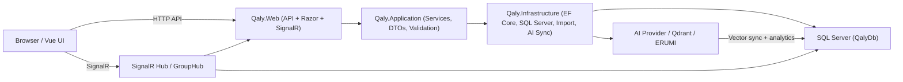
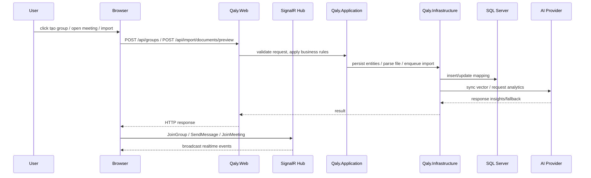
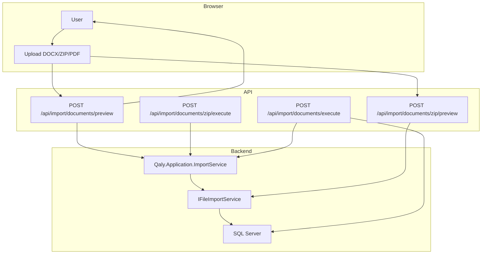

# 🏗️ QALY PROJECT – KIẾN TRÚC THỰC TẾ

> Cập nhật 05/06/2026 | Trạng thái: Core đã hoàn thiện và đang chạy thử nghiệm thực tế

---

## 1. Mô tả tổng quan

Hệ thống QALY hiện tại là một modular monolith với frontend Razor Pages kết hợp Vue, backend ASP.NET Core, và SQL Server làm nguồn dữ liệu chính.

- `Qaly.Web`: Web app, API controllers, SignalR hubs, authentication, Razor Pages, Vue islands.
- `Qaly.Application`: Business logic, CQRS-like service layer, DTO, validation, mapping.
- `Qaly.Infrastructure`: EF Core `DbContext`, SQL Server persistence, Identity stores, repository pattern, import engine, AI ingestion worker.
- `Qaly.Domain`: Domain entities, value objects, enums, quy tắc nghiệp vụ.

Phần `Core` đã hoàn thiện bao gồm luồng CRUD cơ bản, meeting start/join/end, import tài liệu, AI analytics sơ bộ và deploy Docker/Docker Compose.

---

## 2. Sơ đồ module và luồng dữ liệu

### 2.1 Luồng dữ liệu chính

---

## 3. Module chính

### 3.1 Authentication & Authorization

- `Qaly.Web` sử dụng ASP.NET Core Identity và middleware authentication.
- API bảo vệ bằng `[Authorize]`.
- Quyền nhóm: `Owner`, `Admin`, `Member`.
- Một số endpoint yêu cầu `Owner/Admin` để thay đổi cấu hình nhóm, xóa nhóm, hoặc kết thúc meeting.

### 3.2 Groups & SignalR

- Hệ thống có `GroupsController` và `GroupHub` để quản lý nhóm, chat, poll, và meeting.
- SignalR dùng cho realtime chat, join/leave group, và meeting event.
- Hiện tại backend các route `start/join/end` meeting đã hoạt động.
- Participant presence đã có join/leave idempotent, cleanup khi disconnect và rejoin sau reconnect.
- Regression hiện có integration tests cho publisher/presence và Playwright hai authenticated contexts; vẫn cần xác nhận media participant count với LiveKit thật.

### 3.3 Import tài liệu

- `ImportController` cung cấp API preview/execute cho document và ZIP.
- Giới hạn file 5MB.
- Hỗ trợ import DOCX và ZIP bundle chứa `.md`, `.txt`, `.html`, `.docx`.
- PDF hiện được xử lý là unsupported/roadmap nếu chưa parser, không nên ghi là hỗ trợ PDF đầy đủ.
- Import còn bao gồm undo session và lịch sử `import sessions`.

### 3.4 AI & Analytics

- `AiController` xử lý AI analytics, summary, risk, smart search, task assignment và chat.
- `GroupAiController` xử lý action item extraction, summary, draft project, và liên kết meeting transcript.
- Backend đã có fallback/schema cho AI; không nên claim AI hoàn chỉnh khi provider chưa cấu hình.
- `VectorSyncWorker` và ingestion service đồng bộ dữ liệu sang vector DB/AI index.

### 3.5 Deploy và hạ tầng

- Hệ thống hỗ trợ chạy local bằng `localhost` cho SQL Server.
- Docker Compose sử dụng container `qaly-sqlserver`, `qaly-redis`, `qaly-seq`, `qaly-mailhog`.
- Deploy hiện tại đã có cấu hình cơ bản nhưng chưa đủ bằng chứng nghiệm thu đầy đủ cho production.

---

## 4. Luồng import tài liệu chi tiết

---

## 5. Giới hạn hiện tại

- **Meeting realtime**: signaling/presence đã có regression fix; participant media count với LiveKit thật chưa có evidence headful.
- **Screen share**: nhánh lỗi/unsupported có toast rõ và không crash; chưa có positive case headful.
- **Import**: giới hạn file 5MB; PDF vẫn trong roadmap/unsupported.
- **AI**: có thể phụ thuộc provider/fallback; chưa đủ bằng chứng nghiệm thu full AI analytics hoặc Group AI.
- **Deploy**: Docker Compose/infra đã cấu hình cơ bản, nhưng chưa có evidence nghiệm thu đầy đủ cho checklist deploy.

---

## 6. Ghi chú quan trọng

- Tài liệu này mô tả kiến trúc thực tế của hệ thống ở thời điểm hiện tại.
- Không dùng tài liệu này để khẳng định mọi tính năng chưa có bằng chứng QA đã nghiệm thu hoàn toàn.
- Khi demo media meeting/screen share, cần cấu hình LiveKit bằng secret ngoài repository và kiểm tra bằng browser thật.
