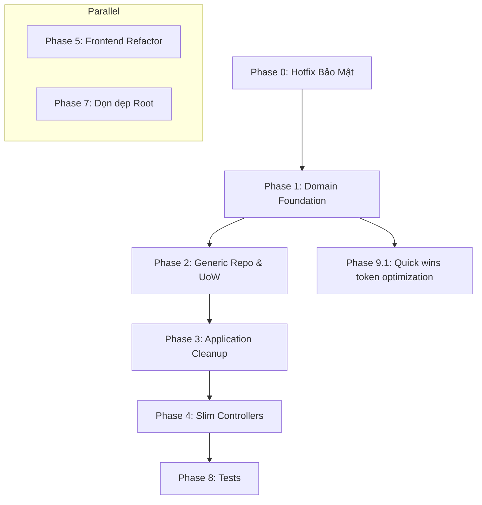

# 🔧 Qaly Project — Kế Hoạch Refactor Toàn Diện

**Mục tiêu:** Cải thiện maintainability, giảm code duplication, tăng bảo mật, và tối ưu token cho AI đọc code (Gemini/Claude).  
**Ngày tạo:** 2026-05-25  
**Trạng thái:** 📋 Chờ duyệt

---

## 📊 Tổng Quan Dự Án

| Layer | Files | Vấn đề chính |
| :--- | :--- | :--- |
| **Domain** | ~17 files | Type safety, DateTime, duplicate repo interfaces |
| **Application** | ~30 files | Unused deps, duplicate services, wrong layer |
| **Infrastructure** | ~15 files | God class, duplicate repos, security issues |
| **Web** | ~15 files | Fat controllers, duplicate code, custom JWT |
| **Frontend** | ~25 files | God components (600+ lines), single API file |
| **Config/DevOps** | ~15 files | .env committed, no tests, root clutter |

---

## 🚨 Phase 0: Hotfix Bảo Mật (CRITICAL)

> [!CAUTION]
> Các vấn đề bảo mật cần xử lý NGAY LẬP TỨC trước mọi refactor khác.

- [ ] **Xóa .env khỏi Git history** — chứa real secrets (DB password, JWT key, Cloudinary, email)
  - Dùng `git filter-branch` hoặc BFG Repo-Cleaner để xóa khỏi history.
  - Thêm `.env` vào `.gitignore` (nếu chưa có).
  - Rotate tất cả secrets đã bị lộ.
- [ ] **Xóa JWT hardcoded fallback trong Infrastructure/DependencyInjection.cs**
  - Xóa `"your-secret-key-..."` fallback.
  - Throw exception nếu thiếu JWT config.
- [ ] **Fix CORS** — Xóa `AllowAnyOrigin()` trong production
  - Chuyển sang whitelist origins từ config.
- [ ] **Xóa hardcoded admin password trong DataSeeder.cs (Admin@123)**
  - Đọc từ environment variable hoặc user-secrets.
- [ ] **Chuyển token từ localStorage sang httpOnly cookie (Frontend AuthContext.tsx)**
  - Giảm XSS vulnerability.

---

## 🏗️ Phase 1: Domain Layer — Nền Tảng Type-Safety

> [!IMPORTANT]
> Domain layer là core, phải fix trước để các layer khác build đúng.

### 1.1 Fix Type Safety cho Entities
- [ ] `Reaction.cs` — Đổi `Type` từ `string` → `ReactionType` enum.
- [ ] `Message.cs` — Đổi `MessageType` từ `string` → `MessageType` enum.
- [ ] Tất cả entities — Đổi `DateTime` → `DateTimeOffset` (9 files).

### 1.2 Tạo Generic Repository Interface
- [ ] **[NEW] Interfaces/IRepository.cs** — Generic base interface:
  ```csharp
  public interface IRepository<T> where T : class
  {
      Task<T?> GetByIdAsync(int id);
      Task<IEnumerable<T>> GetAllAsync();
      Task AddAsync(T entity);
      Task UpdateAsync(T entity);
      Task DeleteAsync(int id);
  }
  ```
- [ ] **Simplify 6 repo interfaces** — Kế thừa `IRepository<T>`, chỉ giữ phương thức riêng:
  - `IPostRepository : IRepository<Post>` — giữ `GetByUserIdAsync`
  - `ICommentRepository : IRepository<Comment>` — giữ `GetByPostIdAsync`
  - `IReactionRepository : IRepository<Reaction>` — giữ `GetByPostIdAndUserIdAsync`
  - `IMessageRepository : IRepository<Message>` — giữ `GetConversationAsync`, `GetChatRoomMessagesAsync`
  - `IHealthRecordRepository : IRepository<HealthRecord>` — giữ `GetByUserIdAsync`, `GetLatestByUserIdAsync`
  - `IChatRoomRepository : IRepository<ChatRoom>` — giữ member mgmt methods
  - *Token savings: Giảm ~60% lines trong 6 interface files (từ ~100 → ~40 lines tổng).*

### 1.3 Extract Value Objects (Optional — Phase sau)
- [ ] `ApplicationUser` — Extract `AddressInfo` value object (`Address`, `Latitude`, `Longitude`).
- [ ] `HealthRecord` — Extract `BloodPressure` value object (`Systolic`, `Diastolic`).

### 1.4 Thêm BaseEntity
- [ ] **[NEW] Entities/BaseEntity.cs**:
  ```csharp
  public abstract class BaseEntity
  {
      public int Id { get; set; }
      public DateTimeOffset CreatedAt { get; set; }
      public DateTimeOffset? UpdatedAt { get; set; }
  }
  ```
- [ ] Các entity `Post`, `Comment`, `Reaction`, `Message`, `ChatRoom`, `ChatRoomMember`, `HealthRecord`, `QalyScoreHistory` kế thừa `BaseEntity`.
  - *Token savings: Giảm ~3-5 lines/entity × 8 entities = ~32 lines.*

---

## 📦 Phase 2: Infrastructure Layer — Generic Repository & UoW

### 2.1 Tạo Generic Repository Implementation
- [ ] **[NEW] Data/GenericRepository.cs**:
  ```csharp
  public class GenericRepository<T> : IRepository<T> where T : class
  {
      protected readonly ApplicationDbContext _context;
      protected readonly DbSet<T> _dbSet;
      // ... shared CRUD implementation
  }
  ```
- [ ] **Simplify 6 repository implementations** — Kế thừa `GenericRepository<T>`, chỉ override/thêm method riêng.
  - *Token savings: Giảm ~200 lines duplicate code (6 repos × ~35 lines CRUD mỗi file).*

### 2.2 Tạo Unit of Work
- [ ] **[NEW] Data/IUnitOfWork.cs** (Interface trong Domain/Interfaces)
- [ ] **[NEW] Data/UnitOfWork.cs**:
  ```csharp
  public class UnitOfWork : IUnitOfWork
  {
      private readonly ApplicationDbContext _context;
      public IPostRepository Posts { get; }
      public ICommentRepository Comments { get; }
      // ... other repos
      public Task<int> SaveChangesAsync();
  }
  ```
- [ ] **Xóa SaveChangesAsync()** rải rác trong từng repository.

### 2.3 Tách Entity Configuration
- [ ] **[NEW] Data/Configurations/PostConfiguration.cs**
- [ ] **[NEW] Data/Configurations/MessageConfiguration.cs**
- [ ] ... (1 file per entity)
- [ ] `ApplicationDbContext.cs` — Dùng `modelBuilder.ApplyConfigurationsFromAssembly()`.
  - *Token savings: ApplicationDbContext giảm từ 63 → ~20 lines.*

### 2.4 Refactor AuthService (GOD CLASS → tách nhỏ)
- [ ] Tách `AuthService` (283 lines) thành:
  - `AuthService.cs` — Login, Register (~80 lines)
  - `TokenService.cs` — JWT token generation/validation (~50 lines)
  - `UserProfileService.cs` — Get/Update profile, search (~80 lines)
- [ ] Di chuyển interfaces `IAuthService`, `ICloudinaryService`, `IEmailService` từ Infrastructure → Application layer.

### 2.5 Fix DependencyInjection.cs
- [ ] Tách thành extension methods:
  - `AddDatabase(config)` — DbContext + repos
  - `AddIdentityConfig()` — Identity settings
  - `AddJwtAuthentication(config)` — JWT bearer
  - `AddCaching(config)` — Redis
  - `AddCorsPolicy(config)` — CORS with whitelist
  - *Token savings: Từ 1 file 110 lines → 5 focused methods, dễ navigate hơn.*

### 2.6 Refactor DataSeeder
- [ ] Tách `DataSeeder.cs` (254 lines) thành:
  - `SeedData/RoleSeeder.cs`
  - `SeedData/UserSeeder.cs`
  - `SeedData/PostSeeder.cs`
  - `SeedData/HealthDataSeeder.cs`
- [ ] Hoặc chuyển seed data sang JSON files.

---

## 🎯 Phase 3: Application Layer — Cleanup & Đúng Layer

### 3.1 Xóa Unused Dependencies
- [ ] Xóa `MediatR` — Không có handler/command/query nào.
- [ ] Xóa `FluentValidation` — Không có validator nào (HOẶC: Thêm validators nếu muốn dùng ở Phase 6).
- [ ] Di chuyển `BCrypt.Net-Next` từ Application → Infrastructure.
  - *Token savings: Xóa ~10 lines registration code + giảm dependencies.*

### 3.2 Di chuyển QalyScoreCalculator → Domain
- [ ] `Common/QalyScoreCalculator.cs` → `Domain/Services/QalyScoreCalculator.cs` (Đây là core business logic, thuộc Domain layer).
- [ ] Refactor magic numbers thành constants:
  ```csharp
  public static class HealthThresholds
  {
      public const decimal NormalBmiMin = 18.5m;
      public const decimal NormalBmiMax = 24.9m;
      // ...
  }
  ```

### 3.3 Tách MappingProfile
- [ ] Tách `Common/MappingProfile.cs` (66 lines) thành:
  - `Mappings/PostMappingProfile.cs`
  - `Mappings/MessageMappingProfile.cs`
  - `Mappings/HealthMappingProfile.cs`
  - `Mappings/UserMappingProfile.cs`

### 3.4 Gộp DTO Files
- [ ] Gộp DTOs theo feature (giảm số files):
  - `DTOs/PostDtos.cs` — `PostDto`, `CreatePostDto`, `UpdatePostDto` (gộp 3 → 1 file)
  - `DTOs/CommentDtos.cs` — `CommentDto`, `CreateCommentDto` (gộp 2 → 1)
  - `DTOs/ReactionDtos.cs` — `ReactionDto`, `CreateReactionDto` (gộp 2 → 1)
  - `DTOs/MessageDtos.cs` — `MessageDto`, `SendMessageDto` (gộp 2 → 1)
  - `DTOs/HealthDtos.cs` — `HealthRecordDto`, `CreateHealthRecordDto` (gộp 2 → 1)
  - *Token savings: Từ 11 files → 5 files, giảm ~50 lines boilerplate (using, namespace).*

### 3.5 Tạo Generic Service Base (Optional)
- [ ] **[NEW] Services/BaseCrudService.cs** — Abstract base cho CRUD:
  ```csharp
  public abstract class BaseCrudService<TEntity, TDto, TCreateDto>
  {
      protected readonly IRepository<TEntity> _repository;
      protected readonly IMapper _mapper;
      // Common CRUD implementations
  }
  ```
- [ ] Simplify 7 service implementations.

### 3.6 Di chuyển Request Models
- [ ] `Web/Auth/LoginModel.cs` → `Application/DTOs/AuthDtos.cs`
- [ ] `Web/Auth/RegisterModel.cs` → `Application/DTOs/AuthDtos.cs`

---

## 🌐 Phase 4: Web Layer — Slim Controllers

### 4.1 Tạo BaseApiController
- [ ] **[NEW] Controllers/BaseApiController.cs**:
  ```csharp
  [ApiController]
  [Route("api/[controller]")]
  [Authorize]
  public abstract class BaseApiController : ControllerBase
  {
      protected string CurrentUserId =>
          User.FindFirst(ClaimTypes.NameIdentifier)?.Value
          ?? throw new UnauthorizedAccessException();
  }
  ```
- [ ] Tất cả controllers kế thừa `BaseApiController`.
  - *Token savings: Xóa ~7 lines duplicate/controller × 7 controllers = ~49 lines.*

### 4.2 Refactor AuthController (170 → ~80 lines)
- [ ] Tách logic upload avatar, search users ra khỏi controller.
- [ ] Thống nhất response format — Dùng `ApiResponse<T>` everywhere.
- [ ] Xóa try/catch — Dùng global exception middleware.

### 4.3 Xóa Custom JWT Middleware
- [ ] Xóa `JwtMiddleware.cs` — Duplicate với built-in ASP.NET JWT auth.
- [ ] Đảm bảo `AddAuthentication().AddJwtBearer()` hoạt động đúng.

### 4.4 Refactor Program.cs (232 → ~50 lines)
- [ ] Tách thành extension methods:
  ```csharp
  builder.Services.AddApplicationServices();      // Application DI
  builder.Services.AddInfrastructureServices(config); // Infrastructure DI
  builder.Services.AddWebServices();               // SignalR, Swagger, etc.
  app.UseGlobalExceptionHandling();
  app.UseQalyMiddleware();
  ```

### 4.5 Tạo Global Exception Handler
- [ ] **[NEW] Middleware/GlobalExceptionMiddleware.cs** — Thay thế try/catch rải rác.
- [ ] Trả về `ApiResponse` nhất quán cho mọi error.

### 4.6 Extract Business Logic từ ChatHub
- [ ] `ChatHub.cs` — Di chuyển message creation logic sang `IMessageService`.
- [ ] Thêm `[Authorize]` attribute.

---

## ⚛️ Phase 5: Frontend — Tách God Components

### 5.1 Tách ChatPage (600+ → ~150 lines mỗi file)
- [ ] **[NEW] components/chat/ChatSidebar.tsx** — Room list, search
- [ ] **[NEW] components/chat/ChatWindow.tsx** — Message display
- [ ] **[NEW] components/chat/MessageInput.tsx** — Message input + send
- [ ] **[NEW] components/chat/MessageBubble.tsx** — Single message
- [ ] **[NEW] hooks/useChat.ts** — Chat state + WebSocket logic
- [ ] Slim down `ChatPage.tsx` — Compose components.

### 5.2 Tách HomePage (450+ → ~100 lines)
- [ ] **[NEW] components/post/PostCard.tsx** — Single post display
- [ ] **[NEW] components/post/PostForm.tsx** — Create post form
- [ ] **[NEW] components/post/CommentSection.tsx** — Comments list + form
- [ ] **[NEW] components/post/ReactionBar.tsx** — Reaction buttons
- [ ] **[NEW] hooks/usePosts.ts** — Posts state management

### 5.3 Tách HealthDashboard (500+ → ~100 lines)
- [ ] **[NEW] components/health/HealthChart.tsx** — Chart component
- [ ] **[NEW] components/health/HealthRecordForm.tsx** — Record input form
- [ ] **[NEW] components/health/QalyScore.tsx** — Score display
- [ ] **[NEW] hooks/useHealthRecords.ts** — Health data management

### 5.4 Refactor API Service Layer
- [ ] Tách `services/api.ts` (200+ lines) thành:
  - `services/apiClient.ts` — Axios instance + interceptors + auth header
  - `services/postApi.ts` — Post CRUD
  - `services/chatApi.ts` — Chat/message calls
  - `services/healthApi.ts` — Health record calls
  - `services/authApi.ts` — Auth calls
- [ ] Thêm response interceptor cho error handling thống nhất.
  - *Token savings: Từ 1 file 200+ lines → 5 focused files, dễ đọc/maintain hơn.*

### 5.5 Tách Types
- [ ] Tách `types/index.ts` (80 lines) thành:
  - `types/post.ts`
  - `types/chat.ts`
  - `types/health.ts`
  - `types/auth.ts`

### 5.6 Thêm Error Boundary
- [ ] **[NEW] components/ErrorBoundary.tsx**
- [ ] Wrap trong `App.tsx`.

---

## ✅ Phase 6: Thêm Validation (Optional)

- [ ] Tạo FluentValidation validators nếu giữ dependency:
  - `Validators/CreatePostValidator.cs`
  - `Validators/CreateCommentValidator.cs`
  - `Validators/CreateHealthRecordValidator.cs`
  - `Validators/RegisterModelValidator.cs`
- [ ] Hoặc xóa FluentValidation và dùng Data Annotations.

---

## 🧹 Phase 7: Dọn Dẹp Project Root

- [ ] **Xóa log files khỏi root:**
  - `app5055.log`, `login-debug.*.log`, `login-final.*.log`, `login-sslfix.*.log`
  - `login-verify.*.log`, `seed-check.*.log`, `qaly-web.*.log`
  - `build_error.log`, `build_output.txt`
- [ ] **Xóa temp files:**
  - `temp_diff.txt`, `robot_base64*.txt`
  - `main_diff_*.txt`, `style_diff_*.txt` (trong Web/)
- [ ] **Thêm vào .gitignore:**
  ```gitignore
  *.log
  *.out.log
  *.err.log
  temp_*.txt
  robot_base64*.txt
  ```
- [ ] **Xóa commented-out code** trong `Program.cs` và các file khác.

---

## 🧪 Phase 8: Tests

- [ ] Unit tests cho `QalyScoreCalculator` — Core business logic.
- [ ] Unit tests cho Services — Ít nhất `PostService`, `AuthService`.
- [ ] Integration tests cho Controllers — Happy path + error cases.

---

## 📝 Phase 9: Tối Ưu Token cho AI

> [!TIP]
> Các thay đổi này giúp Gemini/Claude đọc code nhanh hơn, tiêu tốn ít token hơn.

### 9.1 File-level Optimizations
- [ ] **Dùng global using** trong `Directory.Build.props` hoặc `GlobalUsings.cs`:
  ```csharp
  global using System;
  global using System.Collections.Generic;
  global using System.Linq;
  global using System.Threading.Tasks;
  global using Microsoft.EntityFrameworkCore;
  global using AutoMapper;
  ```
  - *Token savings: Xóa ~5-8 using lines mỗi file × ~30 files = ~200 lines saved.*
- [ ] **Dùng file-scoped namespaces** (`namespace X;` thay vì `namespace X { }`)
  - *Token savings: Giảm 1 level indentation + 2 lines mỗi file × ~30 files = ~60 lines saved.*
- [ ] **Dùng primary constructors (C# 12)** cho DI:
  ```csharp
  // Before (5 lines):
  public class PostService
  {
      private readonly IPostRepository _repo;
      public PostService(IPostRepository repo) { _repo = repo; }
  }

  // After (1 line):
  public class PostService(IPostRepository repo)
  ```
  - *Token savings: Giảm ~4 lines/service × ~10 services = ~40 lines saved.*
- [ ] **Dùng records cho DTOs:**
  ```csharp
  // Before (8 lines):
  public class CreatePostDto
  {
      public string Content { get; set; }
      public string? ImageUrl { get; set; }
  }

  // After (1 line):
  public record CreatePostDto(string Content, string? ImageUrl);
  ```
  - *Token savings: Giảm ~5 lines/DTO × ~11 DTOs = ~55 lines saved.*

### 9.2 Structural Optimizations
- [ ] **Thêm README ngắn** cho mỗi layer folder:
  - `src/Qaly.Domain/README.md` — 5 lines mô tả entities & interfaces.
  - `src/Qaly.Application/README.md` — 5 lines mô tả services & DTOs.
  - `src/Qaly.Infrastructure/README.md` — 5 lines mô tả repos & external services.
  - `src/Qaly.Web/README.md` — 5 lines mô tả controllers & middleware.
  - *AI đọc README trước, hiểu context nhanh mà không cần đọc hết code.*
- [ ] **Tạo ARCHITECTURE.md ở root** — Mô tả kiến trúc tổng quan, data flow, conventions (AI chỉ cần đọc 1 file để hiểu toàn bộ structure).

### 9.3 Ước Tính Token Savings

| Optimization | Lines Saved | Est. Token Savings |
| :--- | :--- | :--- |
| Global usings | ~200 lines | ~800 tokens |
| File-scoped namespaces | ~60 lines | ~240 tokens |
| Primary constructors | ~40 lines | ~160 tokens |
| Record DTOs | ~55 lines | ~220 tokens |
| Generic repo (remove duplication) | ~200 lines | ~800 tokens |
| Generic service base | ~150 lines | ~600 tokens |
| Gộp DTO files (less boilerplate) | ~50 lines | ~200 tokens |
| BaseApiController | ~49 lines | ~196 tokens |
| **TỔNG** | **~804 lines** | **~3,216 tokens** |

---

## 📋 Thứ Tự Thực Hiện (Ưu Tiên)



### Ưu tiên cao nhất:
1. **Phase 0** — Bảo mật (PHẢI LÀM TRƯỚC)
2. **Phase 1** — Domain foundation
3. **Phase 2** — Generic repo + tách AuthService
4. **Phase 9.1** — Quick wins token optimization (global usings, file-scoped ns, records)

### Có thể làm song song:
- **Phase 5 (Frontend)** có thể làm song song với Phase 1-4 (Backend)
- **Phase 7 (Dọn dẹp)** có thể làm bất cứ lúc nào
- **Phase 8 (Tests)** nên làm ngay sau mỗi phase refactor

---

## ⚠️ Rủi Ro & Lưu Ý

> [!WARNING]
> - **Breaking changes:** Đổi `DateTime` → `DateTimeOffset` cần migration DB.
> - **Breaking changes:** Đổi `string` → `enum` cho `Reaction.Type`, `Message.MessageType` cần migration + update seed data.
> - **Frontend changes:** Tách components có thể break CSS nếu styles phụ thuộc DOM structure.
> - **Generic repo:** Một số query phức tạp có thể không fit vào generic pattern.
